<a id="yOBeg"></a>


# 场景 - 某部门某角色

如：秘书、信息化管理员等，是在业务处室下挂一个职位，负责人各不相同


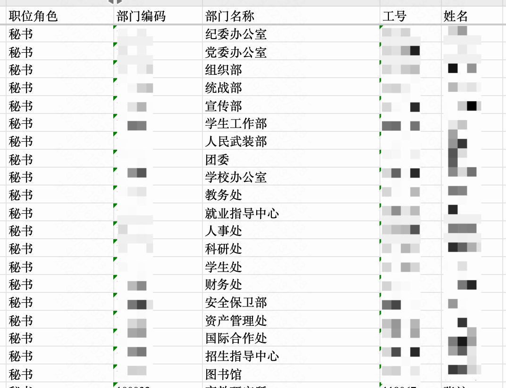


在做流程审批时，也会要求走该部门对应的职位角色参与审批，如：

- 信息化管理员负责本部门的高校信息化建设相关工作，需要参与审批
- 秘书负责本部门流程合规性与流程执行推动等相关工作，需要参与审批

​

<a id="GlOXy"></a>


# 在流程审批中使用


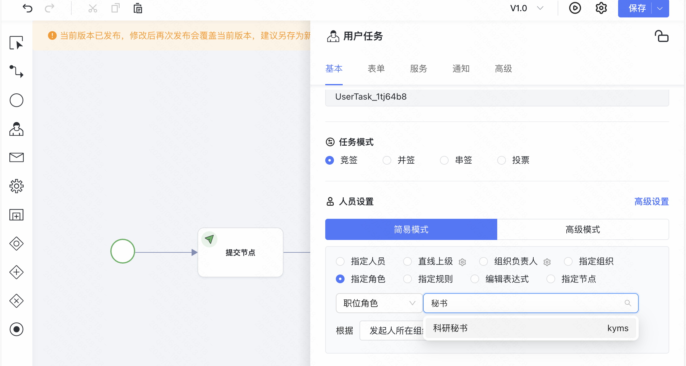


可以通过指定角色，选择 发起人所在部门 的 科研秘书，以实现以上需求

<a id="xTq1B"></a>


# 数据维护操作方法

第一步：维护职位成员在组织架构中的关系

1. 维护职位字典。 如：科研秘书、信息化管理员 等
2. 维护职位部门关系。设立职位，如：人事处科研秘书、财务处信息化管理员 等
3. 员工部门职位表。为每个职位下挂载对应的人员。如：人事处科研秘书是王某某

第二步：维护职位角色

1. 维护角色-职位角色。如：行政秘书、科研秘书
2. 维护职位角色关系表。在职位角色下，关联对应的维护职位部门关系。如：科研秘书，关联 科研处-秘书职位、工学院-秘书职位等

<a id="f37aca60"></a>


# **职位角色关联关系**

以下表都在baiteda\_base 库中

<a id="f3147ec8"></a>


## **post\_dic\_info****职位字典**


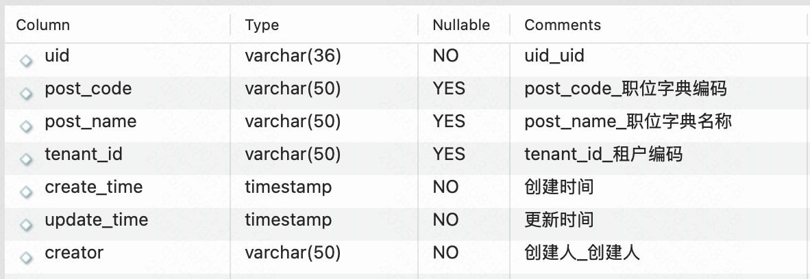


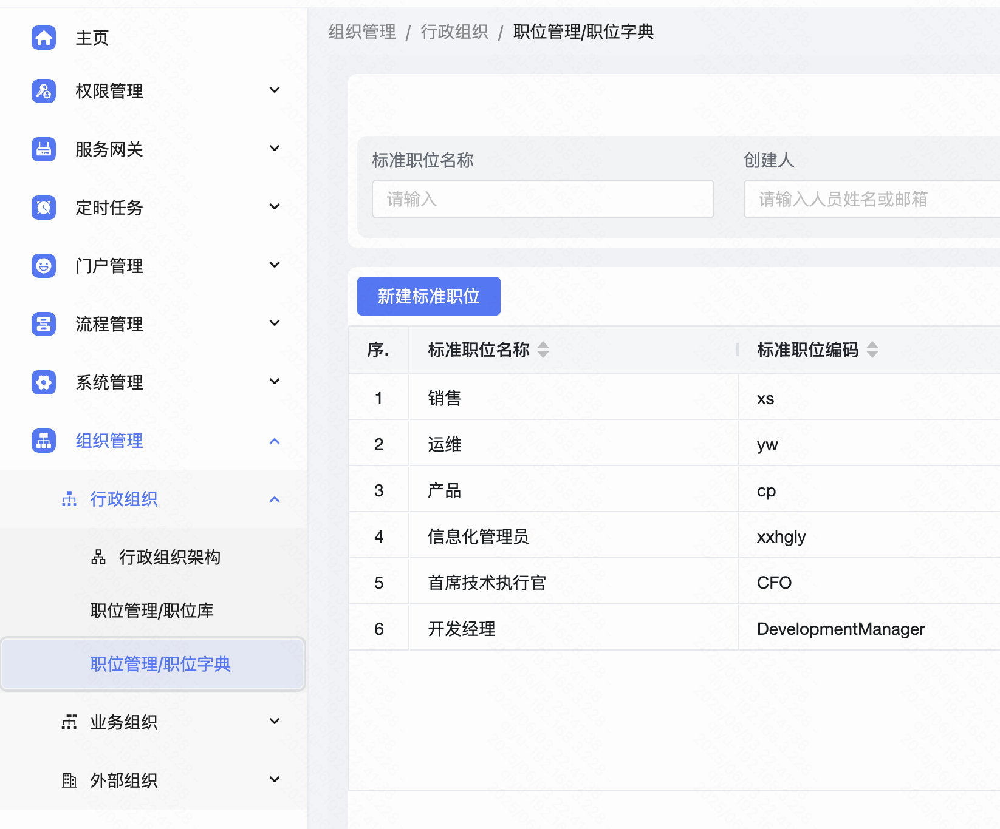


<a id="eMtAV"></a>


## dept\_post\_relation 职位部门关系表


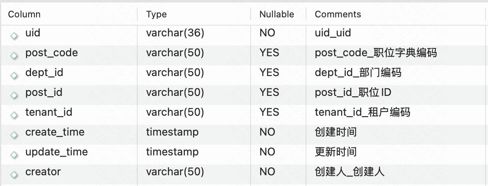


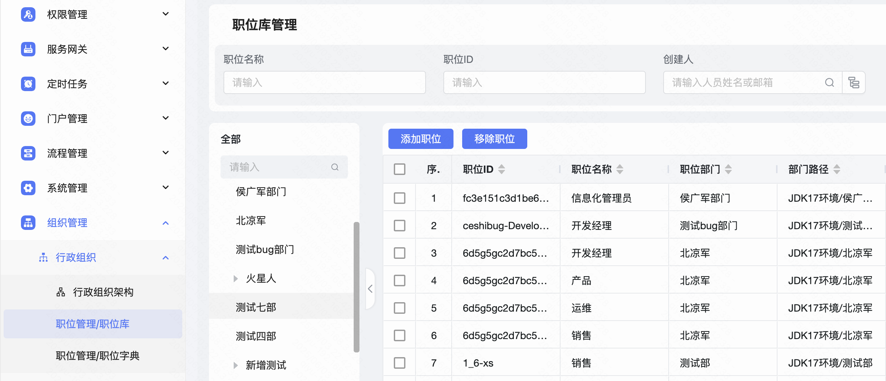


<a id="TQZR2"></a>


## employee\_dept\_post\_relation 员工部门职位表


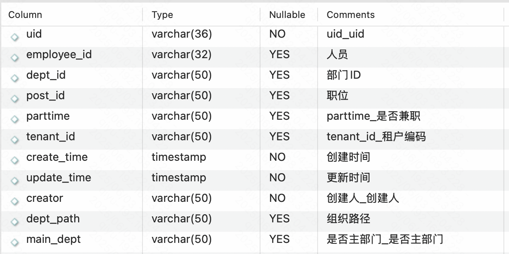


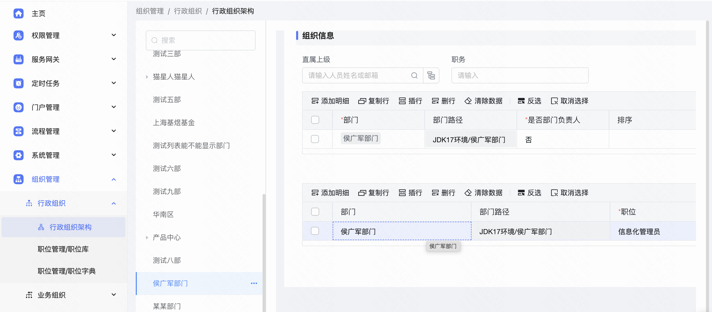


<a id="TF78T"></a>


## base\_group 角色表


```sql
select * from base_group where role_type='POST' and definition_code = 'role-1';
```


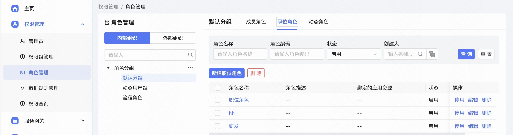


<a id="tsoSC"></a>


## post\_role\_relation 职位角色关系表


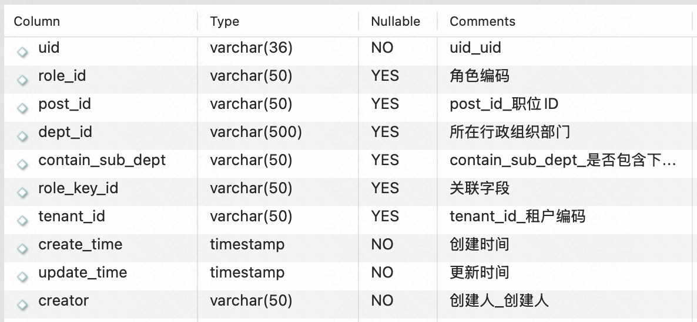


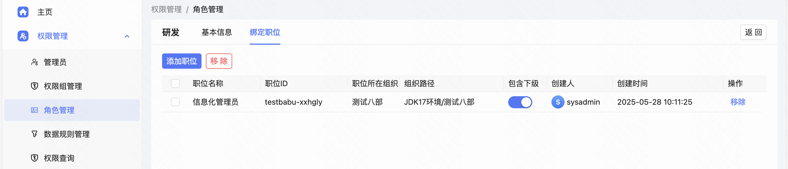


<a id="rLJ9j"></a>


# 成员角色关联关系

以下表都在baiteda\_base 库中

<a id="cFJjy"></a>


## base\_group 角色表


```sql
SELECT * FROM `base_group`  where role_type ='EMPLOYEE'
```


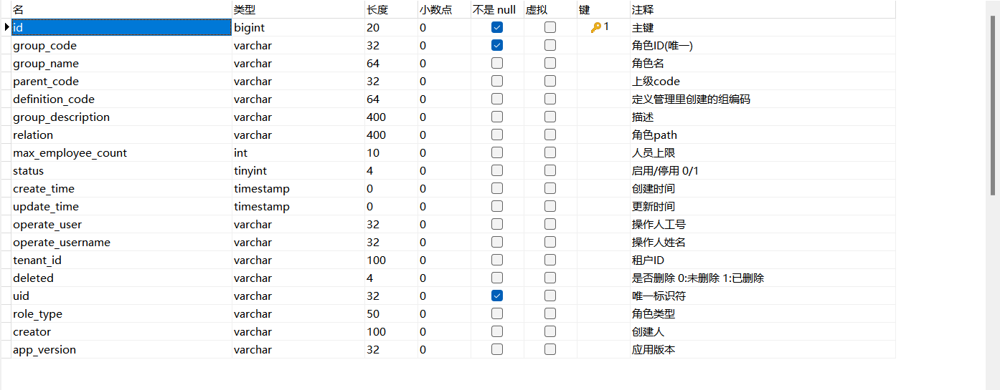


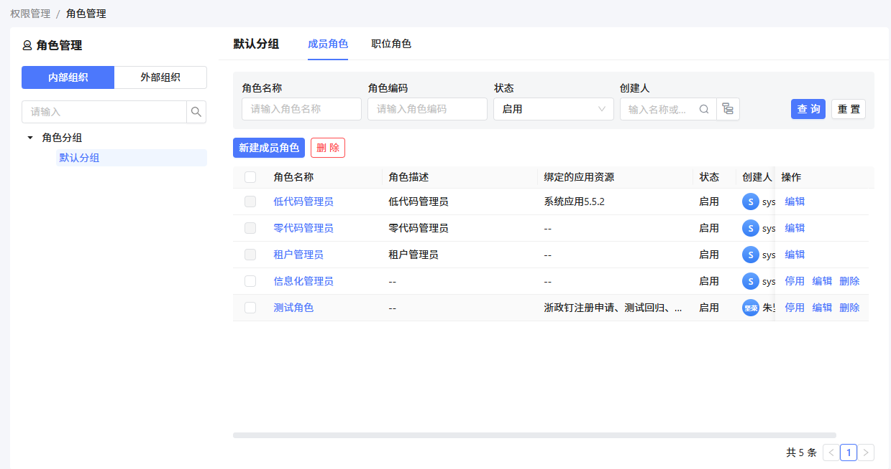


<a id="nxsq6"></a>


## base\_user\_group 角色绑定成员、成员管理组织表

成员工号：employee\_id

管理组织范围字段：management\_scope


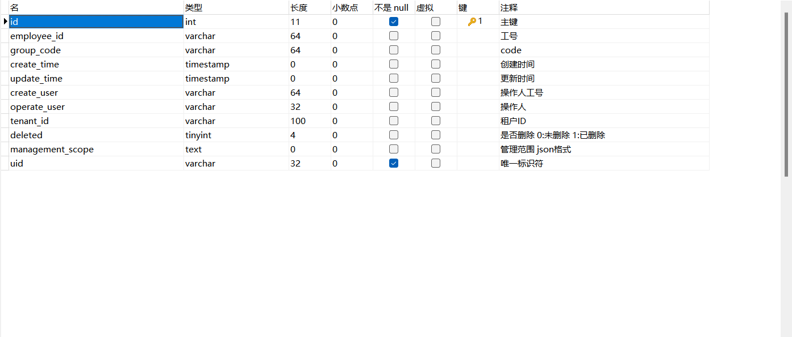


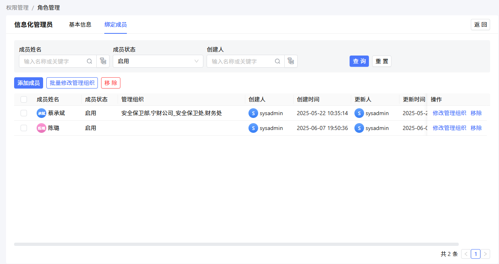
