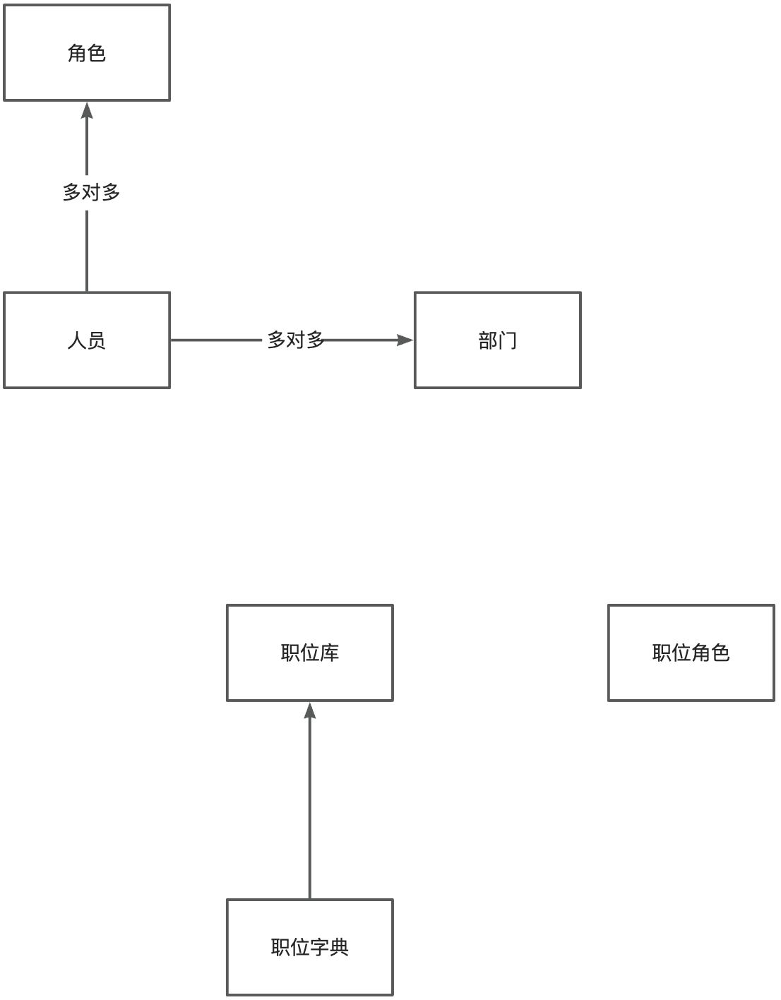

# 基本概念

|  |  |  |
| --- | --- | --- |
| 名词 | 作用 | 说明 |
| 人员 | 表示一个实体的用户   1. 在系统里充当登录账号的作用。 2. 人员有“直线上级”属性，可以按此进行逐级审批 | ​ |
| 部门 | 与现实中公司，单位的部门一致，存在上下级关系。   1. 用于权限的配置 2. 用于流程审批人的查找 3. 部门有上下级关系，可以按此进行逐级审批 | ​ |
| 组织架构 | 表示人员和部门的归属关系。 |  |
| 角色 | 将人员按分组归类。   1. 用于批量给用户设置权限 2. 用户流程审批人查找；“管理维度”可用于特殊的流程审批场景 |  |
| 职位 | 1. 用户流程审批人查找；“职位角色”可用于特殊的流程审批场景 |  |
|  |  |  |

​

## 主要实体间的关系

​

## 数据来源

1. 可以在系统中手动添加组织架构相关信息，包括人员，部门，角色，职位等。
2. 可以通过接口同步到平台中来。目前平台支持自动从企业微信，钉钉，飞书中同步组织相关数据。

​

# 权限设计

# 流程审批设计

## 如何按部门层级审批

## 职位角色管理模式

​

​
