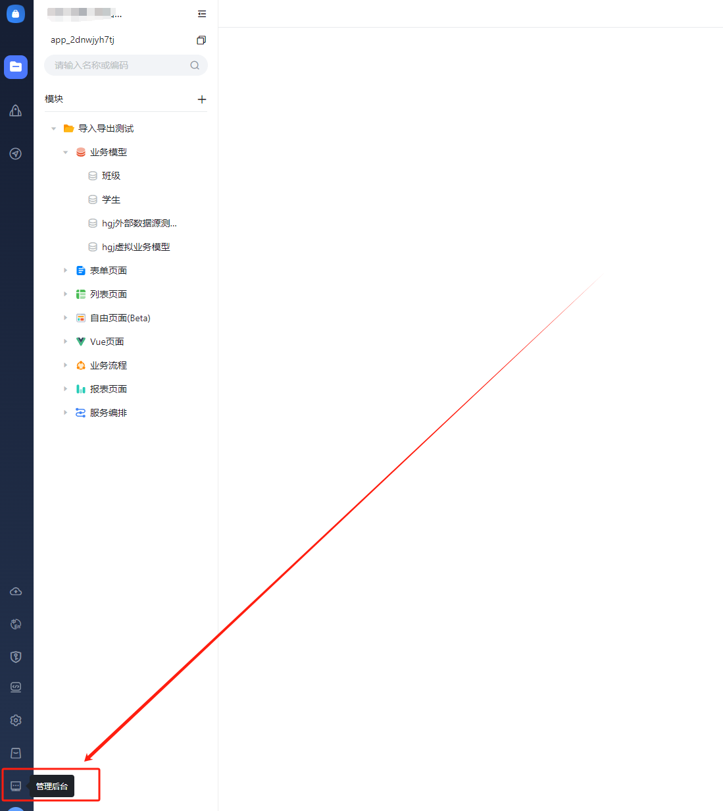
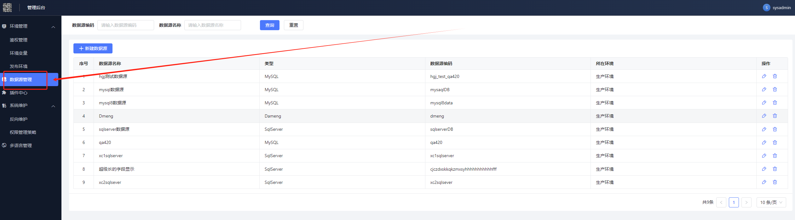
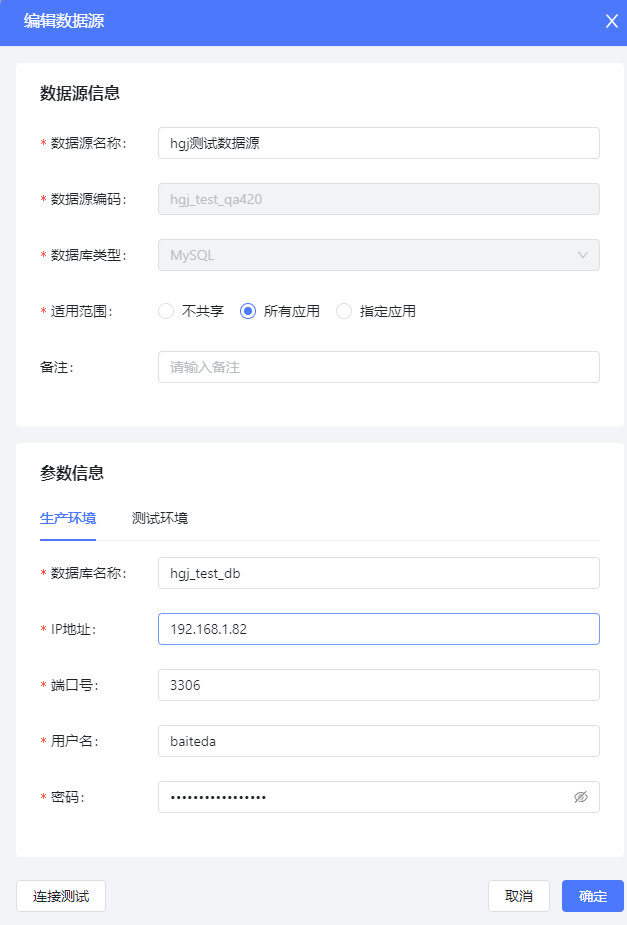
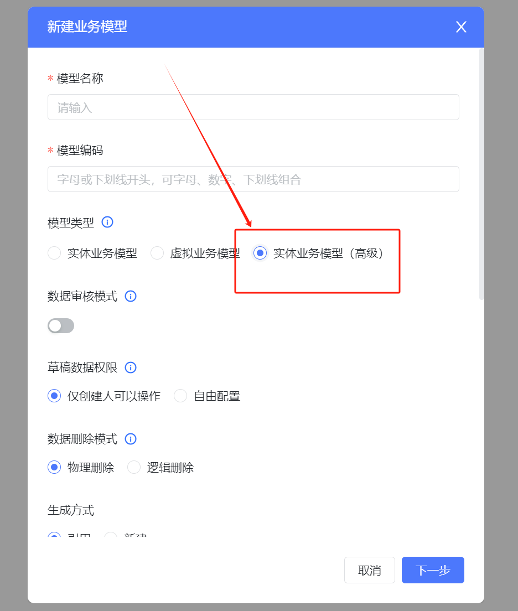
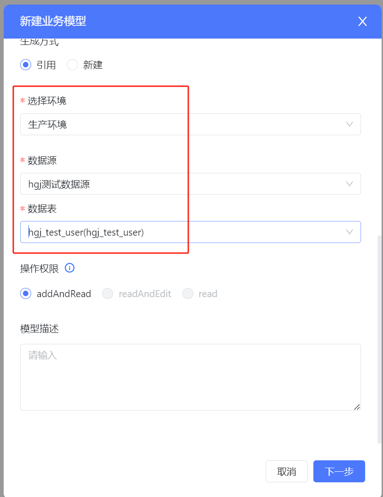
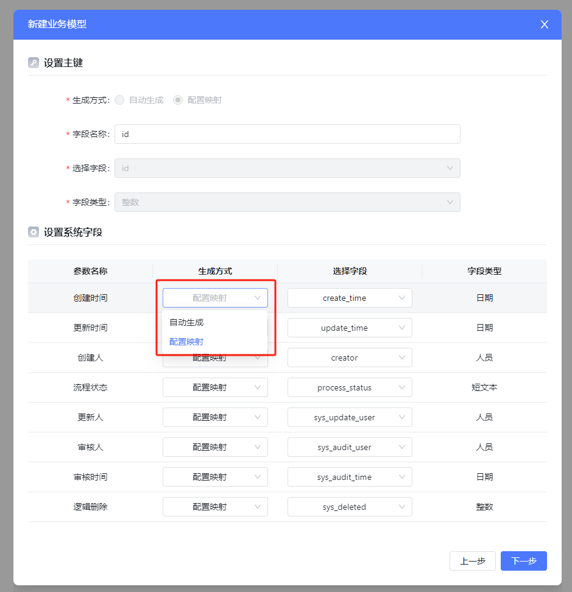
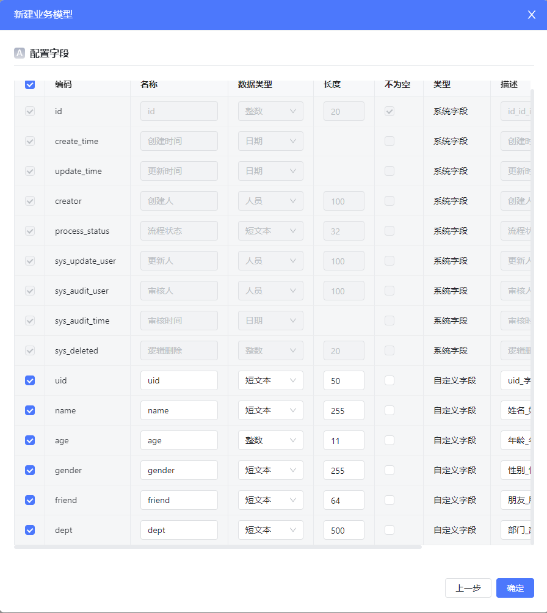

<a id="v5jCH"></a>


## 示例

假如你自己的数据库有这样一张表需要交由百特搭平台管理


```plain
CREATE TABLE `hgj_test_user` (
  `id` bigint(20) NOT NULL COMMENT '主键',
  `uid` varchar(50) DEFAULT NULL COMMENT '字符串类型唯一标识符',
  `name` varchar(255) DEFAULT NULL COMMENT '姓名',
  `age` int(11) DEFAULT NULL COMMENT '年龄',
  `gender` varchar(255) DEFAULT NULL COMMENT '性别',
  `friend` varchar(64) DEFAULT NULL COMMENT '朋友',
  `dept` varchar(500) DEFAULT NULL COMMENT '部门'
  PRIMARY KEY (`id`)
) ENGINE=InnoDB DEFAULT CHARSET=utf8mb4;
```

<a id="OrASF"></a>


## 接入步骤

<a id="EyN3Y"></a>


### 维护数据库信息

从设计态进入设计态管控台：





​

进入数据源管理：





新建自己的数据源，参数信息跟用工具连接数据库一样：





以下几个配置项需要注意：

- 适用范围：如果选择‘不共享’，那这个数据源在新建模型的过程中将无法被选择，一般都选‘所有应用’
- 生产环境/测试环境：分别配置数据库

<a id="zTYRm"></a>


### 引用数据库中的表

<a id="vpuLG"></a>


#### 新建业务模型

模型类型选择‘实体业务模型’：





​

<a id="oChnV"></a>


#### 选择引入的表

然后往下拉，选择自己的表，点下一步配置字段映射：





​

<a id="K6rDd"></a>


#### 配置字段映射





配置项说明：

- 设置主键 - 字段名称：指在百特搭的‘模型’里面的主键字段名
- 设置主键 - 选择字段：如果你的表已经有主键，这里会带出来且不可编辑，如果没有，需要手动选择一个字段作为主键；
- 设置系统字段：由于百特搭平台在运行过程中要控制数据的排序、权限、工作流等信息，要求每张表都要有以上几个‘系统字段’；
- 生成方式：如果你的表里已经有部分字段，配置一下该系统字段关联你的表的哪个字段；如果没有，选择‘自动生成’就行，保存发布后你的物理表中多出相关字段；

<a id="fc8yk"></a>


#### 字段确认

点击下一步，查看全部字段信息，如果没有问题保存即可；保存后在建表单、列表的时候就可以选到这个模型，跟其它模型一样正常使用就行：



