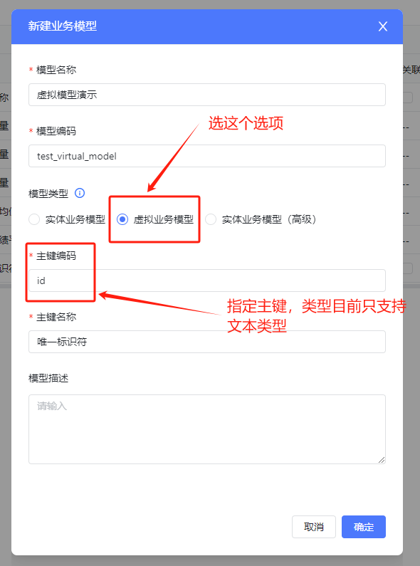
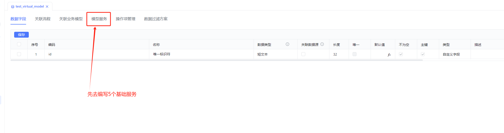
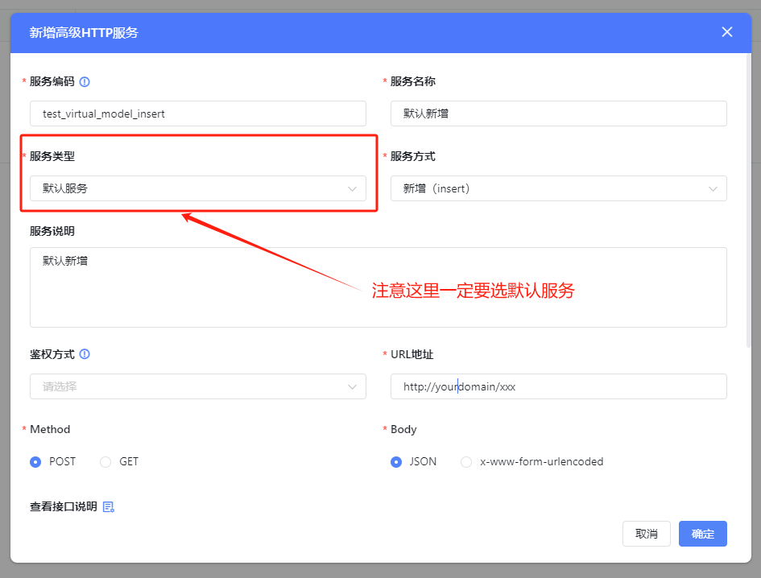
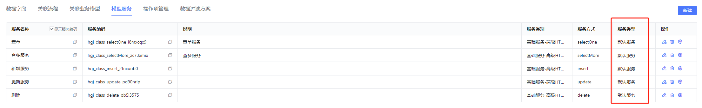

## 场景说明

假如你的数据是来自其它三方平台，或者是通过接口暴露的对已有数据的统计、分析结果，那么可以通过标准的http接口来接入。

## 接入步骤

### 新建虚拟模型

新建模型的时候，模型类型选择‘虚拟业务模型’：

### 将增、删、改、查、查多的数据操作接口封装成默认服务

点击确定后建出来的模型只有一个id字段，这时候不用手动再去建其它字段，先去编写默认服务，将你的接口封装成服务，当有了查多服务后，这里的字段会被自动同步过来：

确保至少有这5个基础服务，否则表单列表上无法引用这个模型：

### 服务如何编写

参考服务专题[高级HTTP对接实战](../../002-专题讲解/004-高级HTTP对接实战.md)。

注意：如果遇到列表上的数据过滤、排序、搜索功能失效时，请务必下载[高级HTTP对接实战](../../002-专题讲解/004-高级HTTP对接实战.md)里面的demo项目查看实际接口是如何接收、处理参数的，因为百特搭会将过滤、排序、搜索的查询条件封装成固定格式的json，所以，你的查询数据接口就需要支持这个结构的入参。
