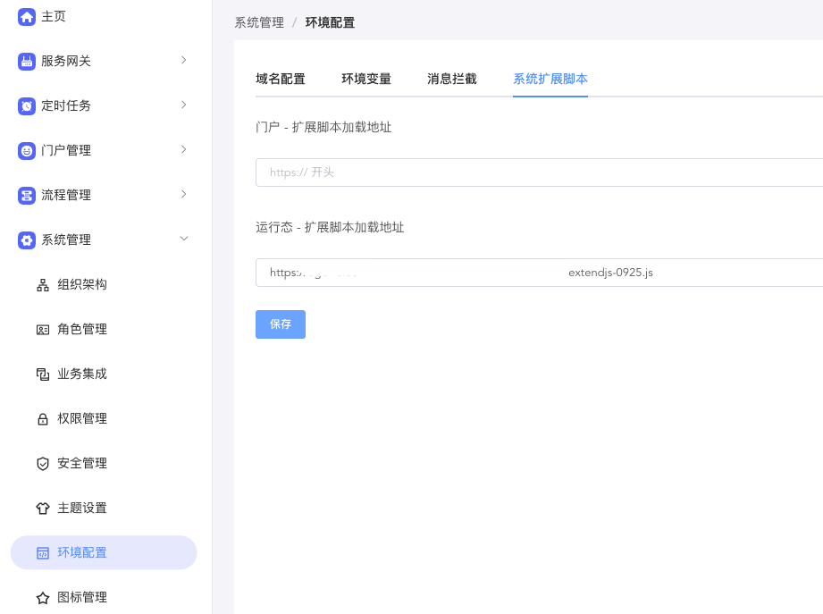
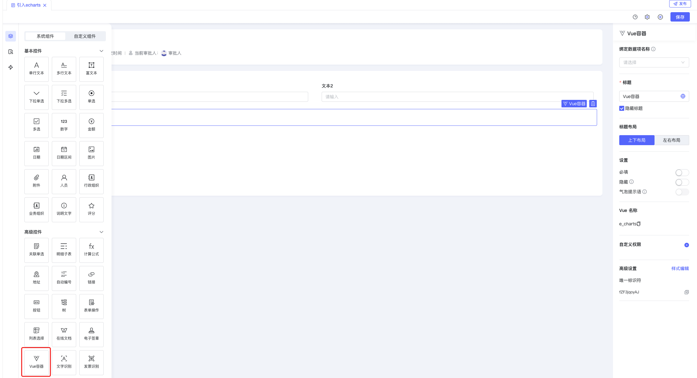
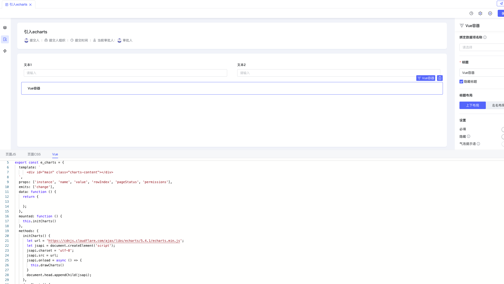
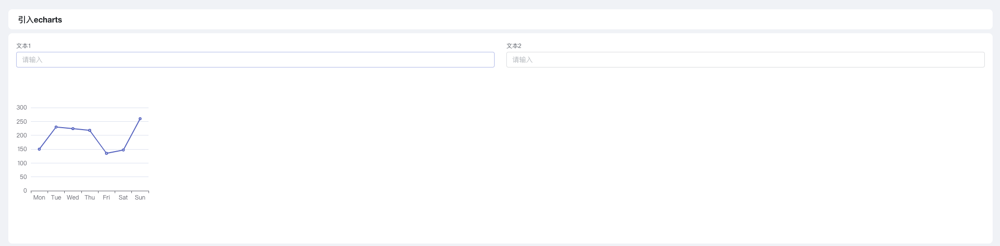
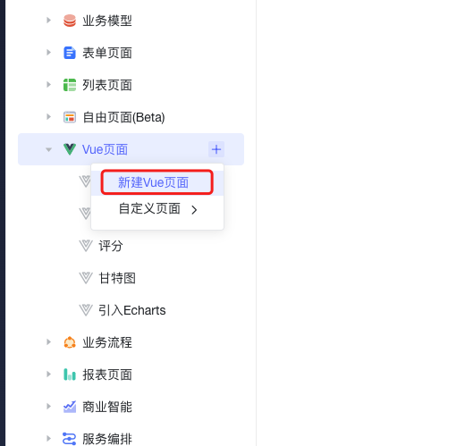
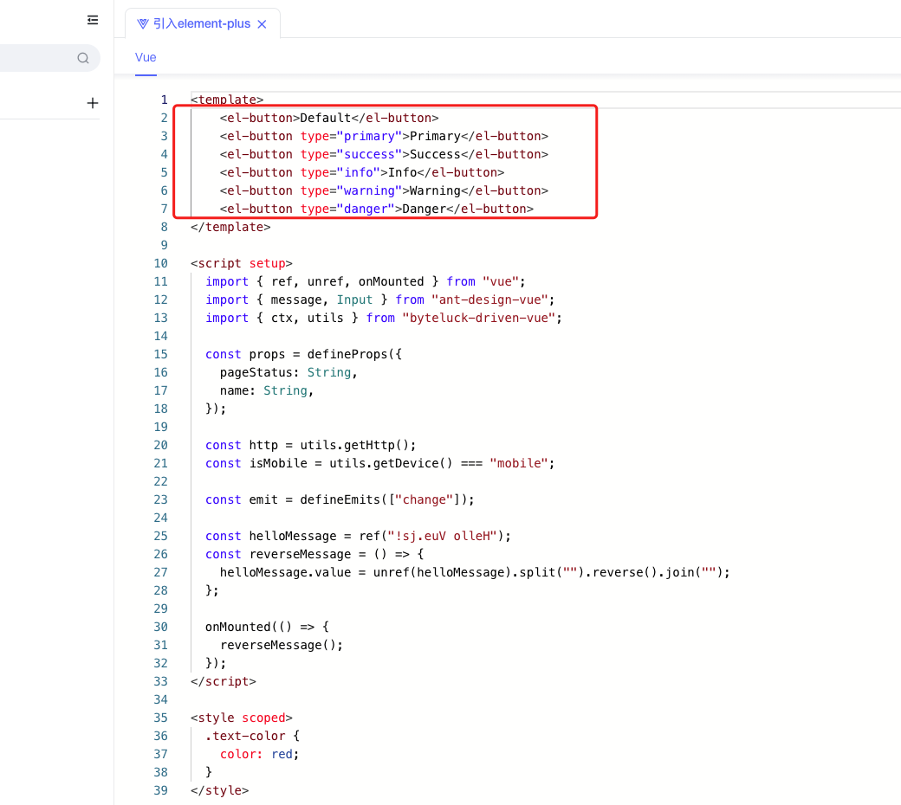
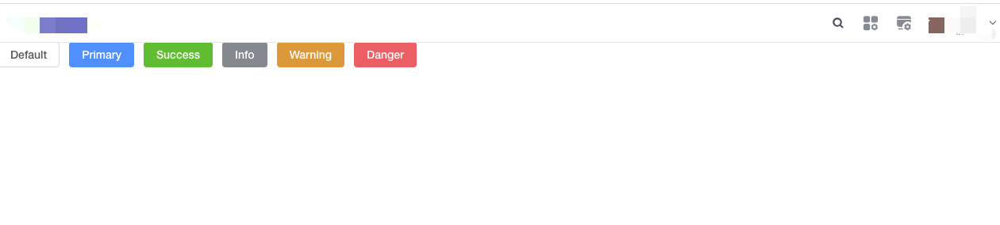

<a id="LCZZC"></a>


## 关键字

三方css、三方js、Echarts、Element

<a id="sItBF"></a>


## 概述

平台内置了PC端ant DesignUI库、移动端vant UI库和lodash等工具库，用户可在二开代码通过window.xxx来使用；同时平台支持引入第三方组件、脚本；

- 表单/Vue页面内需要插入图表、地图
- 表单/Vue页面内用户希望使用Element plus进行二次开发
- 移动端引入vConsole进行调试
- 页面引入埋点工具
- 页面引入jssdk等
- 全局扩展脚本全局注入请求头额外参数

......

<a id="g0WMd"></a>


## 如何使用

<a id="HfFQj"></a>


### 第三方组件引入方式

<a id="x4wpP"></a>


#### 全局引入

<a id="EOX48"></a>


##### extendjs.js 扩展脚本加载组件库示例


```javascript
/**
* 系统初始化时回调，可以注入三方脚本
* @param {*} vue Vue实例
* @param {*} type 有个参数值 desktop / mobile
* @returns Promise / void
*/
window.BaitedaInit = async function(vue, type) {
  return new Promise(function (resolve, reject) {
    // 增加一个css的引用
    const link = document.createElement('link');
    link.rel = "stylesheet";
    link.href = "https://ego-fe.oss-cn-beijing.aliyuncs.com/temp/style.css";
    document.body.appendChild(link);
    // 结束
    // resolve(true) //如果只有css，则需要放在最后执行该语句
    /* 增加一个vconsole组件的引用
    if (type === 'mobile') {
      const vconsole = document.createElement('script')
      vconsole.src = 'https://cdn.bootcdn.net/ajax/libs/vConsole/3.15.1/vconsole.min.js'
      vconsole.crossorigin = 'true'
      vconsole.onerror = function() {reject()}
      vconsole.onload = function() {
        // 已经获取到 window.vconsole，此处可以做一些全局设置
        var vConsole = new window.VConsole();
        resolve(true)
      }
      document.body.appendChild(vconsole)
    }
    */
    // 增加多个组件的引用
    const echarts = document.createElement('script')
    echarts.src = 'https://fe-resource.baiteda.com/libs/echarts-5.3.2/echarts.min.js'
    echarts.crossorigin = 'true'
    echarts.onerror = function() {reject()}
    echarts.onload = function() {
      // 已经获取到 window.echarts，此处可以做一些全局设置
      resolve(true)
    }
    document.body.appendChild(echarts)
    // 结束
  })
}

/**
* 用户身份认证时回调，仅在私有化环境中启用
* @param {*} user 用户对象
* @param {*} tenant 租户对象
*/
window.BaitedaLogin = function(user, tenant) {}

/**
* 页面全局路由变更时回调，仅在私有化环境中启用
* @param {*} to 目标页面
* @param {*} from 当前页面
*/
window.BaitedaRouterChanged = function(to, from) {}

/**
 * 平台关闭页面的行为干预
 * 版本提供 4.2.0
 * @param params {
 *   type: "desktop" | "mobile";
 *   browserType: string;
 *   taskRedirectUrl: string;
 *   appLauncher: boolean;
 * }
 */
window.BaitedaClose = function(params) {}

/**
 * 全局注入请求头额外参数
 * 版本提供 4.2.0
 * @param {*} headers 请求头信息
 * @returns 返回的对象就会被注入到请求头部
 */
window.BaitedaRequestHeaders = function(headers) {return headers}

/**
 * 创建单据、浏览页面、编辑页面，以iframe形式打开，会通过此函数获取到url，进行预处理。如：qiankun等微前端地址替换的处理
 * @param params {
 * 		url: string;
 *     method: 'create' | 'edit' | 'read'
 * }
 * @returns true(表示继续向下执行之前代码) | false(表示不继续执行下面的代码逻辑, 直接返回)
 */
window.BaitedaOpenOperateUrl = function(params) {
	return true
}

/**
 * 修改标签页title的行为干预
 * @param params {
 *   title: string;
 * }
 * @returns true(表示继续向下执行之前代码) | false(表示不继续执行下面的代码逻辑, 直接返回)
 */
window.BaitedaUpdateCurrentTab = function(params) {
  return false
}

/**
 * 全局注入外部干预样式
 * @returns 返回的对象为外部干预样式
 */

window.BaitedaCustomStyle = function() {
	return {
		"list-view-aggrid": {
			"footer": {
				"height": 30
			}
		}
	}
}


/**
 * 创建单据、浏览页面、编辑页面，以iframe形式打开，会通过此函数获取到url，进行预处理。如：qiankun等微前端地址替换的处理
 * 版本提供 4.2.0
 * @param url
 * @param method: 'create' | 'edit' | 'read'
 * @returns url地址
 */
window.BaitedaGetIframeUrl = function(url, method) {return url}

//4.0.0版本提供
window.baitedaCustomFileSupportOnlineView = function(file, type, device) {
  /**
  file: {
    "tenant_id": "testqw",
    "file_id": "b1c72447c9c44c58ba42a5aad4b6b3ae",
    "file_name": "base64.min.js",
    "file_path": "/attach/attachment/testqw/20230521/b1c72447c9c44c58ba42a5aad4b6b3ae/base64.min.js",
    "file_size": 5094,
    "create_time": 1684681790996,
    "support_online_view": false,
    "online_view_url": null,
    "download_url": "",
    "del_file_url": ""
  },
  type: 'isSupport' | 'getUrl'
  device: 'desktop' | 'mobile'
  */
  if (type === 'isSupport') {return false}
  else if (type === 'getUrl') {return 'https://www.sina.com.cn'}
}
```

<a id="A0vNb"></a>


##### 多个组件引用


```javascript
const vuecoms = document.createElement('script')
vuecoms.src = 'https://cdn.bootcdn.net/ajax/libs/element-plus/2.7.7/index.full.min.js'
vuecoms.crossorigin = 'true'
vuecoms.onerror = function () { reject() }
vuecoms.onload = function () {
  //有的第三方组件需要被安装 如：vue.use(ElementPlus)，可以写到对应的资源引入的onload里面
  vue.use(ElementPlus)
}
document.body.appendChild(vuecoms)


// 增加多个组件的引用
const echarts = document.createElement('script')
echarts.src = 'https://cdnjs.cloudflare.com/ajax/libs/echarts/5.4.1/echarts.min.js'
echarts.crossorigin = 'true'
echarts.onerror = function() {reject()}
echarts.onload = function() {
  // 已经获取到 window.echarts，此处可以做一些全局设置
  // window.echarts

  const vconsole = document.createElement('script')
  vconsole.src = 'https://cdn.bootcdn.net/ajax/libs/vConsole/3.15.1/vconsole.min.js'
  vconsole.crossorigin = 'true'
  vconsole.onerror = function() {reject()}
  vconsole.onload = function() {
    // 已经获取到 window.vconsole，此处可以做一些全局设置
    var vConsole = new window.VConsole();
    resolve(true)	//多个引用的话， resolve(true)放在最后一个
  }
  document.body.appendChild(vconsole)

}
document.body.appendChild(echarts)
// 结束
```

<a id="PGLI9"></a>


##### 管控台配置扩展脚本





[第三方js、css引用](https://baiteda.yuque.com/czwxoe/wuacuf/zsynguu2tef8msw0)

<a id="mdVJB"></a>


#### 单页面引入

- Vue页面


```javascript
<template>
    <div id="main" class="charts-content"></div>
</template>
<script setup>
    import { ref, unref, onMounted } from "vue";
          import { message, Input } from "ant-design-vue";
          import { ctx, utils } from "byteluck-driven-vue";
          const http = utils.getHttp();
          const isMobile = utils.getDevice() === "mobile";
          const props = defineProps({
            pageStatus: String,
            name: String,
          });
          const emit = defineEmits(["change"]);
          const initCharts=()=>{
             let url = 'https://cdnjs.cloudflare.com/ajax/libs/echarts/5.4.1/echarts.min.js';
            let jsapi = document.createElement('script');
            jsapi.charset = 'utf-8';
            jsapi.src = url;
                jsapi.onload = async () => {
                drawCharts()
                }
            document.head.appendChild(jsapi);
          }
        const drawCharts=()=>{
                var chartDom = document.getElementById('main');
                var myChart = echarts.init(chartDom);
                var option;
                option = {
                xAxis: {
                    type: 'category',
                    data: ['Mon', 'Tue', 'Wed', 'Thu', 'Fri', 'Sat', 'Sun']
                },
                yAxis: {
                    type: 'value'
                },
                series: [
                    {
                    data: [150, 230, 224, 218, 135, 147, 260],
                    type: 'line'
                    }
                ]
                };
                option && myChart.setOption(option);
        }
          onMounted(() => {
            initCharts()
          });
</script>
<style scoped>
    .charts-content {
        width: 200px;
        height: 200px;
    }
</style>
```


- Vue容器


[Vue容器](../../002-专题讲解/007-表单 列表二开指南/005-Vue容器.md)


```javascript
const ctx = exports.ctx;
const utils = exports.utils;
const http = utils.getHttp()
const isMobile = utils.getDevice() === 'mobile'
export const e_charts = {
  template: `
      <div id="main" class="charts-content"></div>
  `,
  props: ['instance', 'name', 'value', 'rowIndex', 'pageStatus', 'permissions'],
  emits: ['change'],
  data: function () {
    return {};
  },
  mounted: function () {
    this.initCharts()
  },
  methods: {
    initCharts() {
      let url = 'https://cdnjs.cloudflare.com/ajax/libs/echarts/5.4.1/echarts.min.js';
      let jsapi = document.createElement('script');
      jsapi.charset = 'utf-8';
      jsapi.src = url;
      jsapi.onload = async () => {
        this.drawCharts()
      }
      document.head.appendChild(jsapi);
    },
    drawCharts() {
      var chartDom = document.getElementById('main');
      var myChart = echarts.init(chartDom);
      var option;
      option = {
        xAxis: {
          type: 'category',
          data: ['Mon', 'Tue', 'Wed', 'Thu', 'Fri', 'Sat', 'Sun']
        },
        yAxis: {
          type: 'value'
        },
        series: [
          {
            data: [150, 230, 224, 218, 135, 147, 260],
            type: 'line'
          }
        ]
      };
      option && myChart.setOption(option);
    }
  }
}
```

<a id="VBsQA"></a>


## 使用案例

<a id="gXpBX"></a>


### 表单展示图表，引入Echarts

<a id="eDDTM"></a>


#### 创建Vue容器





<a id="mINrs"></a>


#### Vue容器引入Ecahrts资源





<a id="Cv2C3"></a>


#### 效果展示





<a id="jWnmC"></a>


### Vue页面引入Element plus组件库

<a id="M90Gw"></a>


#### 新建Vue页面





<a id="dQGOV"></a>


#### 全局（扩展脚本）引入Element plus资源包


```javascript
/**
 * 系统初始化时回调，可以注入三方脚本
 * @param {*} vue Vue实例
 * @param {*} type 有个参数值 desktop / mobile
 * @returns Promise / void
 */
window.BaitedaInit = async function (vue, type) {
  return new Promise(function (resolve, reject) {
    const link = document.createElement("link");
    link.rel = "stylesheet";
    link.href = "https://cdn.bootcdn.net/ajax/libs/element-plus/2.7.7/index.css";
    document.body.appendChild(link);
    let url = "https://cdn.bootcdn.net/ajax/libs/element-plus/2.7.7/index.full.min.js";
    let jsapi = document.createElement("script");
    jsapi.charset = "utf-8";
    jsapi.src = url;
    document.head.appendChild(jsapi);
    jsapi.onload = function () {
      vue.use(ElementPlus);
      resolve(true);
    };
  });
};

/**
 * 用户身份认证时回调，仅在私有化环境中启用
 * @param {*} user 用户对象
 * @param {*} tenant 租户对象
 */
window.BaitedaLogin = function (user, tenant) {};

/**
 * 页面全局路由变更时回调，仅在私有化环境中启用
 * @param {*} to 目标页面
 * @param {*} from 当前页面
 */
window.BaitedaRouterChanged = function (to, from) {};
```


在管控台配置地址

<a id="hKFKE"></a>


#### Vue页面内使用Element plus





<a id="oz0yb"></a>


#### 效果展示





​
