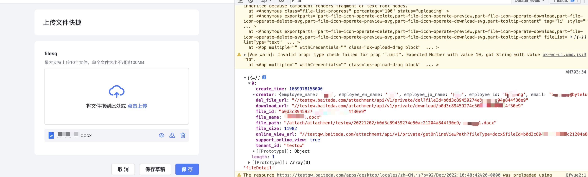

1. 打印效果





2. 代码


```javascript
//上传文件控件值变化时事件
export async function fileChange (payload) {
  // 图片控件详细信息
  const fileDetail=await utils.getDisplay(ctx.getInstance("v1QfznTH4o"))
  console.log(fileDetail,"fileDetail")
  //可以获取到文件的对象，里面包含文件全路径
}
```
