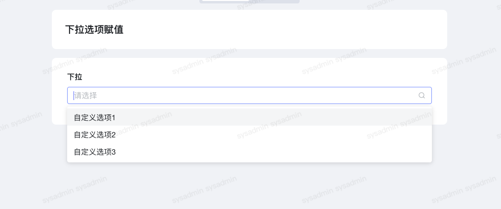

1. 展示效果





2. 代码


```javascript
// 下拉单选控件获取焦点时
export async function onFocus(payload) {
  //这里可以通过接口、服务、自定义的数据来给option赋值
  let res = await utils.querySvc({
    "app_id": "app_jmmfyt6y01",
    "svc_code": "employee_one_level_dept",
    "save_datas": {
      "employee_id": ctx.getState('唯一标识符')
    }
  });
  if (res.code === '000000') {
    console.log(res)
    // 需要对res的数据进行处理
  }
      const option = [
      {
        label: "自定义选项1",
        value: 1
      },
      {
        label: "自定义选项2",
        value: 2
      },
      {
        label: "自定义选项3",
        value: 3
      }
    ]
    ctx.setInstance('QVB5DJyrIy', 'options', option)
```
