<a id="pOrss"></a>


## 关键字

打开表单，查看表单，新表单，其他表单

<a id="dvhcZ"></a>


## 概述

在表单中编辑数据时，经常会遇到需要用到的数据存在于另一个业务模型下的表单上的情况，这时需要在当前表单再打开一张新的表单以便于查看或填写数据，使多个业务模型之间实现联动。

例如：

- 在物品领用申请时需要新增/修改/查看领用物品的信息详情时。
- 在提交报销申请时需要新增/修改/查看发票的信息详情时。
- 在采购申请中需要新增/修改/查看物品的信息详情时

......

<a id="nvNng"></a>


## 如何使用

<a id="ysz3u"></a>


### 使用表单控件

平台单独为打开表单操作添加了一个表单高级控件，以便对打开的表单进行进一步操作。

将高级控件中的表单操作拖拽至表单页面上，点击动作设置下的设置按钮打开设置面板，可以在这里配置需要打开的表单，并可以进行表单的填充与回填。


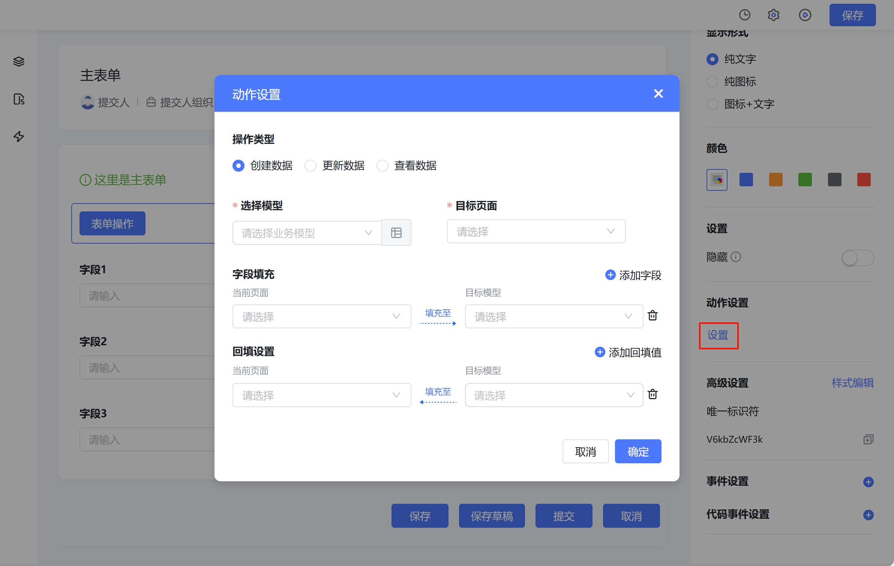


有关该表单控件的更多相关请移步至[表单操作](https://baiteda.yuque.com/czwxoe/avp3qe/rgew3i)进行查阅。

<a id="cnBhF"></a>


### 使用可视化事件

可视化事件，指平台将大多数通用事件进行统一封装之后，通过点击即可实现对应操作，其中就包括打开页面。

该方法对使用表单控件完全上位，不仅可以用于按钮，也可以用于任何支持可视化事件的控件。

表单中的大部分空间都拥有事件设置，此处按钮为例，在如图位置配置新增事件并选择打开页面。


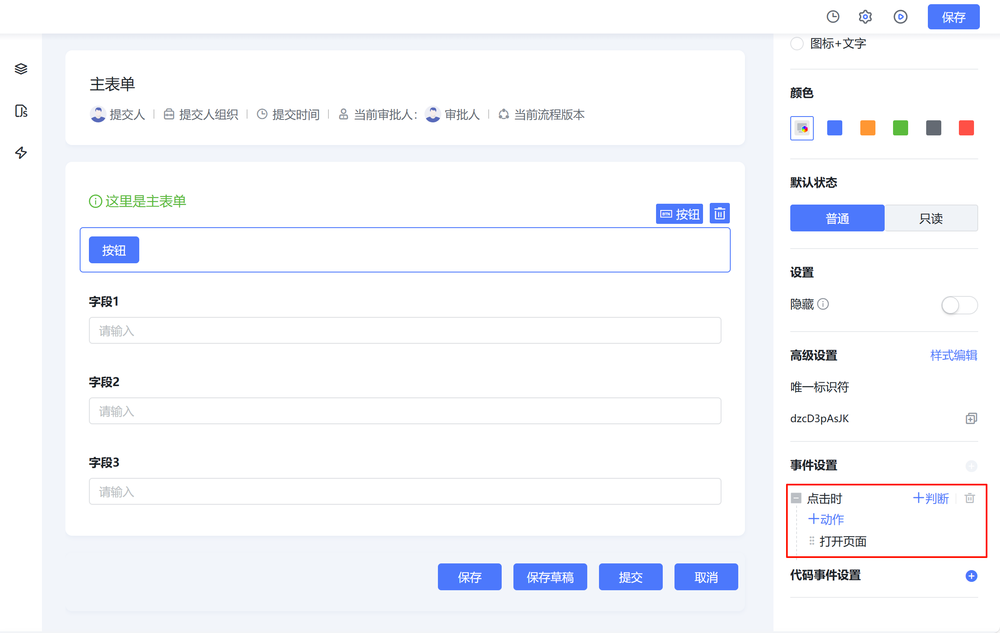


在动作设置中可以选择需要打开的页面类型，设置打开方式，还可以从平台所有应用中选择模型与对应模型下的表单。

根据操作类型不同，需要配置不同的数据过滤，以便确认需要打开的是那个表单。


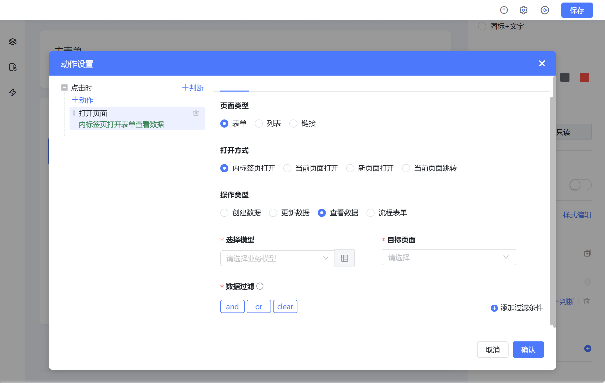


有关打开页面与可视化事件的具体使用介绍及其他用途可移步至[控件事件](https://baiteda.yuque.com/czwxoe/avp3qe/kgfd6a)进行查阅。

<a id="FTFLm"></a>


### 使用内置组件

如果需要在打开表单或者关闭表单时进行更多的操作，上面两种方法无法满足时，便可以使用此方式。

该方式需要用到vue容器，在vue容器对应的vue代码中，添加平台内置表单弹窗组件，通过传递对应的参数，配置对应的方法，以实现需要的效果。

该组件的具体使用方法，请移步至[blFormEngineModal 表单弹窗组件](../../006-前端开发/005-前端内置组件/002-blFormEngineModal 表单弹窗组件.md)进行查阅。

<a id="HbZXn"></a>


### 使用js代码

使用js可以很好的打开新的表单页面，但是使用这种方式打开的表单与当前表单之间互相通信比较困难，请在适合的时机选用它。

我们在window上设置了内标签页相关方法，若想要在内标签页打开表单，可以使用这种方法。

使用window.open()方法，创造一个全新的标签页，并在该标签页中打开表单。

使用iframe，在当前表单中不使用弹窗形式，直接将想要打开的表单放在当前表单上。

该方法主要是为了应对一些特殊情况，比如在vue页面中打开流程表单，用以上三种方式均无法实现。这时需要用到原生js中的iframe进行页面嵌套打开。

本质上，这种方式是在当前页面使用window.open()或iframe打开了一个新的网页，故而受到诸多限制，最好寻找专业前端人员进行帮助。

内标签页使用请参考[内标签页api](../../006-前端开发/001-前端二开API.md#lou7D)

iframe的使用可参考[iframe](https://developer.mozilla.org/zh-CN/docs/Web/HTML/Element/iframe)

window.postMessage()可参考[window.postMessage - Web API | MDN (mozilla.org)](https://developer.mozilla.org/zh-CN/docs/Web/API/Window/postMessage)

表单地址的拼接可参考[页面url参数说明](../../002-专题讲解/007-表单 列表二开指南/README.md#R877z)

<a id="frpwo"></a>


## 使用案例

<a id="eqSgz"></a>


### 表单控件打开表单

首先将表单操作控件拖拽至表单画布上，接着点击设置打开配置面板。


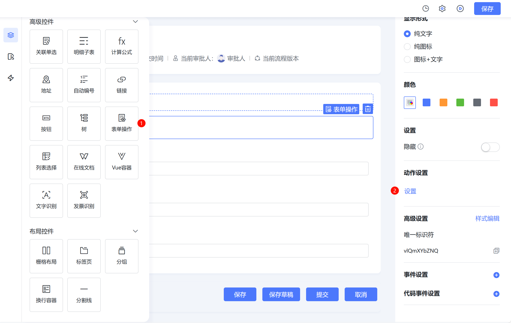


<a id="G00YM"></a>


#### 新增数据

选择创建数据，然后选择需要打开的表单，最后点击确定即可。


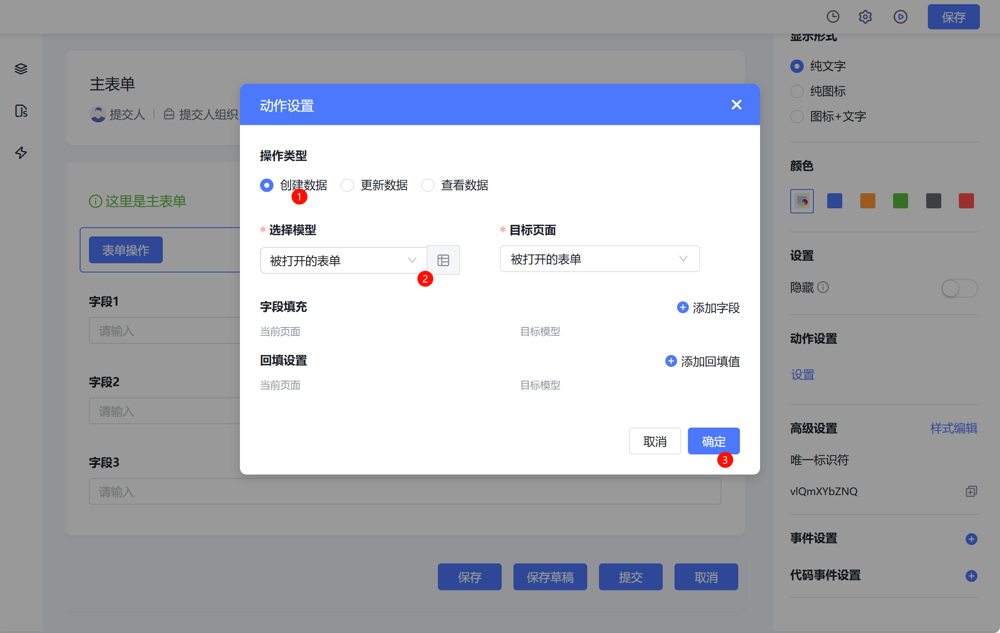


如图所示，点击“表单操作”按钮后，页面打开了一个新的空白表单，并可以进行保存操作


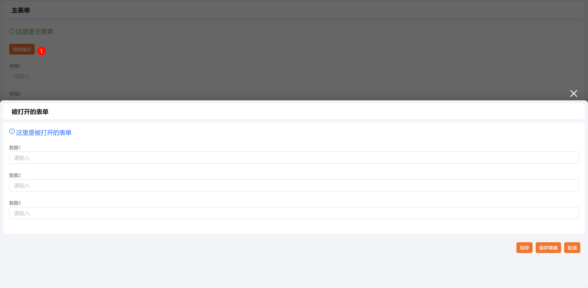


<a id="xRDRg"></a>


#### 更新数据

在打开的面板中选择更新数据，选择需要打开的表单，设置被打开的唯一标识符从字段1中取得，点击确定。


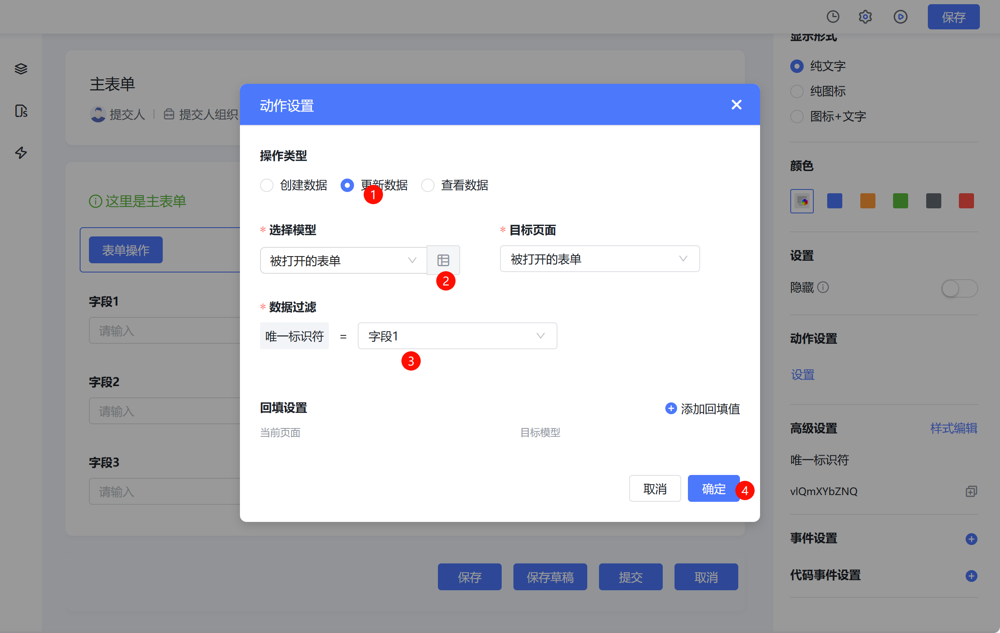


填写“字段1”后，点击表单操作，即可打开对应唯一标识符的表单数据，并可进行编辑。


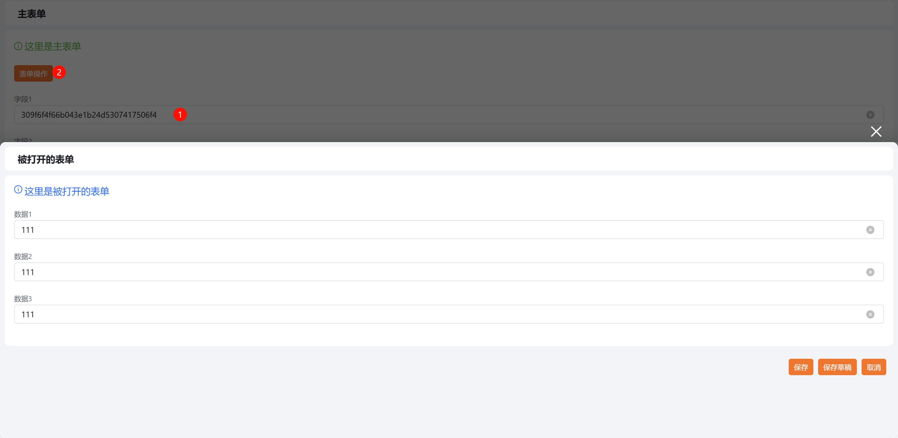


<a id="Z2TPR"></a>


#### 查看数据

查看数据与更新数据相似。不同的时打开的表单是只读的，无法进行修改。此处不再额外展示。

<a id="ukiVd"></a>


### 可视化事件打开表单

此处以按钮控件为例，配置可视化事件，时机为按钮的点击时，事件为打开页面。


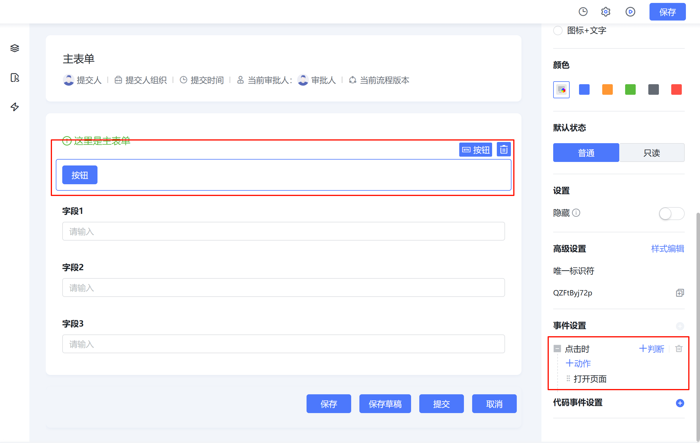


<a id="rKGiC"></a>


#### 新增数据

与表单操作控件类似，但是增加了“打开方式”“字段填充”“回填设置”配置项，可以根据需要选择。


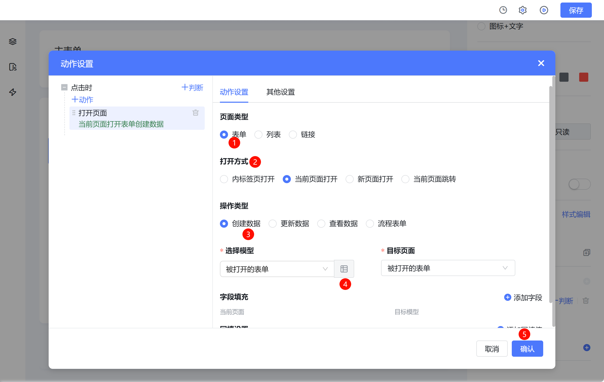


点击按钮即可打开空白表单。


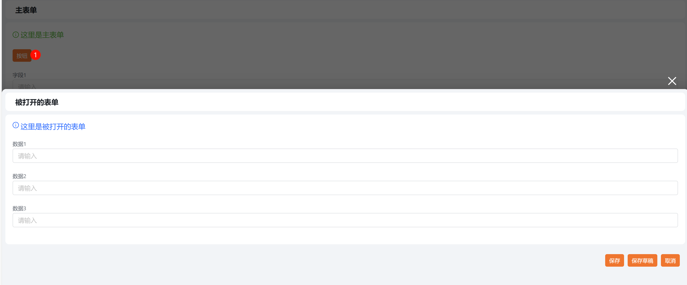


<a id="Krfmc"></a>


#### 更新数据

如图，与表单控件类似，依然选择“字段1”作为uid来源。


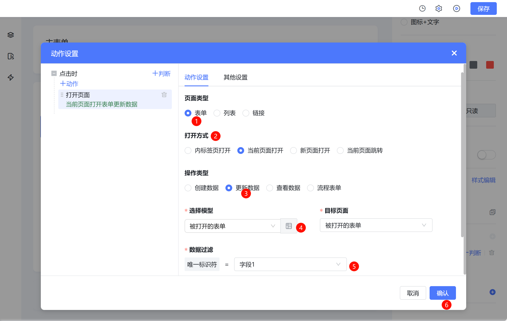


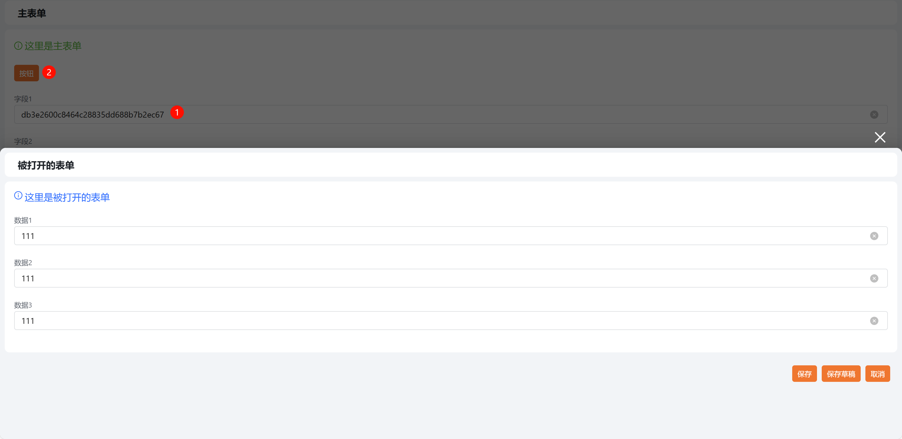


<a id="MhmV2"></a>


#### 查看数据

与更新数据类似，但是在数据过滤这里，可以选择更多过滤字段了。不单单可以选择唯一标识符，也可以选择被打开表单的控件等。运行态图片不再展示。


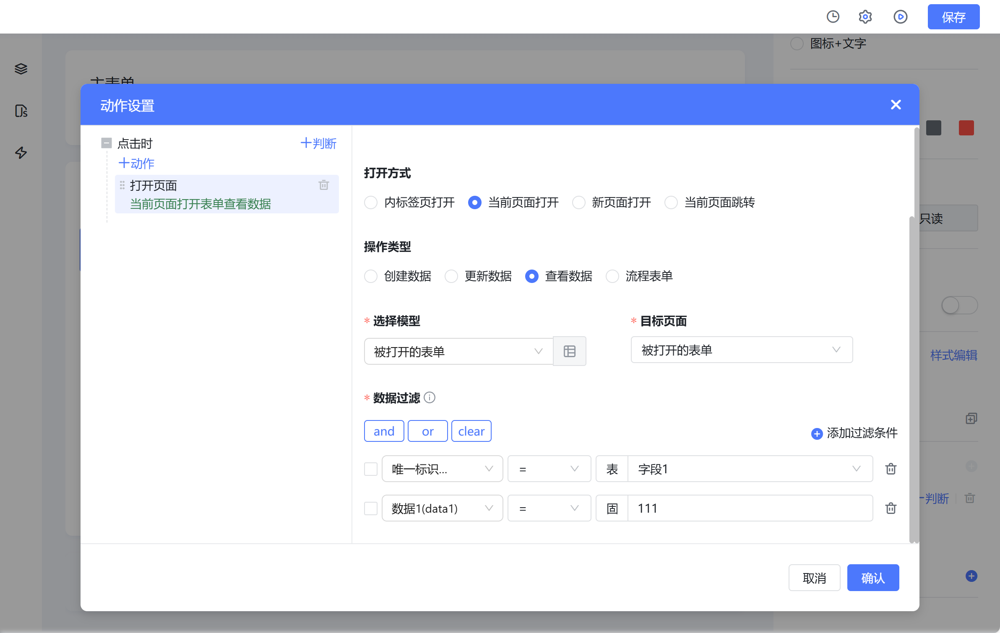


<a id="VdLiv"></a>


### 使用内置组件打开表单

由于内置组件需要写在vue中，强烈建议先阅读[3.4 如何使用vue容器](005-使用Vue容器/README.md)后，再来阅读本节。

在vue容器中添加组件，根据实际场景写法会有改变，请根据实际使用。


```javascript
const ctx = exports.ctx;
const env = exports.env;
const utils = exports.utils;
const pageStatus = utils.getPageStatus()
const http = utils.getHttp(utils.getBasePath());
const isMobile = utils.getDevice() === 'mobile'
// 注意，此处仅为示例，切勿直接复制使用，复制后，请更改相关参数
// 行内注释仅为了方便介绍，复制粘贴后需删除！！！
// 点击按钮后，变量"visible"的值被改为true，表单打开。
export const openForm =  {
  template: `<div>
    <a-button type="link" @click="openDailog">打开表单</a-button>
    <bl-form-engine-modal
      v-model:visible="visible"
      form-key="form_8fupibmzqg" 									// 需要打开的表单的form-id
      app-id="app_gicbh547hh"    									// 需要打开的表单所在的应用的app-id
      uid="db3e2600c8464c28835dd688b7b2ec67"			// 需要打开的数据的唯一标识符，若为空，则为新建表单
    ></bl-form-engine-modal>
  </div>`,
  props: ['instance', 'name','value','rowIndex','pageStatus'],
  emits: ['change'],
  data: function () {
    return {
      visible: false
    };
  },
  methods: {
    openDailog: function () {
      this.visible = true
    },
  }
}
```


如图，点击“打开表单”按钮后，打开表单。


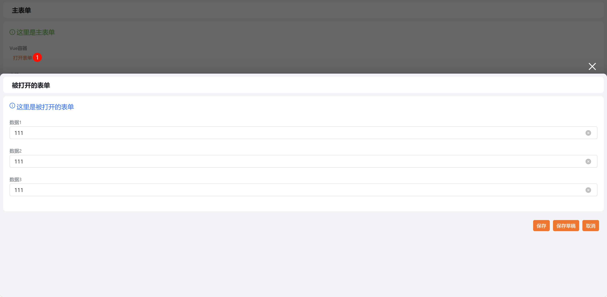


<a id="W3rzi"></a>


### 使用js

由于原生js可实现打开网页方法较多，此处仅列举几个典型。

<a id="xVdeX"></a>


#### window.open()

实现点击按钮时打开新标签页表单。为按钮配置点击时方法“openForm”。


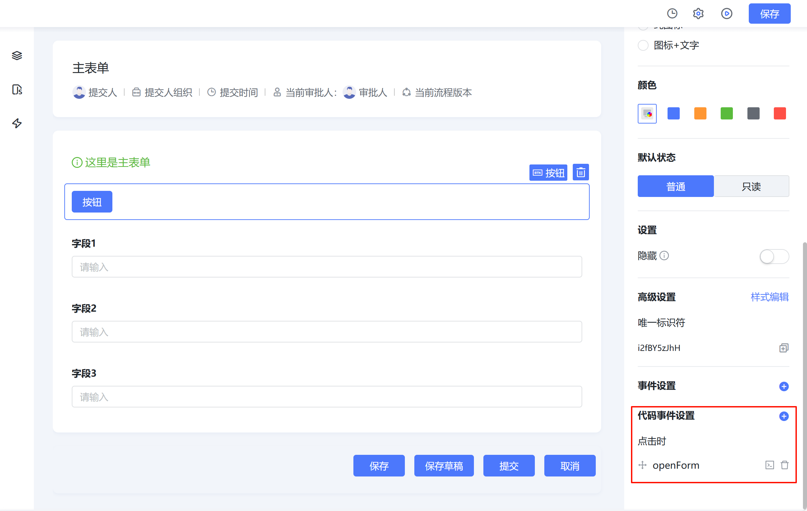


```javascript
export function openForm (payload) {
  const appId = 'app_gicbh547hh'
  const formId = 'form_8fupibmzqg'
  const uid = '309f6f4f66b043e1b24d5307417506f4'
  // 新增表单
  window.open('/apps/desktop/sapp/'+appId+'/sappId/'+formId)
  // 查看表单
  window.open('/apps/desktop/process/'+appId+'/sappId/'+formId+'/'+uid+'?type=view')
  // 修改表单
  window.open('/apps/desktop/process/'+appId+'/sappId/'+formId+'/'+uid)
}
```

<a id="fmgxL"></a>


#### 内标签页

在上面的按钮点击方法中加入如下方法，可实现新建内标签页。


```javascript
window.multipleTabs.createMultipleTab(
  '查看页面',
 'form_8fupibmzqg',
  '/apps/desktop/sapp/app_gicbh547hh/sappId/form_8fupibmzqg',
  'view'
)
```

<a id="Xfd0v"></a>


#### iframe

这是最简单的iframe示例，其中src的规则与上面的一致。


```html
export const openForm =  {
  template: `<iframe width="100%" height="1000" src="/apps/desktop/sapp/app_gicbh547hh/sappId/form_8fupibmzqg?header=none"></iframe>`,
  props: ['instance', 'name', 'value', 'rowIndex', 'pageStatus', 'permissions'],
  emits: ['change'],
}
```


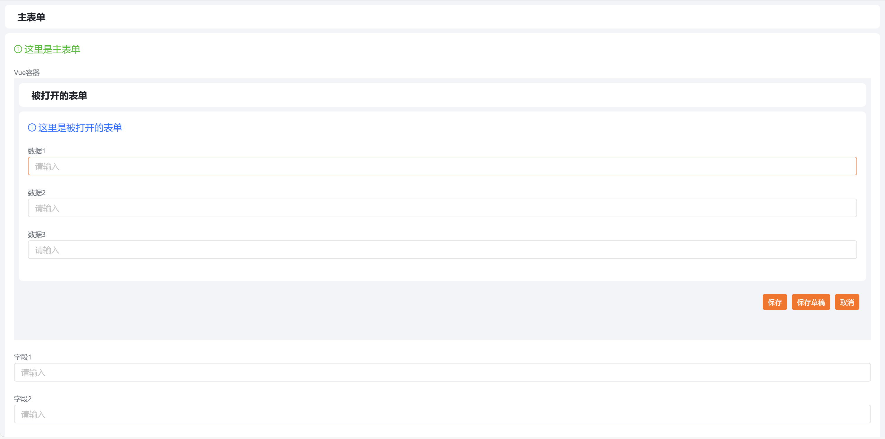


​
