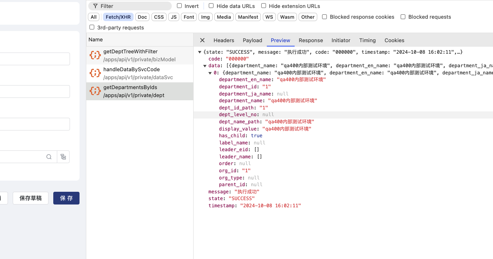
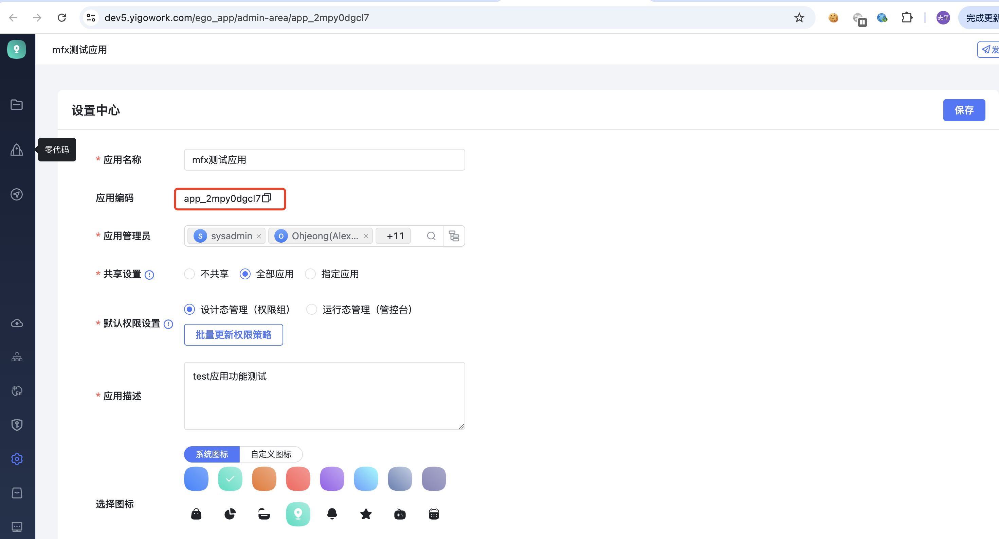
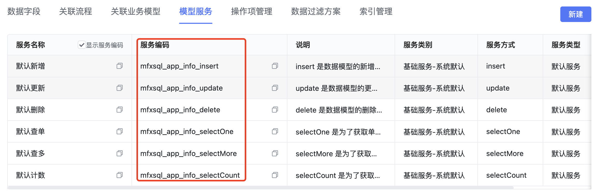
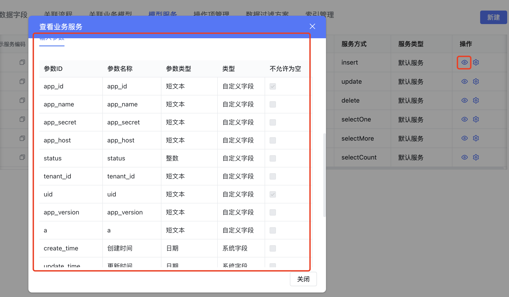
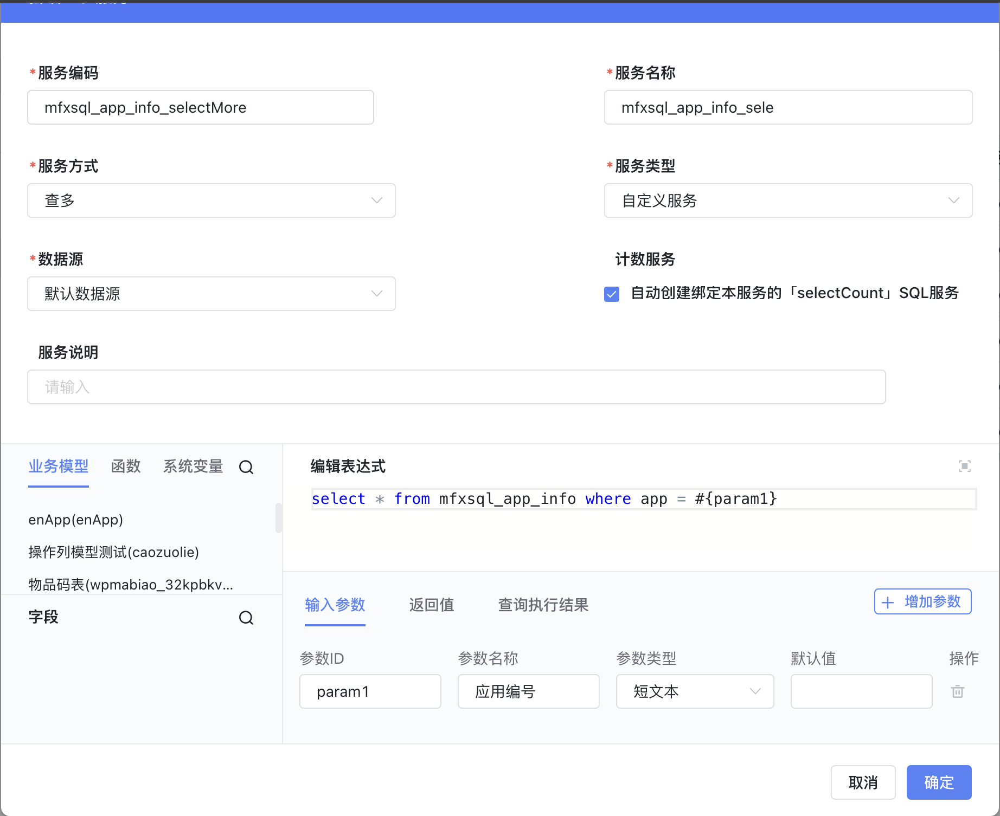

<a id="SUug3"></a>


## 一、表单js直接调用接口

概述： 平台内置了 post get fetch的方式来解决，直接后端接口的调用，需要注意的是接口地址需要打开跨域，需要支持的跨域头如下


```groovy
access-control-allow-credentials: true
access-control-allow-headers: DNT,X-CustomHeader,Keep-Alive,User-Agent,X-Requested-With,If-Modified-Since,Cache-Control,Content-Type,post-auth,post-at,Post-Id,token,auth,href,authCode,requestfrom,Accept-Language,accept-Language,tenantId
access-control-allow-methods: *
access-control-allow-origin: https://dev5.yigowork.com  ##平台域名 注意这里不能用*，新版的chrome会报错，需要指定具体域名
```


```javascript
const ctx = exports.ctx;
const utils = exports.utils;

const http = utils.getHttp()
const isMobile = utils.getDevice() === 'mobile'


// 调用接口
async function getData(){
  const res=await utils.getHttp().post("接口地址",{})
}


// 调用外部接口-跨域
export async function oneLevelDep() {
  const parm = {
    department_ids: ctx.getState("bvqikju2Gd"),
    display_level: 10  //后台暂定10
  }
  await fetch(`${location.origin}/apps/api/v1/private/dept/getDepartmentsByIds`, {
    method: 'POST',
    body: JSON.stringify(parm),
    headers: { 'content-type': "application/json" },
    mode: 'cors',
  }).then(res => {
    return res.json();
  }).then(json => {
    console.log('获取的结果', json.data);
  }).catch(err => {
    console.log('请求错误', err);
  })
}
```





<a id="g7BH0"></a>


## 二、表单js调用平台服务

参数说明：

app\_id：当前应用的id





svc\_code：服务编码





save\_datas: 服务的参数传递





参数说明：

平台服务类型分为 新增、更新、删除、查单、查多、计数

其中 新增、更新、删除、查单 的入参都是 save\_datas,参数格式是key,value的map 结构

使用案例：


```javascript
//新增，uid 指的是主键，平台默认模型下都是uid，如果是高级业务模型或者虚拟业务模型主键非uid这边需要根据实际情况指定
let res = await utils.querySvc({
    "app_id": "app_2mpy0dgcl7",
    "svc_code": "mfxsql_app_info_insert",
    "save_datas": {
      "uid": ctx.getState('UHGe89R51K'), // 新增是主键不是必填，可以给null值，如果为null则平台自动生成uuid
      "status": "状态1"
    }
  });

//修改
let res = await utils.querySvc({
    "app_id": "app_2mpy0dgcl7",
    "svc_code": "mfxsql_app_info_update",
    "save_datas": {
      "uid": ctx.getState('UHGe89R51K'), // 主键必填
      "status": "状态1"
    }
  });

//删除
let res = await utils.querySvc({
    "app_id": "app_2mpy0dgcl7",
    "svc_code": "mfxsql_app_info_delete",
    "save_datas": {
      "uid": ctx.getState('UHGe89R51K') // 主键必填
    }
  });

//查单
let res = await utils.querySvc({
    "app_id": "app_2mpy0dgcl7",
    "svc_code": "mfxsql_app_info_selectOne",
    "save_datas": {
      "uid": ctx.getState('UHGe89R51K') // 主键必填
    }
});
```


查多服务和计数服务需要传递的是query参数，如下


```javascript
//查多、计数
let res = await utils.querySvc({
    "app_id": "app_2mpy0dgcl7",
    "svc_code": "mfxsql_app_info_selectMore",
     "query":{//查多服务是需要传递
          "page_index":1,
          "page_size":10,
          "query_criteria":[
              {
                  "column_name":"dcount",
                  "query_type":0,//查询类型 0:eq,1:gt,2:lt,3:in,4:like,5:range
                  "value":[ //查询匹配值，eq gt lt like,数组长度为1，其他为2
                     "value1"
                  ]
              },{
                    "column_name_list":[
                          {
                              "value": "dept_name",
                              "field_type": "varchar",
                              "type": "FIELD"
                          },
                          {
                            "type":"MOSAICS",
                            "value":"_"
                          },
                          {
                            "value": "dept_id",
                            "field_type": "varchar",
                            "type": "FIELD"
                          }
                      ],
                    "query_type":9, //多字段拼接like 用sql表示即  concat(dept_name,"_",dept_id) like "%value1%"
                    "value":[
                       "value1"
                    ]
                }
          ],
          "sort_criteria":{
              "dcount":"desc"
          },
        "data_filters": [
        {
            "type": "conditions",
            "value": "or",
            "children": [
                {
                    "type": "condition",
                    "left_variable_bo": {
                        "type": "varchar",
                        "value": "storeType"
                    },
                    "value": [
                        "10"
                    ],
                    "symbol": "op_equal"
                },
                {
                    "type": "condition",
                    "left_variable_bo": {
                        "type": "varchar",
                        "value": "storeType"
                    },
                    "value": [
                        "11"
                    ],
                    "symbol": "op_equal"
                }
            ]
        },
        "save_datas":{
            "param1":"113"
          }

    ]
    },
});
```


query参数说明

page\_index : 分页页码

page\_size： 每页大小

sort\_criteria：排序字段asc desc,如果不需要传排序字段 需要传空对象 "sort\_criteria": {}

query\_criteria： 查询过滤字段,如果不需要过滤需要传空数组 "query\_criteria":[]

save\_datas: sql服务内嵌参数是需要，如下图所示





data\_filters 高级过滤 支持 多层嵌套 比如 **book\_name like "%aa%" and (id = "2323" and name = "aaa")**

上面最终翻译的sql如下 (其中query\_criteria、data\_filters 都是拼接到外面，save\_datas是在内部根据参数匹配)

select \* from (select \* from mfxsql\_app\_info where app = '123' ) t where dcount = 'value1' and concat(dept\_name,"\_",dept\_id) like '%value1%' and (storeType = '10' or storeType = '11' ) dcount desc limit 1,10

​

​

query\_criteria, query\_type 枚举说明

|  |  |  |
| --- | --- | --- |
| **query\_type 枚举** | **示例** | **转义到sql （以mysql为例,会根据数据类型自动转换成数字或者字符串）** |
| EQ查询 queryType=0 | {  **"column\_name"**: **"book\_name"**,  **"value"**: [  **"heihei"**  ],  **"query\_type"**: **0** } | book\_name = "heihei" |
| GT查询 queryType = 1 | {  **"column\_name"**: **"book\_no"**,  **"value"**: [  **"123"**  ],  **"query\_type"**: **1** } | book\_no > "123" |
| LT查询 queryType = 2 | {  **"column\_name"**: **"book\_no"**,  **"value"**: [  **"123"**  ],  **"query\_type"**: **2** } | book\_no < "123" |
| IN查询 queryType = 3 | {  **"column\_name"**: **"book\_name"**,  **"value"**: [  **"123"**,  **"456"**,  **"789"**  ],  **"query\_type"**: **3** } | book\_no in ("123","456","789") |
| LIKE查询 queryType = 4 | {  **"column\_name"**: **"book\_name"**,  **"value"**: [  **"heihei"**  ],  **"query\_type"**: **4** } | book\_name like '%heihei%' |
| RANGE查询 queryType = 5 | {  **"column\_name"**: **"book\_no"**,  **"value"**: [  **"123"**,  **"789"**  ],  **"query\_type"**: **5** } | book\_no between 123 and 789 |
| GE查询 queryType = 6 | {  **"column\_name"**: **"book\_no"**,  **"value"**: [  **"123"**  ],  **"query\_type"**: **6** } | book\_no >= 123 |
| LE查询 queryType = 7 | {  **"column\_name"**: **"book\_no"**,  **"value"**: [  **"123"**  ],  **"query\_type"**: **7** } | book\_no <= 123 |
| CONCATLIKE查询 queryType = 9 | {  **"column\_name\_list"**: [  {  **"type"**: **"FIELD"**,  **"value"**: **"book\_name"**  },  {  **"type"**: **"MOSAICS"**,  **"value"**: **"\_"**  },  {  **"type"**: **"FIELD"**,  **"value"**: **"book\_no"**  }  ],  **"column\_name"**: **null**,  **"value"**: [  **"张三\_123"**  ],  **"query\_type"**: **9** } | concat(**book\_name,"\_",book\_no**) like **"%张三\_123%"**  **用户解决下拉框多字段拼接模糊搜索的场景** |
| not eq 查询 queryType = 11 | {  **"column\_name"**: **"book\_no"**,  **"value"**: [  **"123"**  ],  **"query\_type"**: **11** } | book\_no != 123 |
| 为空胡总等于某个字段 queryType = 11 | {  **"column\_name"**: **"book\_no"**,  **"value"**: [  **"p\_book\_no"**  ],  **"query\_type"**: **11** } | book\_no is null or book\_no = '' or book\_no = **p\_book\_no** |

​

入参类型说明

​

|  |  |  |
| --- | --- | --- |
| 类型 | 示例 | 说明 |
| VARCHAR("varchar", "短文本") | "123" | 字符串 |
| TIMESTAMP("timestamp", "时间") | 1728390784000 | 毫秒级时间戳 |
| TEXT("text", "长文本") | "123" | 字符串 |
| DECIMAL("decimal", "数值类型") | 123 | 数值 |
| BIGINT("bigint", "长整型") | 123 | 数值 |
| IMAGE("image", "图片") | ["cbf556d5e3944929a3f5a4fb4a9183a8","d8d67b6a64f446bfa026b2aefe12a39b"] | 数组格式的图片文件id，需要先通过附件接口把二进制流传进去， 业务表中存储以逗号隔开  在平台的system\_file\_resource有详细信息 |
| FILE("file", "附件") | ["cbf556d5e3944929a3f5a4fb4a9183a8","d8d67b6a64f446bfa026b2aefe12a39b"] | 数组格式的附件文件id，需要先通过附件接口把二进制流传进去， 业务表中存储以逗号隔开  在平台的system\_file\_resource有详细信息 |
| AUTO\_NUMBER("auto\_number", "自动编号") | 只读 | 平台会根据配置自动生成，如果前端传了则用前端的 |
| PEOPLE("people", "人员") | ["zhangsan","lisi"] | employee\_info表里面的用户id，业务表数据库以逗号隔开存储 |
| LOCATION("location", "地址") |  | 地址json字符串存储 |
| ARRAY("array", "数组") | ["选项一","选项二"] | 数据库中以#@#存储 如 选项一#@#选项二，为了防止存储选项中存在，逗号所以未用逗号隔开 |
| DEPARTMENT("department", "部门") | ["bumen1","bumen1"] | dept\_info表里面的部门id，业务表数据库以逗号隔开存储 |
| RELATION\_FIELD("relation-field", "关联字段") | "cbf556d5e3944929a3f5a4fb4a9183a8" | 关联表中的主键字段 |
| REFERENCE\_FIELD("reference-field", "引用字段") | 只读 | 存储接口传递后会被过滤掉，查询类接口可以传递 |
| CALC("calc", "计算公式") | 只读 | 存储接口传递后会被过滤掉，查询类接口可以传递 |
| JSON("json", "JSON") | {"id":"123"} | 业务表中以json字符串存储，一般用于自定义主键或者vue容器用来存储复杂类型 |
| NCRYPTED\_FIELD("encrypted\_field", "加密文本") | 只读 | 不支持作为入参传递 |

​

​

data\_filters 参数说明


```javascript
"data_filters": [
        {
            "type": "conditions",  // 类型
            "value": "or",  // and or
            "children": [
                {
                    "type": "condition",
                    "left_variable_bo": {
                        "type": "varchar",
                        "value": "storeType"
                    },
                    "value": [
                        "10"
                    ],
                    "symbol": "op_equal"
                },
                {
                    "type": "condition",
                    "left_variable_bo": {
                        "type": "varchar",
                        "value": "storeType"
                    },
                    "value": [
                        "11"
                    ],
                    "symbol": "op_equal"
                }
            ]
        }
```


type 条件类型

conditions 条件组

对象如下


```java
@Data
public class ConditionsFilter  extends BaseFormElementBindFilter  implements Serializable {
    private static final FilterTypeEnum type = FilterTypeEnum.CONDITIONS;
    /**
     * 连接符 and/or
     */
    private String value;

    /**
     *
     */
    private List<BaseFormElementBindFilter> children;

     @Override
    public FilterTypeEnum getType() {
        return type;
    }

}
```


condition 条件


```java
@Data
public class ConditionFilter extends BaseFormElementBindFilter  implements Serializable {
    private static final long serialVersionUID = 1L;

    private static final FilterTypeEnum type = FilterTypeEnum.CONDITION;
    /**
     * 运算符
     */
    private String symbol;

    @ApiModelProperty(value = "左值")
    private LeftVariableBo leftVariableBo;

    @ApiModelProperty(value = "右值")
    private RightVariableBo rightVariableBo;

    @Override
    public FilterTypeEnum getType() {
        return type;
    }
}

@Data
public class LeftVariableBo implements Serializable {

    private static final long serialVersionUID = 1860415281232802560L;

    @ApiModelProperty(value = "模型编码（区分查询哪张表）")
    private String dataCode;

    /**
     * 字段类型
     */
    @ApiModelProperty(value = "字段类型")
    private String type;

    /**
     * 字段code
     */
    @ApiModelProperty(value = "字段code")
    private String value;

    /**
     * 字段类型
     * @see OptionsTypeEnum
     */
    @ApiModelProperty(value = "值类型：系统变量值、字段值,默认为字段值")
    private String category;


    public LeftVariableBo(String type, String value) {
        this.type = type;
        this.value = value;
    }

}

/**
 * 数据过滤右值对象
 */
@Data
@AllArgsConstructor
@NoArgsConstructor
public class RightVariableBo implements Serializable {

    private static final long serialVersionUID = 1860415281232802560L;

    /**
     * 类型
     * 表单控件/系统变量/自定义
     * {@link OptionsTypeEnum}
     */
    @ApiModelProperty(value = "表单控件/系统变量/自定义")
    private String type;

    /**
     * 选择的值 表单控件为 控件ID， 系统变量为 规定字符串， 自定义为 值
     */
    @ApiModelProperty(value = "选择的值 表单控件为 控件ID， 系统变量为 规定字符串， 自定义为 值")
    private List<Object> value;

}
```


完整示例：


```javascript
const ctx = exports.ctx;
const utils = exports.utils;

const http = utils.getHttp()
const isMobile = utils.getDevice() === 'mobile'


// 调用服务
export async function setProjectManagerHide(payload) {
  let res = await utils.querySvc({
    "app_id": "app_jmmfyt6y01",
    "svc_code": "employee_one_level_dept",
    "save_datas": {
      "employee_id": ctx.getState('UHGe89R51K')[0]
    }
  });
  if (res.code === '000000') {
    console.log(res)
    // 有两种提示
    utils.toast("提示的内容")
    // 可根据res.code选择不同的提示类型
    window.antd.message.info("提示的内容")
    window.antd.message.success("提示的内容")
    window.antd.message.error("提示的内容")
  }
}


```


​

​

## 下级条目

- [服务、接口调用](001-服务、接口调用.md)
