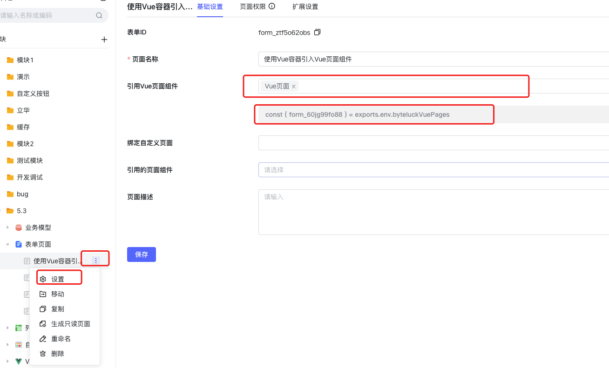
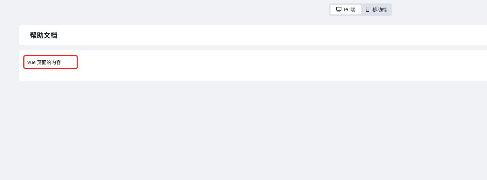

<a id="ut34q"></a>


#### 新建Vue容器

<a id="AIlb4"></a>


#### 引用Vue页面，修改Vue容器模版，编写代码





```javascript
const ctx = exports.ctx;
const env = exports.env;
const utils = exports.utils;
const pageStatus = utils.getPageStatus()
const http = utils.getHttp(utils.getBasePath());
const isMobile = utils.getDevice() === 'mobile'
const { form_60jg99fo88 } = exports.env.byteluckVuePages
export const vue_name1 = {
  template: `<form_60jg99fo88/>`,
  props: ['instance', 'name', 'value', 'rowIndex', 'pageStatus', 'permissions'],
  emits: ['change'],
  components: { form_60jg99fo88 },
  data: function () {
    return {
    };
  },
  mounted: function () {
    this.$emit('change', 777)//用于更新数据
  },
  methods: {

  }
}
```

<a id="tkkwo"></a>


#### 效果展示



