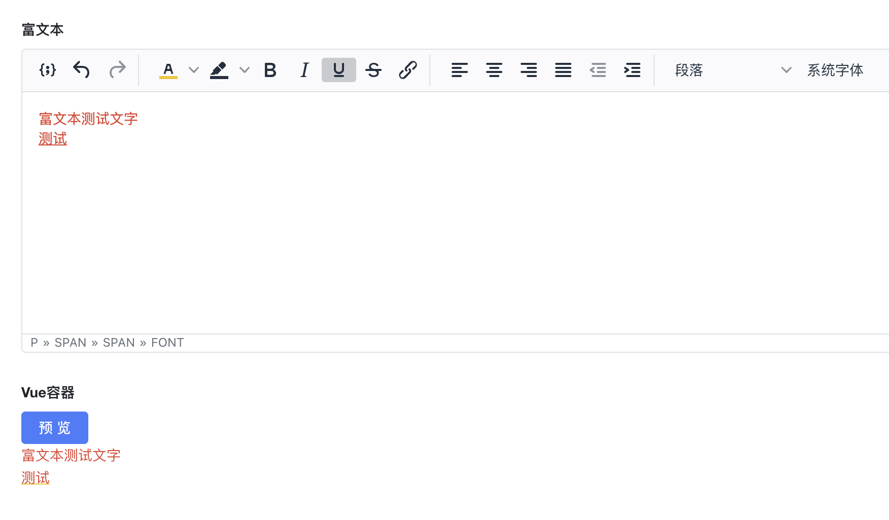

1. 展示效果





2. Vue容器


```javascript
const ctx = exports.ctx;
const utils = exports.utils;
const http = utils.getHttp()
const isMobile = utils.getDevice() === 'mobile'
export const show1 =  {
  template: `<a-button type="primary" @click="preview">预览</a-button>
         <div class="html-detail" v-html="show_preview"></div>
  `,
  props: ['instance', 'name','value','rowIndex','pageStatus', 'permissions'],
  emits: ['change'],
  data: function () {
    return {
      show_preview: '',
    };
  },
  mounted: function() {
    this.$emit('change', 777)//用于更新数据
  },
  methods: {
    preview: function () {
      const rich_text=ctx.getState("O6iYiqbzZ5")
      this.show_preview=rich_text
    }
  }
}
```
