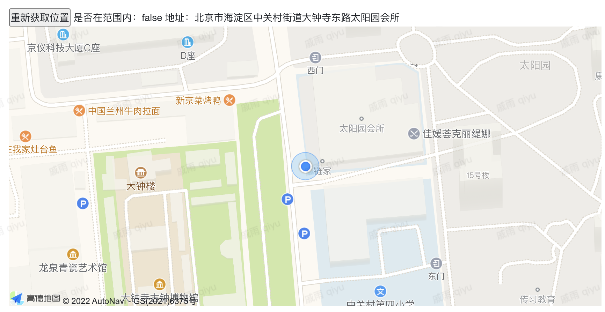

```typescript
const { shallowRef } = exports.env.vue
const ctx = exports.ctx;
const utils = exports.utils;
const http = utils.getHttp()
const isMobile = utils.getDevice() === 'mobile'
export const showMap =  {
  template: `<div>
  <button type="primary" @click="getCurrentLocation">重新获取位置</button>
  是否在范围内：{{inArea}}
  地址：{{address}}
  <div id="container" tabindex="0" style="height:400px"></div>
  </div>`,
  props: ['instance', 'name','value','rowIndex','pageStatus'],
  emits: ['change'],
  data: function () {
    return {
      inArea: false,
      map: shallowRef(null),
      address: ''
    };
  },
  mounted: function() {
    let url = 'https://webapi.amap.com/maps?v=1.4.15&key=baed08bb43236991bbb49945ecda2bc5&callback=onLoad';
    let jsapi = document.createElement('script');
    jsapi.charset = 'utf-8';
    jsapi.src = url;
    jsapi.onload = async () => {
      this.map = new AMap.Map('container');
      this.getCurrentLocation()
    }
    document.head.appendChild(jsapi);

  },
  methods: {
    getCurrentLocation() {
      AMap.plugin('AMap.Geolocation', () => {
        this.map.clearMap()
        const circle = new AMap.Circle({
          center: new AMap.LngLat(118.637002,32.081706), // 圆心位置
          radius: 1000,  //半径
          strokeColor: "#F33",  //线颜色
          strokeOpacity: 1,  //线透明度
          strokeWeight: 3,  //线粗细度
          fillColor: "#ee2200",  //填充颜色
          fillOpacity: 0.35 //填充透明度
        });

        this.map.add(circle);
        var geolocation = new AMap.Geolocation({
          enableHighAccuracy: true,//是否使用高精度定位，默认:true
          timeout: 10000,          //超过10秒后停止定位，默认：5s
          showButton: false,
          buttonPosition:'RB',    //定位按钮的停靠位置
          buttonOffset: new AMap.Pixel(10, 20),//定位按钮与设置的停靠位置的偏移量，默认：Pixel(10, 20)
          zoomToAccuracy: true,   //定位成功后是否自动调整地图视野到定位点

        });
        this.map.addControl(geolocation);
        geolocation.getCurrentPosition((status,result) => {
          if(status=='complete'){
            onComplete(result)
            this.inArea = circle.contains(result.position)
            // alert('是否在范围内：' + inArea)
            this.address = result.formattedAddress
          }else{
            onError(result)
          }
        });
      });
      //解析定位结果
      function onComplete(data) {
        // document.getElementById('status').innerHTML='定位成功'
        var str = [];
        str.push('定位结果：' + data.position);
        str.push('定位类别：' + data.location_type);
        if(data.accuracy){
          str.push('精度：' + data.accuracy + ' 米');
        }//如为IP精确定位结果则没有精度信息
        str.push('是否经过偏移：' + (data.isConverted ? '是' : '否'));
        console.log(str);
      }
      //解析定位错误信息
      function onError(data) {
        // document.getElementById('status').innerHTML='定位失败'
        // document.getElementById('result').innerHTML = '失败原因排查信息:'+data.message;
        console.error(data.message)
      }
    }
  }
}
```

<a id="lJNEl"></a>


# ​
