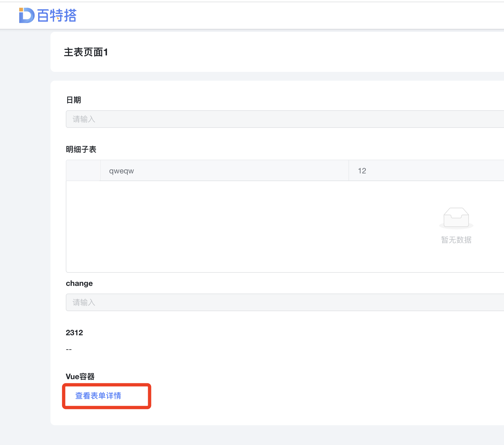
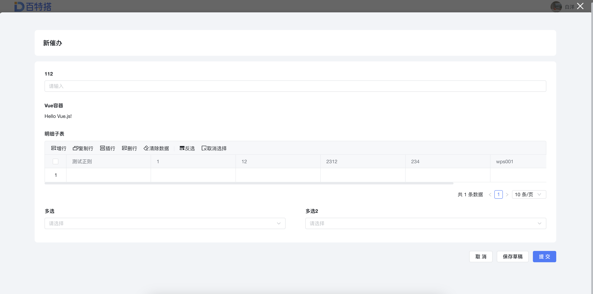

1. 展示效果








2. 在Vue容器中使用


```javascript
const ctx = exports.ctx;

const utils = exports.utils;
const http = utils.getHttp()
const isMobile = utils.getDevice() === 'mobile'
export const uyyguygygjgu =  {
  template: `
  <div>
    <a-button type="link" @click="openM">查看表单详情</a-button>
    <bl-form-engine-modal
      v-model:visible="showM"
      form-key="form_jzhbxxeoe9"
      app-id="app_dt9cfvho64"
      :readonly="false"
      :on-engine-submitted="onEngineSubmitted"
      :on-engine-mounted="onEngineMounted"
      :on-close-error="onCloseError"
      async
      :uid="value.uid"
      :onEngineMounted="popopFormMounted"
    ></bl-form-engine-modal>
  </div>
  `,
  props: ['instance', 'name','value','rowIndex','pageStatus', 'permissions'],
  emits: ['change'],
  data: function () {
    return {
      showM:false,
      uid:''
    };
  },
  mounted: function() {


  },
  methods: {
    openM: function () {
    this.showM=true
    this.uid=this.value.uid
    console.log(this.uid,"this.uid")
    },
    popopFormMounted:(ctx)=>{
      // ctx.setState("被弹出的表单的对应控件的唯一标识符",'111111111')
    }
  }
}
```
