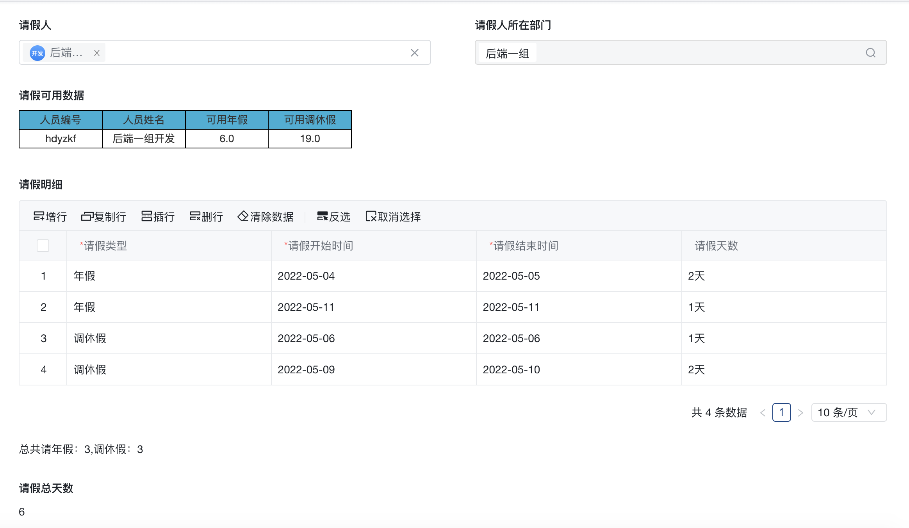

嵌入vue容器代码


```javascript
export const qjkyreport =  {
  template: `<div :style="style"><iframe id = "report" :src="page" style="width:100%;height:50px"
  frameborder="no" border="1" marginwidth="0" marginheight="0" scrolling="no"></iframe></div>`,
  props: ['instance', 'name','value','rowIndex','pageStatus', 'permissions'],
  emits: ['change'],
  data: function () {
    return {
      style:{
        display:'none'
      }
    };
  },
  mounted: function() {
    var iframe = document.getElementById('report');
    iframe.onload = () => {
      iframe.contentWindow.document.querySelector('.preview-form').style.display = 'none';
      this.style.display = 'block';
    }
  },
  computed: {
    page(){
      return "/report/ureport/view?_u=ego-8wrahhic5r&header=none&_t=0&user_id=" + this.value;
    }
  }
}
```


请假人（人员控件）值变更试触发js


```javascript
/**
 * 请假人变化时，刷新报表
 */
export function qjrchange (payload) {
  ctx.setState('nt4zOiOFPh',payload.value);
}
```
