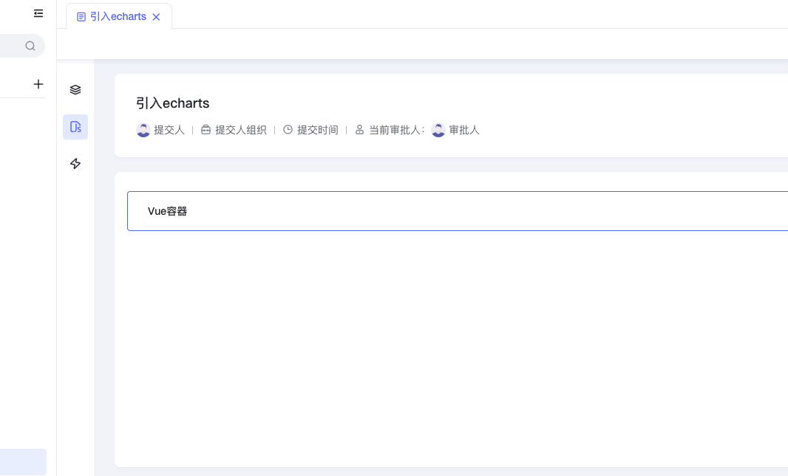
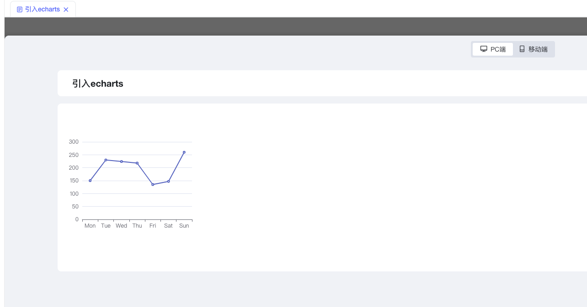

1、表单里拖一个Vue容器





2、Vue容器内代码


```javascript
const ctx = exports.ctx;
const utils = exports.utils;
const http = utils.getHttp()
const isMobile = utils.getDevice() === 'mobile'
export const e_charts = {
  template: `
      <div id="main" class="charts-content"></div>
  `,
  props: ['instance', 'name', 'value', 'rowIndex', 'pageStatus', 'permissions'],
  emits: ['change'],
  data: function () {
    return {

    };
  },
  mounted: function () {
    this.initCharts()
  },
  methods: {
    initCharts() {
      let url = 'https://cdnjs.cloudflare.com/ajax/libs/echarts/5.4.1/echarts.min.js';
      let jsapi = document.createElement('script');
      jsapi.charset = 'utf-8';
      jsapi.src = url;
      jsapi.onload = async () => {
        this.drawCharts()
      }
      document.head.appendChild(jsapi);
    },
    drawCharts() {
      var chartDom = document.getElementById('main');
      var myChart = echarts.init(chartDom);
      var option;
      option = {
        xAxis: {
          type: 'category',
          data: ['Mon', 'Tue', 'Wed', 'Thu', 'Fri', 'Sat', 'Sun']
        },
        yAxis: {
          type: 'value'
        },
        series: [
          {
            data: [150, 230, 224, 218, 135, 147, 260],
            type: 'line'
          }
        ]
      };
      option && myChart.setOption(option);
    }
  }
}
```


3、预览效果



