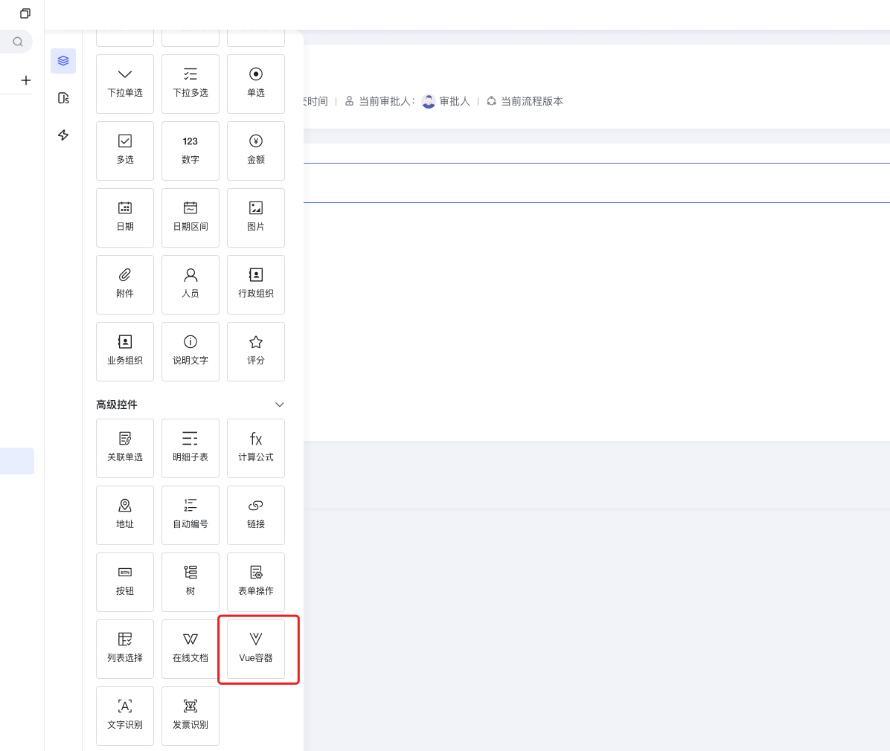
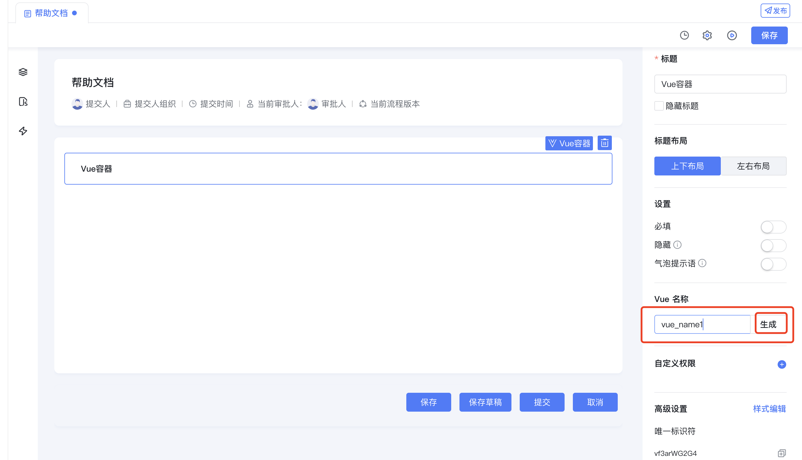
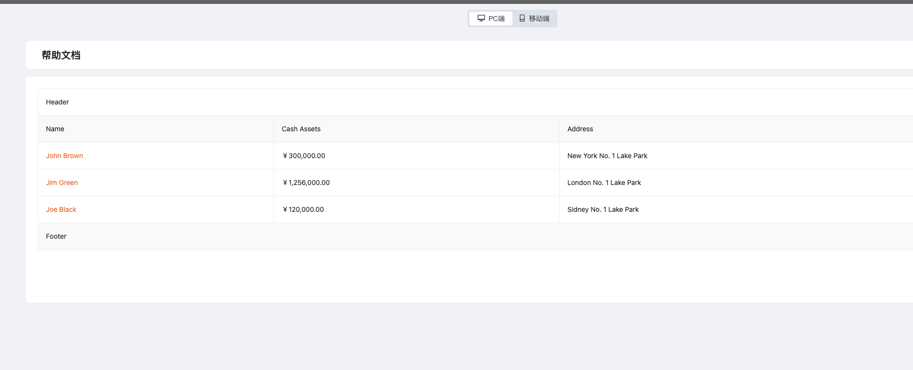
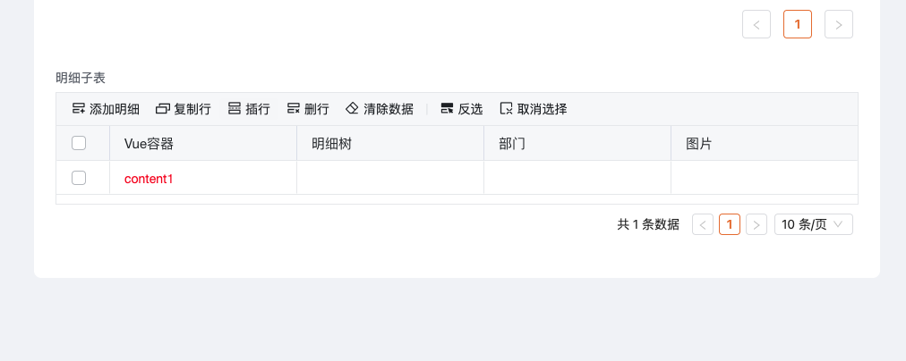
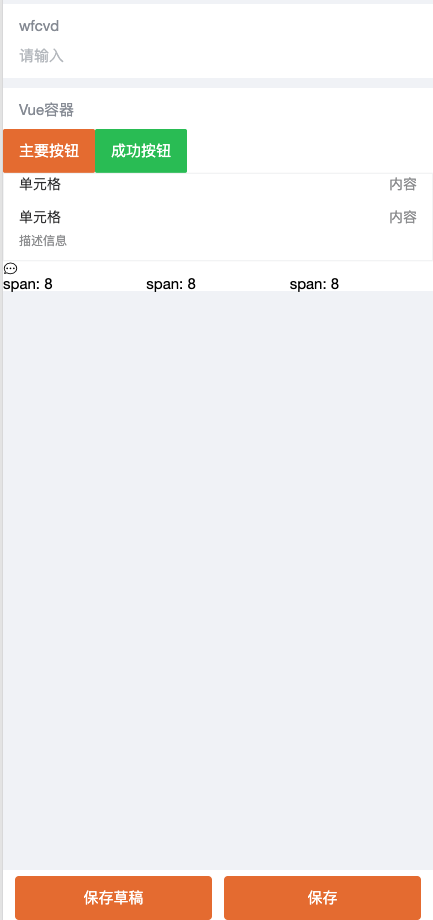

[Vue容器](../../../002-专题讲解/007-表单 列表二开指南/005-Vue容器.md)


[前端内置组件](../../../006-前端开发/005-前端内置组件/README.md)

<a id="LCZZC"></a>


## 关键字

表单、Vue容器、Vue2、Vue3、表单自定义弹窗、表单charts图表、表单引入组件

<a id="aOOSA"></a>


## 概述

在平台中提供Vue编写与渲染能力，可以使用平台内置的ant design vue 4.x 版本（pc端）的所有组件以及vant3.x版本（移动端）的所有组件；

具体使用文档 [ant design vue 4.x](https://www.antdv.com/components/overview-cn/) 以及 [vant 3.x](https://youzan.github.io/vant/v3/#/zh-CN/home)

[Vue 3.x 语法文档](https://v3.cn.vuejs.org/guide/introduction.html) 请使用Options API

- 表单使用Vue容器实现自定义表格
- 使用Vue容器作为组件
- 使用Vue容器引入Vue页面组件
- 使用Vue容器展示表单、列表、其他页面
- 表单明细子表使用Vue容器展示字段
- 移动端使用Vue容器
- 兼容PC和移动端的Vue容器写法
- 表单使用Vue容器展示其他个性化展示

......

<a id="WKay2"></a>


## 如何使用

<a id="baHox"></a>


### 拖入或点击新建Vue容器





<a id="cqfTH"></a>


### 输入Vue容器名称生成Vue容器代码模版





<a id="bIDK6"></a>


### Vue容器代码模版使用说明

<a id="SUyMI"></a>


#### Vue2模版


```javascript
const ctx = exports.ctx;
const env = exports.env;
// 工具集
const utils = exports.utils;
//页面状态
const pageStatus = utils.getPageStatus()
//调用服务/接口的工具
const http = utils.getHttp(utils.getBasePath());
//判断是否是移动端
const isMobile = utils.getDevice() === 'mobile'
export const vue_name1 =  {
  //DOM
  template: `<li>{{ message }}</li>`,
  //props参数说明
  // instance：当前Vue容器实例
  // name：该组件的name，主要用于表单校验，需要与rules的 name一致
  // value：当前Vue容器绑定字段的值
  // rowIndex：如果Vue容器在明细子表，rowIndex为索引，否则为undefined
  // pageStatus：页面状态
        // 1 = 只读页面
        // 2 = 可编辑页面
        // 5 = 打印页面
  // permissions：
        // 表单权限
        // 0:不受权限控制
        // 1:隐藏
        // 2:只读
        // 6:可编辑

        // 流程权限
        // 8:读权限(必填开关开启)
        // 24:写权限(必填开关开启)
        // 56:必填
  props: ['instance', 'name', 'value', 'rowIndex', 'pageStatus', 'permissions'],
  emits: ['change'],
  data: function () {
    return {
      getLocaleText,
      message: '!sj.euV olleH'
    };
  },
  mounted: function() {
    //用于更新当前Vue容器绑定字段的值
    this.$emit('change', 777)//用于更新数据
  },
  methods: {

  }
}
```

<a id="zgOue"></a>


#### Vue3模版


```javascript
const ctx = exports.ctx;
const env = exports.env;
const utils = exports.utils;
const pageStatus = utils.getPageStatus()
const http = utils.getHttp(utils.getBasePath());
const isMobile = utils.getDevice() === 'mobile'

const {
  defineComponent,
  onMounted,
  nextTick,
  computed,
  ref,
  getCurrentInstance,
  reactive,
  unref,
  watch,
  onUnmounted
} = exports.env.vue;

export const vue3Demo = defineComponent({
  components: {},
  template: `
    <div>
      <div class="board">
        Vue容器内容
      </div>
    </div>
  `,

  //props参数说明同Vue2
  props: ['instance', 'name', 'value', 'rowIndex', 'pageStatus'],
  setup() {
    const { proxy } = getCurrentInstance();
    const visible = ref(false);
    const currentCardData = ref({});
    onMounted(async () => {
      await nextTick();
    });
    onUnmounted(() => {

    })
    return {

    }
  }
});
```

<a id="VBsQA"></a>


## 使用案例

<a id="xTD5p"></a>


### 表单使用Vue容器实现自定义表格

<a id="vo6NX"></a>


#### 新建Vue容器

<a id="XOWfU"></a>


#### 修改Vue容器模版，编写代码


```javascript
const ctx = exports.ctx;
const env = exports.env;
const utils = exports.utils;
const pageStatus = utils.getPageStatus()
const http = utils.getHttp(utils.getBasePath());
const isMobile = utils.getDevice() === 'mobile'
export const vue_name1 = {
  template: `  <a-table :columns="columns" :data-source="data" bordered>
    <template #bodyCell="{ column, text }">
      <template v-if="column.dataIndex === 'name'">
        <a>{{ text }}</a>
      </template>
    </template>
    <template #title>Header</template>
    <template #footer>Footer</template>
  </a-table>`,
  props: ['instance', 'name', 'value', 'rowIndex', 'pageStatus', 'permissions'],
  emits: ['change'],
  data: function () {
    return {
      columns: [
        {
          title: 'Name',
          dataIndex: 'name',
        },
        {
          title: 'Cash Assets',
          className: 'column-money',
          dataIndex: 'money',
        },
        {
          title: 'Address',
          dataIndex: 'address',
        },
      ],

      data: [
        {
          key: '1',
          name: 'John Brown',
          money: '￥300,000.00',
          address: 'New York No. 1 Lake Park',
        },
        {
          key: '2',
          name: 'Jim Green',
          money: '￥1,256,000.00',
          address: 'London No. 1 Lake Park',
        },
        {
          key: '3',
          name: 'Joe Black',
          money: '￥120,000.00',
          address: 'Sidney No. 1 Lake Park',
        },
      ]
    };
  },
  mounted: function () {
    this.$emit('change', 777)//用于更新数据
  },
  methods: {

  }
}
```

<a id="oz0yb"></a>


#### 效果展示





<a id="DqSk5"></a>


### 使用Vue容器引入Vue页面组件

<a id="ut34q"></a>


#### 新建Vue容器

<a id="AIlb4"></a>


#### 引用Vue页面，修改Vue容器模版，编写代码


```javascript
const ctx = exports.ctx;
const env = exports.env;
const utils = exports.utils;
const pageStatus = utils.getPageStatus()
const http = utils.getHttp(utils.getBasePath());
const isMobile = utils.getDevice() === 'mobile'
const { form_60jg99fo88 } = exports.env.byteluckVuePages
export const vue_name1 = {
  template: `<form_60jg99fo88/>`,
  props: ['instance', 'name', 'value', 'rowIndex', 'pageStatus', 'permissions'],
  emits: ['change'],
  components: { form_60jg99fo88 },
  data: function () {
    return {
    };
  },
  mounted: function () {
    this.$emit('change', 777)//用于更新数据
  },
  methods: {

  }
}
```

<a id="tkkwo"></a>


#### 效果展示


<a id="S6NFT"></a>


### 使用Vue容器展示表单、列表、其他页面

<a id="fbDB6"></a>


#### 新建Vue容器

<a id="d2iLl"></a>


#### Vue容器代码

- 通过内置组件展示


```javascript
export const createBtn =  {
  template: `<div>
    <a-button type="link" @click="openDailog">创建图书</a-button>
    <bl-form-engine-modal
      v-model:visible="visible"
      form-key="btdev_form_p9djle9ggf"
      app-id="btdev_app_vfuf9ib6zy"
      :readonly="false"
      :on-engine-submitted="onEngineSubmitted"
      :on-engine-mounted="onEngineMounted"
      :on-close-error="onCloseError"
      async
    ></bl-form-engine-modal>
  </div>`,
  props: ['instance', 'name','value','rowIndex','pageStatus'],
  emits: ['change'],
  data: function () {
    return {
      visible: false
    };
  },
  mounted: function() {
  },
  methods: {
    openDailog: function () {
      this.visible = true
    },
    onEngineSubmitted() {

    },
    onEngineMounted(innerCtx) {
      innerCtx.setState('asc373bsa', ctx.getState('zuyt34f7ka'))
      debugger
    },
    onCloseError() {

    }
  }
}
```


- 通过iframe显示


```javascript
const ctx = exports.ctx;
const utils = exports.utils;
const http = utils.getHttp()
const isMobile = utils.getDevice() === 'mobile'
export const iframePage = {
  template: `
  <a-button @click="showPopup=true">点击打开弹窗</a-button>
  <a-modal v-model:visible="showPopup" width="800px" title="Basic Modal" @ok="handleOk">
        <iframe v-if="" style="width:300px;height:300px" src="/apps/desktop/list/RrEVju/>
  </a-modal>
  `,
  props: ['instance', 'name', 'value', 'rowIndex', 'pageStatus', 'permissions'],
  emits: ['change'],
  data: function () {
    return {
      showPopup:false
    };
  },
  mounted: function () {

  },
  methods: {

  }
}
```

<a id="Q7HtN"></a>


### 表单明细子表使用Vue容器展示字段

<a id="gluhz"></a>


#### 新建Vue容器

<a id="Xi4nF"></a>


#### Vue容器代码


```javascript
const ctx = exports.ctx;
const env = exports.env;
const utils = exports.utils;
const pageStatus = utils.getPageStatus()
const http = utils.getHttp(utils.getBasePath());
const isMobile = utils.getDevice() === 'mobile'
export const subtable_vue =  {
  template: `<div style="color: red;">{{value}}</div>`,
  props: ['instance', 'name', 'value', 'rowIndex', 'pageStatus', 'permissions','rowRecord'],
  emits: ['change'],
  data: function () {
    return {

    };
  },
  mounted: function() {
    this.$emit('change', 'content1')//用于更新数据
  },
  methods: {

  }
}
```

<a id="P6iPR"></a>


#### 效果展示





​

<a id="nGZEl"></a>


### 移动端使用Vue容器

<a id="fRXY1"></a>


#### 新建Vue容器

<a id="OLwHH"></a>


#### Vue容器代码


```javascript
const ctx = exports.ctx;
const env = exports.env;
const utils = exports.utils;
const pageStatus = utils.getPageStatus()
const http = utils.getHttp(utils.getBasePath());
const isMobile = utils.getDevice() === 'mobile'
export const mobile_vue =  {
  template: `
    <van-button type="primary">主要按钮</van-button>
    <van-button type="success">成功按钮</van-button>
    <van-cell-group>
      <van-cell title="单元格" value="内容" />
      <van-cell title="单元格" value="内容" label="描述信息" />
    </van-cell-group>
    <van-icon name="chat-o" />
    <van-row>
    <van-col span="8">span: 8</van-col>
    <van-col span="8">span: 8</van-col>
    <van-col span="8">span: 8</van-col>
  </van-row>
  `,
  props: ['instance', 'name', 'value', 'rowIndex', 'pageStatus', 'permissions'],
  emits: ['change'],
  data: function () {
    return {
    };
  },
  mounted: function() {
    this.$emit('change', 777)//用于更新数据
  },
  methods: {

  }
}
```

<a id="Ro8XB"></a>


#### 效果展示





<a id="diQti"></a>


### 兼容PC和移动端的Vue容器写法

<a id="Tw9Z8"></a>


#### 新建Vue容器

<a id="emhPY"></a>


#### Vue容器代码

<a id="dBLYX"></a>


##### 示例一


```javascript
const ctx = exports.ctx;
const utils = exports.utils;
const http = utils.getHttp()
const isMobile = utils.getDevice() === 'mobile'

export const DeviceComponent =  {
  template: `<div>
      <div v-if="isMobile">mobile: {{ message }}</div>
      <div v-else>PC: {{ message }}</div>
  </div>
  `,
  props: ['instance', 'name','value','rowIndex','pageStatus','permissions'],
  data: function () {
    return {
      message: 'Hello Vue.js!',
      isMobile: isMobile,
    };
  },
}
```

<a id="woci8"></a>


##### 示例二


```javascript
const ctx = exports.ctx;
const utils = exports.utils;
const http = utils.getHttp()
const isMobile = utils.getDevice() === 'mobile'

// 下方的实例中，通过pageStatus判断了只读状态下展示纯文本，激活状态下可以点击跳转
export const MyComponent =  {
  template: `<ul>
    <li>
        <span v-if="pageStatus === 1">{{ message }}</span>
        <a v-else href="https://www.baidu.com">{{ message }}</a>
    </li>
   </ul>`,
  props: ['instance', 'name','value','rowIndex','pageStatus'],
  data: function () {
    return {
      message: 'Hello Vue.js!'
    };
  },
}
```

<a id="vtS0V"></a>


##### 示例三


```javascript
const ctx = exports.ctx;
const utils = exports.utils;
const http = utils.getHttp()
const isMobile = utils.getDevice() === 'mobile'

export const SubtableDeviceComponent =  {
  template: `<div v-if="pageStatus === 2">
    <a-input v-if="!isMobile" :value="value" @change="updatePCValue"></a-input>
    <van-field v-else :model-value="value" @update:model-value="updateValue"></van-field>
  </div>
  <div v-else>{{value}}</div>
  `,
  props: ['instance', 'name','value','rowIndex','pageStatus'],
  emits: ['change'],
  data: function () {
    return {
      isMobile: isMobile,
    };
  },
  methods: {
    updateValue(value) {
      this.$emit('change', value)
    },
    updatePCValue(e) {
      this.$emit('change', e.target.value)
    }
  }
}
```

## 下级条目

- [移动端使用Vue容器](001-移动端使用Vue容器.md)
- [兼容PC和移动端的Vue容器写法](002-兼容PC和移动端的Vue容器写法.md)
- [表单明细子表使用Vue容器展示字段](003-表单明细子表使用Vue容器展示字段.md)
- [使用Vue容器展示表单、列表、其他页面](004-使用Vue容器展示表单、列表、其他页面.md)
- [使用Vue容器引入Vue页面组件](005-使用Vue容器引入Vue页面组件.md)
- [表单使用Vue容器实现自定义表格](006-表单使用Vue容器实现自定义表格.md)
- [页面JS和Vue容器数据传递](007-页面JS和Vue容器数据传递.md)
- [富文本预览（Vue容器）](008-富文本预览（Vue容器）.md)
- [获取当前地理位置及高德地图显示](009-获取当前地理位置及高德地图显示.md)
- [内置表单组件](010-内置表单组件.md)
- [表单嵌入内置report并联动](011-表单嵌入内置report并联动.md)
- [表单里引入Echarts](012-表单里引入Echarts.md)
