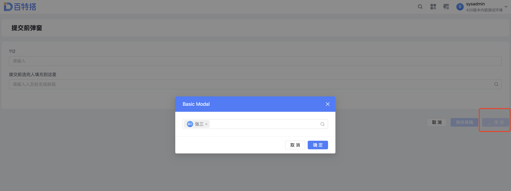

展示效果





页面JS


```javascript
// 表单提交前事件
export async function brforeSubmit(payload) {
  const r = await ctx.emit("vueContainer_member", { type: "", data: {} })
  if (r.length && (r[0] === "timeout" || r[0] === undefined)) return false;
}
```


Vue容器


```javascript
const ctx = exports.ctx;
const utils = exports.utils;
const http = utils.getHttp()
const isMobile = utils.getDevice() === 'mobile'
export const beforeSubmitChooseMember = {
  template: `
  <div>
        <a-modal v-model:visible="openModal" title="Basic Modal" @ok="handleOk" @cancel="onCancel">
          <ok-employee-select
            .value="memberValue"
            .update="updateValue"
            mode="default"
            multiple
          ></ok-employee-select>
    </a-modal>
  </div>
  `,
  props: ['instance', 'name', 'value', 'rowIndex', 'pageStatus', 'permissions'],
  emits: ['change'],
  data: function () {
    return {
      openModal: false,//弹窗状态
      memberValue: [],//人员数组
      resolve:{}
    };
  },
  mounted: function () {
    //表单提交前调用方法
    ctx.on("vueContainer_member", (data) => {

      return new Promise((resolve, reject) => {
        this.openPopup()
        this.resolve=resolve
      })
    })
    this.$emit('change', 777)//用于更新数据
  },
  methods: {
    updateValue(selectedIds) {
      console.log(selectedIds,1)
      this.memberValue = selectedIds
    },
    handleOk() {
      console.log(this.memberValue, "memberValue")
      ctx.setState("iR3LHmfuAn",this.memberValue)
      this.openModal = false
      this.resolve()
    },
    openPopup() {
      this.openModal = true
    },
    onCancel(){
      this.openModal = false
      this.resolve()
    }
  }
}
```
