<a id="GmvJs"></a>


## 单个控件校验

推荐校验设置的时机：

- 页面加载前
- 表单控件联动触发的事件，如：点击时、值改变时、标签页切换时等

<a id="s80ff"></a>


### 必填

控件：所有表单控件（可以绑定数据项的控件）

- required：

- 值范围：true | false
- 默认值：false


```javascript
//设置必填
ctx.setInstance('control_id', 'required', true)
ctx.setInstance('control_id', 'requiredMessage', '此处必填')

//重置必填
ctx.setInstance('control_id', 'required', false)
```


[required 属性定义](https://baiteda.yuque.com/staff-shgita/nbg92z/zzw6la0o4nqdgu5e#OOWuV)

PC端


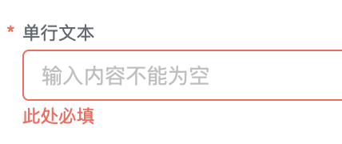


移动端


<a id="dYMzC"></a>


### 正则校验

控件：单行文本、数字

- regularRules

- 内置正则表达式模板：

- 邮箱：^$|^[a-zA-Z0-9.\_-]+@[a-zA-Z0-9\_-]+(.[a-zA-Z0-9\_-]+)+$
- 手机号：^$|^1[3-9][0-9]{9}$
- 电话号码：^$|^0[0-9]{2}-?[0-9]{8}$|^0[0-9]{3}-?[0-9]{7}$
- 身份证号码：^[1-9]\d{5}(18|19|([23]\d))\d{2}((0[1-9])|(10|11|12))(([0-2][1-9])|10|20|30|31)\d{3}[0-9Xx]$
- 自定义

- 默认值：{stencilName: '', expression: '', errMessage: ''}


```javascript
//设置正则表达式校验
ctx.setInstance('control_id', 'regularRules', {stencilName: 'custom', expression: '^$|^1[3-9][0-9]{9}$', errMessage: '不正确的格式'})

//重置正则表达式校验
ctx.setInstance('control_id', 'regularRules', {stencilName: '', expression: '', errMessage: ''})
```


[短文本的 regularRules 属性定义](https://baiteda.yuque.com/staff-shgita/nbg92z/evpg3ttw4qcqskhk#oM2AX)

PC 端


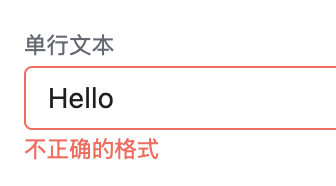


移动端


<a id="IgUgE"></a>


### 最大长度、最小长度校验

控件：单行文本、多行文本、富文本

- minLength：

- 值范围：大于0的整数
- 默认值：0

- maxLength：

- 值范围：大于0的整数
- 单行文本默认值：200
- 多行文本/富文本默认值：50000


```javascript
//设置控件的内容长度
ctx.setInstance('control_id', 'minLength', 10)
ctx.setInstance('control_id', 'maxLength', 500)


//--重置默认值--
//重置单行文本长度
ctx.setInstance('control_id', 'minLength', 0)
ctx.setInstance('control_id', 'maxLength', 200)

//重置多行文本/富文本长度
ctx.setInstance('control_id', 'minLength', 0)
ctx.setInstance('control_id', 'maxLength', 50000)
```


[短文本的minLength、maxLength属性定义](../../../006-前端开发/002-前端组件属性及事件/005-DataView 表单页/013-Input 单行文本.md#zaBoV)

[多行文本的minLength、maxLength属性定义](../../../006-前端开发/002-前端组件属性及事件/005-DataView 表单页/022-Textarea 多行文本.md#zaBoV)

[富文本的minLength、maxLength属性定义](../../../006-前端开发/002-前端组件属性及事件/005-DataView 表单页/017-RichText 富文本.md#zaBoV)

PC 端


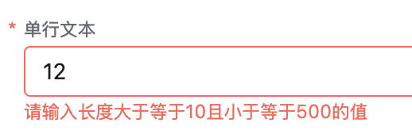


移动端


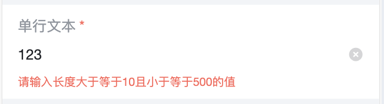


<a id="mPMPs"></a>


### 最少填写行数、最多填写行数

控件：明细子表

- limitRows：

- 值范围：大于0的整数
- 默认值：1

- maxRows：

- 值范围：大于0的整数
- 默认值：null


```javascript
//设置明细表最少填写2行 并且 最多填写5行
ctx.setInstance('control_id', 'limitRows', 2)
ctx.setInstance('control_id', 'maxRows', 5)


//重置为默认值
ctx.setInstance('control_id', 'limitRows', 1)
ctx.setInstance('control_id', 'maxRows', null)
```


[明细子表的limitRows、maxRows属性定义](../../../006-前端开发/002-前端组件属性及事件/007-SubTable 明细表.md#uqNIs)

PC 端


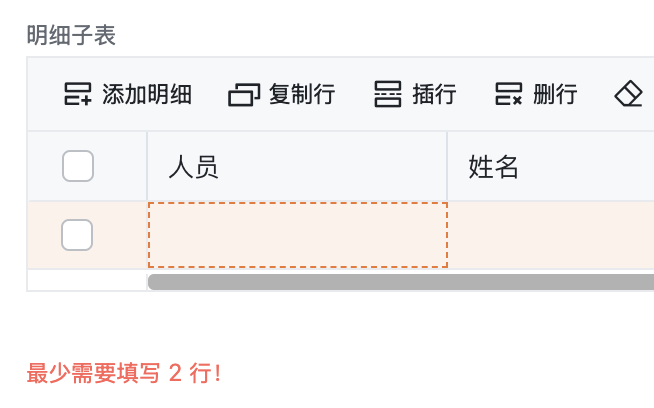


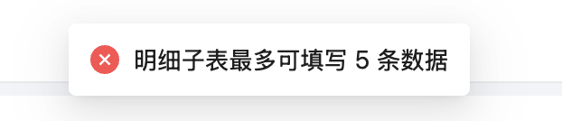


​

移动端


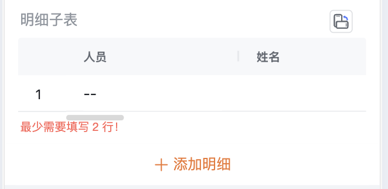


<a id="Nwccn"></a>


### 最大上传数量

控件：图片、附件

- maxLimit：

- 值范围：大于0的整数
- 默认值：10


```javascript
//设置最多上传2个文件/图片
ctx.setInstance('control_id', 'maxLimit', 2)

//重置最多上传数量默认值
ctx.setInstance('control_id', 'maxLimit', 10)
```


[图片的maxLimit 属性定义](../../../006-前端开发/002-前端组件属性及事件/005-DataView 表单页/012-Image 图片.md#FDga3)

[附件的maxLimit 属性定义](../../../006-前端开发/002-前端组件属性及事件/005-DataView 表单页/003-Attachment 附件.md#SGNh4)

PC 端

- 展现形式：标题式


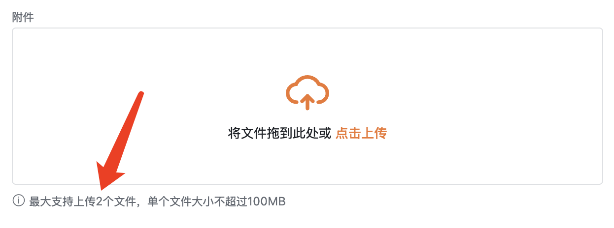


- 展现形式：列表式


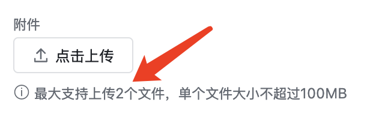


​

移动端


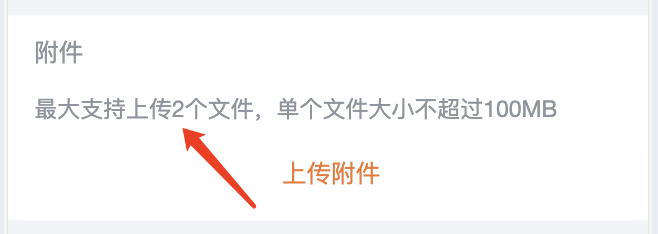


<a id="aHjYY"></a>


### 文件大小限制、格式限制校验

控件：附件

- maxSize：

- 值范围：大于0的整数
- 默认值：104857600（单位为Byte，默认值为100MB）

- attachmentAccept：

- 值范围：字符串数组
- 默认值：[]


```javascript
const MB1 = 1048576
const MB10 = 10485760
const MB100 = 104857600
const MB1000 = 1048576000

//设置最多上传2个文件/图片
ctx.setInstance('control_id', 'maxSize', MB1)
ctx.setInstance('control_id', 'attachmentAccept', ['zip','png'])


//重置最多上传数量默认值
ctx.setInstance('control_id', 'maxSize', MB100)
ctx.setInstance('control_id', 'attachmentAccept', [])
```


[附件的maxSize、attachmentAccept 属性定义](../../../006-前端开发/002-前端组件属性及事件/005-DataView 表单页/003-Attachment 附件.md#SGNh4)

PC 端

- 展现形式：标题式


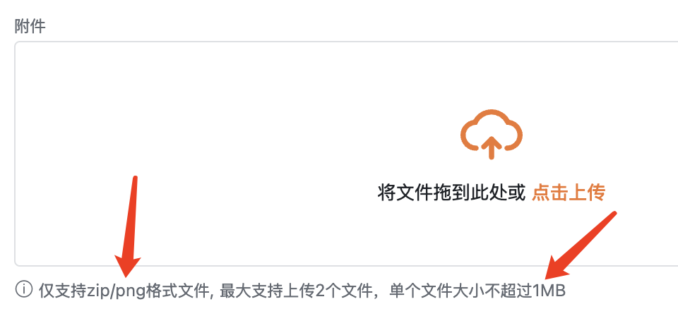


- 展现形式：列表式


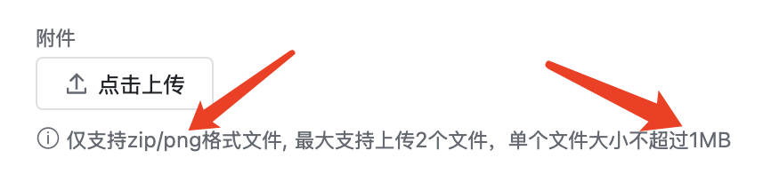


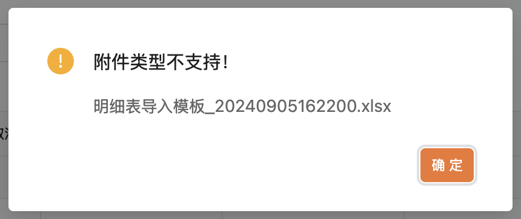


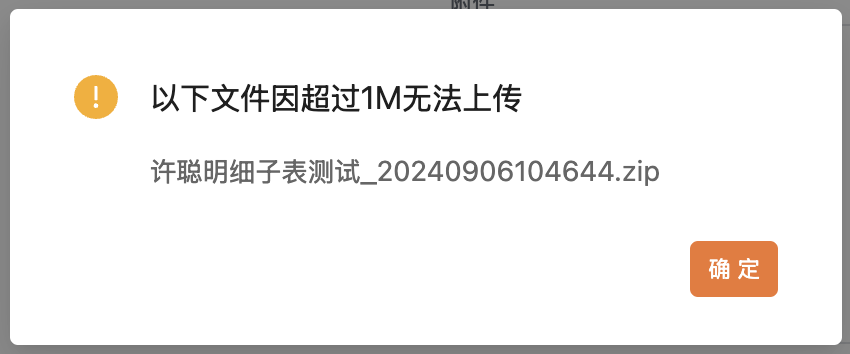


​

移动端


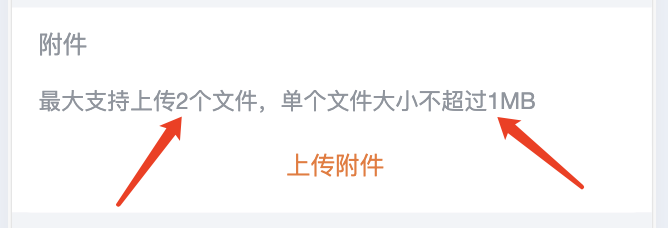


<a id="CbTFB"></a>


### 数字范围校验

控件：数字、金额

- rangeMin：

- 值范围：大于0的整数
- 默认值：''

- rangeMax：

- 值范围：大于0的整数
- 默认值：''


```javascript
//设置最小值
ctx.setInstance('control_id', 'rangeMin', -100)
//设置最大值
ctx.setInstance('control_id', 'rangeMax', 100)


//重置默认值
ctx.setInstance('control_id', 'rangeMin', '')
ctx.setInstance('control_id', 'rangeMax', '')
```


[数字的rangeMin、rangeMax 属性定义](../../../006-前端开发/002-前端组件属性及事件/005-DataView 表单页/014-Number 数字.md#zaBoV)

[金额的rangeMin、rangeMax 属性定义](../../../006-前端开发/002-前端组件属性及事件/005-DataView 表单页/002-Amount 金额.md#zaBoV)

PC 端

- 仅设置最小值


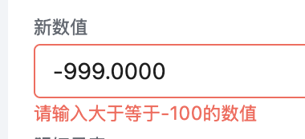


- 仅设置最大值


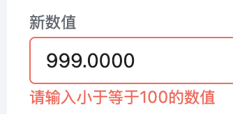


- 同时设置最小值和最大值


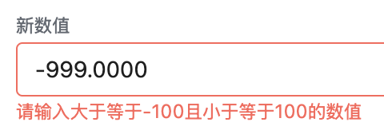


移动端

- 仅设置最小值


- 仅设置最大值


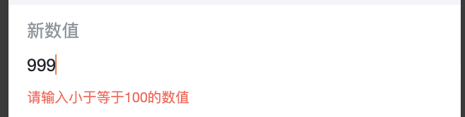


- 同时设置最小值和最大值


<a id="fQvUg"></a>


### 时间限制范围校验

控件：日期、日期区间

- limitDateList：

- 值范围：数组对象 [{dateConfigType: 'earlyDate', dateLimitType: 'timeSpecified', value: payload.value}]
- 默认值：[]


```javascript
//设置限制最早日期
ctx.setInstance('JNDB5dTIiq', 'limitDateList', [{
  dateConfigType: 'earlyDate',
  dateLimitType: 'timeSpecified',
  value: '1728835200000'
}])

//设置限制最晚日期
ctx.setInstance('HqjqVob4kX', 'limitDateList', [{
  dateConfigType: 'lateDate',
  dateLimitType: 'timeSpecified',
  value: '1729439999000'
}])

//限制不可选区间
ctx.setInstance('OpicP4aWuW', 'limitDateList', [{
  dateConfigType:'unSelectAbleInterval',
  dateLimitType: 'filledInTime',
  value: ['1728835200000', '1729439999000']
}])


//重置日期限制范围
ctx.setInstance('OpicP4aWuW', 'limitDateList', [])
```


[日期的limitDateList 属性定义](../../../006-前端开发/002-前端组件属性及事件/005-DataView 表单页/007-DatePicker 日期.md#qhczT)

[日期区间的limitDateList 属性定义](../../../006-前端开发/002-前端组件属性及事件/005-DataView 表单页/008-DateRange 日期区间.md#dZPNR)

PC 端

- 设置限制最早日期


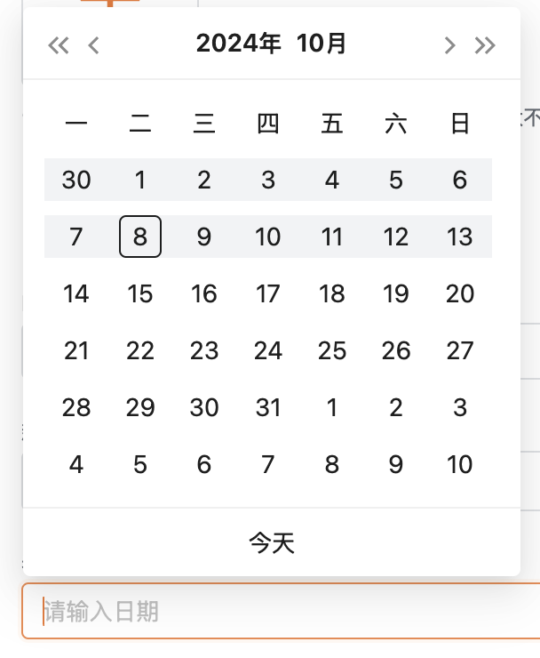


- 设置限制最晚日期


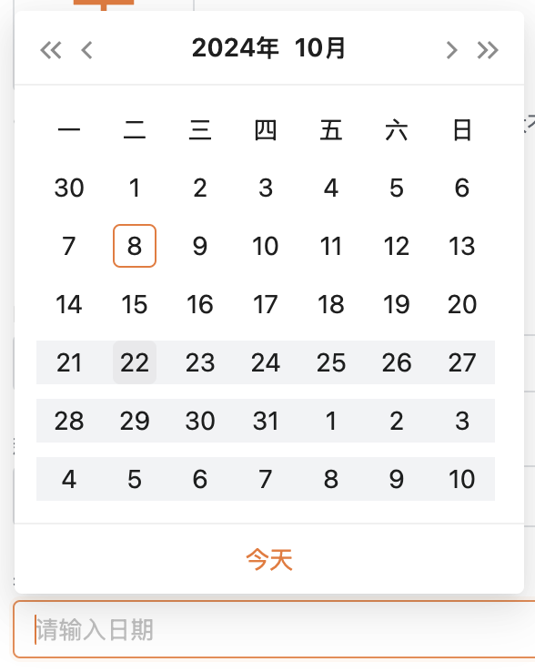


- 不可选区间


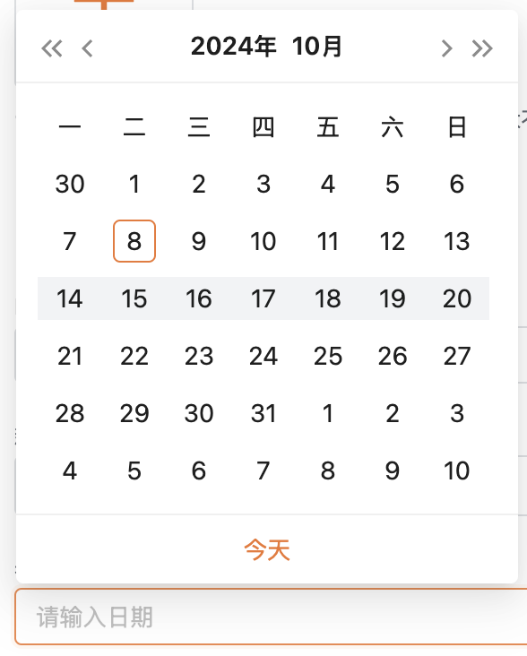


​

移动端

- 设置限制最早日期


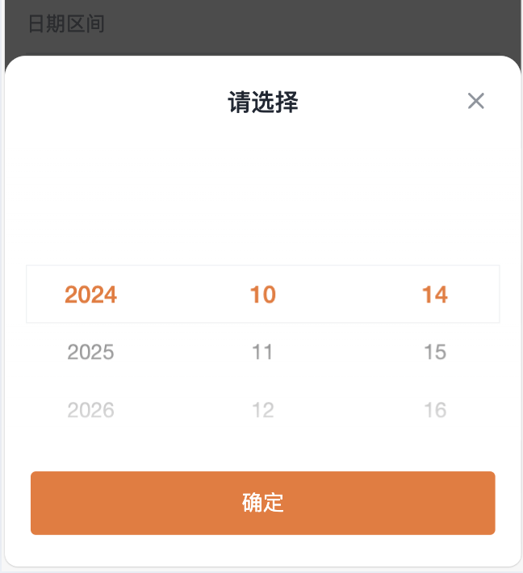


​

- 设置限制最晚日期


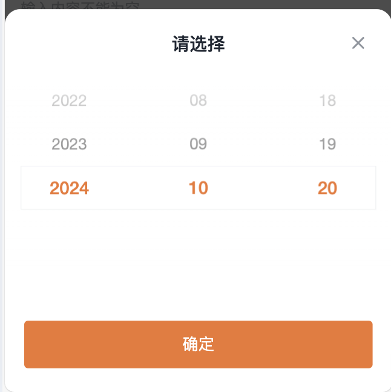


​

- 不可选区间


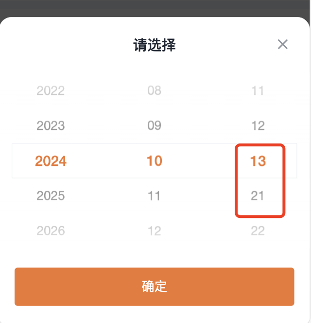


<a id="xhMvW"></a>


## 关联性校验

<a id="g1NIw"></a>


### 开始-结束可选范围控制

初始状态


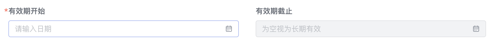


选择开始日期后，截止日期的可选范围受到限制


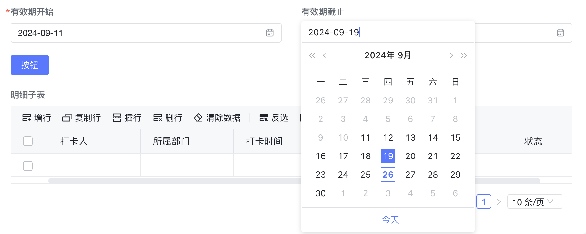


选择截止日期后，开始日期的可选范围受到限制


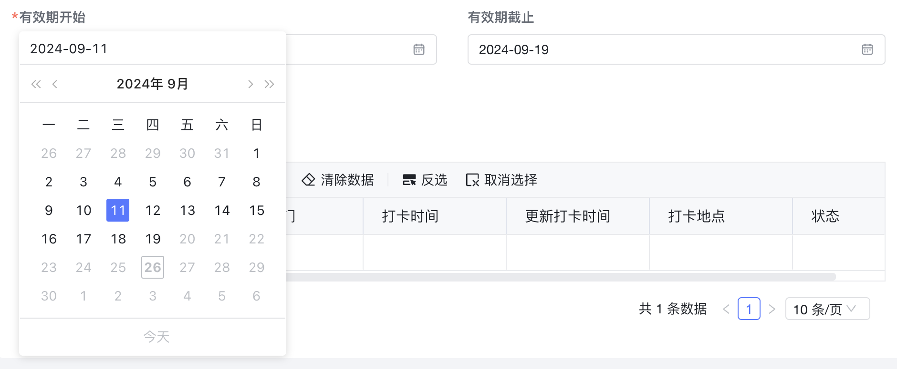


规则：

1. 开始时间 不能大于 结束时间
2. 结束时间 不能小于 开始时间
3. 开始时间不可以为空
4. 结束时间可以为空


```javascript
export function validStartOnChange (payload) {
  //控制截止日期控件状态
  if (payload.value === '') {
    //清空限制规则
    ctx.setInstance('JNDB5dTIiq', 'limitDateList', [])
  } else {
    ctx.setInstance('JNDB5dTIiq', 'limitDateList', [{
      dateConfigType: 'earlyDate',
      dateLimitType: 'timeSpecified',
      value: payload.value
    }])
    ctx.setInstance('JNDB5dTIiq', 'defaultState', 'default')
  }
}

export function validEndOnChange (payload) {
  if (payload.value === '') {
    //清空限制规则
    ctx.setInstance('HqjqVob4kX', 'limitDateList', [])
  } else {
    ctx.setInstance('HqjqVob4kX', 'limitDateList', [{
      dateConfigType: 'lateDate',
      dateLimitType: 'timeSpecified',
      value: payload.value
    }])
  }
}

export function onload (payload) {
  //修改页面时，需要根据填写的值重置一次开始、截止日期控件的状态
  const validStart = ctx.getField('master', 'valid_start')
  if (validStart) {
    validStartOnChange ({value: validStart})
  }
  const validEnd = ctx.getField('master', 'valid_end')
  if (validStart) {
    validEndOnChange ({value: validEnd})
  }
  //
}
```

<a id="wQZwq"></a>


### 明细表时间比较


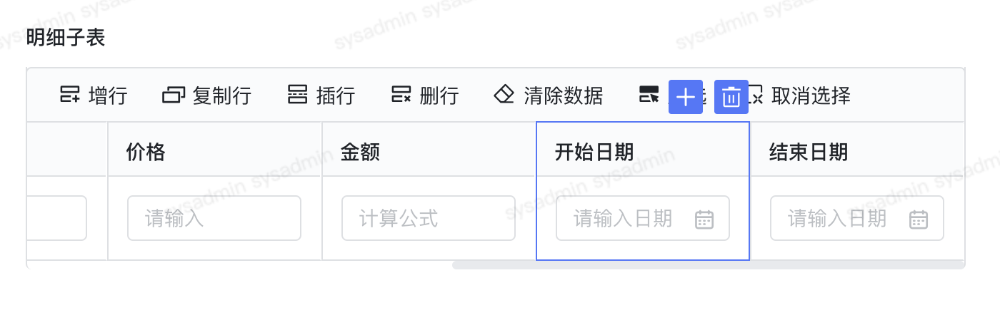


```javascript
//明细表时间比较
export function dtStartDateOnChange(payload) { dtDateOnChange(payload) }
export async function dtEndDateOnChange(payload) { dtDateOnChange(payload) }
function dtDateOnChange(payload) {
  // 两个日期字符串，分别代表开始时间和结束时间
  var startTimeStr = ctx.getField('case_kfn9u5x0', 'start_time', payload.rowIndex); // 开始时间
  var endTimeStr = ctx.getField('case_kfn9u5x0', 'end_time', payload.rowIndex); // 结束时间
  if (startTimeStr != '' && endTimeStr != '') {
    // 检查结束时间是否大于开始时间
    if (startTimeStr > endTimeStr) {
      // 如果结束时间小于或等于开始时间，弹出页面提示
      utils.toast("结束日期不能小于开始日期，请从新选择", "error")
      ctx.setState(payload.instance.id, '', payload.rowIndex);//设置值为空
    } else {
      // 如果结束时间大于开始时间，则执行其他操作（如果需要的话）
      console.log("时间设置正确。");
    }
  }
}
```

<a id="F7TOi"></a>


### 通过身份证号判断男女


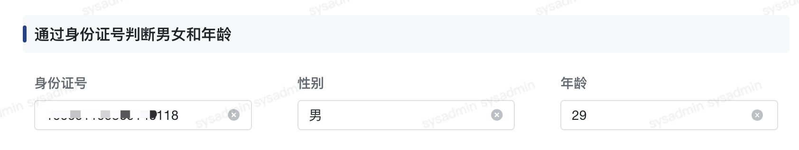


```javascript
//通过身份证号判断男女和年龄
export function onchangsfz(payload) {
  //身份证号控件，值改变
  const value = payload.value
  if (value) {
    let year, sex
    if (value.length === 15) {
      year = '19' + value.slice(6, 8)
      sex = Number(value[14]) % 2 === 0 ? '女' : '男'
    } else if (value.length === 18) {
      year = value.slice(6, 10)
      sex = Number(value.slice(16, 17)) % 2 === 0 ? '女' : '男'
    }
    console.info('sex', sex)
    ctx.setState('R9LMquaKv4', sex)
    if (year) {
      const age = new Date().getFullYear() - year
      ctx.setState('xst3bJ65TD', age)
      return
    }
  }
  ctx.setState('xst3bJ65TD', '')
}
```

<a id="eavmq"></a>


## 提交前校验

<a id="HeeKD"></a>


### 前端JS预处理及校验

- 校验提交数据日期不能重复
- 循环判断合计值，按日分组按照每日进行折算工时
- 循环日报填写不能小于8，不能大于24

如果不满足以上规则，通过 return false 阻止提交，提示用户修改填写数据


```javascript
export async function beforeSumbit(payload) {
  //增加校验-校验提交数据日期不能重复
  let queryParams = {
    "query": {
      "page_index": 1,
      "page_size": 9,
      "query_criteria": [{
        "column_name": "user",
        "query_type": 0,//查询类型 0:eq,1:gt,2:lt,3:in,4:like,5:range
        "value": ctx.getField('pj_project_work_fill_flow', 'user')
      },{
        "column_name": "work_date",
        "query_type": 3,//查询类型 0:eq,1:gt,2:lt,3:in,4:like,5:range
        "value": ctx.getField('pj_project_work_fill_flow_dt', 'work_date')
      }]
    },
    "svc_code": "pj_fill_flow_dt_sm_U_claendar_dr_sf8xn07k"
  }
  //dataUid非空情况下,进行参数查询
  if (dataUid != '') {
    queryParams.query.query_criteria.push({
      "column_name": "dataUid",
      "query_type":11,//查询类型 0:eq,1:gt,2:lt,3:in,4:like,5:range,11:not eq
      "value": [dataUid]
    })
  }
  //查询结果
  let queryResult = await utils.querySvc(queryParams);
  //判断结果
  if (queryResult.code != "000000") {
    utils.toast("系统服务异常,请稍后重试", "error")
    return false;
  }
  //结果数
  let count = queryResult.data.total;
  //为0
  if (count > 0) {//校验未通过
    let msgState = "填报";
    if(queryResult.data.value[0].process_status=='DRAFT'){
      msgState='保存草稿'
    }
    utils.toast("工时日期"+queryResult.data.value[0].format_work_date+"已"+msgState+"，请勿重复填写", "error");
    return false;
  }
  //end---上面为校验,下面为根据校验成功 进行执行操作
  //循环判断合计值，按日分组按照每日进行折算工时
  let dtList = ctx.getData('pj_project_work_fill_flow_dt');
  let grouplist = [];//分组
  for (var index = 0; index < dtList.length; index++) {
    let flag = false;
    for (var k = 0; k < grouplist.length; k++) {
      if (grouplist[k].workDay === dtList[index].work_date) {
        grouplist[k].workHour = Decimal.add(grouplist[k].workHour, dtList[index].work_hour).toNumber();
        flag = true
        break;
      }
    }
    if (!flag) {
      grouplist.push({ workDay: dtList[index].work_date, workHour: dtList[index].work_hour })
    }
  }
  //循环日报填写不能小于8，不能大于24
  let forFlag = false;
  for (var k = 0; k < grouplist.length; k++) {
    if (grouplist[k].workHour < 8 || grouplist[k].workHour > 24) {//日工时小于8，或者大于24
      let tDay = parseInt(grouplist[k].workDay);
      const date = moment(tDay).format('YYYY/MM/DD');
      if (grouplist[k].workHour < 8) {
        utils.toast("「" + date + "」工时合计小于8,请填写至少8小时");
      }
      if (grouplist[k].workHour > 24) {
        utils.toast("「" + date + "」工时合计大于24,请填写最多24小时");
      }
      forFlag = true
      break;
    }
  }
  if (forFlag) {
    //通过 return false 阻止提交
    return false;
  }
}
```

<a id="afVeC"></a>


### 后端逻辑校验

操作项执行前，由后端校验

- 仅在新增的情况下执行后续动作
- 检查书籍的价格小于0，则扔出异常阻止提交


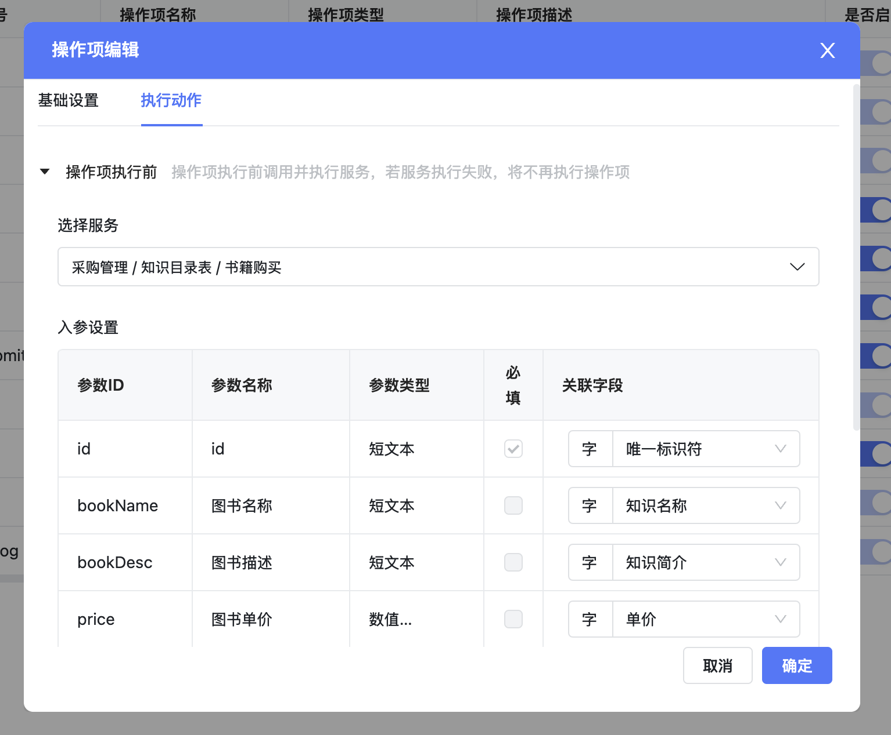


```java
@PostMapping("insert")
public PlainResult<String> insert(@RequestBody BuyBookBo bookBo) {
    return new PlainResult<>(buyBookService.save(bookBo));
}
```


```java
public String save(BuyBookBo bookBo) {
    String id = bookBo.getId();
    if (id != null && !id.isEmpty()) {
        //如果是保存（非新增）则不执行下面的保存逻辑
        return bookBo.getId()
    }
    //以下是新增的时候执行

    if(bookBo.getPrice() <= 0) {
        //阻止提交
        throw new DefaultException("图书价格不能小于等于0元");
    }

    BuyBookPo buyBookPo = new BuyBookPo();
    BeanUtils.copyProperties(bookBo, buyBookPo);
    if (Objects.nonNull(bookBo.getCategory()) && !bookBo.getCategory().isEmpty()) {
        buyBookPo.setCategory(JSON.toJSONString(bookBo.getCategory()));
    }

    buyBookManager.save(buyBookPo);
    return buyBookPo.getId();
}
```


> DefaultException 会抛出一个非 000000 的状态码


```java
@Data
@ApiModel("购买图书")
public class BuyBookBo {
    @ApiModelProperty("id 主键")
    private String id;
    @ApiModelProperty("创建时间")
    private Date createTime;
    @ApiModelProperty("更新时间")
    private Date updateTime;
    @ApiModelProperty("创建人")
    private String creator;
    @ApiModelProperty("图书名称")
    private String bookName;
    @ApiModelProperty("图书描述")
    private String bookDesc;
    @ApiModelProperty("图书单价")
    private double price;
    @ApiModelProperty("购买数量")
    private int buyCount;
    @ApiModelProperty("所属分类")
    private List<String> category;
}
```

## 下级条目

- [判断数据是否重复，重复数据跳转到其他表单](001-判断数据是否重复，重复数据跳转到其他表单.md)
- [表单提交前弹框选人](002-表单提交前弹框选人.md)
