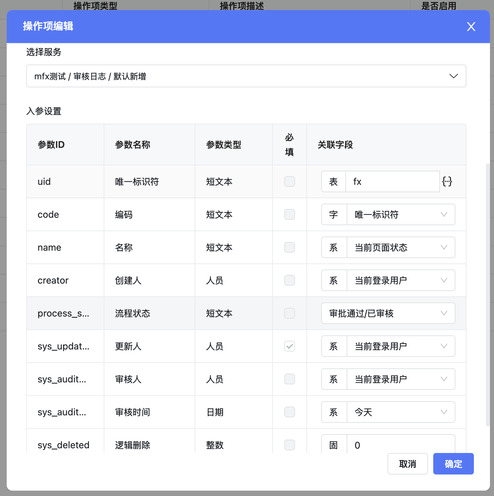
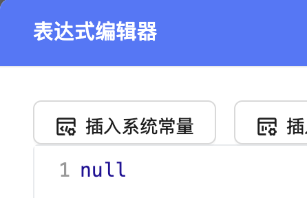
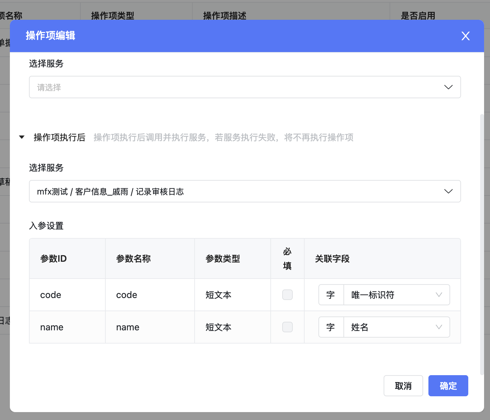
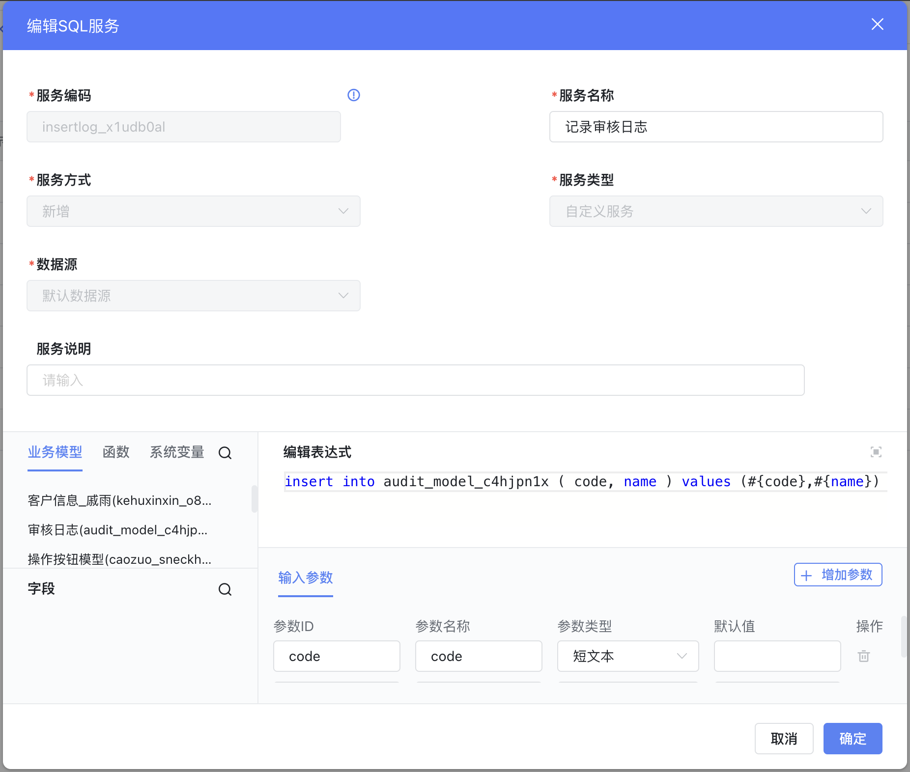
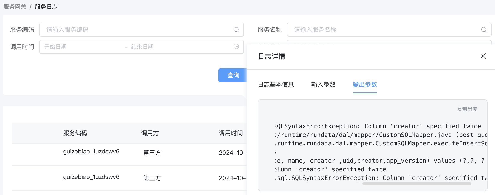
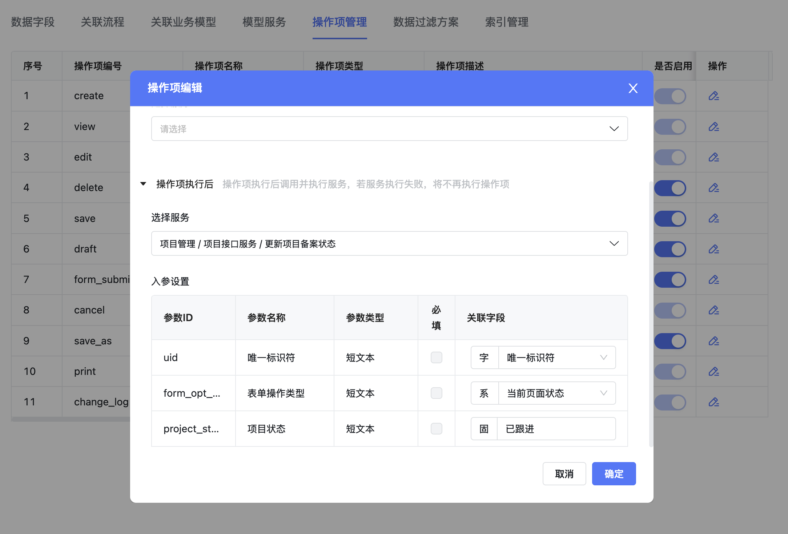
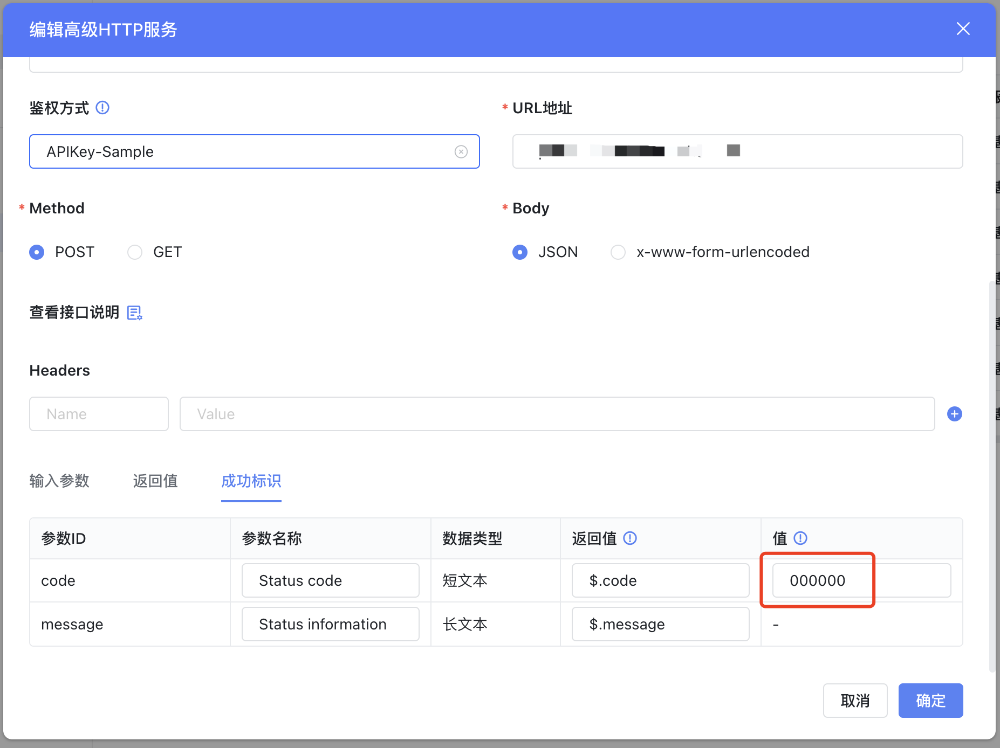
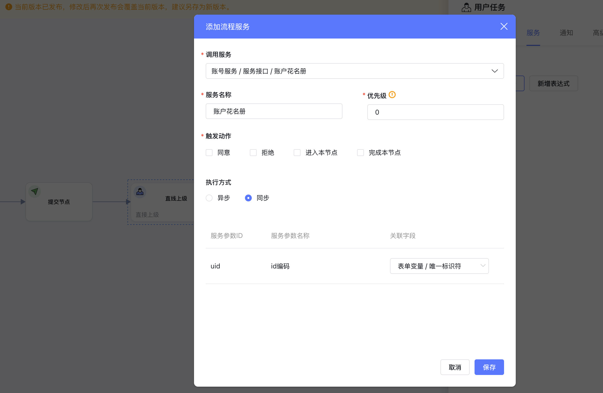
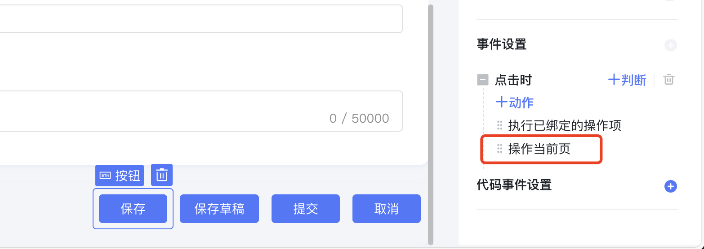
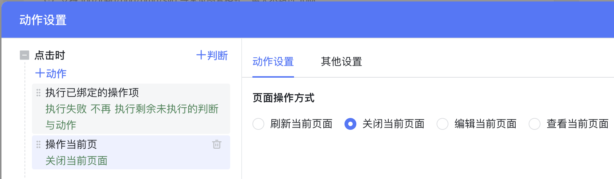

<a id="vSMh6"></a>


## 与平台数据一起保存

<a id="WBeLo"></a>


### 在操作项执行后调用默认新增

在保存当前数据后，将唯一标识符、姓名字段值的数据插入审核日志表中。





- uid：选择表达式，内容填写为 null





- 字段-唯一标识符：是当前数据新增后的 uid
- 系统变量-当前页面状态：可以区分当前是保存、保存草稿

> 服务异常，会阻止当前数据的保存或提交

<a id="pnx2b"></a>


### 在操作项执行后调用SQL服务

在保存当前数据后，将唯一标识符、姓名字段值的数据插入审核日志表中。





对应的 SQL 服务实现，定义的入参变量使用 #{ } 在SQL中引用。





> 注意：SQL服务中不要插入系统字段，如：creator，它们将由平台默认插入，如果你也碰巧插入了该字段，会遇到一个服务器异常。
>
> ​
>
> SQL 服务异常，会阻止当前数据的保存或提交

调用服务日志可以在服务日志中查看





<a id="KVPLj"></a>


### 在操作项执行后调用高级HTTP服务

业务场景：项目立项保存后，更新项目备案表字段：项目状态 = “已跟进”





> 在服务中返回的成功标识符不一致时，会阻止当前数据的保存或提交
>
> 返回值一定在高级 HTTP 服务的返回值中配置，平台规范成功值是 000000





后端发起数据请求：


```json
{
  "uid": "random-alphabet-and-number",
  "form_opt_type": "form_submit",
  "project": "已跟进"
}
```


返回最少需要包含一下结构：


```json
{
  code: "000000"
}
```

<a id="Rw3Vi"></a>


### 在流程中调用高级HTTP/SQL服务

业务场景：审批流程通过后，需要将生成的账号同步到花名册





- 执行方式

- 同步：服务调用成功 -> 表单保存 -> 流程驱动下一步
- 异步：表单保存 -> 流程驱动下一步 -> 接口调用

> 执行方式设置为同步：
>
> - 在服务中返回的成功标识符不一致时，会阻止当前数据的保存或提交。
> - 不能修改当前表单数据，它会被覆盖❗

<a id="lcrwh"></a>


### 在表单后事件发起请求

<a id="kC8SN"></a>


#### 新增数据时触发

新增/提交数据成功后，额外往另一张表中记录数据


```javascript
const ctx = exports.ctx;
const env = exports.env;
const utils = exports.utils;
const pageStatus = utils.getPageStatus()
const http = utils.getHttp(utils.getBasePath());
const isMobile = utils.getDevice() === 'mobile'
export async function onSubmmitted (payload) {
  //payload.options.btnType 有当前点击按钮的类型
  if (['save', 'form_submit'].includes(payload.options.btnType)) {
    //必须使用 async/await，保证接口调用完后再接着执行后续可视化动作，如：后续的页面关闭/刷新
    const result = await utils.querySvc({
      "app_id":"app_ella2nc7pu",
      //添加、修改服务是调用，数据格式要对应上
      "save_datas":{
        "code": payload.value,
        "name": ctx.getField('kehuxinxin_o8fy81w7', 'name'),
        //必须保存creator字段，否则数据没有创建人，导致列表上显示不出来这行数据
        "creator": utils.getUserInfo().employee_id,
      },
      // svc_code为服务编码
      "svc_code":"audit_model_c4hjpn1x_insert"
    })
  }
}
```

<a id="QxMNj"></a>


## 控制页面跳转

<a id="rKRj9"></a>


### 逐个可视化事件控制

操作栏的每个按钮独立通过可视化事件控制页面跳转

> 操作当前页的默认值
>
> 1. 普通模型表单：
>
> - 保存、保存草稿、提交、取消： 关闭当前页
>
> 2. 数据审核模式模型表单：
>
> - 保存、保存草稿、取消：关闭当前页
> - 提交、审核、审核并提交：查看当前页面
> - 撤回、反审核：IF 当前页面状态=查看 THEN 编辑当前页面 ELSE 刷新当前页面；





<a id="dGWIv"></a>


#### 仅改变当前页面的状态





配置 操作当前页 具体详见：


[控件事件](https://baiteda.yuque.com/czwxoe/avp3qe/kgfd6a#HcDOW)

<a id="VOvcB"></a>


### 集中JS控制页面跳转

在提交、保存、保存草稿、流程审批过程中都会进入到这里。

<a id="pW3Lw"></a>


#### 新增数据时触发


```javascript
const ctx = exports.ctx;
const env = exports.env;
const utils = exports.utils;
const pageStatus = utils.getPageStatus()
const http = utils.getHttp(utils.getBasePath());
const isMobile = utils.getDevice() === 'mobile'
export function onSubmmitted (payload) {
  //payload.options.btnType 有当前点击按钮的类型
  if (['save', 'form_submit'].includes(payload.options.btnType)) {
    //根据需要跳转回列表页
    const url = '/apps/desktop/multipleTabs/sapp/app_2dnwjyh7tj/sapp_vkg5495o0s/box/'
    //浏览器可以后退到当前表单页
    window.location.href = url
    //浏览器不可以后退到
    // window.location.replace(url)

    //阻止后续可视化动作执行
    return false
  }
}
```
