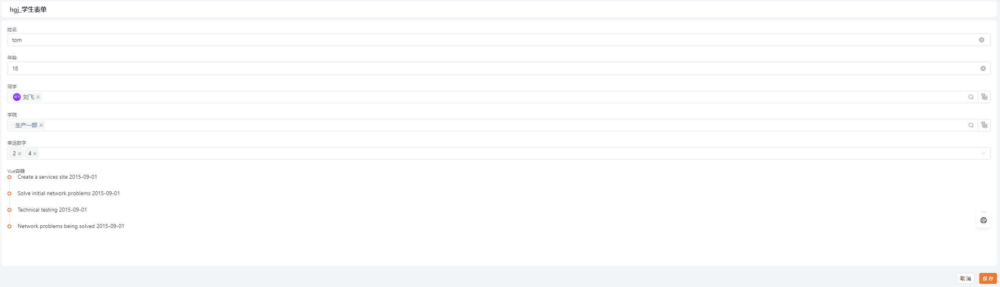
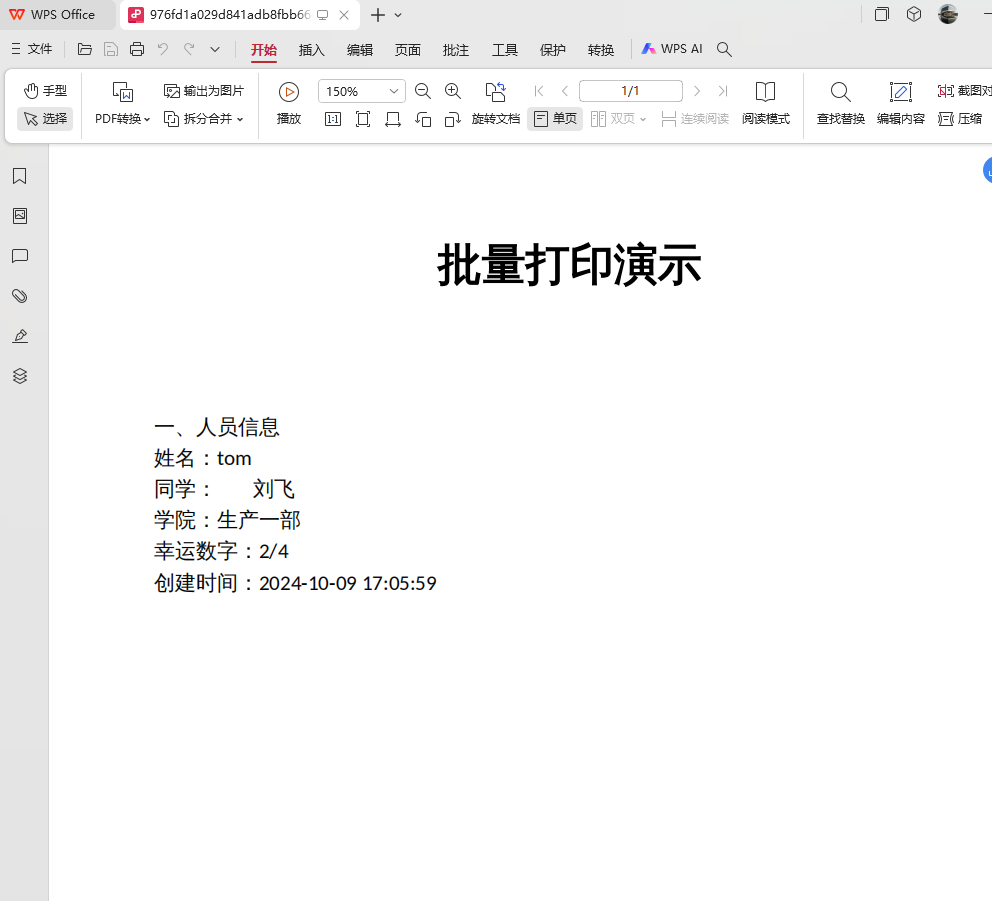
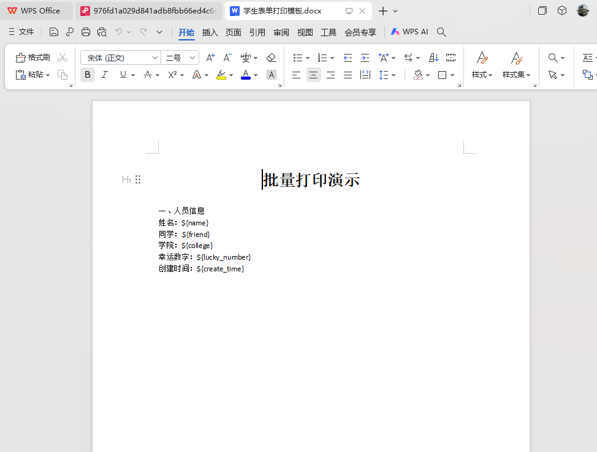
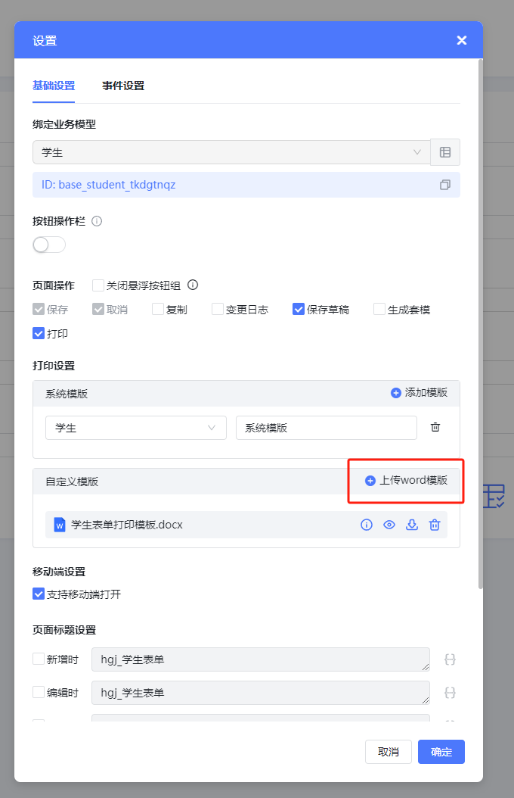
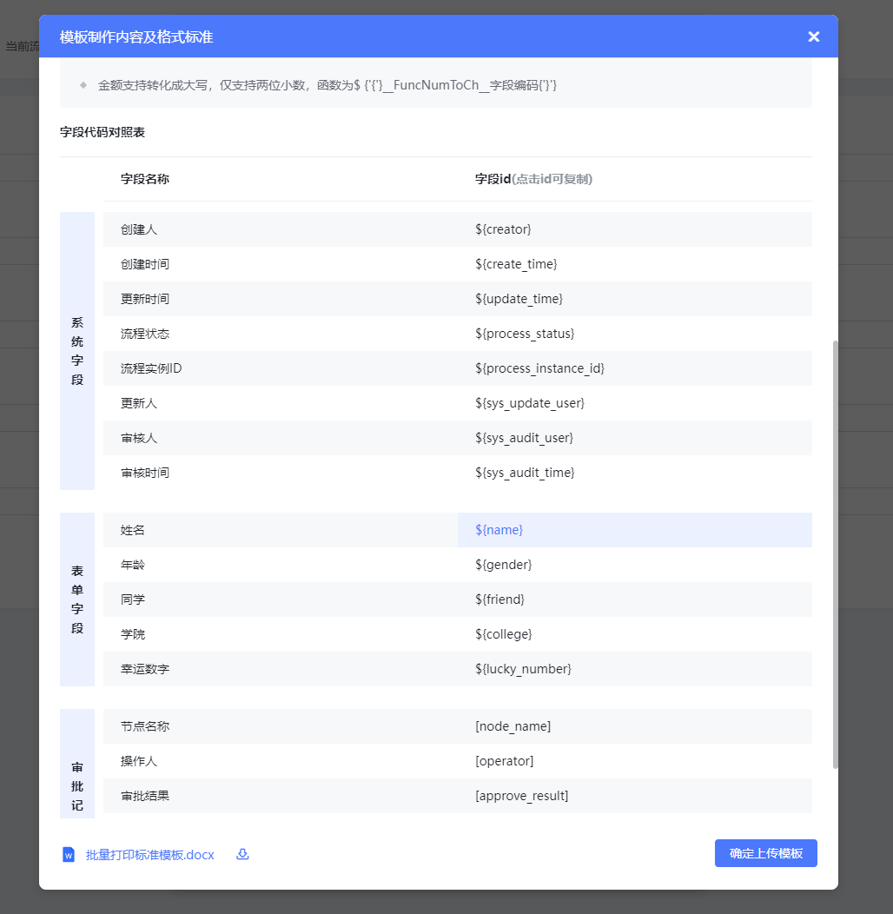
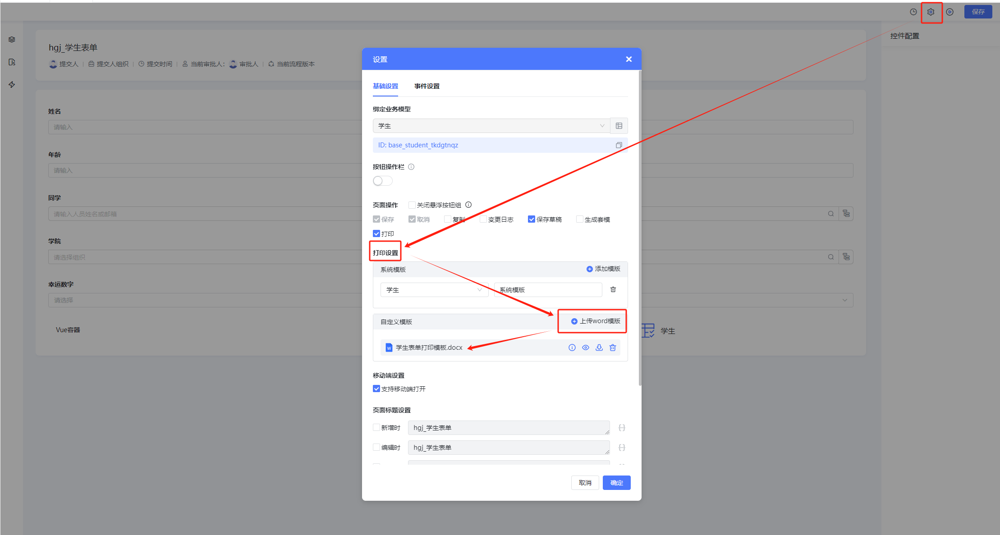
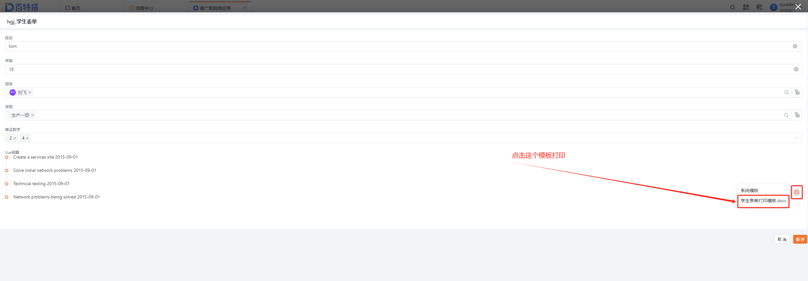
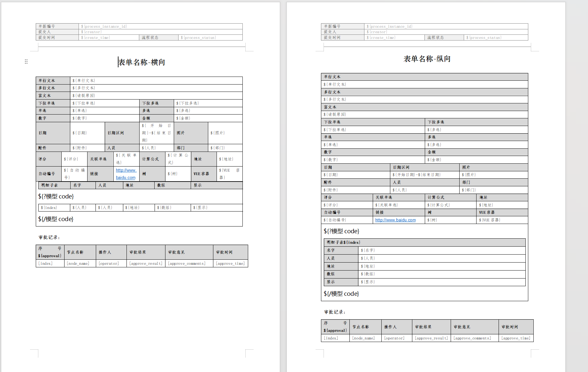

## 案例展示

有这样一个表单：

​

要把它的数据打印成这样一个自定义字段排版格式得PDF：

​

需要先准备这样一个word模板，里面的变量用具体规则的占位符代替：

​

占位符可以从设计态复制出来，点击表单的设置按钮弹出下面的对话框，然后点击 ‘上传word模板’就会弹出 字段代码占位符，可以从里面复制：

​

然后在设计态表单打印配置的地方上传这个word：

​

再到运行态选择打印模板然后打印：

​

## 模板配置规则

- 复制你所需要的字段代码粘贴到本地的word文档(只支持docx格式)中相应的位置，打印时会获取实际数据中的字段内容，字段代码仅支持识别业务模型中的字段编码
- 表单字段为该表单绑定的业务模型的所有字段，若该业务模型下存在子表，则会以业务模型名称为维度展示相应子表字段
- 审批记录按照表格方式展示，可自定义样式，但审批记录的字段展示会根据当前表单是否配置流程及当前流程是否展示审批记录权限展示，审批记录第一行第一列需标记$ {approval}，序号以$ {index}标记
- 日期类型字段默认显示格式为年/月/日 时:分:秒
- 明细子表支持横向、纵向展示，展示规则详见模版，表上方必须以$ {'{?'}模型code{'}'}开始，以 $ {'{/'}模型code{'}'}结尾，表中字段为$ {'{'}字段编码{'}'}，序号循环为$ {'{'}index{'}'}
- 不支持打印的字段：按钮、表单操作、列表选择、文字识别、发票识别、仪表盘
- 控件绑定数据源(如：下拉单选)存在显示值存储值，默认解析为存储值，显示值按照函数$ {'{'}\_\_FuncDataDisplay\_\_字段编码\_\_服务编码\_\_存储值字段编码\_\_显示值字段编码{'}'}获取
- 控件绑定自定义选项(如：下拉单选)存在显示值存储值，默认解析为存储值，显示值按照函数$ {'{'}\_\_FuncCustomDisplay\_\_字段编码\_\_表单ID\_\_控件ID{'}'}获取
- 二维码打印函数为$ {'{@'}\_\_FuncQrCode\_\_字段编码\_\_300\_\_300{'}'}; 条形码打印函数为$ {'{@'}\_\_FuncBarCode\_\_字段编码\_\_300\_\_300{'}'}
- 日期只支持转换为yyyy-MM-dd，函数为$ {'{'}\_\_FuncDate\_\_字段编码\_\_1{'}'}
- 金额支持转化成大写，仅支持两位小数，函数为$ {'{'}\_\_FuncNumToCh\_\_字段编码{'}'}

可以参考这个标准模板：

[附件: 打印标准模版.docx](../../_assets/ukiymlfycsymhxgo/打印标准模版-832ac4e835.docx)

