<a id="LyYVT"></a>


## 关键字

自定义组件

<a id="yhERe"></a>


## 概述

平台支持自定义组件的接入，用户可在表单中使用自定义的控件，使表单更加灵活方便，满足用户的特色需求

- 手写签名自定义组件
- 二维码自定义组件
- 扫码自定义组件
- 开关自定义组件
- 其他自定义组件

<a id="z7wfG"></a>


## 如何使用

<a id="ZuYsW"></a>


### 开发流程


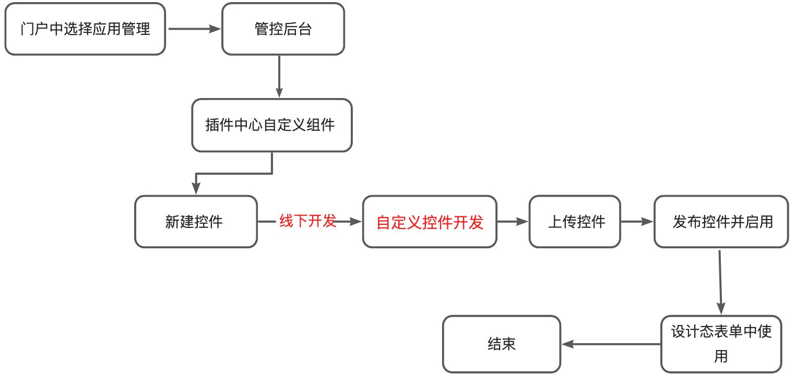

<a id="UNDll"></a>


### 门户中选择应用管理

项目管理-管理后台


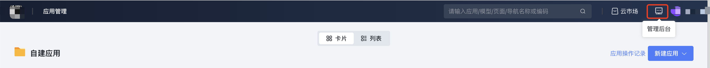


<a id="HTkCO"></a>


### 管控后台、插件中心自定义组件


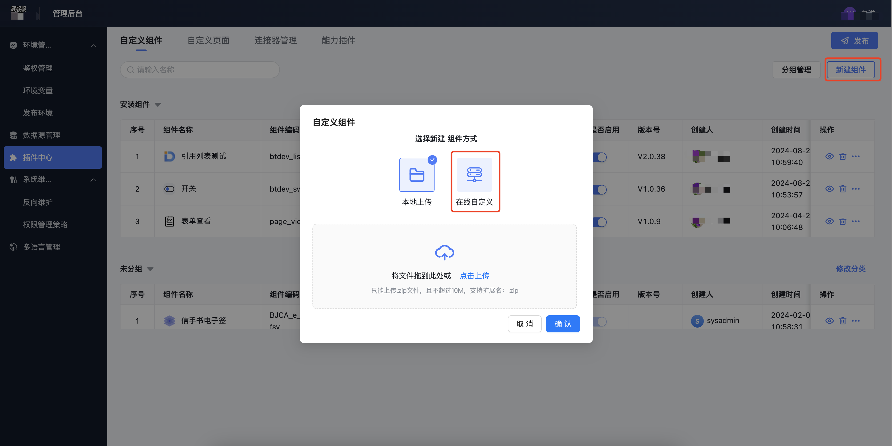


<a id="wdcx3"></a>


### 新建控件


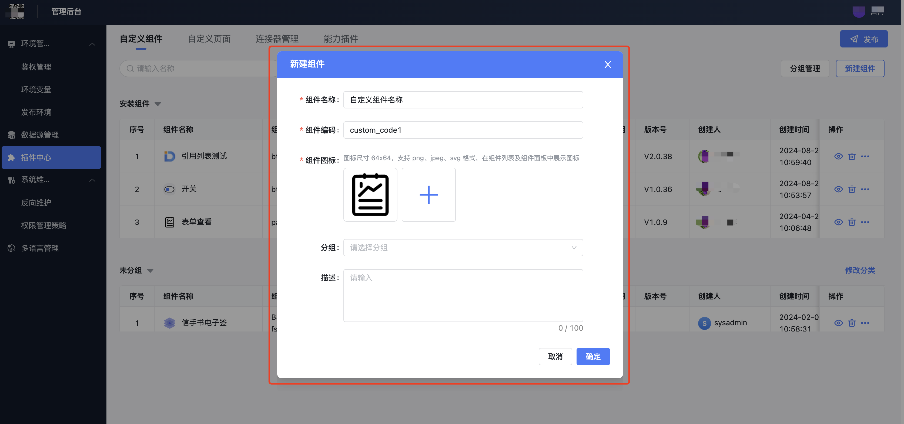


<a id="zebIX"></a>


### 自定义控件开发

<a id="xaniF"></a>


#### 下载脚手架


```bash
 npm init byteluck-control@stable  // 下载脚手架并自定义组件
  // 输入控件的id

  // 输入控件的name
  // 确认控件的类型

  cd 进入控件文件

  npm install // 安装依赖包

  npm run dev // 本地项目调试

  npm run build  // 打包zip包
```


注：本地开发自定义组件时id必须和组建编码保持一致（要带有自动生成的8位数随机编码）


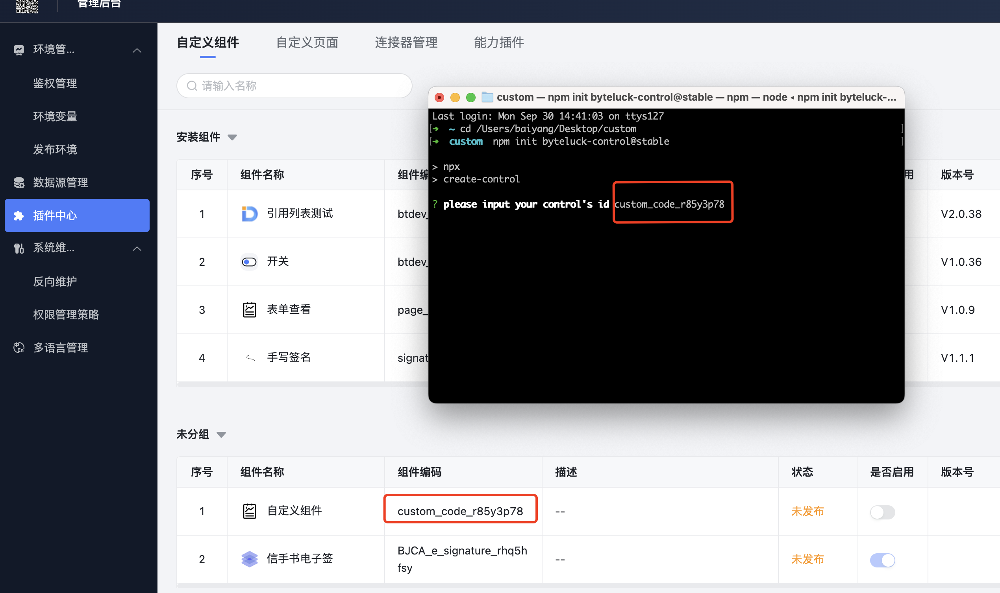


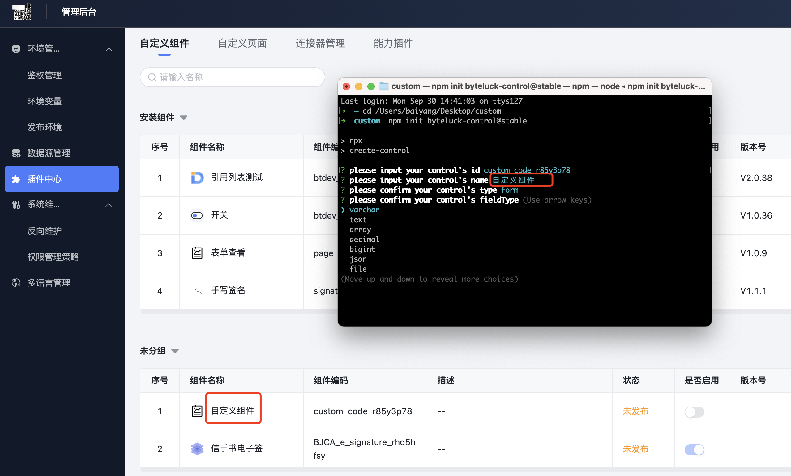

、

​


```bash
id（对应新建组件时的组件编码）
name（对应新建组件时的组件名称）
type （组件类型）
base（不需要绑定数据项(模型字段)的控件）: 基础控件
form（需要绑定数据项(模型字段)的控件）:  表单控件
fieldType:
varchar：  短文本（单行文本、单选、下拉单选）
text： 长文本 （多行文本、富文本）
array： 数组  （多选、下拉多选）
decimal： 数值 （数字输入框）
json：外部数据源 （vue容器）
file： 附件 （附件）
image：图片（图片）
people：人员 （人员控件）
department： 部门 （部门）
timestamp：日期（时间戳）（日期、日期区间）
layout ：布局控件
wrap ：控件容器
```

<a id="FINur"></a>


#### 线下开发-自定义控件开发

<a id="Mfbo3"></a>


##### 执行 pnpm install

<a id="SyiPJ"></a>


##### 更改调试地址

（注：此调试地址需要当前登录账号有【系统应用】的权限）


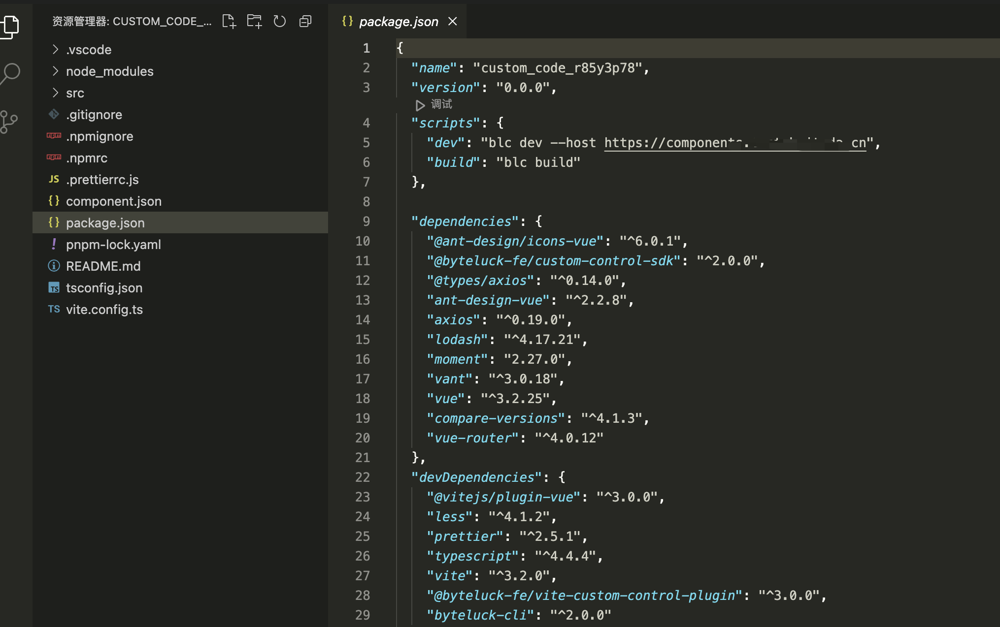


<a id="YFv65"></a>


##### 目录说明


```bash
btdev_custom_control
├── .vscode
│   └── extensions.json
├── dist
│   └── component.json
├── src
│   ├── designer   // 设计态的自定义组件
│   │   ├── settings //自定义原子控件
│   │   ├── designer.vue  //组件
│   │   └── index.ts
│   ├── runtime  // 运行态的自定义组件
│   │   ├── index.ts
│   │   ├── runtime-desktop.vue // pc端
│   │   └── runtime-mobile.vue // 移动端
│   ├── env.d.ts
│   ├── property.ts // 控件的基本属性
│   └── upgrade.ts
├── .npmignore
├── .npmrc
├── .prettierrc.js
├── README.md
├── component.json // 定义了控件的id，name，type等 id和name必须与自定义控件管控台一致
├── package.json
├── pnpm-lock.yaml
├── tsconfig.json
└── vite.config.ts
```

<a id="E0RV1"></a>


##### 开发手册

详见


[自定义组件开发手册](../../../004-平台扩展开发/003-自定义组件开发指南/002-自定义组件开发手册.md)

<a id="BN4fd"></a>


##### 打包

执行 npm run build


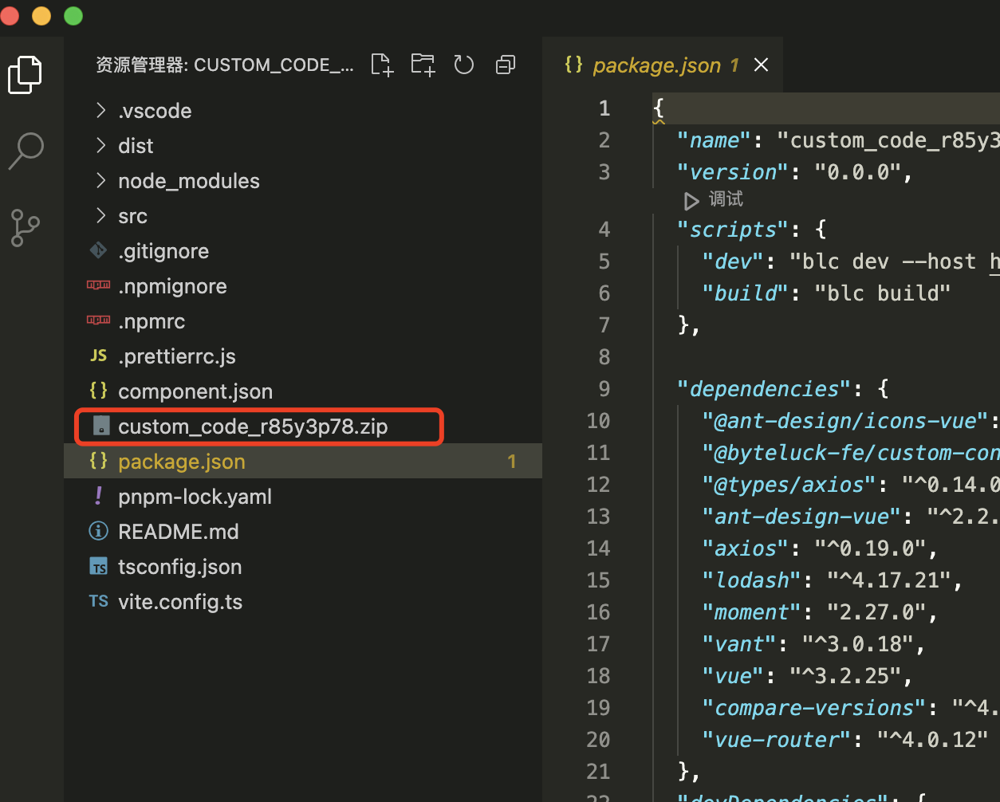


<a id="dPEeD"></a>


#### 上传控件

<a id="Osjki"></a>


##### 上传压缩包


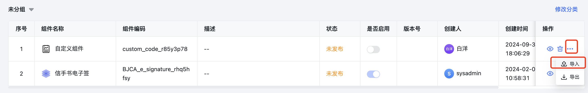


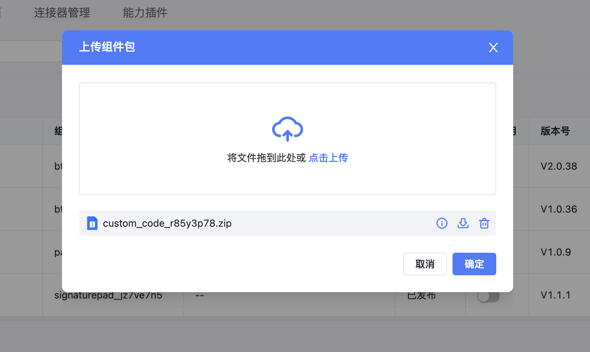


<a id="sOQHL"></a>


##### 自定义组件-共享设置

- 设置自定义组件的展示范围


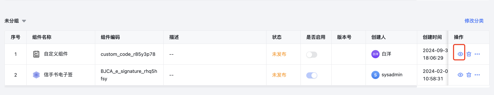


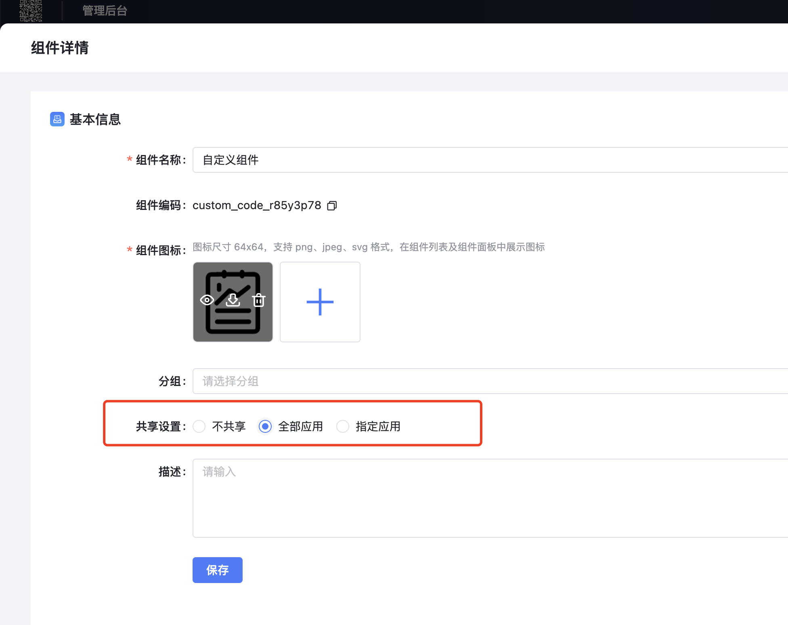


<a id="dXLrK"></a>


#### 发布控件并启用

<a id="ofz5j"></a>


#### 设计态表单使用


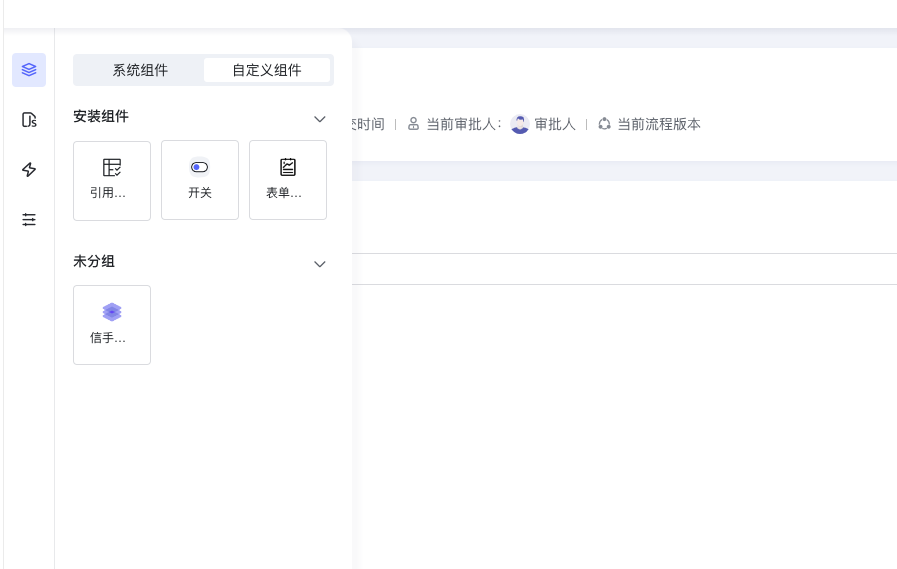


<a id="R7GbO"></a>


### 自定义组件的导出、安装、更新

- 导出


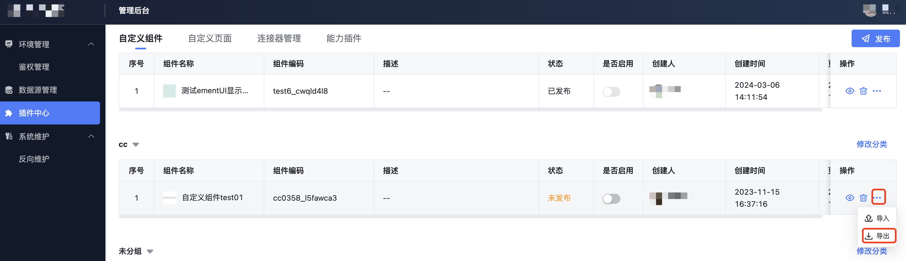


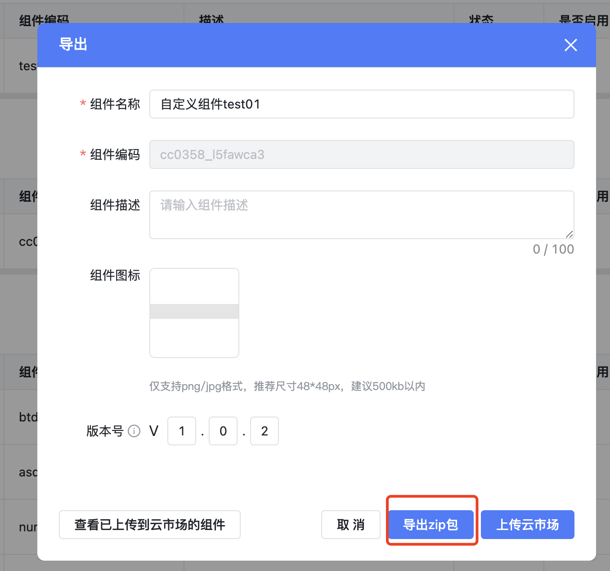


- 安装


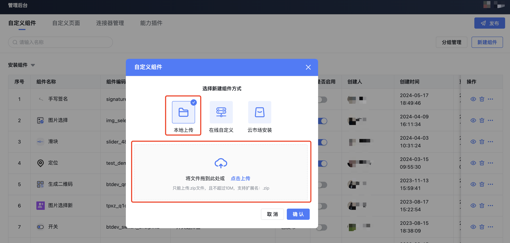


- 更新


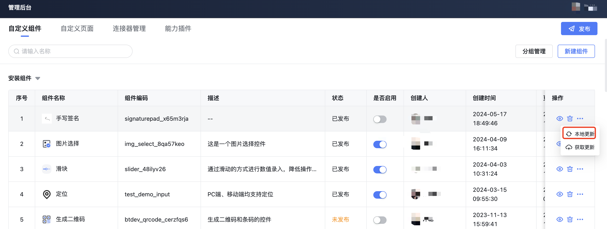


<a id="VBsQA"></a>


## 使用案例

<a id="jFMpA"></a>


### 开关自定义组件

<a id="KJQ5d"></a>


#### 新建自定义组件

详见上文【如何使用】

<a id="cHwrj"></a>


#### 本地开发

- 目录结构


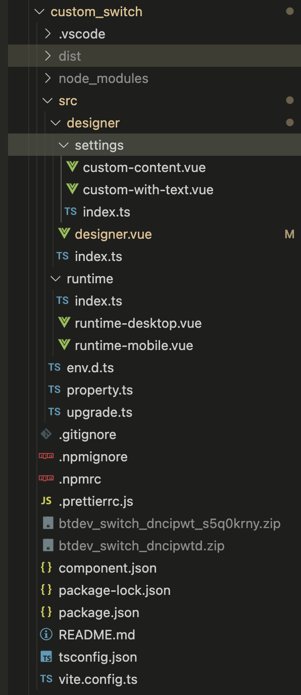


- 设计态（designer）代码


```bash
<template>
  <rok-form-item ref="formItemRef" :control="instance" :name="name" style="--bl-readonly-underline: false">
    <div class="custom-switch-desk subtable-inner-modal" v-if="inSubTable">
      <div class="sub-table-switch" v-if="instance.props.styleSetting==='checkbox'">
        <a-checkbox
          v-if="!isEditable"
          class="my-checkbox"
          :disabled="true"
          v-model:checked="checked">
          <span v-if="instance.props.withtext.isShowText" class="checkbox-label">
            {{checked===1?instance.props.withtext.openText:instance.props.withtext.closeText}}
          </span>
        </a-checkbox>
        <div v-else class="action-checkbox">
          <a-checkbox
            class="my-checkbox"
            :disabled="isDisabled || disabled || !isEditable"
            v-model:checked="checked"
            @change="onChange"
            @blur="onBlur(props.value)"
            @focus="onFocus(props.value)">
            <span v-if="instance.props.withtext.isShowText" class="checkbox-label">
              {{checked===1?instance.props.withtext.openText:instance.props.withtext.closeText}}
            </span>
          </a-checkbox>
        </div>
      </div>
      <div class="sub-table-switch" v-else>
        <a-switch
          v-if="!isEditable"
          :checkedValue="1"
          :unCheckedValue="0"
          :disabled="true"
          :checked-children="openText"
          :un-checked-children="closeText"
          v-model:checked="checked"
        />
        <div v-else class="action-switch">
          <a-switch
            :checkedValue="1"
            :unCheckedValue="0"
            :disabled="isDisabled || disabled || !isEditable"
            :checked-children="openText"
            :un-checked-children="closeText"
            v-model:checked="checked"
            @change="onChange"
            @blur="onBlur(props.value)"
            @focus="onFocus(props.value)"
          />
        </div>
      </div>
    </div>
    <div class="custom-switch-desk subtable-inner-modal" v-else>
      <a-checkbox
        v-if="instance.props.styleSetting==='checkbox'"
        class="my-checkbox"
        :disabled="isDisabled || disabled || !isEditable"
        v-model:checked="checked"
        @change="onChange"
        @blur="onBlur(props.value)"
        @focus="onFocus(props.value)"
      >
        <span v-if="instance.props.withtext.isShowText">
          {{checked===1?instance.props.withtext.openText:instance.props.withtext.closeText}}
        </span>
      </a-checkbox>
      <a-switch
        v-else
        :checkedValue="1"
        :unCheckedValue="0"
        :checked-children="openText"
        :un-checked-children="closeText"
        :disabled="isDisabled || disabled || !isEditable"
        v-model:checked="checked"
        @change="onChange"
        @blur="onBlur(props.value)"
        @focus="onFocus(props.value)"
      />
    </div>
  </rok-form-item>
</template>

<script setup lang="ts">
import {computed, ref, watch} from 'vue'
import Property from '../property'
import {
  useBaseForm,
  useFormEvents,
} from '@byteluck-fe/custom-control-sdk/runtime'

const props = defineProps<{
  instance: typeof Property.Runtime
  rowIndex?: number
  name: string | string[]
  value: any
  disabled: boolean
}>()
const {
  props: instanceProps,
  isDisabled,
  placeholder,
  isEditable,
  formItemRef,
  updateValue,
} = useBaseForm(
  props.instance,
  props.rowIndex,
  computed(() => props.value)
)
const openText = computed(() =>
  props.instance.props.withtext.isShowText
    ? props.instance.props.withtext.openText
    : undefined
)
const closeText = computed(() =>
  props.instance.props.withtext.isShowText
    ? props.instance.props.withtext.closeText
    : undefined
)
const { onFocus, onBlur, onInput } = useFormEvents(props)
const checked = ref<number>(Number(props.value))
// 是否在明细表中
const inSubTable = computed(() => {
  const rowIndex = props.rowIndex
  return rowIndex !== undefined
})
watch(
  () => props.value,
  (newVal) => {
    // console.log(isEditable.value, '------', isDisabled.value)
    checked.value = Number(props.value)
  }
)
const onChange = (event: InputEvent) => {
  checked.value = checked.value ? 1 : 0
  updateValue(checked.value)
  onInput(checked.value)
}
</script>
<style lang="less" scoped>
.custom-switch-desk {
  .sub-table-switch {
    .action-switch {
      //padding: 6px 9px;
      height: 32px;
      display: flex;
      align-items: center;
    }
    .action-checkbox{
      padding: 6px 9px;
    }
    .ant-switch-disabled {
      cursor: pointer;
      &::after {
        cursor: pointer;
      }
    }
    .ant-switch :deep(.ant-switch-inner) {
      margin-left: 8px;
    }
    .ant-switch-checked :deep(.ant-switch-inner) {
      margin-left: -8px;
    }
    :deep(.my-checkbox){
      span{
        display: inline-block;
        width: 16px;
        height: 16px;
      }
    }
  }
  .my-checkbox :deep(.ant-checkbox){
      zoom: 130%;
      display: inline-block;
  }
}
.ant-switch {
  font-family: 'PingFang SC';
}
.ant-switch :deep(.ant-switch-inner) {
  color: #8f959e;
}
.ant-switch-checked :deep(.ant-switch-inner) {
  color: #fff;
}
.ant-switch-disabled:not(.ant-switch-checked) {
  background-color: #d0d0d0;
}
</style>
```


- 运行态（runtime）代码


```bash
<template>
  <rok-form-item ref="formItemRef" :control="instance" :name="name" style="--bl-readonly-underline: false">
    <div class="custom-switch-desk subtable-inner-modal" v-if="inSubTable">
      <div class="sub-table-switch" v-if="instance.props.styleSetting==='checkbox'">
        <a-checkbox
          v-if="!isEditable"
          class="my-checkbox"
          :disabled="true"
          v-model:checked="checked">
          <span v-if="instance.props.withtext.isShowText" class="checkbox-label">
            {{checked===1?instance.props.withtext.openText:instance.props.withtext.closeText}}
          </span>
        </a-checkbox>
        <div v-else class="action-checkbox">
          <a-checkbox
            class="my-checkbox"
            :disabled="isDisabled || disabled || !isEditable"
            v-model:checked="checked"
            @change="onChange"
            @blur="onBlur(props.value)"
            @focus="onFocus(props.value)">
            <span v-if="instance.props.withtext.isShowText" class="checkbox-label">
              {{checked===1?instance.props.withtext.openText:instance.props.withtext.closeText}}
            </span>
          </a-checkbox>
        </div>
      </div>
      <div class="sub-table-switch" v-else>
        <a-switch
          v-if="!isEditable"
          :checkedValue="1"
          :unCheckedValue="0"
          :disabled="true"
          :checked-children="openText"
          :un-checked-children="closeText"
          v-model:checked="checked"
        />
        <div v-else class="action-switch">
          <a-switch
            :checkedValue="1"
            :unCheckedValue="0"
            :disabled="isDisabled || disabled || !isEditable"
            :checked-children="openText"
            :un-checked-children="closeText"
            v-model:checked="checked"
            @change="onChange"
            @blur="onBlur(props.value)"
            @focus="onFocus(props.value)"
          />
        </div>
      </div>
    </div>
    <div class="custom-switch-desk subtable-inner-modal" v-else>
      <a-checkbox
        v-if="instance.props.styleSetting==='checkbox'"
        class="my-checkbox"
        :disabled="isDisabled || disabled || !isEditable"
        v-model:checked="checked"
        @change="onChange"
        @blur="onBlur(props.value)"
        @focus="onFocus(props.value)"
      >
        <span v-if="instance.props.withtext.isShowText">
          {{checked===1?instance.props.withtext.openText:instance.props.withtext.closeText}}
        </span>
      </a-checkbox>
      <a-switch
        v-else
        :checkedValue="1"
        :unCheckedValue="0"
        :checked-children="openText"
        :un-checked-children="closeText"
        :disabled="isDisabled || disabled || !isEditable"
        v-model:checked="checked"
        @change="onChange"
        @blur="onBlur(props.value)"
        @focus="onFocus(props.value)"
      />
    </div>
  </rok-form-item>
</template>

<script setup lang="ts">
import {computed, ref, watch} from 'vue'
import Property from '../property'
import {
  useBaseForm,
  useFormEvents,
} from '@byteluck-fe/custom-control-sdk/runtime'

const props = defineProps<{
  instance: typeof Property.Runtime
  rowIndex?: number
  name: string | string[]
  value: any
  disabled: boolean
}>()
const {
  props: instanceProps,
  isDisabled,
  placeholder,
  isEditable,
  formItemRef,
  updateValue,
} = useBaseForm(
  props.instance,
  props.rowIndex,
  computed(() => props.value)
)
const openText = computed(() =>
  props.instance.props.withtext.isShowText
    ? props.instance.props.withtext.openText
    : undefined
)
const closeText = computed(() =>
  props.instance.props.withtext.isShowText
    ? props.instance.props.withtext.closeText
    : undefined
)
const { onFocus, onBlur, onInput } = useFormEvents(props)
const checked = ref<number>(Number(props.value))
// 是否在明细表中
const inSubTable = computed(() => {
  const rowIndex = props.rowIndex
  return rowIndex !== undefined
})
watch(
  () => props.value,
  (newVal) => {
    // console.log(isEditable.value, '------', isDisabled.value)
    checked.value = Number(props.value)
  }
)
const onChange = (event: InputEvent) => {
  checked.value = checked.value ? 1 : 0
  updateValue(checked.value)
  onInput(checked.value)
}
</script>
<style lang="less" scoped>
.custom-switch-desk {
  .sub-table-switch {
    .action-switch {
      //padding: 6px 9px;
      height: 32px;
      display: flex;
      align-items: center;
    }
    .action-checkbox{
      padding: 6px 9px;
    }
    .ant-switch-disabled {
      cursor: pointer;
      &::after {
        cursor: pointer;
      }
    }
    .ant-switch :deep(.ant-switch-inner) {
      margin-left: 8px;
    }
    .ant-switch-checked :deep(.ant-switch-inner) {
      margin-left: -8px;
    }
    :deep(.my-checkbox){
      span{
        display: inline-block;
        width: 16px;
        height: 16px;
      }
    }
  }
  .my-checkbox :deep(.ant-checkbox){
      zoom: 130%;
      display: inline-block;
  }
}
.ant-switch {
  font-family: 'PingFang SC';
}
.ant-switch :deep(.ant-switch-inner) {
  color: #8f959e;
}
.ant-switch-checked :deep(.ant-switch-inner) {
  color: #fff;
}
.ant-switch-disabled:not(.ant-switch-checked) {
  background-color: #d0d0d0;
}
</style>
```

<a id="TIFyu"></a>


#### 打包

npm run build


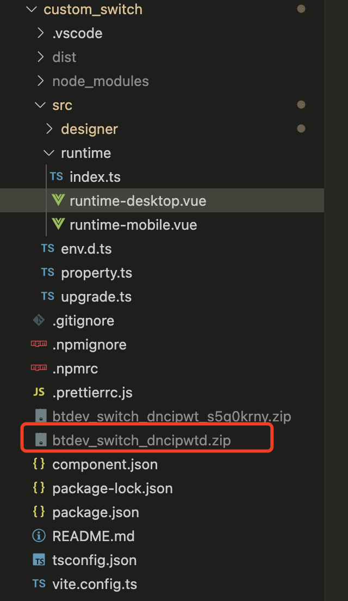


<a id="UvAaG"></a>


#### 上传


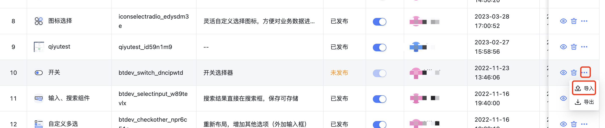


<a id="ZRHsu"></a>


#### 使用


​

​

​

​

​

​

## 下级条目

- [自定义组件开发注意事项](001-自定义组件开发注意事项.md)
