<a id="VgOsw"></a>


## 概述

在平台中设置默认值时基础规范

- 平台配置
- JS事件
- 简易/复杂案例

<a id="HPZrs"></a>


## 支持默认值的控件

|  |  |  |  |
| --- | --- | --- | --- |
| 控件名称 | 类型( TypeScript ) | 值解释 | 默认值 |
| 单行文本 | string | N/A | "" |
| 多行文本 | string | "" |
| 富文本 | string | "" |
| 下拉单选 | string | "" |
| 下拉多选 | string [ ] | [ ] |
| 单选 | string | "" |
| 多选 | string [ ] | [ ] |
| 数字 | number | "" |
| 金额 | [amountType{ }](../../006-前端开发/002-前端组件属性及事件/002-公共类型定义.md#tDJkg) | [{ amountValue }](../../006-前端开发/002-前端组件属性及事件/002-公共类型定义.md#tDJkg) |
| 日期 | string | 时间戳 | "" |
| 日期区间 | { min: string , max: string } | min 为 开始时间戳 max为结束时间戳 | { min: "" , max: "" } |
| 图片 | string [ ] | file\_id 文件id | [ ] |
| 附件 | string [ ] | file\_id 文件id | [ ] |
| 人员 | string [ ] | employee\_id 人员id | [ ] |
| 行政组织 | string [ ] | department\_id 部门id | [ ] |
| 业务组组织 | string [ ] | department\_id 部门id | [ ] |
| 评分 | number | N/A | "" |
| 关联单选 | string | "" |
| 计算公式 | [CalcValueType](../../006-前端开发/002-前端组件属性及事件/002-公共类型定义.md#GyJTR) | [CalcValue](../../006-前端开发/002-前端组件属性及事件/002-公共类型定义.md#GyJTR) |
| 地址 | [AddressType{ }](../../006-前端开发/002-前端组件属性及事件/002-公共类型定义.md#C9mc6) | { [AddressValue](../../006-前端开发/002-前端组件属性及事件/002-公共类型定义.md#C9mc6) } |
| 树 | string [ ] | [ ] |

<a id="bkQ1K"></a>


## 简易设置

表达式默认值

- 拖入表单控件设置默认值


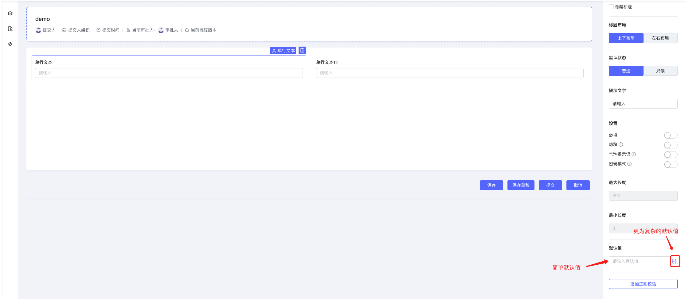


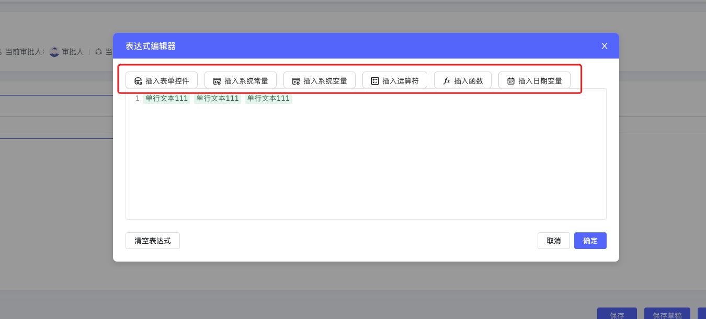


- 可引用表单控件
- 系统常量
- 系统变量
- 可使用运算符组装
- 可插入内置提供函数
- 可插入日期变量-(今天、昨天、明天 ..... )

<a id="UnLWU"></a>


### 通过插入表单控件得到用户全量信息

背景: 创建账户时会有很多信息需填写 如 国家地区、地址、姓氏、名字..... , 在展示该用户信息时需要以此格式展现:“ 姓氏名字" - 地址: "国家或地区地址信息" 电话: "电话号码" 账号: "新的百特搭账户 ” ,不希望写一些代码来组装全量信息.

配置 - 通过表达式插入表单控件组装该信息.


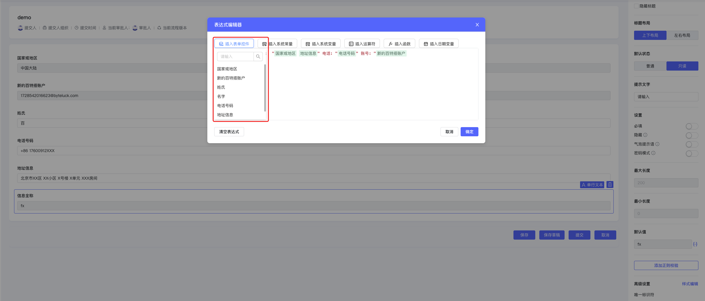


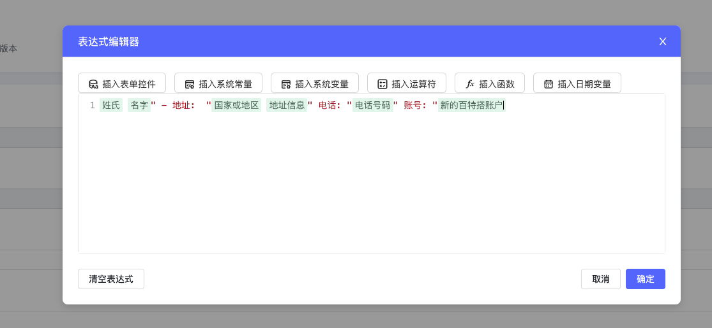


效果:


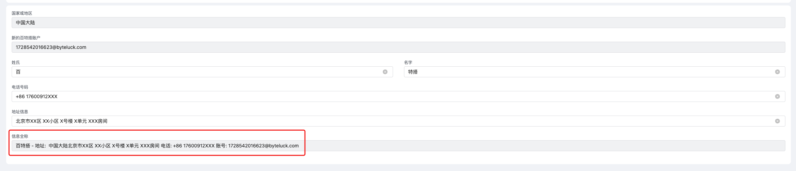


<a id="kiXtN"></a>


### 通过插入系统变量获取当前登陆人信息

配置-插入系统变量组装当前登陆人信息


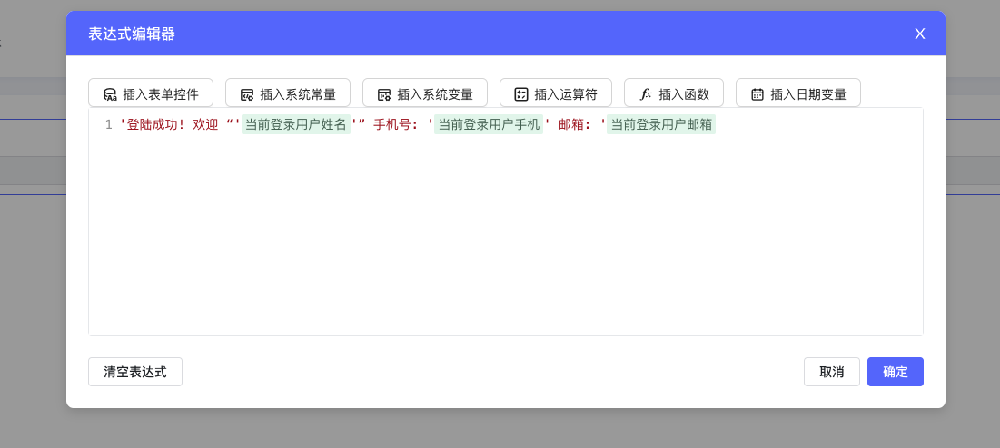


效果:


<a id="da274"></a>


### 通过插入日期变量去筛选近7天的数据

配置-通过表达式设置日期区间为 本周 通过自身值调用服务去查询7天以内的数据


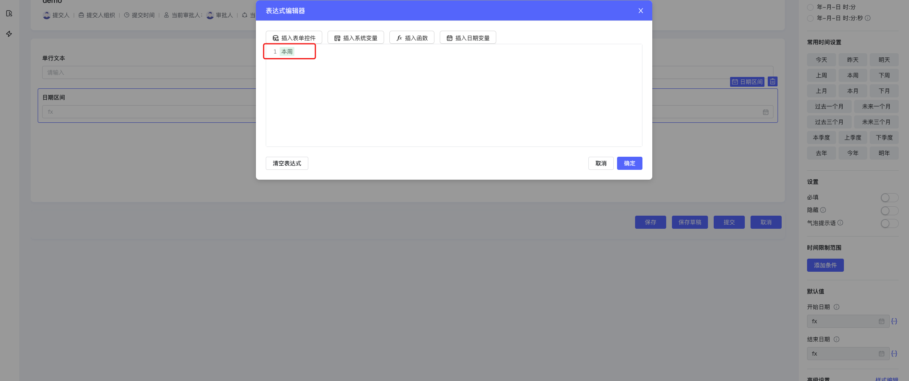


效果:


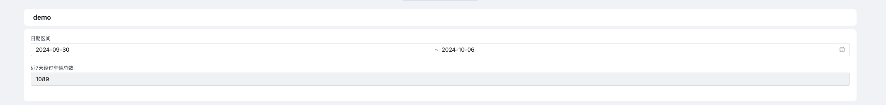


<a id="Lcv4d"></a>


## 复杂设置

<a id="CqMEs"></a>


### 绑定字段控件

<a id="NauEb"></a>


#### 调用服务查询明细表数据 并插入到明细表

- [engine-initialized 页面加载前](https://baiteda.yuque.com/staff-shgita/nbg92z/grnmdplv3v41dxsg#ncTmV)

该方法适用于需要赋值默认值的控件绑定了字段 & 进入页面时用户不会感知到页面抖动及配置显隐的控件抖动 & 不需要触发值发生变化事件.


```javascript
//支持同步执行
export function async pageEventBefore (payload) {
   const result = await utils.querySvc('car_no_selectMore')
  // result [{ car_no: '京X-XXXXX',car_name: '保时捷-XXX' },{ car_no: '京X-XXXXX',car_name: '保时捷-XXX' },{ car_no: '京X-XXXXX',car_name: '保时捷-XXX' },{ car_no: '京X-XXXXX',car_name: '保时捷-XXX' }]
  // carInfoDetail 为 明细表code
   payload.value.carInfoDetail = result.data.data
}
```

<a id="b6SIk"></a>


#### 通过 id 查询 外部数据源 关联的商品信息

[engine-initialized 页面加载前](https://baiteda.yuque.com/staff-shgita/nbg92z/grnmdplv3v41dxsg#ncTmV)

绑定字段控件 & 进入页面时用户不会感知到页面抖动及配置显隐的控件抖动 & 不需要触发值发生变化事件.


```javascript
export function async pageEventBefore (payload) {
  const result = await utils.querySvc({
  	app_id: 'demo',
  	query: {
  		page_index: 1,
  		page_size: 100,
  	},
    save_datas:{
      id:'12345'
    },
  	svc_code: 'demo_detail_selectMore',
  })
   const result = await utils.querySvc('car_no_selectMore')
   // result.data.data 值为 [{ title: "简易衣柜落地出租屋储物家用可折叠加粗钢管组装加固简约衣橱 单...", price: 50, num: 100 },{ title: "简易衣柜落地出租屋储物家用可折叠加粗钢管组装加固简约衣橱 单...", price: 50, num: 100 },{ title: "简易衣柜落地出租屋储物家用可折叠加粗钢管组装加固简约衣橱 单...", price: 50, num: 100 }]
   // demoDetail 为 明细表code
    payload.value.demoDetail = result.data.data
}
```


效果:


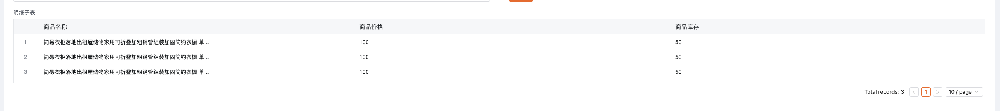


<a id="MgCUj"></a>


### 未绑定字段控件

该方法适用于需要赋值默认值的控件未绑定字段 & 需要触发值发生变化事件.

[engine-mounted 页面加载时](https://baiteda.yuque.com/staff-shgita/nbg92z/grnmdplv3v41dxsg#miTjE)​

- [getState](../../006-前端开发/001-前端二开API.md#rJj7W)
- [setState](../../006-前端开发/001-前端二开API.md#GRNtW)
- [setStates](../../006-前端开发/001-前端二开API.md#ceI84)

<a id="jUenK"></a>


## 表单弹窗中使用

<a id="KbJei"></a>


### 点击列表操作按钮时获取当前行数据给控件赋默认值

- [blFormEngineModal](../../006-前端开发/005-前端内置组件/002-blFormEngineModal 表单弹窗组件.md)
- [操作列按钮点击时](../../006-前端开发/002-前端组件属性及事件/006-ListView 列表页/README.md#NDtbN)

添加Vue容器,添加列表操作列点击时事件,利用该事件唤起弹窗.


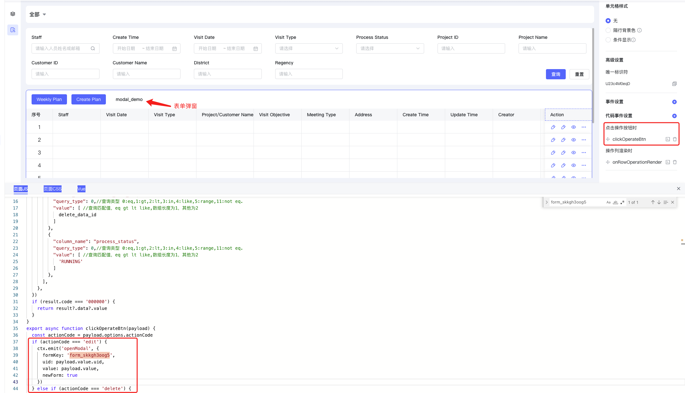


JS事件中 emit('openModal')与Vue容器交互,从而实现操作列按钮点击后能够拿到该行数据.


```javascript
const ctx = exports.ctx;
const utils = exports.utils;
const http = utils.getHttp()
const isMobile = utils.getDevice() === 'mobile'
export const formModal = {
  template: `
    <bl-form-engine-modal
      v-model:visible="visible"
      form-key="form_skkgh3oog5"
      app-id="app_kw0cw8bdm4"
      :readonly="false"
      :on-engine-submitted="onEngineSubmitted"
      :on-engine-mounted="onEngineMounted"
      :onEngineBeforeInit="onEngineBeforeInit"
      :on-close-error="onCloseError"
      async
    ></bl-form-engine-modal>
  `,
  props: ['instance', 'name', 'value', 'rowIndex', 'pageStatus', 'permissions'],
  emits: ['change'],
  data: function () {
    return {
      visible: false,
      formKey: '',
      uid: '', // 当前操作的uid
      currentValue: {},
      newForm: true
    };
  },
  mounted: function () {
    // 点击列表操作按钮时会将uid传递进来
    ctx.on('openModal', (params) => {
      this.formKey = params.formKey
      this.uid = params.uid
      this.currentValue = params.value
      this.visible = true
    })
  },
  methods: {
    onEngineSubmitted() {
      ctx.emit('listview:reload-list', {})
      this.visible = false
    },
    onEngineBeforeInit(engine, payload) {
      //默认值
      payload.value.journey_plan_em3c73ej = this.currentValue.data_value_map
      payload.value.journey_plan_em3c73ej.modify_dataid = this.uid
      payload.value.journey_plan_em3c73ej.uid = ''
    },
    onEngineMounted(innerCtx) {
      // 设置 Ze7GWaE8zJ 默认值, 并触发值发生变化事件
      innerCtx.setState('Ze7GWaE8zJ', this.uid)
    }
  }
}
```


效果:


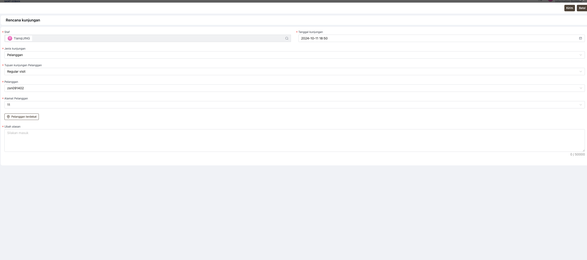
