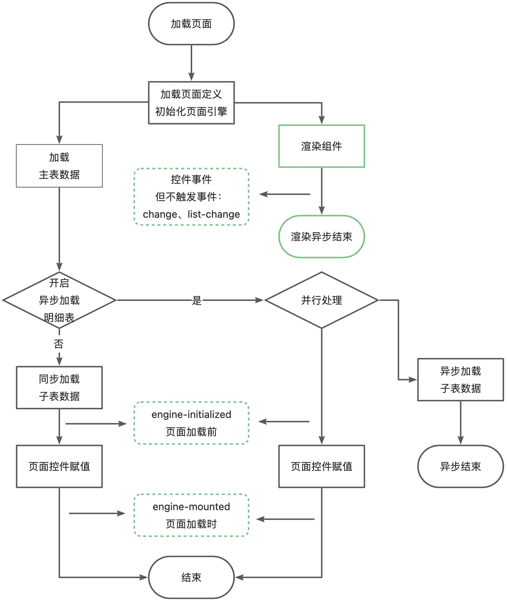
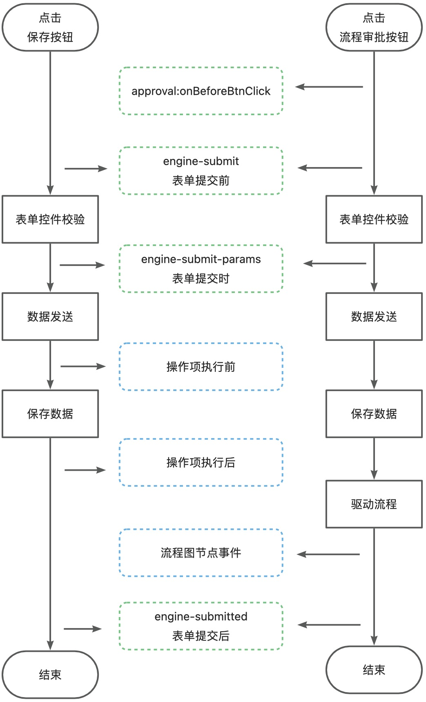

## 表单生命周期

### 加载

#### 前端：engine-initialized 页面加载前事件

[DataView 表单页](../../006-前端开发/002-前端组件属性及事件/005-DataView 表单页/README.md#ncTmV)

#### 前端：engine-mounted 页面加载时事件

[DataView 表单页](../../006-前端开发/002-前端组件属性及事件/005-DataView 表单页/README.md#miTjE)

### 提交

#### 前端：approval:onBeforeBtnClick

[DataView 表单页](../../006-前端开发/002-前端组件属性及事件/005-DataView 表单页/README.md#EDfFY)

#### 前端：engine-submit 表单提交前

[DataView 表单页](../../006-前端开发/002-前端组件属性及事件/005-DataView 表单页/README.md#EmblV)

#### 前端：engine-submit-params 表单提交时

[DataView 表单页](../../006-前端开发/002-前端组件属性及事件/005-DataView 表单页/README.md#oSPnB)

#### 前端：engine-submitted 表单提交后

[DataView 表单页](../../006-前端开发/002-前端组件属性及事件/005-DataView 表单页/README.md#NzTDv)

#### 后端：操作项执行前

#### 后端：操作项执行后

#### 后端：流程图节点事件

## 下级条目

- [表单上引入第三方组件](001-表单上引入第三方组件.md)
- [JS 取值、赋值操作](002-JS 取值、赋值操作/README.md)
- [如何从表单上打开其他表单](003-如何从表单上打开其他表单.md)
- [如何调用接口](004-如何调用接口/README.md)
- [使用Vue容器](005-使用Vue容器/README.md)
- [替换下拉框的默认查询](006-替换下拉框的默认查询.md)
- [表单有效性校验](007-表单有效性校验/README.md)
- [表单保存后处理](008-表单保存后处理.md)
- [自定义打印](009-自定义打印.md)
- [自定义组件开发](010-自定义组件开发/README.md)
- [表单设置默认值](011-表单设置默认值.md)
