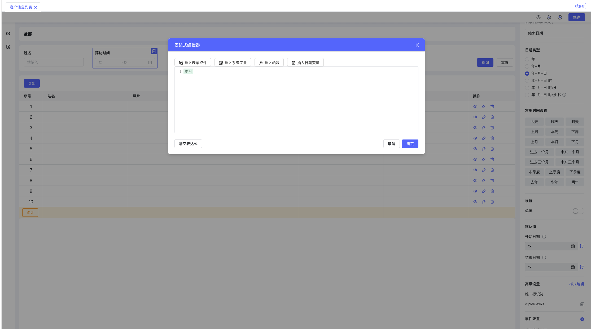
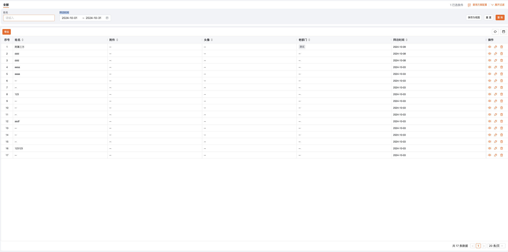
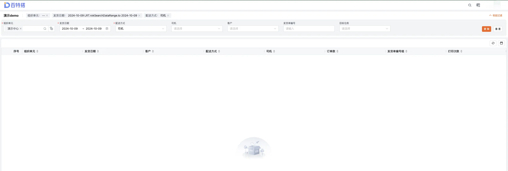
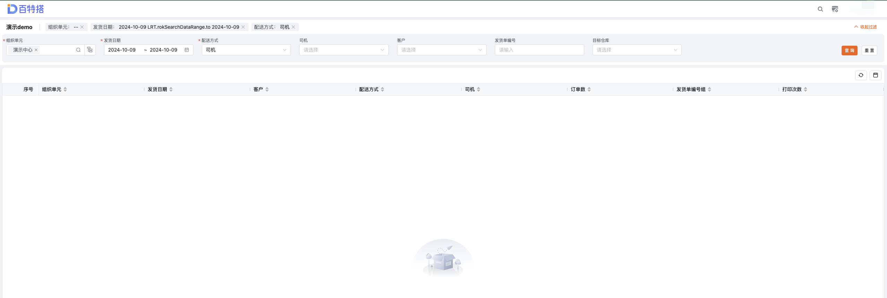
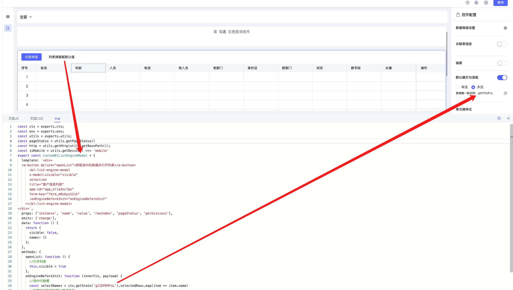
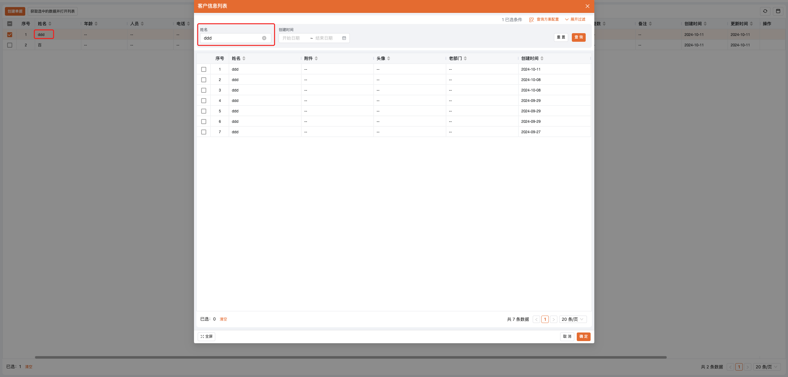

<a id="ncTmV"></a>


## 支持默认值的控件

|  |  |  |  |
| --- | --- | --- | --- |
| 控件名称 | 类型( TypeScript ) | 值解释 | 默认值 |
| 日期 | string | 时间戳 | "" |
| 日期区间 | [ min , max ] as string [ ] | min 为 开始时间戳 max为结束时间戳 | [ "" , "" ] |
| 下拉单选 | string | N/A | "" |
| 下拉多选 | string [ ] | [ ] |

<a id="MhNYh"></a>


## 简易设置

- 表达式默认值(5.2.0新增)

<a id="zsNNR"></a>


#### 查询当月拜访客户信息

配置拜访时间默认值为本月





效果:





<a id="p7n0R"></a>


## 复杂设置

<a id="UCaw9"></a>


### 可被修改的默认值

- [engine-initialized 页面加载前](../../006-前端开发/002-前端组件属性及事件/006-ListView 列表页/README.md#A9qX5)

<a id="ctskV"></a>


#### 设置查询区域 当前登陆人所在组织、当天的数据、配送方式司机


```typescript
const ctx = exports.ctx
const utils = exports.utils
const http = utils.getHttp()
const isMobile = utils.getDevice() === 'mobile'
const moment = exports.env.moment
export function onListEngineInitialized(payload) {
	//发货日期
	ctx.setState('I4kyXEzGjb', [
		+new Date(moment().format('YYYY-MM-DD 00:00:00')),
		+new Date(moment().format('YYYY-MM-DD 23:59:59')),
	])
	//组织单元
	ctx.setState('nLC73rtL0A', ['1'])
	//配送方式
	ctx.setState('wUHHByLdD5', '司机')

	//....more
}
```


效果:





<a id="QHqA1"></a>


###

<a id="l8ZEb"></a>


### 不可被修改的默认值

- [list-search 列表数据查询构建时](https://baiteda.yuque.com/staff-shgita/nbg92z/kwlg9re8muw4x2sw#jCPqS)

<a id="Csp7e"></a>


#### 查询列表时设置组织、发货时间、司机 的默认值


```typescript
const ctx = exports.ctx;
const utils = exports.utils;
const http = utils.getHttp()
const isMobile = utils.getDevice() === 'mobile'
const moment = exports.env.moment;
//列表查询参数构建时
export function onListDataSearch(payload) {
  let send_date_start = ctx.getState('I4kyXEzGjb')[0];//开始日期
  let send_date_end = ctx.getState('I4kyXEzGjb')[1];//结束日期
  if(send_date_start==''){
    send_date_start = new Date(moment().format('YYYY-MM-DD 00:00:00')).getTime()
  }
  if(send_date_end==''){
    send_date_end = new Date(moment().format('YYYY-MM-DD 23:59:59')).getTime()
  }
  let transport_type = ctx.getState('wUHHByLdD5');//配送方式
  let org_id = ctx.getState('nLC73rtL0A')[0];//业务组织
  let bill_num = ctx.getState('swUgfDdCX5');//发货单编号
  let dest_warehouse_id = ctx.getState('tyoQrzYdQL');//仓库
  let market_id = ctx.getState('yLthS86Ft9') // 市场

  let send_ids = ctx.getState('m6xnsbYn26').join(',') // 发货单
  console.log("send_id", send_ids)

  //设置查询入参
  let save_datas = {
    "send_date_start": send_date_start,
    "send_date_end": send_date_end,
    "transport_type": transport_type,
    "org_id": org_id,
    "bill_num": bill_num,
    "dest_warehouse_id": dest_warehouse_id,
    "market_id": market_id,
    "send_ids": send_ids
  }
  payload.value.page.page_size = 50
  payload.value.save_datas = save_datas;
  return payload.value
}
```


效果:





<a id="WliDd"></a>


### 使用列表弹窗时设置默认值

- [Vue容器](../../002-专题讲解/007-表单 列表二开指南/005-Vue容器.md)
- [blListEngineModal](../../006-前端开发/005-前端内置组件/003-blListEngineModal 列表弹窗组件.md)

<a id="kQGQC"></a>


#### 选中行后根据姓名值去过滤-客户信息列表(弹窗)

拖拽Vue控件并生成对应二开代码





```javascript
const ctx = exports.ctx;
const env = exports.env;
const utils = exports.utils;
const pageStatus = utils.getPageStatus()
const http = utils.getHttp(utils.getBasePath());
const isMobile = utils.getDevice() === 'mobile'
export const CustomBlListEngineModal = {
  template: `<div>
  <a-button @click="openList">获取选中的数据并打开列表</a-button>
      <bl-list-engine-modal
      v-model:visible="visible"
      selection
      title="客户信息列表"
      app-id="app_ella2nc7pu"
      form-key="form_m8sbyu12ik"
      :onEngineBeforeInit="onEngineBeforeInit"
    ></bl-list-engine-modal>
</div>`,
  props: ['instance', 'name', 'value', 'rowIndex', 'pageStatus', 'permissions'],
  emits: ['change'],
  data: function () {
    return {
      visible: false,
      names: []
    };
  },
  methods: {
    openList: function () {
      //打开列表
      this.visible = true
    },
    onEngineBeforeInit: function (innerCtx, payload) {
      //选中行数据
      const selectNames = ctx.getState('gIIEPEMFnL').selectedRows.map(item => item.name) // ['ddd']
      //设置打开列表的 默认查询条件 - 重置后会清空该查询条件
      innerCtx.setState('Jicmv9u5zF', selectNames[0]) //selectNames[0] - > ddd
      //设置列表查询控件默认值 - 重置后不会清空该查询条件
      innerCtx.setInstance('Jicmv9u5zF', 'defaultValue',selectNames[0]) //selectNames[0] - > ddd
    }
  }
}
```


效果:

该方式设置的查询区域默认值是可被修改的.



