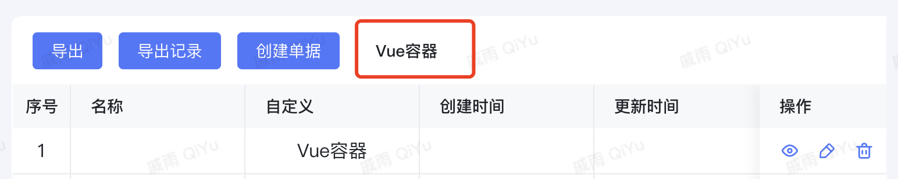
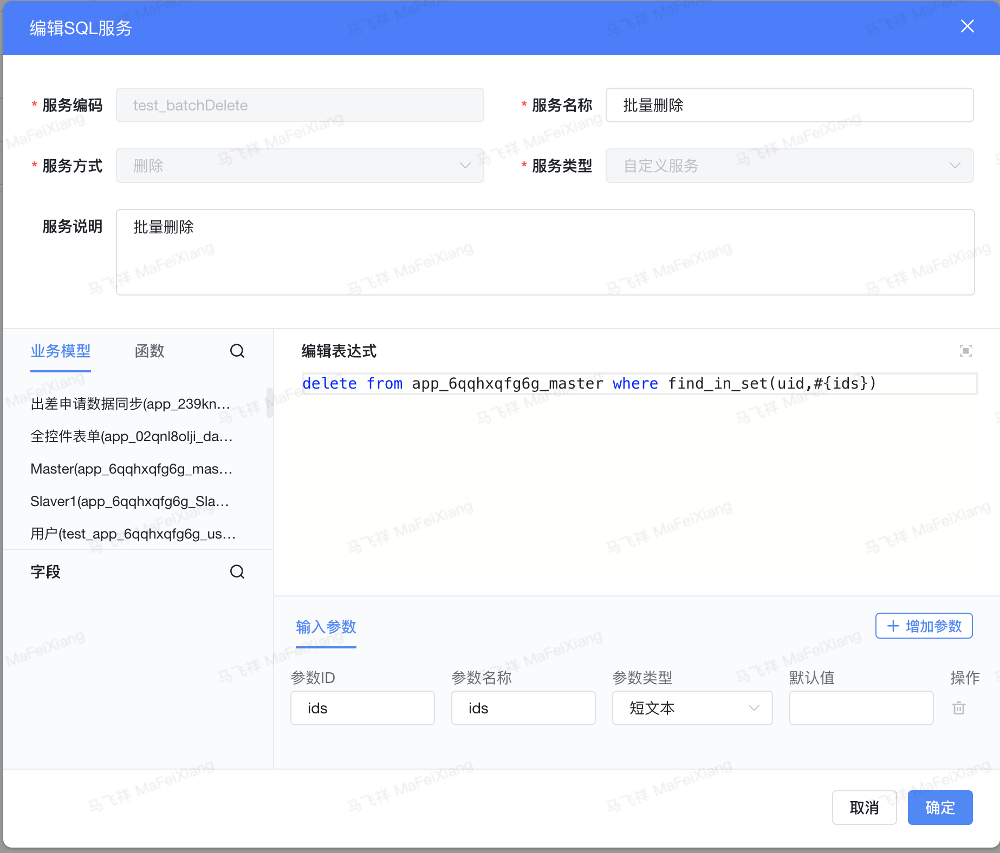

<a id="lJNEl"></a>


# ​





工具栏上放置vue容器


```typescript
export const batchDelete =  {
  template: '<div><a-button @click="batchDelete">批量删除</a-button></div>',
  props: ['instance', 'name','value','rowIndex','pageStatus', 'permissions'],
  emits: ['change'],
  data: function () {
    return {
      getSelectedRowData: []
    };
  },
  mounted: function() {
    // 开启表格多选模式
    ctx.setInstance(this.instance.parent, 'isShowSelection', true)
    ctx.on('checked', payload => {
          this.getSelectedRowData = payload.value
    })
    //
  },
  methods: {
    async batchDelete() {
      if (this.getSelectedRowData.length === 0) return
      // 删除可调用接口
      await utils.querySvc({
        "app_id":"app_6qqhxqfg6g",
        "save_datas":{//添加、修改服务是调用，数据格式要对应上
           "ids": this.getSelectedRowData.map(item => item.uid).join(',') //查单，修改或者删除服务时传递
        },
        "svc_code":"test_batchDelete"
      })
      // 前端API：utils.querySvc调用参数，见 https://baiteda.yuque.com/books/share/036629a3-6a2f-4e3c-98a6-81ca11fb487f/csh4gh#roR3W
      window.updateList()
    }
  }
}
```


前端API：utils.querySvc调用参数，请见以下链接：

<https://baiteda.yuque.com/books/share/036629a3-6a2f-4e3c-98a6-81ca11fb487f/csh4gh#roR3W>

​





```sql
delete from app_6qqhxqfg6g_master where 1 = 1 and find_in_set(uid,#{ids})
```

<a id="rxFpU"></a>


# ​
