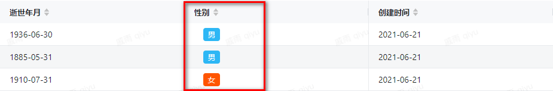
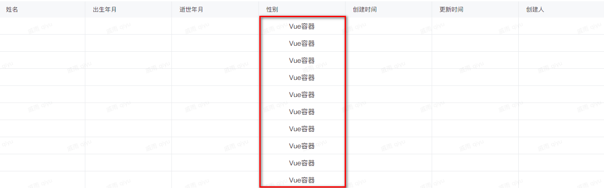

例如 需要设置性别男为蓝色标签，性别女为红色标签

<a id="vMVpT"></a>


## 展示效果





<a id="ITKNZ"></a>


## 设置vue容器





<a id="iKowg"></a>


## 编写代码


```javascript
const ctx = exports.ctx;
const utils = exports.utils;
const http = utils.getHttp()
const isMobile = utils.getDevice() === 'mobile'
export const getSex =  {
  template:  `<div>
    <a-tag :color="judgeGender">{{ gender }}</a-tag>
  </div>`,
  props: ['instance', 'name','value','rowIndex','pageStatus', 'permissions'],
  emits: ['change'],
  computed: {
    gender() {
      console.log(this.value)
      return this.value.gender
    },
    judgeGender(){
      if(this.value.gender === '男'){
        return "#2db7f5"
      }else{
        return "#f50"
      }
    }
  },
}
```

<a id="eLDNo"></a>


# ​
