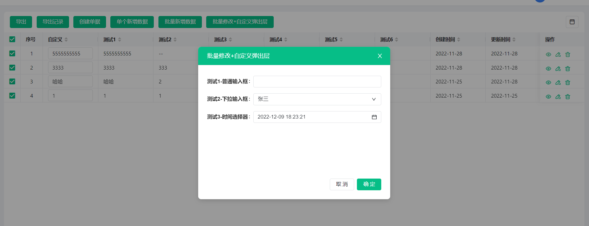

<a id="fOXpy"></a>


### 一、效果图

本案例涉及内容为：

1、单个新增，钩选某一列数据后，可以以弹出层形式修改当前数据，或者直接在列表上编辑数据，然后直接保存为一条新数据

2、批量新增，钩选N个复选框后，可以以弹出层形式修改当前数据，或者直接在列表上编辑数据，然后直接保存为多条新数据

3、批量修改，钩选N个复选框后，可以以弹出层形式修改当前数据，或者直接在列表上编辑数据，然后直接保存为多条新数据。

弹出层上可以关联数据控件赋值就行。





<a id="ZlEZK"></a>


###

<a id="lEylU"></a>


### 二、具体步骤

<a id="RW1ph"></a>


#### 1、单个新增


```javascript
//单个新增数据
export const addFn =  {
  template: `
      <a-button type="primary" @click="addFnData">单个新增数据</a-button>
  `,
  props: ['instance', 'name','value','rowIndex','pageStatus', 'permissions'],
  emits: ['change'],
  data: function () {
    return {
      message: '!sj.euV olleH',
      Myarrlist:[],
    };
  },
  mounted: function() {
    this.reverseMessage()
    this.$emit('change', 777)//用于更新数据

    //监听列表复选框钩选的事件
    ctx.on('checked', payload => {
      console.log(payload)
      this.Myarrlist = payload.value
    })
  },
	methods: {
    reverseMessage: function () {
      this.message = this.message
        .split('')
        .reverse()
        .join('');
    },
    addFnData(){
      console.log(this.value)
      let _this = this
      Modal.confirm({
        content:'提示信息：你确定要新增数据吗？',
        onOk() {
          return new Promise(async (resolve, reject) => {
            var res = await utils.querySvc({
              "app_id":"list1_uqyt6jzl",
              "save_datas":{
                "a1":_this.Myarrlist[0].a1,
                "creator":utils.getUserInfo().employee_id, //必须填当前登录人,或者指定人员
              },
              "svc_code":"list1_uqyt6jzl_insert"
            });
            if(res.code == '000000'){
              window.antd.message.success('单个新增成功~');
              resolve() //返回状态
              window.updateList() //更新列表
            }
          }).catch(
            () => console.log('Oops errors!')
          );
        },
        onCancel() {},
      });
    }
  }
}
```

<a id="miypk"></a>


#### 2、批量新增


```javascript
//批量新增
export const AddListFns1 =  {
  template: `
    <a-button type="primary" @click="AddClick" :disabled="getSelectedRowData.length<=0">批量新增数据</a-button>
  `,
  props: ['instance', 'name','value','rowIndex','pageStatus', 'permissions'],
  emits: ['change'],
  data: function () {
    return {
      message: '!sj.euV olleH',
      getSelectedRowData: []
    };
  },
  mounted: function() {
    this.reverseMessage()
    this.$emit('change', 777)//用于更新数据

    ctx.setInstance(this.instance.parent, 'isShowSelection', true)  // 开启表格多选模式--列表里面有一次就行
    //监听列表复选框钩选的事件
    ctx.on('checked', payload => {
      this.getSelectedRowData = payload.value
    })
  },
  methods: {
    reverseMessage: function () {
      this.message = this.message
        .split('')
        .reverse()
        .join('');
    },
    AddClick(){
      console.log("123")
      let _this = this
      Modal.confirm({
        content:'提示信息：您当前钩选了  '+_this.getSelectedRowData.length+'  条数据,您确定要提交吗？',
        onOk() {
          console.log(_this.getSelectedRowData)
          return new Promise(async (resolve, reject) => {
            let arr = []
            _this.getSelectedRowData.forEach(el=>{
              arr.push({
                creator:utils.getUserInfo().employee_id, //必须填当前登录人,或者指定人员
                a1:el.a1,
                a2:el.a2,
              })
            })
            var res = await utils.querySvc({
              "app_id":"list1_uqyt6jzl",
              save_datas_list:arr,
              "svc_code":"list1_uqyt6jzl_batch_save" //svc_code用模型编码_batch_save
            });
            if(res.code == '000000'){
              window.antd.message.success('批量增加成功~');
              resolve() //返回状态
              window.updateList() //更新列表
            }
          }).catch(
            () => console.log('Oops errors!')
          );
        },
        onCancel() {},
      });
    }
  }
}
```

<a id="zGbkJ"></a>


#### 3、批量修改+自定义弹出层


```javascript
//批量修改+自定义弹出层
export const UpPopData =  {
  template:`
    <a-button type="primary" @click="visible=true" :disabled="getSelectedRowData.length<=0">批量修改+自定义弹出层</a-button>
    <a-modal
      v-model:visible="visible"
      title="批量修改+自定义弹出层"
      @ok="handleOk"
      @cancel="cancelFn"
      :confirm-loading="confirmLoading"
    >
      <a-form :model="formState" :label-col="labelCol" :wrapper-col="wrapperCol">
        <a-form-item label="测试1-普通输入框">
          <a-input v-model:value="formState.a1" />
        </a-form-item>

        <a-form-item label="测试2-下拉输入框">
          <a-select v-model:value="formState.a2" placeholder="please select your zone">
            <a-select-option value="张三">张三</a-select-option>
            <a-select-option value="李四">李四</a-select-option>
          </a-select>
        </a-form-item>

        <a-form-item label="测试3-时间选择器">
          <a-date-picker
            v-model:value="formState.a3"
            show-time
            type="date"
            placeholder="选择时间"
            style="width: 100%"
          />
        </a-form-item>

      </a-form>
    </a-modal>
  `,
  props: ['instance', 'name','value','rowIndex','pageStatus', 'permissions'],
  emits: ['change'],
  data: function () {
    return {
      message: '!sj.euV olleH',
      visible:false,
      confirmLoading:false,
      getSelectedRowData:[],
      formState:{
        a1:'',
        a2:'',
        a3:'',
      },
    };
  },
  mounted: function() {
    this.reverseMessage()
    this.$emit('change', 777)//用于更新数据

    //监听钩选的数据
    ctx.on('checked', payload => {
      this.getSelectedRowData = payload.value
    })
  },
  methods: {
    reverseMessage: function () {
      this.message = this.message
        .split('')
        .reverse()
        .join('');
    },
    //弹出层点击确定按钮
    async handleOk(){
      //处理数据
      this.confirmLoading = true; //加载层
      let arr = []
      this.getSelectedRowData.forEach(el=>{
        arr.push({
          uid:el.uid,
          a1:this.formState.a1?this.formState.a1:el.a1, //三目判断,如果弹出层填写了,则取用,否则取默认
          a2:this.formState.a2,
          a3:moment(this.formState.a3).valueOf(),
        })
      })
      console.log(arr,'=============')

      //发送请求
      var res = await utils.querySvc({
        "app_id":"list1_uqyt6jzl",
        "save_datas_list": arr,
        "svc_code":"list1_uqyt6jzl_batch_modify" // 修改编码：_batch_modify
      });
      if(res.code == '000000'){
        window.antd.message.success('修改成功~');
        this.visible = false;
        this.confirmLoading = false;
        window.updateList()
      }
    },
    //关闭弹出层的回调
    cancelFn(){
      console.log("关闭")
    },
  }
}
```

<a id="k31Iu"></a>


#### 4、列表上的input


```javascript
//列表上的input
export const test1 =  {
  template: `
    <a-input v-model:value="value.a1" placeholder="Basic usage" />
  `,
  props: ['instance', 'name','value','rowIndex','pageStatus', 'permissions'],
  emits: ['change'],
  data: function () {
    return {
      message: '!sj.euV olleH'
    };
  },
  mounted: function() {
    this.reverseMessage()
    this.$emit('change', 777)//用于更新数据
  },
  methods: {
    reverseMessage: function () {
      this.message = this.message
        .split('')
        .reverse()
        .join('');
    }
  }
}
```
