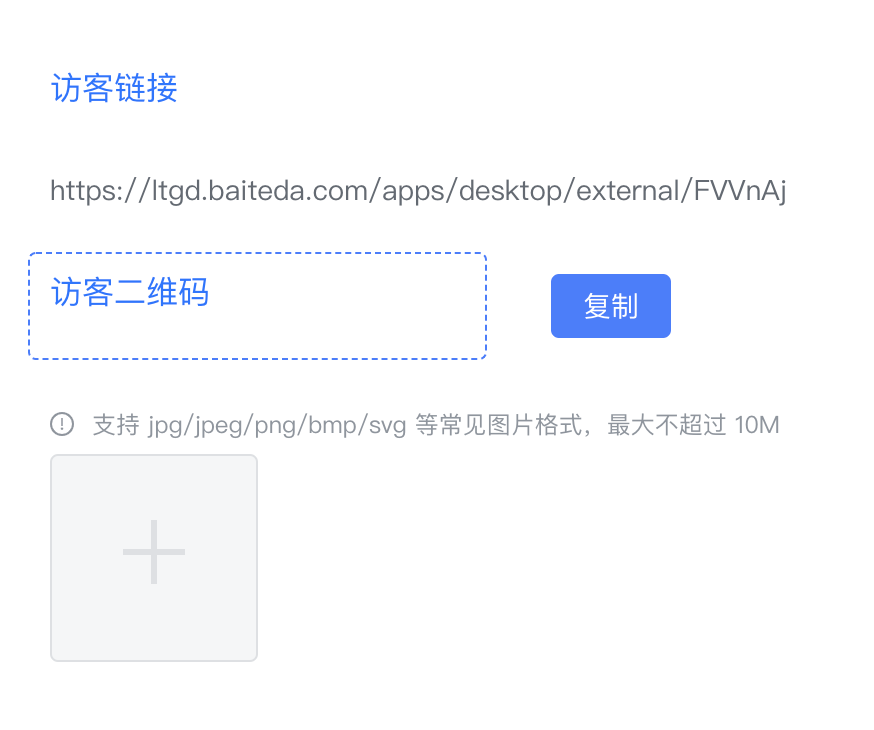

<a id="Ch7KO"></a>


## 场景

1. 列表页中编辑和删除按钮的显示需要进行判断

<a id="WvXoN"></a>


## 实现


```javascript
const ctx = exports.ctx;
const utils = exports.utils;
const http = utils.getHttp()
const isMobile = utils.getDevice() === 'mobile'
export const optcol =  {
  template: `<div>
    <a href="javascript:;" style="margin:0 8px" @click.stop="handleViewRow">
			<i class="iconfont iconliulan1"></i>
		</a>
		<a v-if="canEdit" href="javascript:;" style="margin:0 8px" @click.stop="handleEditRow">
			<i class="iconfont iconbianji6-Blue1"></i>
		</a>
		<a-popconfirm
			title="'确定要删除此条数据吗？'
			ok-text="确定"
			cancel-text="取消"
			@confirm="handleDeleteRow"
		>
			<a href="javascript:;" style="margin:0 8px" @click.stop>
				<i class="iconfont iconlajitong"></i>
			</a>
		</a-popconfirm>
  </div>`,
  props: ['instance', 'name','value','rowIndex','pageStatus', 'permissions'],
  emits: ['change'],
  data: function () {
    return {
      row: this.value,
      canEdit: this.value.process_instance_id !== '',
    };
  },
  mounted: function() {
  },
  methods: {
    handleViewRow: function () {
      window.open(`/apps/desktop/process/app_mn8qjv3fxd/sappId/form_wjrfxsgh62/${this.row.uid}?type=view&additional_query={}`)
    },
    handleEditRow: function() {
      window.open(`/apps/desktop/sapp/app_mn8qjv3fxd/sappId/form_wjrfxsgh62/${this.row.uid}?type=edit&additional_query={}&header=none`)
    },
    handleDeleteRow: function() {
      http.post('')
    }
  }
}
```

<a id="bGgqm"></a>


# 复制链接到剪贴板

需要通过复制按钮，将上面访客链接的内容复制到剪贴板中





实现思路

1. 通过getInstance可以获取链接组件的属性content，获得链接值
2. 使用Clipboard API可以实现复制到剪贴板

<https://developer.mozilla.org/en-US/docs/Web/API/Clipboard/writeText>


```javascript
const ctx = exports.ctx;
const utils = exports.utils;
const http = utils.getHttp()
const isMobile = utils.getDevice() === 'mobile'
export function copyLink (payload) {
  const link = ctx.getInstance('Myt18DJu1S').props.content
  // debugger
  navigator.clipboard.writeText(link)
  utils.toast('复制成功')
}
```

<a id="e25Ua"></a>


# ​
