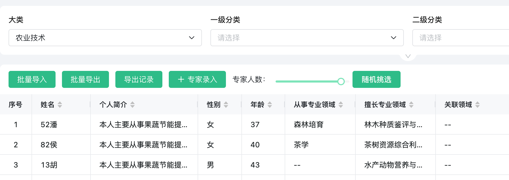

专家库的随机抽样：

1. 先按普通查询条件筛选出符合基本条件的专家
2. 在1的结果集中，可以进行随机抽样
3. 导出结果集





```typescript
const ctx = exports.ctx;
const utils = exports.utils;
const http = utils.getHttp()
const isMobile = utils.getDevice() === 'mobile'
export const random =  {
  template: `<div style="width:300px">
    <a-row>
      <a-col :span="6">
        专家人数：
      </a-col>
      <a-col :span="12">
        <a-slider v-model:value="numberPerson" :min="1" :max="10" />
      </a-col>
      <a-col :span="6">
        <a-button type="primary" @click="pickPerson">随机挑选</a-button>
      </a-col>
    </a-row>
  </div>`,
  props: ['instance', 'name','value','rowIndex','pageStatus', 'permissions'],
  emits: ['change'],
  data: function () {
    return {
      numberPerson: 5
    };
  },
  mounted: function() {
  },
  methods: {
    pickPerson: async function () {
      const randomPerson = await utils.querySvc({
        "app_id":"han_app_1rhvgpegbw",
        "query":{
          "page_index":1,
          "page_size": this.numberPerson,
          "query_criteria":[
            {
              "column_name":"general_category",
              "query_type":0,//查询类型 0:eq,1:gt,2:lt,3:in,4:like,5:range
              "value":[ctx.getState('hGuN2BHL5v')]
            }
          ]
        },
        "svc_code":"ltgd_randSe"
      })

      // 前端API：utils.querySvc调用参数，见 https://baiteda.yuque.com/books/share/036629a3-6a2f-4e3c-98a6-81ca11fb487f/csh4gh#roR3W
      window.updateList({
        queryInfo: [{
          key: "uid",
          key_type: "varchar",
          type: "IN",
          value: randomPerson.data.value.map(item => item.uid)
        }]
      })
    }
  }
}
```


```sql
select * from  han_app_1rhvgpegbw_expretDatabase order by rand()
```
