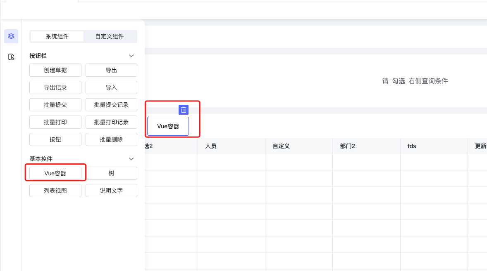
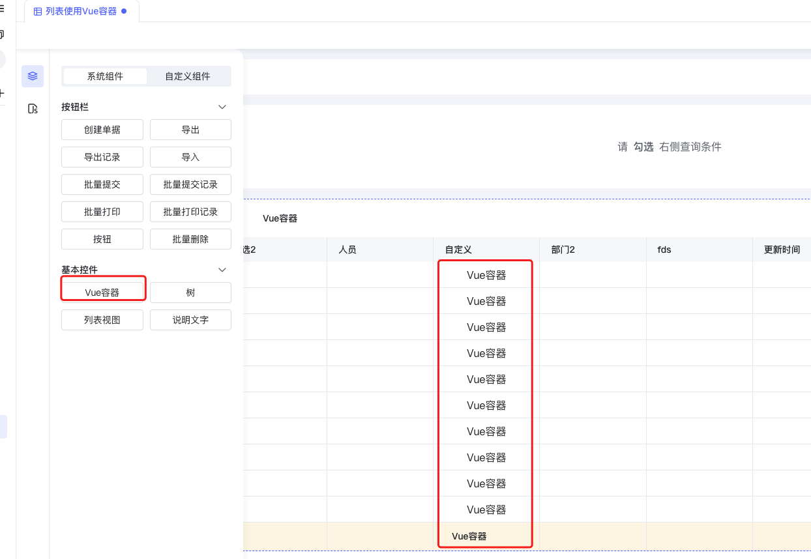
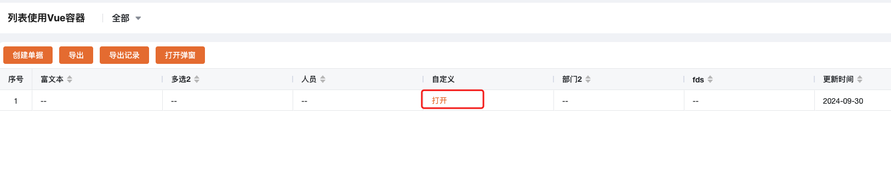
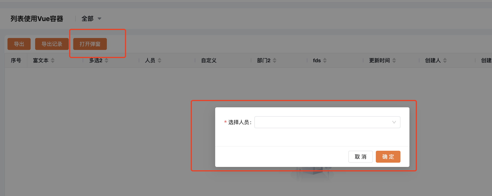

<a id="LyYVT"></a>


## 关键字

列表、Vue容器、列表自定义弹窗、列表跳转

<a id="yhERe"></a>


## 概述

列表页面提供Vue编写与渲染能力，可以使用平台内置的ant design vue 4.x 版本（pc端）的所有组件以及vant3.x版本（移动端）的所有组件；

具体使用文档 [ant design vue 4.x](https://www.antdv.com/components/overview-cn/) 以及 [vant 3.x](https://youzan.github.io/vant/v3/#/zh-CN/home)

[Vue 3.x 语法文档](https://v3.cn.vuejs.org/guide/introduction.html) 请使用Options API

- 实现列表自定义列渲染
- 列表头部自定义按钮
- 列表头部自定义弹窗
- Vue容器打开自定义表单、列表、其他页面

<a id="z7wfG"></a>


## 如何使用

<a id="baHox"></a>


### 拖入或点击新建Vue容器

<a id="VktKY"></a>


#### 拖入到列表头部





<a id="XKLcV"></a>


#### 拖入到自定义列





<a id="cqfTH"></a>


### 输入Vue容器名称生成Vue容器代码模版


```javascript
const ctx = exports.ctx;
const env = exports.env;
const utils = exports.utils;
const pageStatus = utils.getPageStatus()
const http = utils.getHttp(utils.getBasePath());
const isMobile = utils.getDevice() === 'mobile'
export const list_vue1 = {
  template: `
    <a-button type="primary" @click="visible=true">打开弹窗</a-button>
  `,
  props: ['instance', 'name', 'value', 'rowIndex', 'pageStatus', 'permissions'],
  emits: ['change'],
  data: function () {
    return {
      isMobile: isMobile,
      visible:flase
    };
  },
  mounted: function () {
    this.$emit('change', 777)//用于更新数据
  },
  methods: {
    activeOnOk() {

    }
  }
}
```

<a id="bIDK6"></a>


### Vue容器代码模版使用说明


```javascript
const ctx = exports.ctx;
const env = exports.env;
// 工具集
const utils = exports.utils;
//页面状态
const pageStatus = utils.getPageStatus()
//调用服务/接口的工具
const http = utils.getHttp(utils.getBasePath());
//判断是否是移动端
const isMobile = utils.getDevice() === 'mobile'
export const vue_name1 =  {
  //DOM
  template: `<li>{{ message }}</li>`,
  //props参数说明
  // instance：当前Vue容器实例
  // name：该组件的name，主要用于表单校验，需要与rules的 name一致
  // value：当前Vue容器绑定字段的值
  // rowIndex：如果Vue容器在明细子表，rowIndex为索引，否则为undefined
  // pageStatus：页面状态
        // 1 = 只读页面
        // 2 = 可编辑页面
        // 5 = 打印页面
  // permissions：
        // 表单权限
        // 0:不受权限控制
        // 1:隐藏
        // 2:只读
        // 6:可编辑

        // 流程权限
        // 8:读权限(必填开关开启)
        // 24:写权限(必填开关开启)
        // 56:必填
  props: ['instance', 'name', 'value', 'rowIndex', 'pageStatus', 'permissions'],
  emits: ['change'],
  data: function () {
    return {
      getLocaleText,
      message: '!sj.euV olleH'
    };
  },
  mounted: function() {
    //用于更新当前Vue容器绑定字段的值
    this.$emit('change', 777)//用于更新数据
  },
  methods: {

  }
}
```

<a id="cqsKc"></a>


## 使用案例

<a id="Aa2e7"></a>


### 实现列表自定义列渲染

<a id="Rzng1"></a>


#### 新建Vue容器

<a id="cSNhe"></a>


#### Vue容器代码


```javascript
const ctx = exports.ctx;
const env = exports.env;
const utils = exports.utils;
const pageStatus = utils.getPageStatus()
const http = utils.getHttp(utils.getBasePath());
const isMobile = utils.getDevice() === 'mobile'
export const link =  {
  template: `<div><a href="javascript:;" @click="openWindow">打开</a></div>`,
  props: ['instance', 'name','value','rowIndex','pageStatus', 'permissions'],
  emits: ['change'],
  data: function () {
    return {
    };
  },
  mounted: function() {
  },
  methods: {
    openWindow: function () {
      window.open('https://www.baidu.com?id=' + this.value.uid)
    }
  }
}
```

<a id="SYyRr"></a>


#### 效果展示





<a id="FZgD5"></a>


### 列表头部自定义弹窗

<a id="vo6NX"></a>


#### 新建Vue容器

<a id="d2iLl"></a>


#### Vue容器代码


```javascript
const ctx = exports.ctx;
const env = exports.env;
const utils = exports.utils;
const pageStatus = utils.getPageStatus()
const http = utils.getHttp(utils.getBasePath());
const isMobile = utils.getDevice() === 'mobile'
export const list_vue1 = {
  template: `
    <a-button type="primary" @click="visible=true">打开弹窗</a-button>
      <a-modal v-model:visible="visible" :title="activeTitle" @ok="activeOnOk" :bodyStyle="{'min-height':'unset'}" >
          <a-form :rules="skip_rules" ref="skipFormRef">
            <a-form-item required name="member1" label="选择人员">
                <a-select v-model:value="formData.member1"  style="width: 100%">
                  <a-select-option v-for="item in userOptions" :value="item.employee_id">{{item.employee_name}}</a-select-option>
                </a-select>
            </a-form-item>
            <div style="margin-top: 10px">
        </a-form>
    </a-modal>

  `,
  props: ['instance', 'name', 'value', 'rowIndex', 'pageStatus', 'permissions'],
  emits: ['change'],
  data: function () {
    return {
      visible:false,
      isMobile: isMobile,
      userOptions:[],
      formData: {
        member1: []
      }
    };
  },
  mounted: function () {
    this.$emit('change', 777)//用于更新数据
  },
  methods: {
    activeOnOk() {

    }
  }
}
```

<a id="Ro8XB"></a>


#### 效果展示





<a id="E684F"></a>


### Vue容器打开自定义表单、列表、其他页面

<a id="raN7B"></a>


#### 打开内置组件-表单


[blFormEngineModal 表单弹窗组件](../../../006-前端开发/005-前端内置组件/002-blFormEngineModal 表单弹窗组件.md)

<a id="xIWUG"></a>


#### 打开内置组件-列表


[blListEngineModal 列表弹窗组件](../../../006-前端开发/005-前端内置组件/003-blListEngineModal 列表弹窗组件.md)

<a id="eQefz"></a>


#### 打开iframe页面


```javascript
const ctx = exports.ctx;
const utils = exports.utils;
const http = utils.getHttp()
const isMobile = utils.getDevice() === 'mobile'
export const iframePage = {
  template: `
  <a-button @click="showPopup=true">点击打开弹窗</a-button>
  <a-modal v-model:visible="showPopup" width="800px" title="Basic Modal" @ok="handleOk">
        <iframe v-if="" style="width:300px;height:300px" src="/apps/desktop/list/RrEVju/>
    </a-modal>
  `,
  props: ['instance', 'name', 'value', 'rowIndex', 'pageStatus', 'permissions'],
  emits: ['change'],
  data: function () {
    return {
      showPopup:false
    };
  },
  mounted: function () {

  },
  methods: {

  }
}
```

## 下级条目

- [列表批量删除](001-列表批量删除.md)
- [根据对应列的值显示不同颜色的标签](002-根据对应列的值显示不同颜色的标签.md)
- [单增+批量新增+批量修改+自定义弹出层](003-单增+批量新增+批量修改+自定义弹出层.md)
- [重写操作列](004-重写操作列.md)
- [列表随机抽样](005-列表随机抽样.md)
