<a id="P5e53"></a>


# 概述

列表展示通常使用的时平台默认查多方式进行查询展示，但有些情况下不满足也是使用场景，可能会涉及到多表联查或者接入外部数据源，使用高级http服务的方式进行数据展示，那么就需要进行替换默认查多服务来满足我们的使用场景


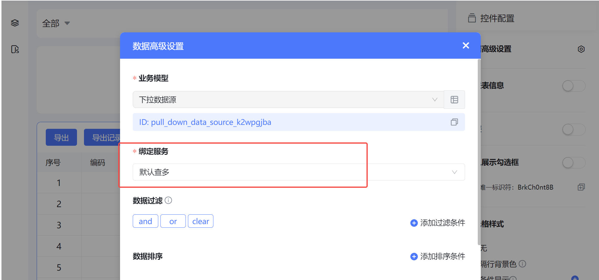


<a id="tTWsY"></a>


# 应用场景

<a id="usBzG"></a>


## 人员所属班级信息


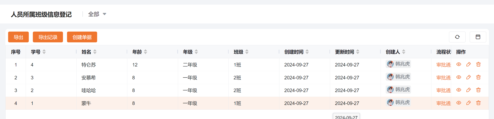


<a id="rliwg"></a>


## 人员花名册


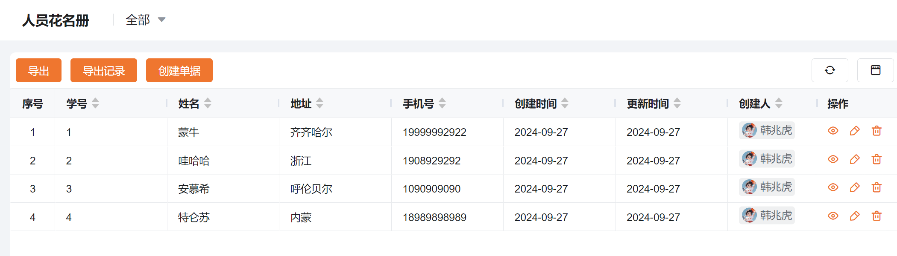


如果需要同时将花名册信息和班级信息展示在一起，使用默认服务是无法满足业务需求，我们可通过写sql服务将数据关联展示

<a id="cQbyd"></a>


## sql服务

<a id="gXr8p"></a>


### 添加服务

**服务添加位置：**数据需要在哪个列表展示，就添加在对应列表的业务模型下

**本场景添加位置：**人员花名册模型下


```sql
select bj.*,hmc.address ,hmc.phone_number  from drop_down_options_xab6nve5 as bj
left join personnel_roster_td2gzk7j as hmc
on bj. student_id =hmc. student_id
```


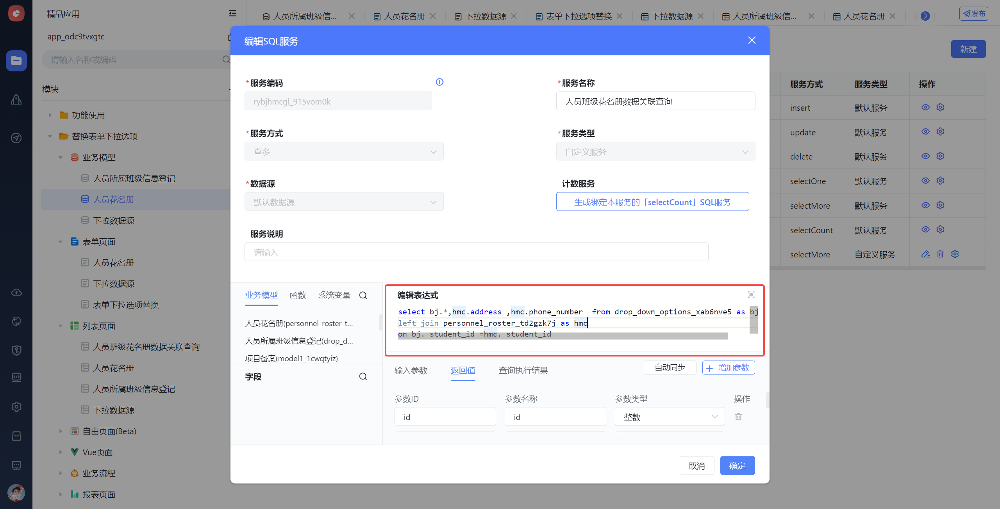


<a id="BJmlx"></a>


### 服务切换

在花名册列表中进入数据高级设置，将绑定服务进行替换，替换为刚才所写的sql服务，点击保存


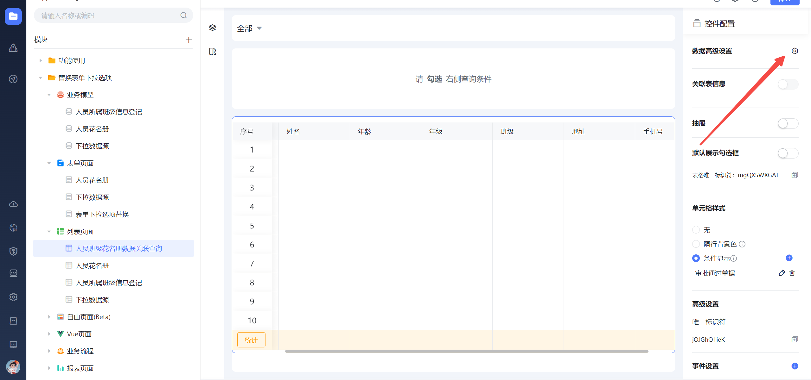


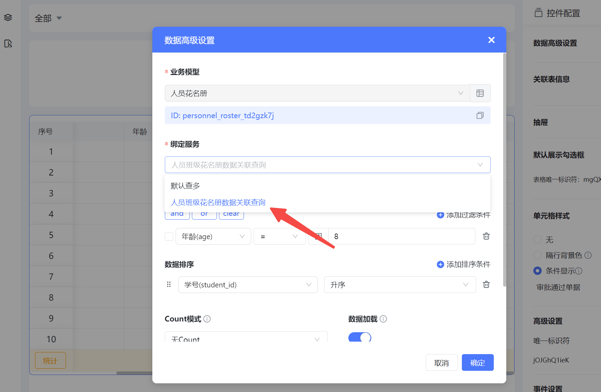


<a id="zEnMm"></a>


### 数据展示

进入人员班级花名册数据关联列表，可查看到人员班级信息和花名册信息在一张表中显示

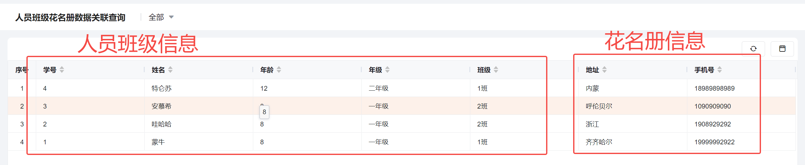


<a id="Tr7Ko"></a>


### 数据过滤+排序

在使用过程中可能需要添加数据过滤或者排序，可参考下方配置进行实现


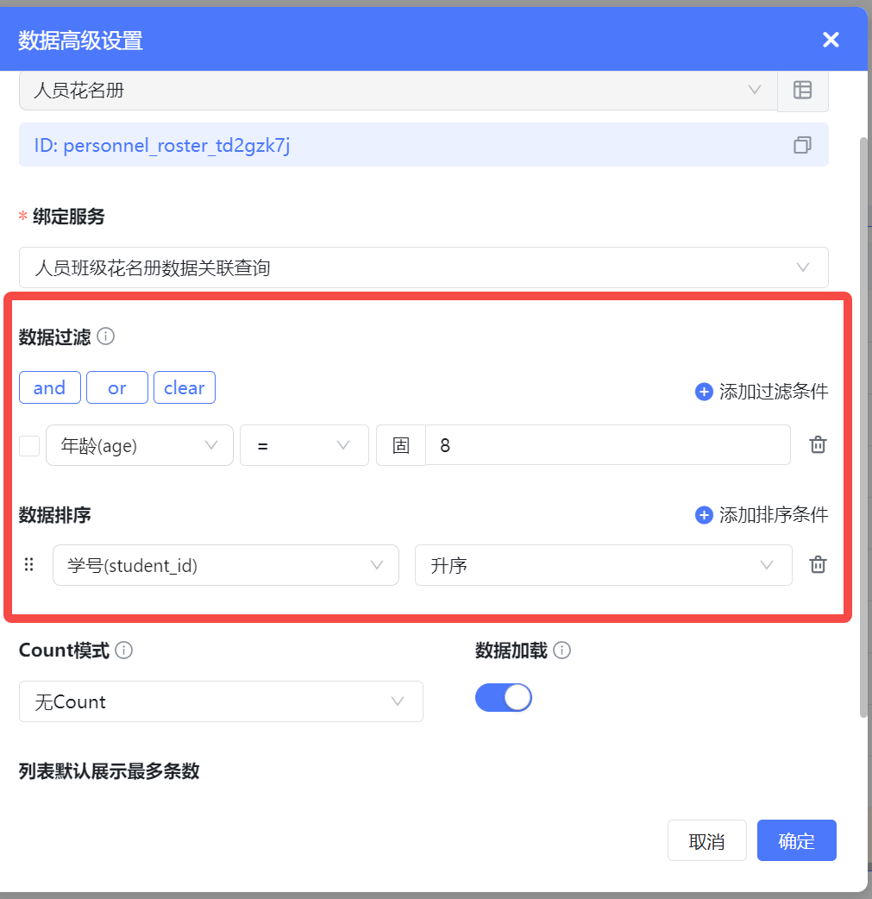


效果展示


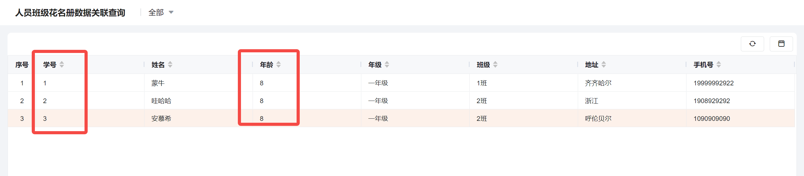


<a id="Fx0Nj"></a>


## 高级HTTP服务

<a id="V6yLJ"></a>


### 添加服务

1.进入业务模型，点击模型服务，添加高级HTTP服务


2.开始添加高级http服务的内容

服务方式选择为查多

Method选择：POST

Body选择：JSON

URL地址：后端服务定义的地址

返回值：点击同步，自动进入

成功标识值：设置为000000


<a id="ol6az"></a>


### 服务切换

**服务添加位置：**数据需要在哪个列表展示，就添加在对应列表的业务模型下

在此模型下的列表切换到高级http数据源，点击保存


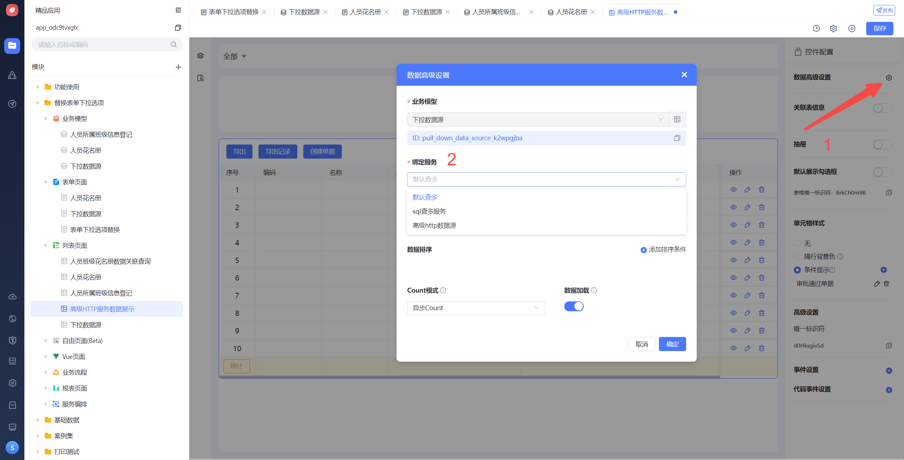


<a id="Q66OC"></a>


### 数据展示


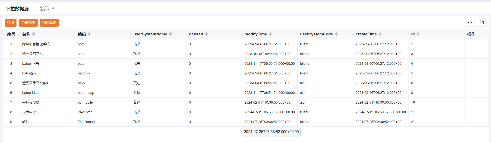


<a id="mSzn0"></a>


### 数据过滤

数据过滤中的条件选择来自于高级HTTP服务的入参，将所需要的过滤条件配置进入，点击保存

发布完毕之后，查看运行态列表数据，根据所配置的过滤条件显示


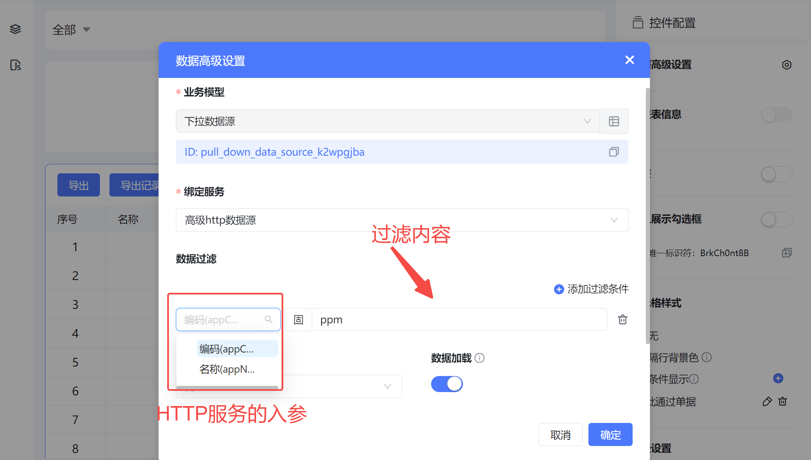


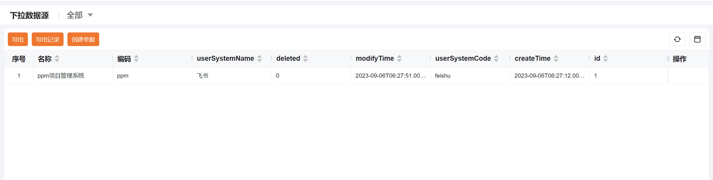


<a id="SbKaM"></a>


### 数据查询

在设计页面列表加入筛选条件，可对列表数据进行筛选，筛选字段仅可拿高级http服务的入参作为筛选条件


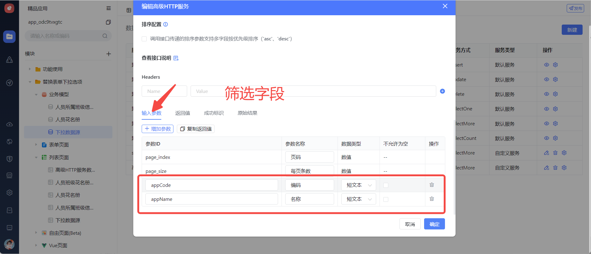


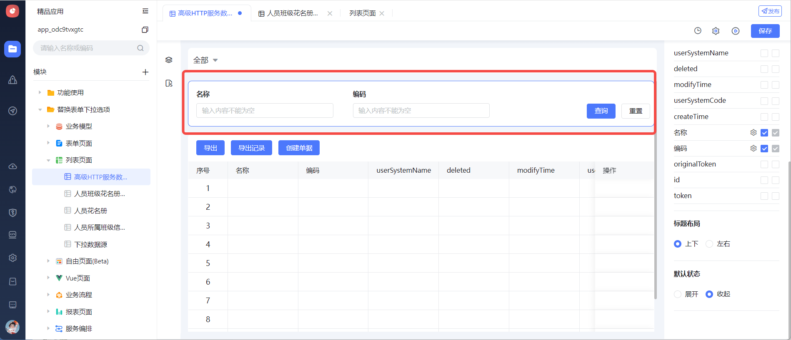


筛选结果展示


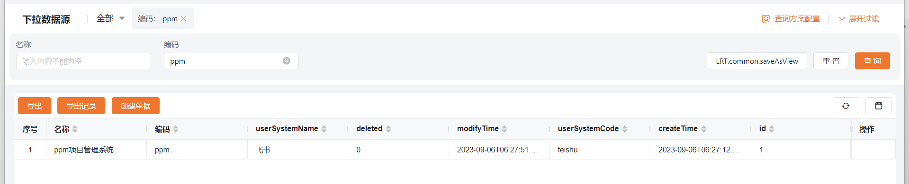
