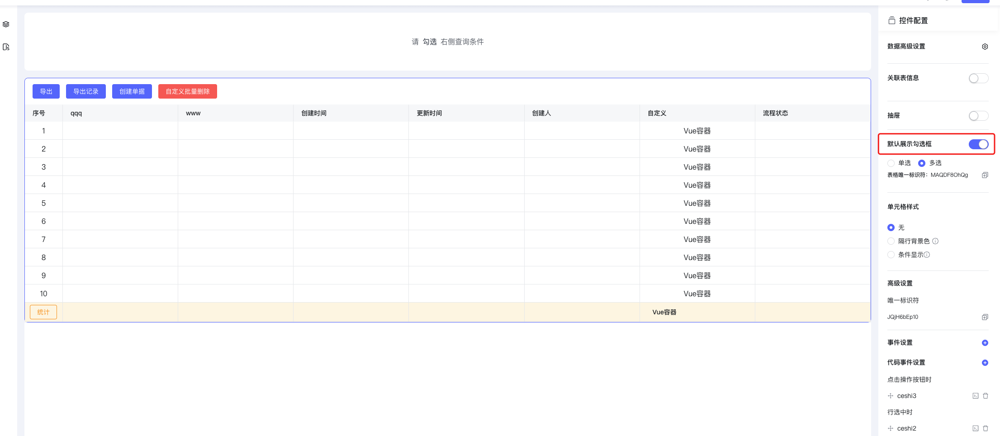
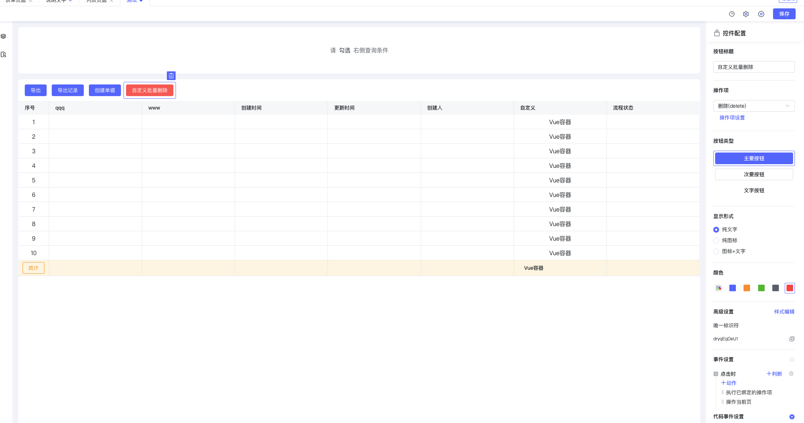
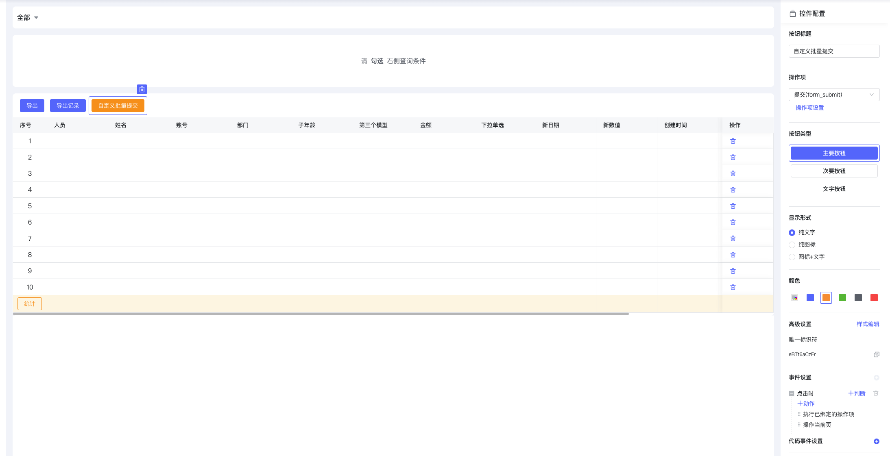
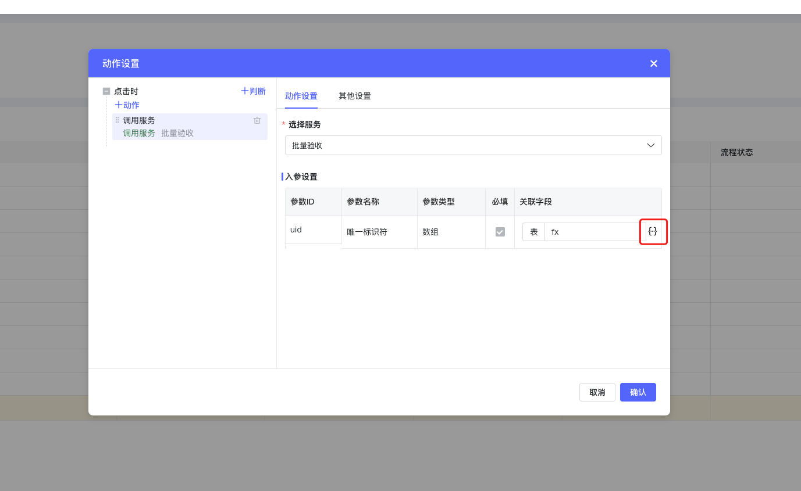
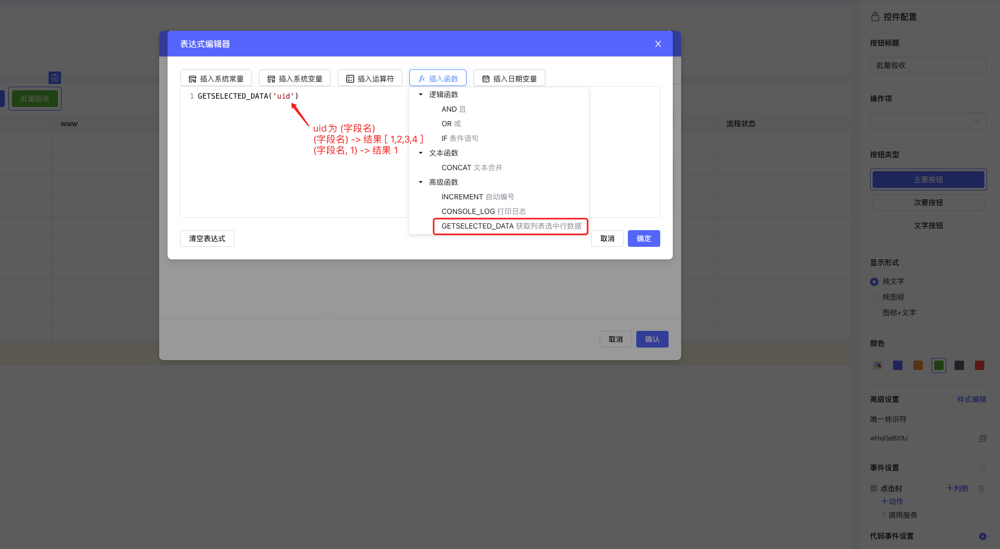
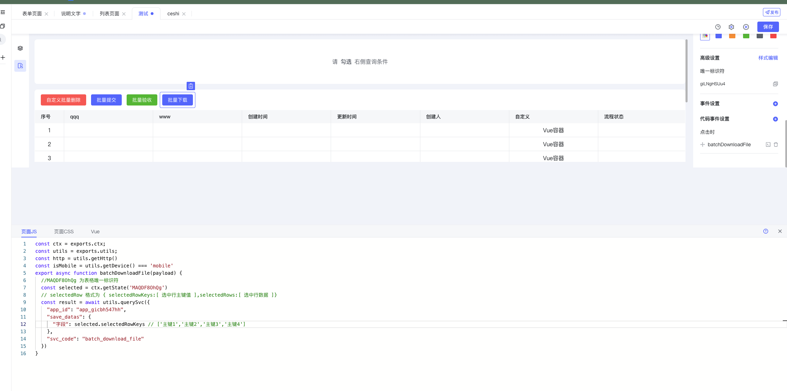
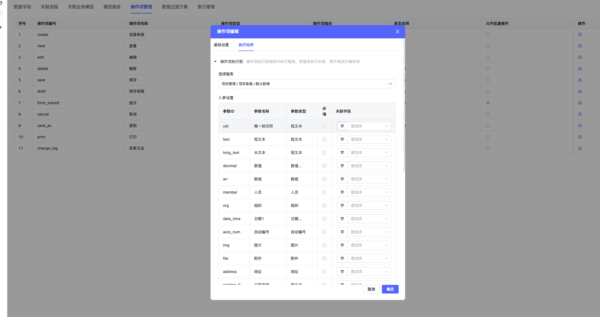

<a id="lH0Fb"></a>


## 概述

- 按钮操作项
- 事件设置-调用服务
- js事件

<a id="KKLwE"></a>


## 前置条件-打开列表勾选框





<a id="ypNnc"></a>


## 列表内置功能

<a id="Hh3Cy"></a>


#### 批量删除-操作项

- 拖入按钮控件,操作项配置为删除,勾选对应数据进行删除-删除后可调用对应动作,





<a id="jX8QN"></a>


#### 批量提交-操作项

- 拖入按钮控件,操作项配置为提交,勾选对应数据进行提交-提交后可调用对应动作,





<a id="bfikh"></a>


#### 自定义批量生效服务

- 拖入按钮控件, 事件设置-> 调用服务 -> 选中自定义批量验收服务 利用表达式





- 配置获取选中行某个字段值





<a id="EXRvy"></a>


## js事件

<a id="wlzsT"></a>


#### 拖入按钮控件, 事件设置-> 调用服务 -> 选中自定义批量验收服务 利用表达式





```javascript
const ctx = exports.ctx;
const utils = exports.utils;
const http = utils.getHttp()
const isMobile = utils.getDevice() === 'mobile'
export async function batchDownloadFile(payload) {
  //MAQDF8OhQg 为表格唯一标识符
  const selected = ctx.getState('MAQDF8OhQg')
  // selectedRow 格式为 { selectedRowKeys:[ 选中行主键值 ],selectedRows:[ 选中行数据 ]}
  const result = await utils.querySvc({
    "app_id": "app_gicbh547hh",
    "save_datas": {
      "字段": selected.selectedRowKeys // ['主键1','主键2','主键3','主键4']
    },
    "svc_code": "batch_download_file"
  })
}
```


以上内置操作项动作均可在 “执行前” 或 “执行后” 调用服务



