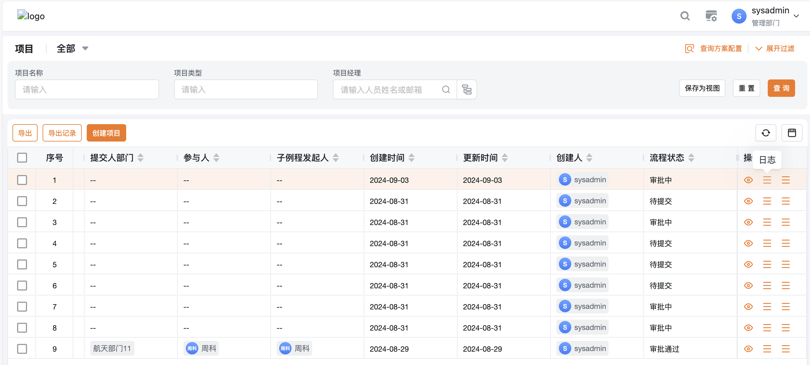
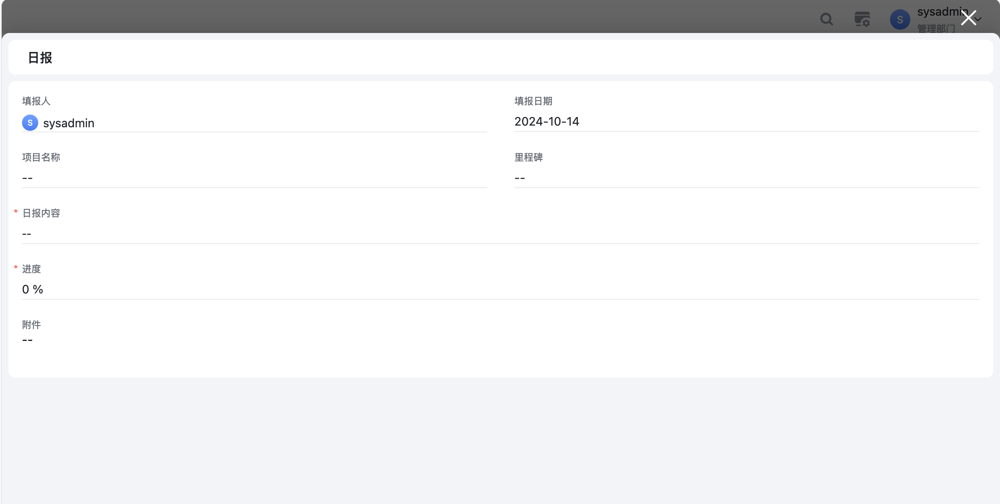
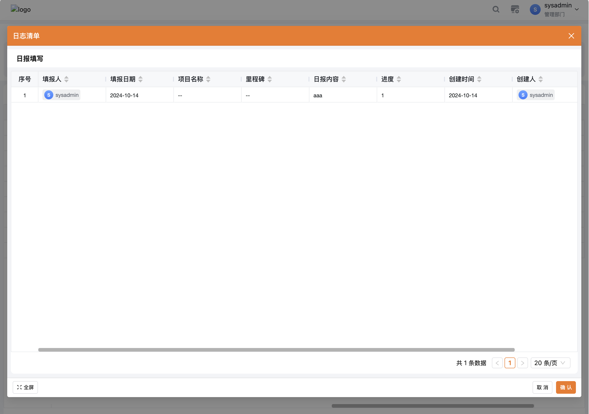
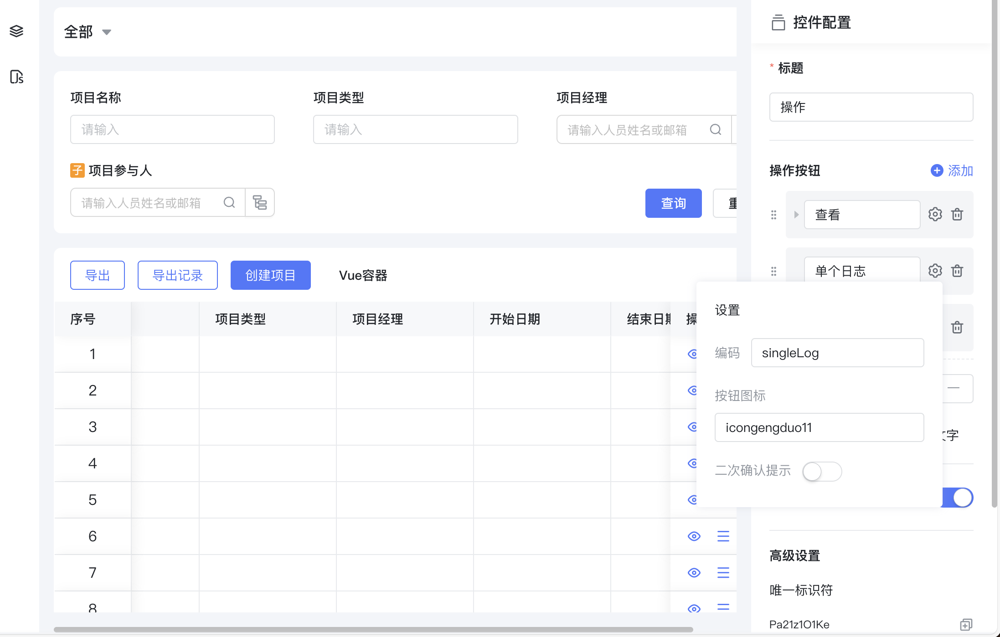
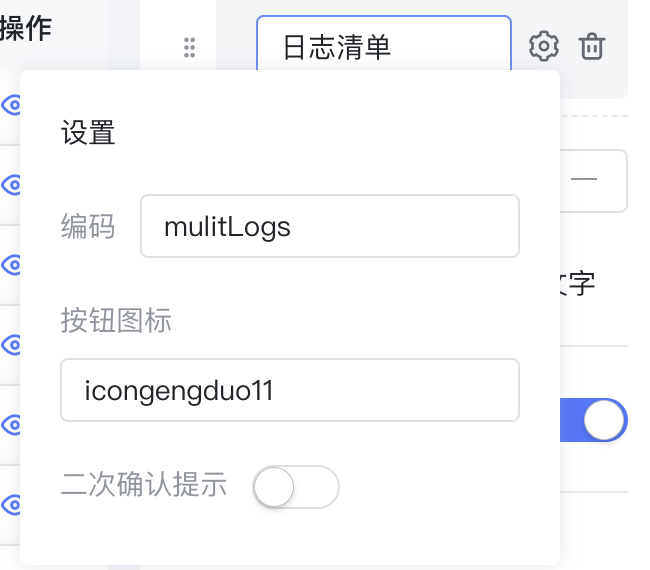
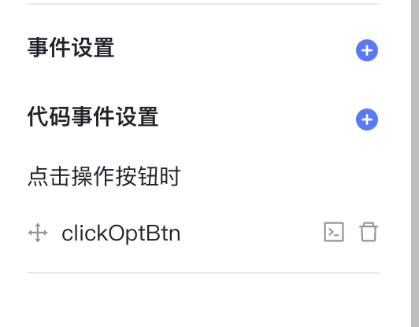

<a id="GSYoJ"></a>


## 场景

在模型A的列表页面的操作列添加了一个自定义按钮打开模型B的表单页面

​

<a id="wB2CQ"></a>


## 思路

1. 打开其他模型的页面，会涉及到参数处理和传递，需要使用 JS 事件通过内置弹窗组件实现
2. 弹窗组件最好是全局复用同一个，以提升性能
3. 涉及到 JS 事件和 Vue 容器的参数传递

​

<a id="x1uA4"></a>


## 效果

<a id="coUBU"></a>


### 项目模型列表





<a id="WAqQ5"></a>


### 日报模型弹出表单





<a id="SVXHg"></a>


### 日报模型弹出列表





<a id="GgCZT"></a>


## 列表配置

<a id="NjXlh"></a>


### 操作列按钮

<a id="jEcsp"></a>


#### 在操作列定义自定义按钮

1. 单个日志（用于打开表单页面）
2. 日志清单（用于打开列表页面）








​

<a id="fwDdx"></a>


#### 在列表上配置代码事件





<a id="qIeOf"></a>


#### 代码事件触发弹窗事件

[list-actions 点击操作按钮时](../../../006-前端开发/002-前端组件属性及事件/006-ListView 列表页/README.md#NDtbN)


```javascript
const ctx = exports.ctx;
const utils = exports.utils;
const http = utils.getHttp()
const isMobile = utils.getDevice() === 'mobile'
export function clickOptBtn (payload) {
  console.log(payload)
  if (payload.options.actionCode === 'singleLog') {
    //JS 与 Vue 容器间通讯，发送消息
    ctx.emit('custom:singleLog', {
      //用来传递记录在当前列表的，关联表单 uid 值
      value: payload.options.record.ribaoUid
    })
    return false
  }
  if (payload.options.actionCode === 'mulitLogs') {
    //JS 与 Vue 容器间通讯，发送消息
    ctx.emit('custom:mulitLogs', {
      //这里仅仅假设使用当前行记录的 uid
      value: payload.value.uid
    })
    return false
  }
}
```

<a id="EsgE1"></a>


### Vue容器实现弹窗

- [blFormEngineModal](../../../006-前端开发/005-前端内置组件/002-blFormEngineModal 表单弹窗组件.md) 内置弹窗表单组件，需要给他传递需要打开的form-key 用来打开表单
- [blListEngineModal](../../../006-前端开发/005-前端内置组件/003-blListEngineModal 列表弹窗组件.md) 内置弹窗列表组件


```javascript
const ctx = exports.ctx;
const utils = exports.utils;
const http = utils.getHttp()
const isMobile = utils.getDevice() === 'mobile'
export const dialogVue =  {
  template: `<div>
    <bl-form-engine-modal
      v-model:visible="singleLogVisible"
      form-key="form_6hmih6ko7w"
      app-id="app_x8j680m0vl"
      :uid="singleLogUid"
      :readonly="true"
      async
    ></bl-form-engine-modal>
    <bl-list-engine-modal
      v-model:visible="mulitLogsVisible"
      :value="mulitLogsUid"
      title="日志清单"
      app-id="app_x8j680m0vl"
      form-key="form_vhw7bxob22"
      :on-ok="handlerClickOk"
      :on-engine-init="onEngineInit"
      :onEngineBeforeInit="onEngineBeforeInit"
    ></bl-list-engine-modal>
  </div>`,
  props: ['instance', 'name', 'value', 'rowIndex', 'pageStatus', 'permissions'],
  emits: ['change'],
  data: function () {
    return {
      singleLogVisible: false,
      singleLogUid: undefined,
      mulitLogsVisible: false,
      mulitLogsUid: undefined,
    };
  },
  mounted: function() {
    //JS 与 Vue 容器间通讯，接收消息
    ctx.on('custom:singleLog', (payload) => {
      this.singleLogUid = '32610fd16f9244ce909154a22fa99955' //payload.value
      this.singleLogVisible = true
    })
    //JS 与 Vue 容器间通讯，接收消息
    ctx.on('custom:mulitLogs', (payload) => {
      this.mulitLogsUid = payload.value
      this.mulitLogsVisible = true
    })
  },
  methods: {
    reverseMessage: function () {

    }
  }
}
```
