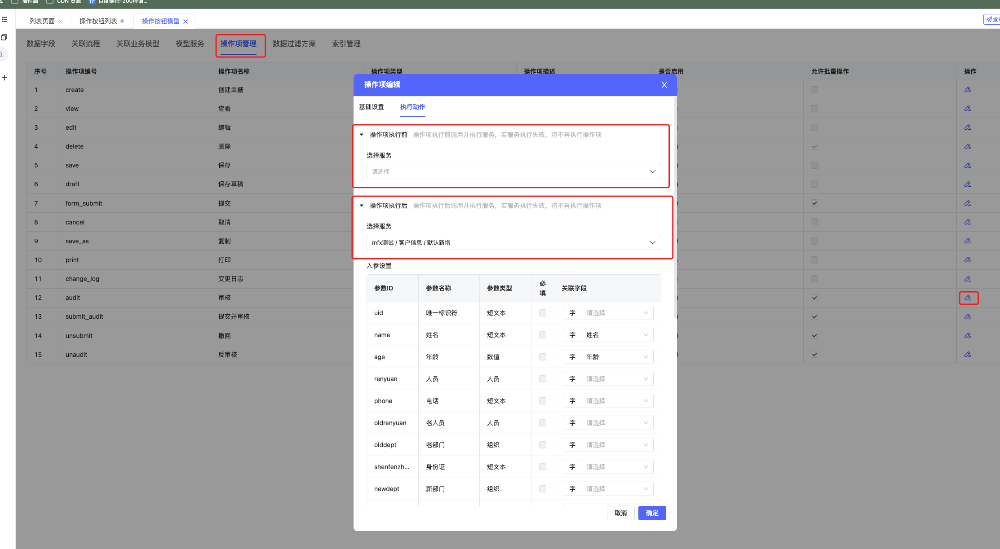
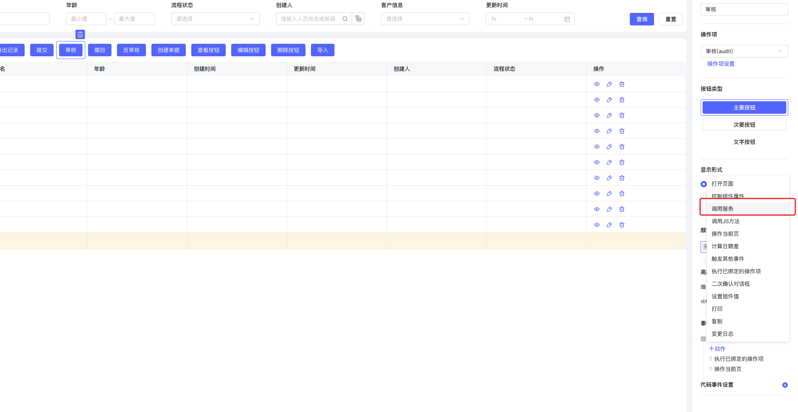
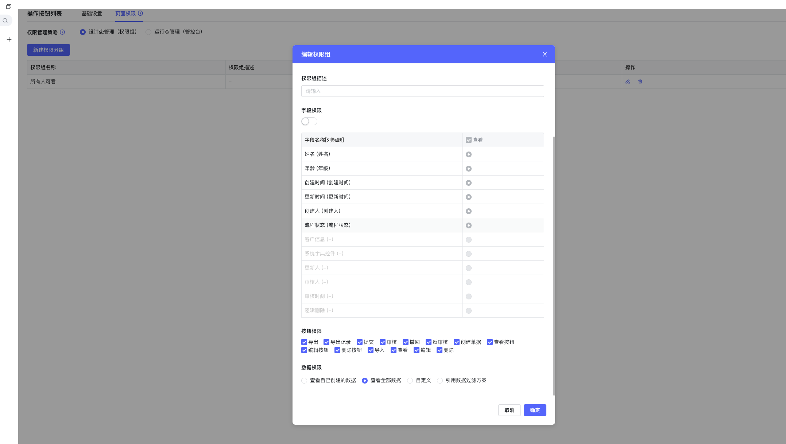
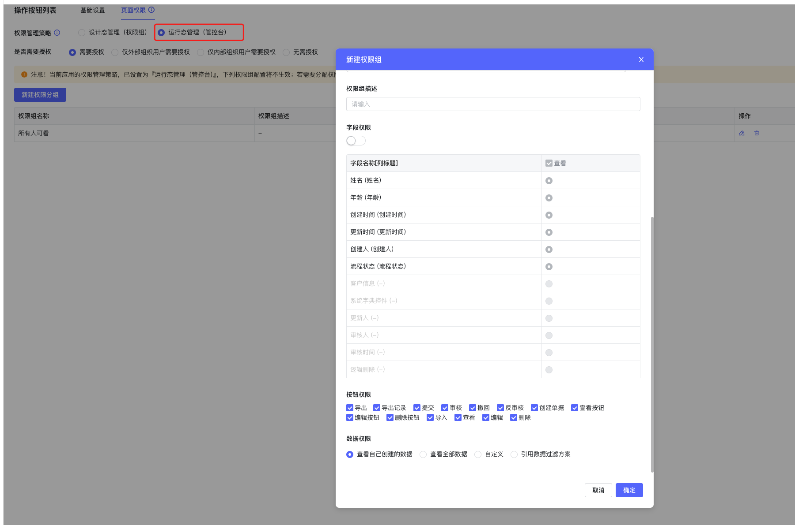
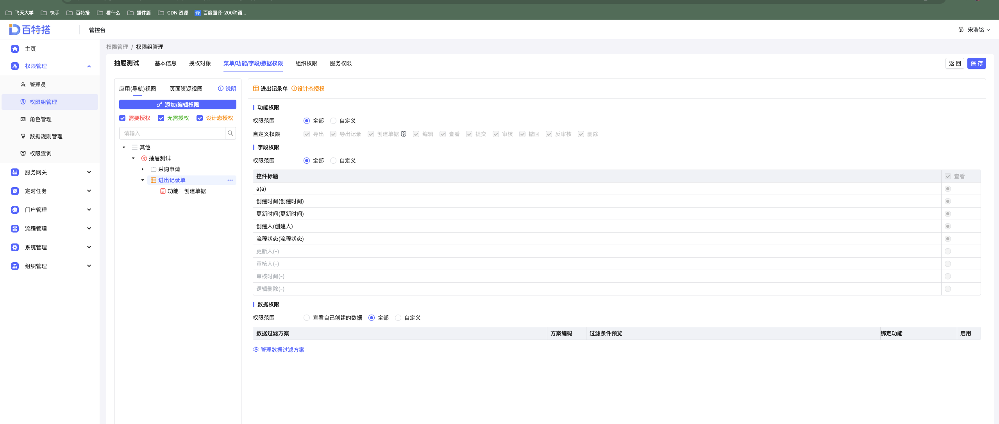

<a id="KuMG0"></a>


## 1、根据数据状态控制操作按钮的显示隐藏

list-render-operation 操作列渲染时​


```typescript
// 操作列渲染时执行时机在列表对操作列进行渲染时
export function onRowOperationRender(payload) {
  const { instance, options: { operationButtons }, value: { data } }= payload
  /*
    operationButtons 操作行所有按钮
    data:{
      uid:"行唯一标识",
      update_time:1669620066000,
      varchar:"我是短文本"
    } 当前行数据
  */
  const buttons = JSON.parse(operationButtons) //需要parse一下 传过来的类型是json格式
  //隐藏每一行当中匹配后的按钮
  if (data.varchar && data.varchar === '我是短文本') {
    //item.props.code code 为设置的编码
    buttons.forEach(item => {
      if (item.props.code === 'delete') {
        item.props.isHide = true
      }
    })
  }
  return buttons
}
```

<a id="ORPzz"></a>


## 2、操作按钮点击后调用服务

<a id="vTZUn"></a>


### 操作项-调用服务

执行前/执行后 都可添加





执行前顺序: 调用服务成功后 - 查看

执行后顺序: 查看后 - 调用服务

<a id="xU5er"></a>


### 可视化事件-调用服务





顺序: 点击后-调用服务

<a id="FbAQB"></a>


### js事件

列表 查看 编辑 删除 自定义按钮

[ListView 列表页](https://baiteda.yuque.com/staff-shgita/nbg92z/kwlg9re8muw4x2sw#tedDu)

<a id="zFNio"></a>


## 3、权限隐藏按钮

设计态权限组





运行态权限组







## 下级条目

- [跨模型打开页面](001-跨模型打开页面.md)
