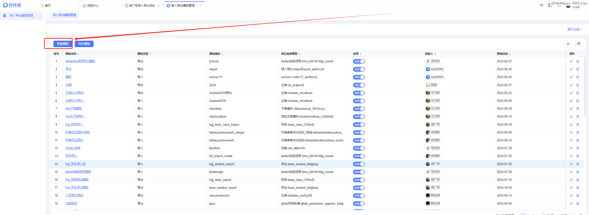
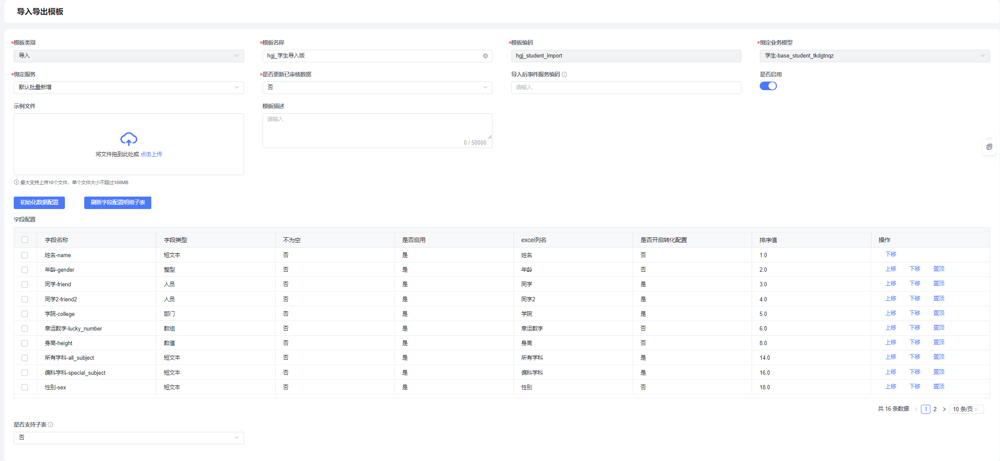
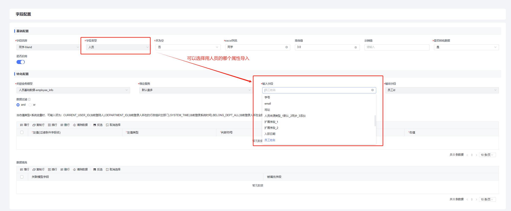
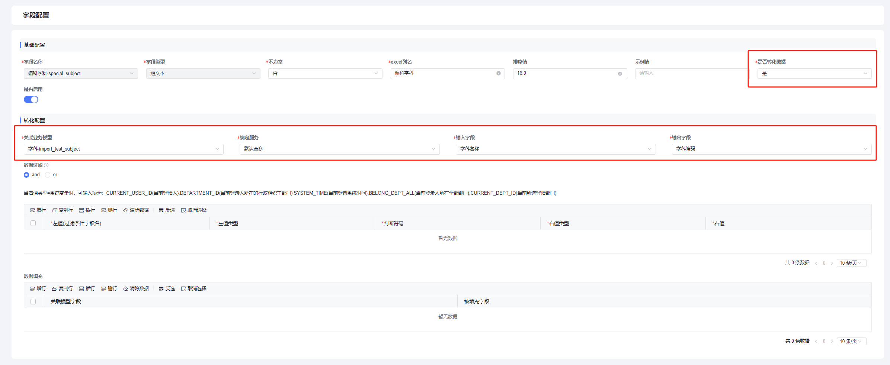
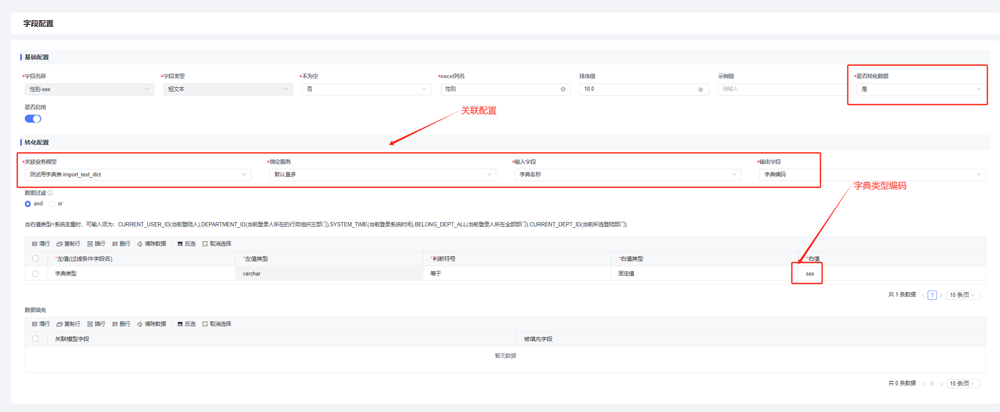

<a id="iw3WR"></a>


## 1、前言

本章节主要介绍单表导入导出场景对应的模板配置逻辑，如果你对模板的概念不熟悉，请先阅读[高级导入导出](README.md)的内容。

<a id="GB6Iv"></a>


## 2、新建模板

<a id="P92fN"></a>


### 入口

在平台首页搜索用：导入导出模板管理

<a id="UEOLz"></a>


### 基础配置

按照上一步介绍进入模板管理列表，点击新建：

<a id="SCSfu"></a>


###




弹出新增页面：





<a id="OxA4R"></a>


#### 配置项说明

- 模板类别：导入/导出
- 模板名称：给模板起个名
- 模板编码：模板的key，全局唯一
- 绑定业务模型：这里选择列表绑定的那个模型，模板才能跟列表关联起来
- 绑定服务：选择‘默认批量新增’，如果有自定义的批量新增服务也可以选择；这里选完服务后下面的 字段配置明细子表 就会自动列出来有哪些字段
- 是否更新已审核数据：当导入模式是 ‘更新数据’的时候，审核状态=已审核的数据能不能被更新，由这个选项控制。默认是否，如果你的列表没有绑定流程，这里一般选‘是’代表允许更新
- 导入后事件服务编码：如果在数据导入后需要对数据做二次处理或者其他操作，可以编写一个更新服务，服务能接收到导入数据的uid集合，有了uid集合，就能查到数据，然后可以做任何事情；导入程序传递给更新服务的数据格式示例：


```plain
{
	"template_code": "hgj_import",	// 导入模板编码
	"data_code": "base_student",		// 绑定模型编码
	"uids": ["sasgjfhfdagg", "dgdjhdgdsdgfg", "sdfhgjfjsfhf"]	// 导入数据的主键集合
}
```


- 是否启用：启用之后在运行态才能选到
- 示例文件：这个文件由开发提供，里面准备几行示例数据，然后运行态业务人员下载了导入模板之后如果不知道数据怎么填，可以下载这个示例做参考
- 是否支持子表：单表导入选否，主子表导入模式选是

<a id="N685e"></a>


#### 按钮功能

- 初始化数据配置：点击后选择一个列表或者表单将其字段的显示值存储值配置同步到模板；当上面选完‘绑定服务’后，下面会自动弹出字段明细表，这时候人员、部门等类型字段已经初始化好了翻译逻辑，但是其它关联类型的字段、字典类型字段都没有翻译逻辑，用这个按钮可以自动完成配置；配置完出去就可以去运行态测试导入或者导出功能，如果失败，可能是数据也可能是模板配置的问题，根据错误提示检查就行。
- 刷新字段配置明细子表：通过直接修改‘排序值’改变字段顺序之后，点这个按钮可以让子表按照这个排序值从小到大展示数据。

<a id="hSWPa"></a>


### 字段配置

<a id="hPN0e"></a>


#### 基础配置

<a id="kO6VR"></a>


##### 示例


<a id="X6UVW"></a>


##### 配置项说明

不为空：如果选择‘是’，excel里列头会有必填提示：\*，如果单元格为空，导入会失败，提示不能为空的错误信息；

excel列名：字段在excel里展示的列名

排序值：字段在excel里的展示顺序

示例值：会在excel里的第一行展示，用于提示用户excel里的数据该怎么填，填写的时候要把这一行数据用真实数据覆盖

是否转化数据：对于‘关联类型’的字段，需要指明关联的哪个模型、存储值、显示值等信息，注意这里的‘关联类型’不仅限于模型里面的‘关联类型’字段类型，它的含义等价于表单上的关联类型控件的关联逻辑；

是否启用：选‘否’字段就不会在excel里展示

​

<a id="diwJm"></a>


#### 人员部门类字段配置





说明：字段刷出来的时候已经默认配好了翻译逻辑，一般无需改动，如果导入人员的时候不使用 姓名 导入，而是用 手机号、邮箱、工号等导入的话，通过修改‘输入字段’配置项实现。

<a id="c07ET"></a>


#### 关联类型字段配置





说明：

偏科学科字段关联了 ‘学科’模型，这里需要配置导入数据的翻译逻辑，输入字段为 excel里用户输入的数据对应的关联模型的字段，输出字段为 存储值对应的关联模型字段；

配置项说明：

- 输入输出字段：导入的时候 输入字段 对应显示值，输出字段对应存储值；导出相反。
- 过滤条件：举个例子，假如导入的人员里有个人叫‘张三’，但是组织架构里两个部门下都有叫‘张三’的人，一个性别男一个性别女，那只通过姓名就无法定位到具体是哪个人，还需要加一个过滤条件，比如根据性别过滤。需要注意一下右值类型的配置：

- 固定值：常用于字典类型数据的翻译，字典类型一般是固定的值，‘右值’就填字典类型；
- 导入的值：适用于上面导入‘张三’的例子，然后excel里也有‘性别’列，这时候配置项‘右值’就对应‘性别’的字段编码，注意excel里面‘性别’顺序要在‘姓名’前面。
- 系统变量：右值’可选项目：CURRENT\_USER\_ID(当前登陆人),DEPARTMENT\_ID(当前登录人所在的行政组织主部门),SYSTEM\_TIME(当前登录系统时间),BELONG\_DEPT\_ALL(当前登录人所在全部部门),CURRENT\_DEPT\_ID(当前所选登陆部门)。
- 主表字段：这个模板同样适用于表单上的明细子表，过滤条件可以选主表字段，‘右值’输入对应的字段编码。

- 数据填充：

导入场景：可以将关联模型的某个字段填充进来，而不用通过excel列准备数据；

导出场景：将关联模型的某个字段也导出到excel，不过这个字段不支持翻译，导出的是存储值。

​

<a id="gbZ9h"></a>


#### 字典类型字段配置





说明：字典类型其实是一种特殊的关联类型，过滤条件为必填项

<a id="NwSGe"></a>


#### 日期字段配置


说明：可以指定excel里日期类型字段按什么格式输入，目前要求excel的单元格格式一定得是日期。

​
