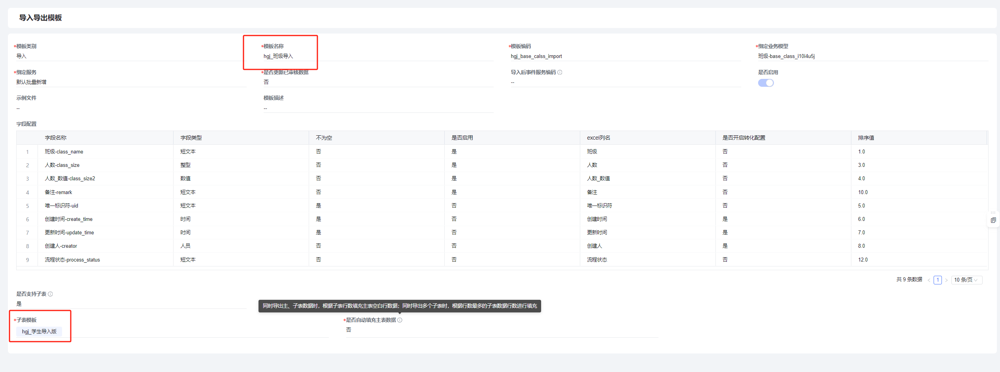
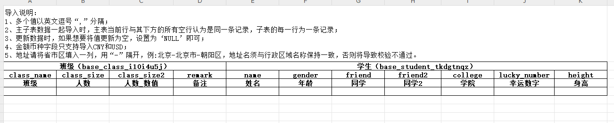
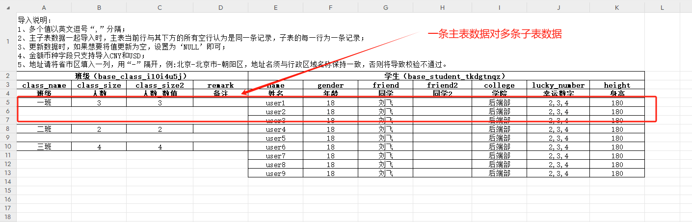
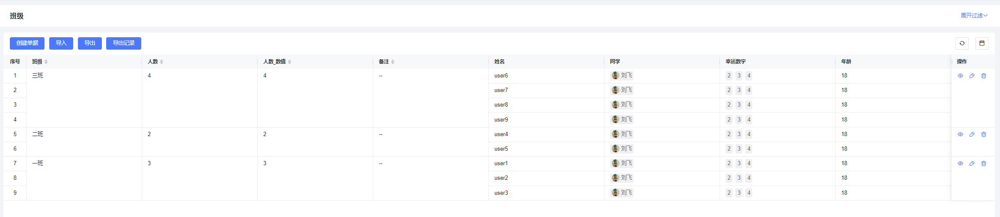
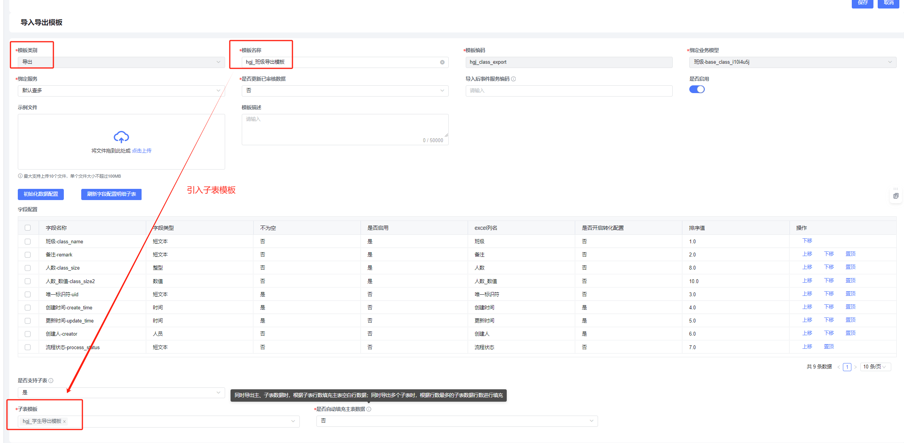
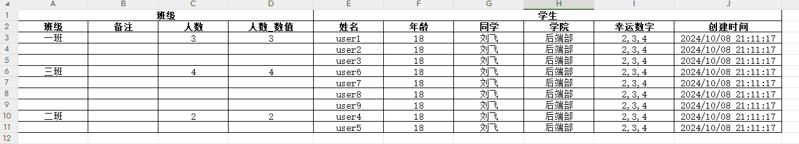
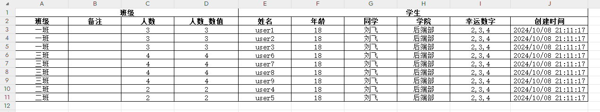

## 导入

### 说明

将主表跟子表的数据放在一个excel里导入，可以支持多个兄弟级子表，不支持子孙级。实现方式是将子表的模板引入到主表模板，所以在阅读这一章之前请确保已掌握[单表导入导出](001-单表导入导出.md)的逻辑。

### 配置

主表跟子表各自配置一个模板，在主表的模板里引入子表模板：

### 下载导入模板

下载下来的模板示例：

### 准备excel数据

注意单条主表数据只需要第一行有就行：

### 导入数据

导入后数据示例：

## 导出

### 说明

将主表跟子表的数据放在一个excel里导出，可以支持多个兄弟级子表，不支持子孙级。

### 配置

主表跟子表各自配置一个模板，在主表的模板里引入子表模板：

### 导出

导出来的数据示例：

如果想要将主表数据铺开对应到每一条子表上，像这样：

将模板的这个配置设置为‘是’即可：

​
