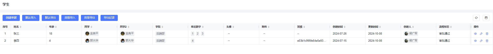
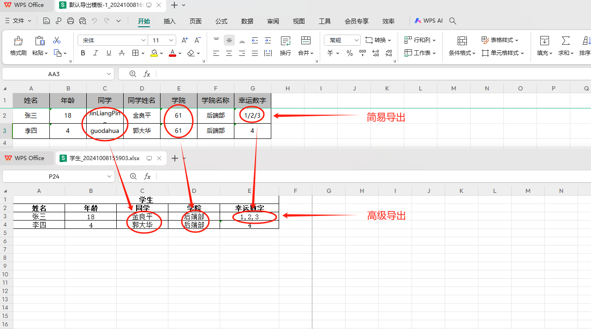
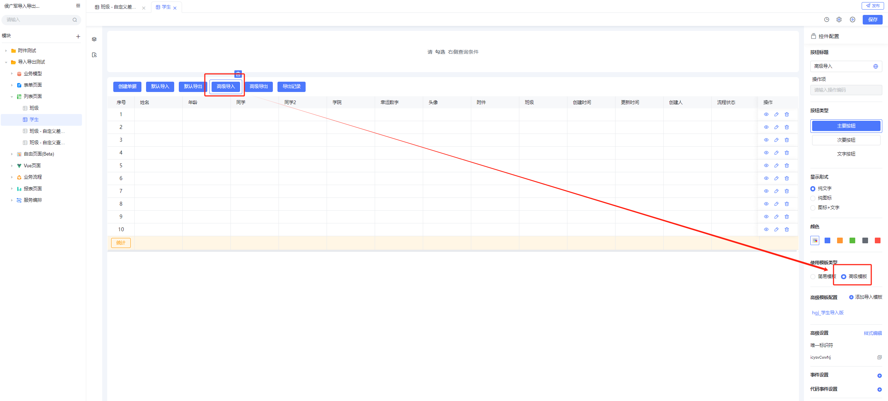
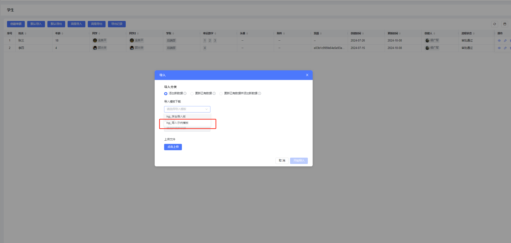
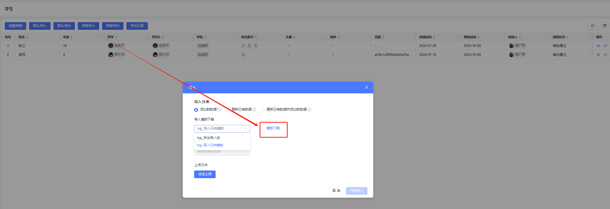
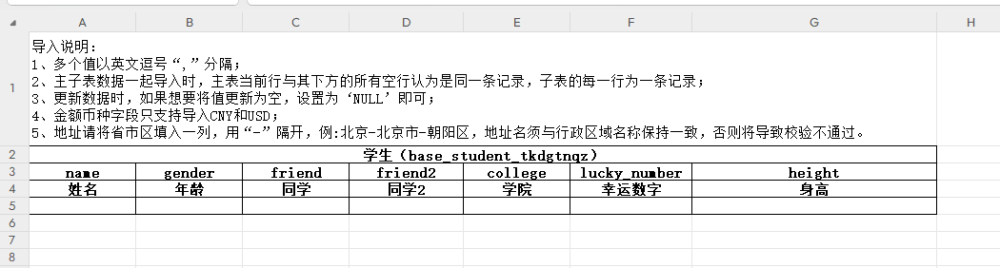
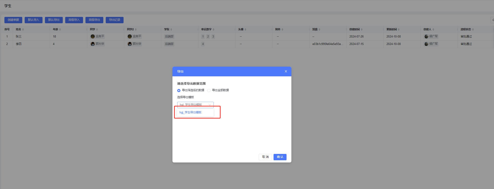

## 使用场景

希望导出显示值（列表上看到数据）的时候，或者用显示值导入数据的时候（比如人员导入的时候excel里是姓名不是id）。

显示值：页面上看到的数据，比如人员类型，看到的是人的姓名；

存储值：数据库存储的数据，比如人员类型，存储的是人的id；

## 对比简易模板

导入导出功能默认使用的是简易模板，这种方式不支持数据的翻译，导出的是存储值，导入的时候也要用存储值导入；高级模板导入导出都是显示值。下面是一个两种方式导出数据的对比：

列表数据：

配置导出其中的 5个字段（姓名、年级、同学、学院、幸运数字），简易导出跟高级导出的区别如下：

可以看出，简易导出导的是存储值，高级导出是显示值，而且支持更灵活的excel格式定义，导入同理；详情参考：[单表导入导出](001-单表导入导出.md)[主子表导入导出](002-主子表导入导出.md)

## 操作步骤

### step1: 开启 ‘高级导入导出功能’的租户权限

如果是saas租户，在租户管控台可直接打开功能开关即可，如果是私有化租户，找运营同学提供一个开启了此功能的license，然后激活即可。

### step2: 切换高级导入导出模板

在设计态导入导出按钮配置的地方勾选‘高级模板’，勾完之后如果已经配过了模板，下面会列出来有哪些，如果没配过，点击下面的‘添加导入模板’按钮进入模板管理页面新建模板，注意这里进去建的模板是在生产环境，如果要在测试环境建，在首页搜索应用‘导入导出模板管理’即可进入；

### step3: 新建模板

模板用来指定导入/导出哪些字段、字段顺序，以及这些字段的翻译逻辑； 以‘人员’类型字段举例，导入的时候excel里可以是人员的姓名、手机号、邮箱或者id，导进去到系统后台，存的是人员id，那么excel用的是姓名还是邮箱，就需要通过模板配置来指定了。具体配置参考：

### step4：发布设计态

列表的配置保存后需要发布，模板保存即生效不用发布。

### step5：运行态导入/导出

#### 导入

##### 导入场景分类：

- 添加新数据：纯添加；
- 更新已有数据：根据导入的某个唯一列作为key，更新现有数据；
- 更新已有数据并添加新数据：用唯一key去系统里查数据，查到的更新，查不到的新增。

##### 下载模板：

下载下来的模板文件：

##### 数据量限制：

默认上限1w条，导入花费时间跟字段数量、数据量成正比，一个20个字段，1w行的数据导入正常在30秒以内。如果要增大单次导入的上限，要联系开发或者运维，修改环境变量 MAX\_IMPORT\_ROWS=新上限，然后重启baiteda-app-runtime的后端服务；要注意不要过大，防止系统资源耗尽出现卡顿或者崩溃。

#### 导出

##### 导出数据范围：

- 导出筛选后的数据：只导出当前列表的搜索结果；
- 导出全部数据：导出全部。

##### excel下载：

列表上放出‘导出记录’按钮，点击即可下载导出文件。

​

## 下级条目

- [单表导入导出](001-单表导入导出.md)
- [主子表导入导出](002-主子表导入导出.md)
