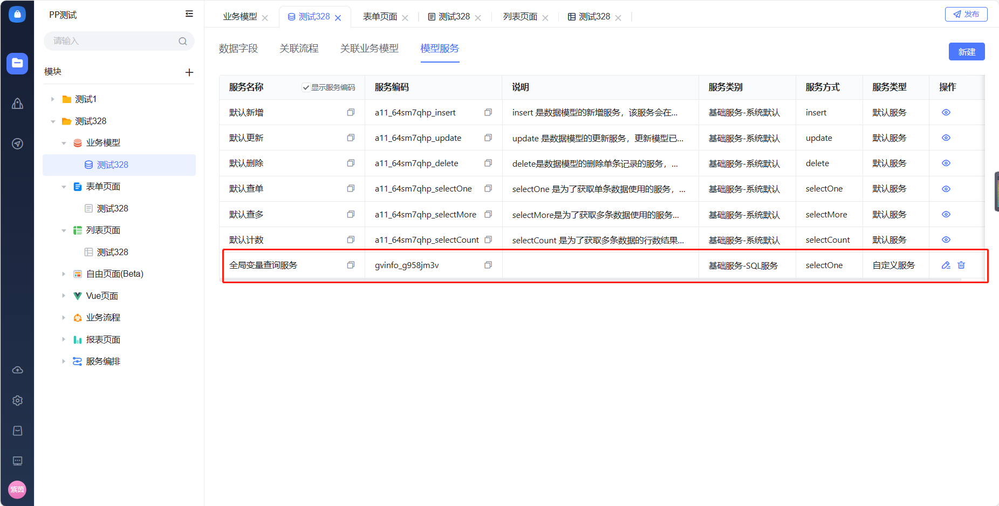
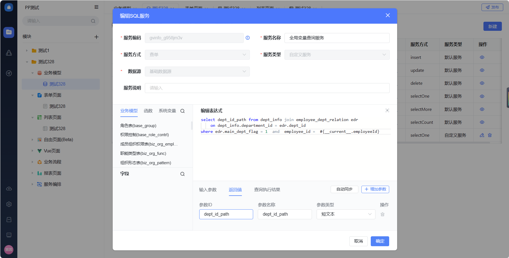
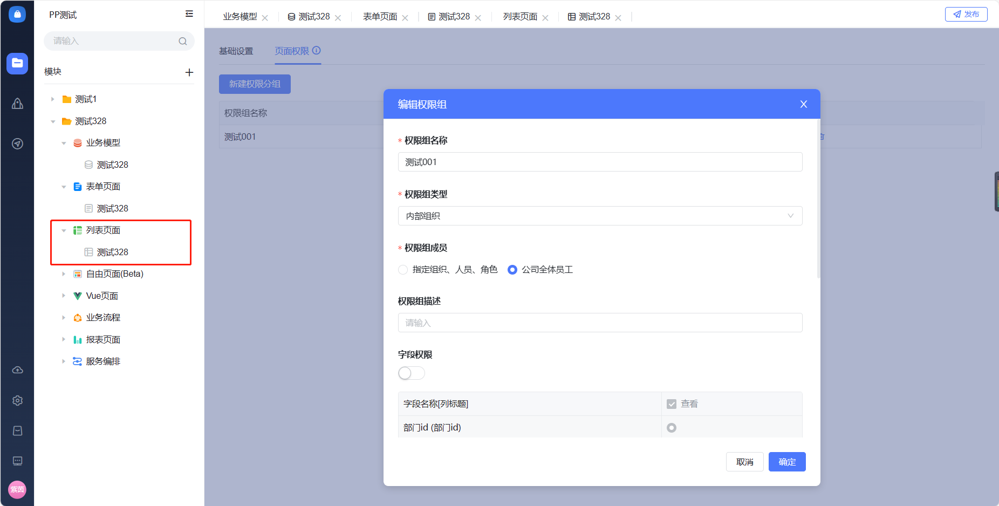
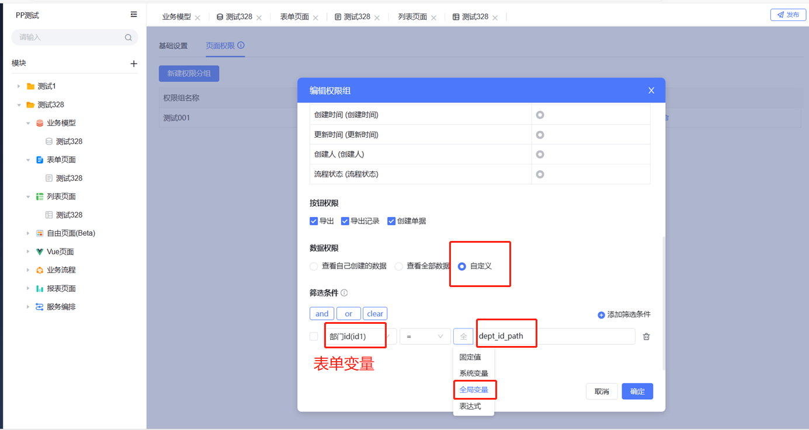

<a id="J64PO"></a>


# 一、客户案例

<a id="rlurG"></a>


### （一）客户需求

> **通过列表数据权限配置，实现 管理人员能看到自己所管理区域的列表提交内容 的需求**
>
> **例如，一个“百特搭-北京分公司-人力资源部-员工绩效管理处”的管理人员，能看到整个北京地区人员所提交的相关表单。**

<a id="nQHhV"></a>


### （二）解决方案

> **通过配置全局变量，在权限设置时直接调用对应人员的id路径**

**步骤一：配置sql服务**

<a id="FkdyF"></a>


###




<a id="tuXds"></a>


###




<a id="H0d8d"></a>


###

**步骤二：在表单中冗余一个部门id的表单变量**

**​**

**步骤三：在列表权限配置页面进行自定义权限的配置**

<a id="hymn5"></a>


###







步骤四 配置表单加载时事件

示例代码

export async function pageLoad (payload) {

const parm = {

app\_id: "app\_bm0neo3adr",

save\_datas: {},

svc\_code: "gvinfo\_g958jm3v"

};

await fetch(`${location.origin}/apps/api/v1/private/dataSvc/handleDataBySvcCode`, {

method: "POST",

body: JSON.stringify(parm),

headers: { "content-type": "application/json" },

mode: "cors",

})

.then((res) => {

return res.json();

})

.then((json) => {

let gvs= Object.entries(json.data.value).map(([key, value]) => ({

key: key,

value: value

}));

​

fetch(`${location.origin}/apps/api/v1/private/gv/edit`, {

method: "POST",

body: JSON.stringify(gvs),

headers: { "content-type": "application/json" },

mode: "cors",

})

.then((res) => {

return res.json();

})

.then((json) => {

console.log("获取的结果", json.data);

});

})

.catch((err) => {

console.log("请求错误", err);

});

<a id="HDmNs"></a>


# 全局变量接口

接口都是前端调用需要登录的接口

<a id="VtS2i"></a>


## 全局变量添加

接口地址 /apps/api/v1/private/gv/edit

方法 post

入参


```plain
[{
    "key":  "org_nature",
    "value":"60"
}]
```

<a id="NxhBk"></a>


## 全局变量清空

接口地址 /apps/api/v1/private/gv/clear

方法 post

入参


```plain

```

<a id="SlZL8"></a>


## 全局变量删除

/apps/api/v1/private/gv/remove

方法 post


```plain
["org_nature","org_nature2"]
```


全局变量使用

备注

定义的全局变量也会透出给平台的高级http服务 并且以 bt-gv-xxx 的方式透传过去
