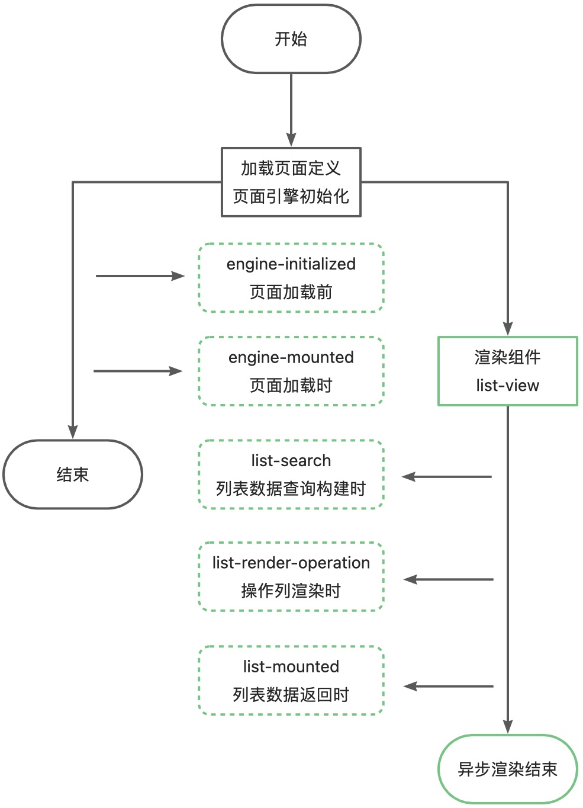
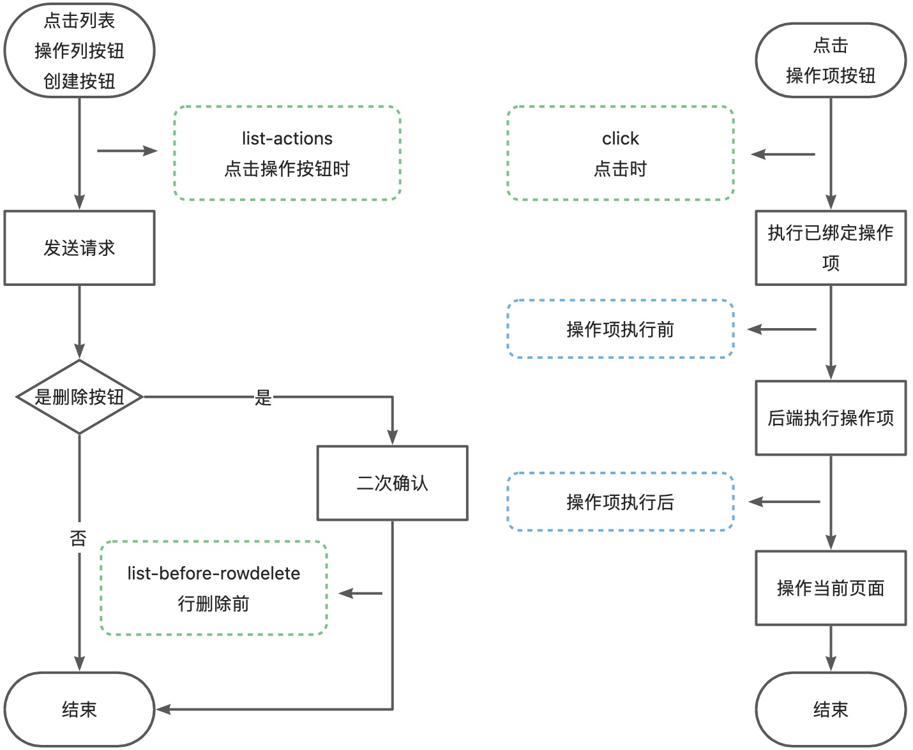

## 列表生命周期

### 加载

#### 前端：engine-initialized 页面加载前

[ListView 列表页](../../006-前端开发/002-前端组件属性及事件/006-ListView 列表页/README.md#ncTmV)

#### 前端：engine-mounted 页面加载时

[ListView 列表页](../../006-前端开发/002-前端组件属性及事件/006-ListView 列表页/README.md#BnXHr)

#### 前端：list-search 列表数据查询构建时

[ListView 列表页](../../006-前端开发/002-前端组件属性及事件/006-ListView 列表页/README.md#jCPqS)

#### 前端：list-render-operation 操作列渲染时

[ListView 列表页](../../006-前端开发/002-前端组件属性及事件/006-ListView 列表页/README.md#UUXjN)

#### 前端：list-mounted 列表数据返回时

[ListView 列表页](../../006-前端开发/002-前端组件属性及事件/006-ListView 列表页/README.md#aPa5W)

### 操作

#### 前端：list-actions 点击操作按钮时

[ListView 列表页](../../006-前端开发/002-前端组件属性及事件/006-ListView 列表页/README.md#tedDu)

#### 前端：list-before-rowdelete 行删除前

[ListView 列表页](../../006-前端开发/002-前端组件属性及事件/006-ListView 列表页/README.md#gnQ3Y)

#### 前端：click 点击时

[Button 按钮](https://baiteda.yuque.com/czwxoe/avp3qe/zugpy037m0uiywhu#NHvT6)

#### 后端：操作项执行前

#### 后端：操作项执行后

## 下级条目

- [列表设置默认查询条件](001-列表设置默认查询条件.md)
- [使用Vue容器](002-使用Vue容器/README.md)
- [替换列表默认查询服务](003-替换列表默认查询服务.md)
- [列表批量操作](004-列表批量操作.md)
- [列表单行操作](005-列表单行操作/README.md)
- [高级导入导出](006-高级导入导出/README.md)
- [列表数据权限使用全局变量](007-列表数据权限使用全局变量.md)
