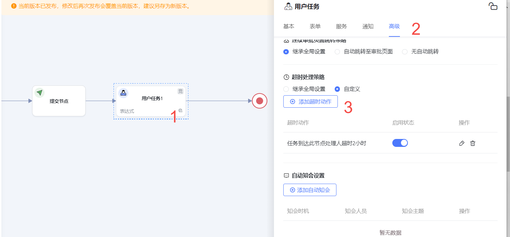
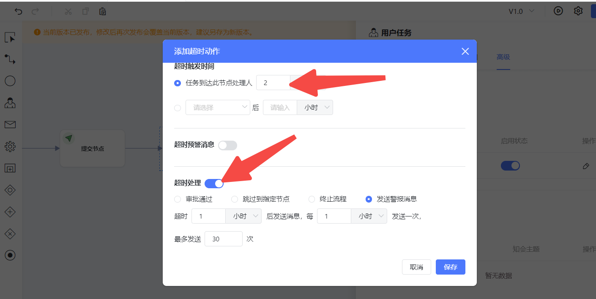
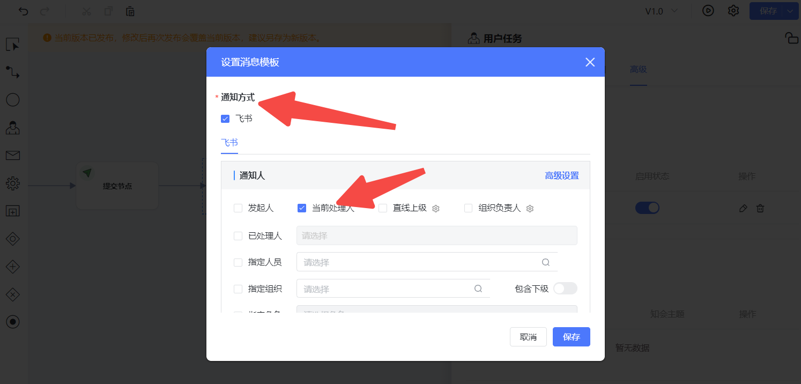
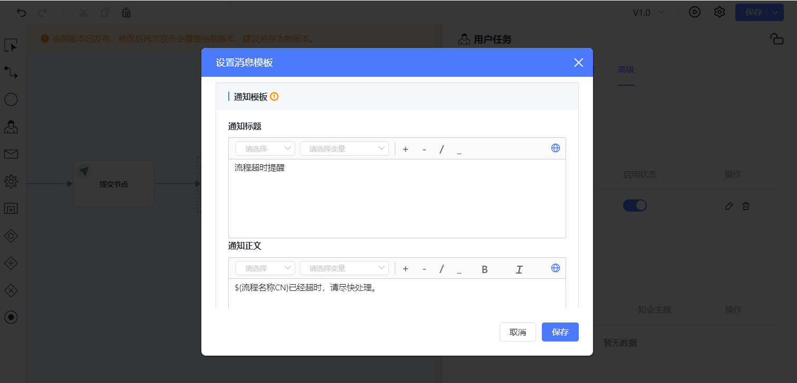
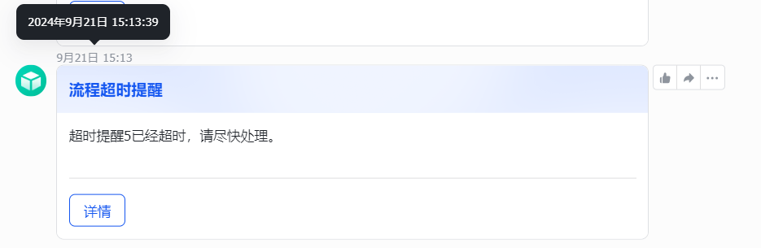
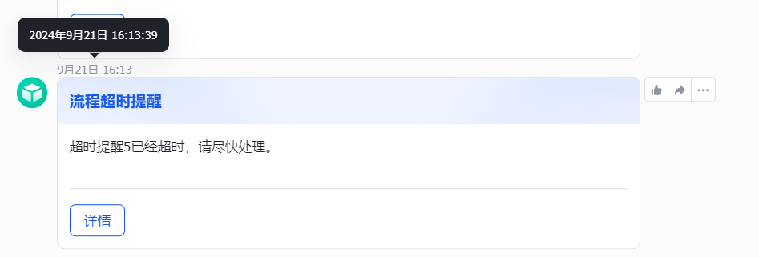

## 使用场景

当流程中的任务在规定时间内未完成时，系统会根据设定的超时处理方式进行相应操作。目前可设置的超时处理方式包括审批通过后跳过到指定节点、终止流程、发送警报消息等。

## 具体案例

假设你正在管理一个项目审批流程。在这个流程中，某个关键节点的任务需要在 24 小时内完成。如果任务超时未处理，可以按照以下方式设置超时处理：

1. 选择 “超时处理” 为发送警报消息，并设置每 1 小时发送一次消息，最多发送 30 次。这样，当任务超时后，相关人员会每小时收到一次提醒，确保问题能够及时得到关注。
2. 设置消息模板为 “${流程名称CN}已经超时，请尽快处理。” 这样，每次发送的消息都能清晰地告知相关人员具体的超时任务和需要采取的行动。

例如，小明负责项目的预算审核任务，规定时间为 2 小时。如果小明在 2小时内未完成审核，系统将从超时时刻开始，每1小时向小明发送一次警报消息，提醒他尽快处理预算审核任务。如果在 30 小时后小明仍未处理任务，系统将停止发送消息。

## 操作配置

1.进入对应流程，进入对应的流程节点，选择高级，点击进入添加超时动作，进入配置

2.进入超时配置，按照实际需求选择超时触发事件，选择超时处理的方法，可选择审批通过、跳转到指定节点、终止流程、发送警报消息，此案例以发送警报消息为讲解，实现逻辑如下

任务到达该审批节点2小时

超过1小时后发送预警消息，每1小时发送一次，最多发送30次

3.设置消息模板，选择通知方式，如果该系统对接有IM工具（企微、飞书 、钉钉、邮箱），可将详细发送到对应的IM工具中、配置通知人，通知人可收到消息，设置消息模板，到达指定时间，消息模板中的内容将自动发送给通知人

## 展示效果

