

## 案例背景

企业每到月底对应对实习生进行考勤信息收集

1. **服务模块**

- **消息发送服务**：将考勤填写链接发送到员工性质为实习生的填报系统中

2. **任务调度模块**

- **定时任务调度器**：每个月最后一天发起考勤填写提醒，10点，14点，17点进行发送

## 实现步骤

### 前期配置

进入管理后台添加连接器配置

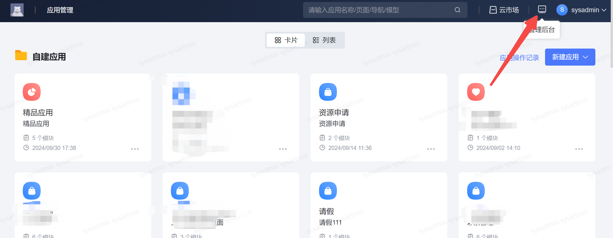

添加连接器信息

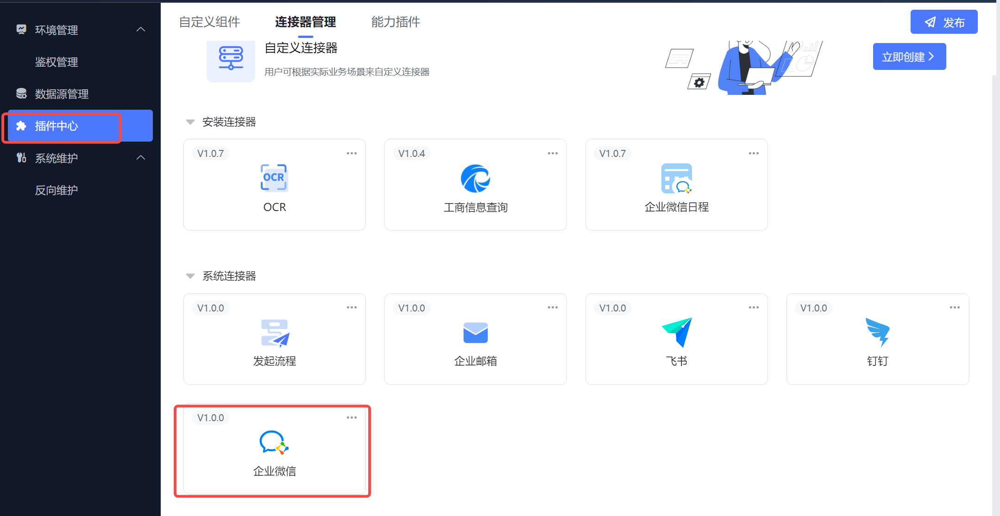

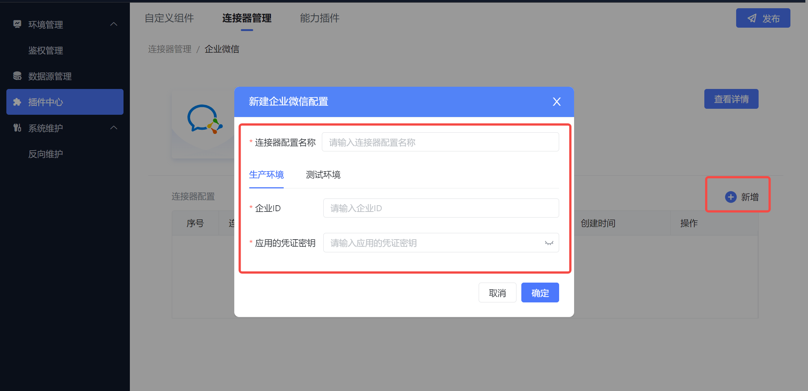

### 1. 服务编排

新建一个服务编排，触发方式选择定时触发，服务方式选择其他

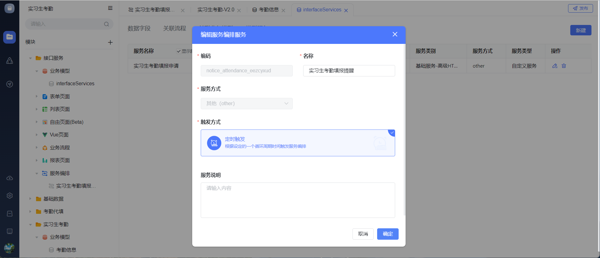

服务配置：定时任务每触发一次，调用一次该服务进行发送消息提醒

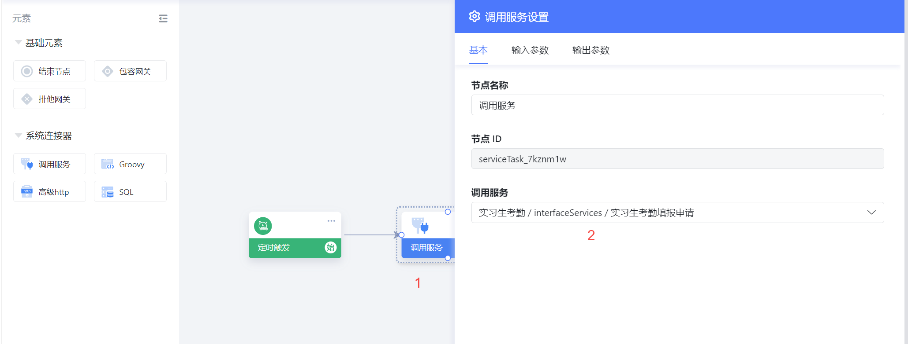

### 2. 定时任务

进入定时任务配置页面，开始进行定时配置，年月日周时分秒按照自己的要求进行配置

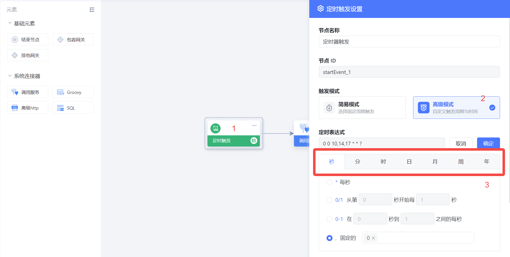

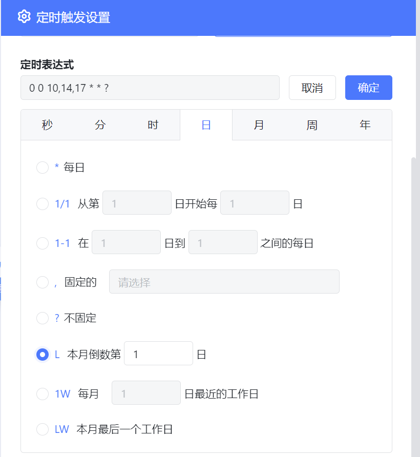

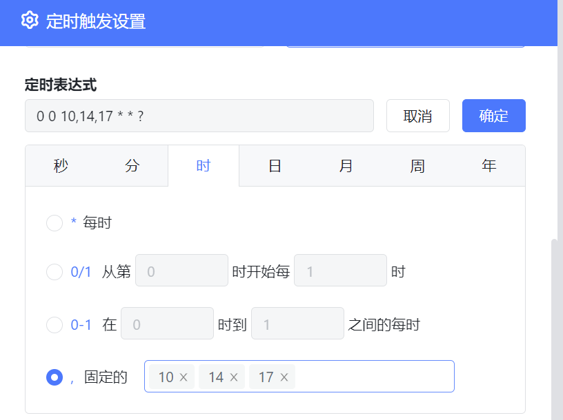

### 3.服务配置

配置连接器信息

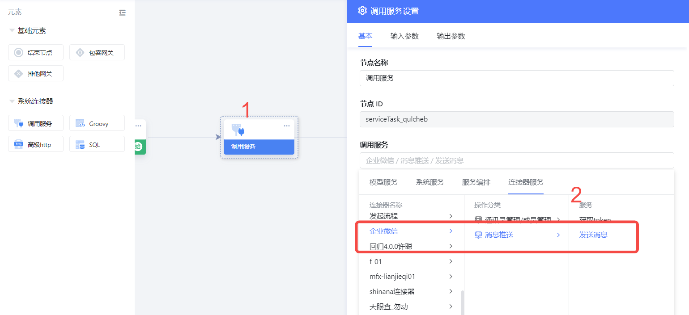

选中对应连接器

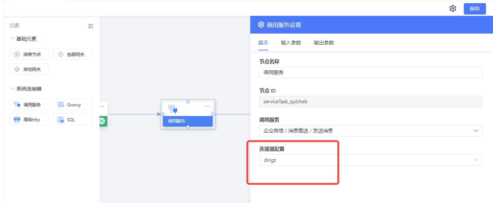

**配置输入参数**

参数解读：

agentld：对应IM工具后台应用管理下对应应用的AgentId

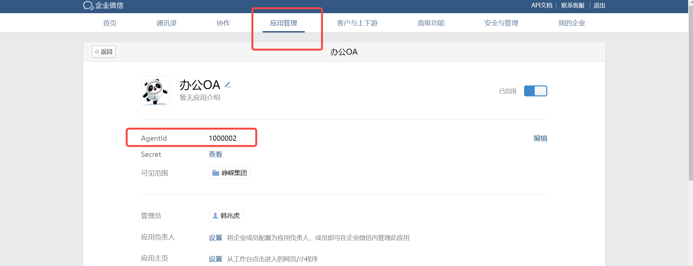

文字内容：需要发送的内容可以写在这里

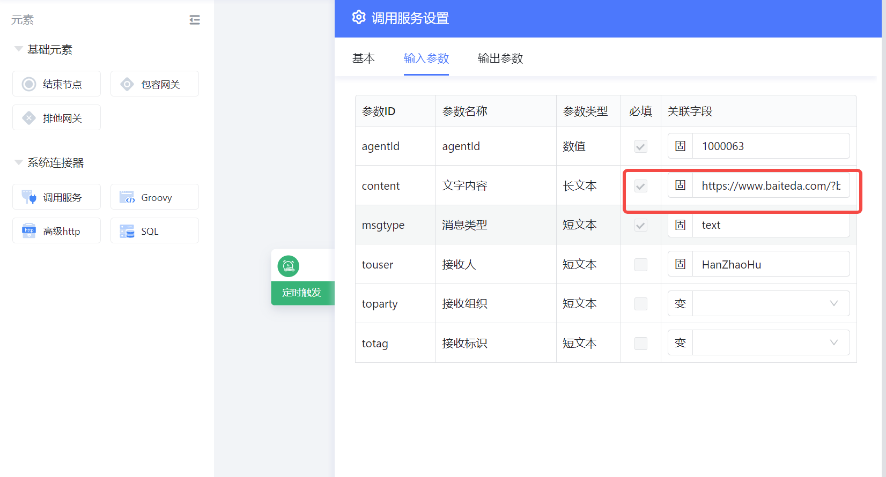

消息类型：文本类型为text

接收人：需要接收到的人员账号写在此处，如果有多人使用英文逗号隔开

## 结果

通过实施上述的服务编排和定时任务，实现了定时发送消息的操作，员工收到消息后可进行点击链接填写考勤

​
