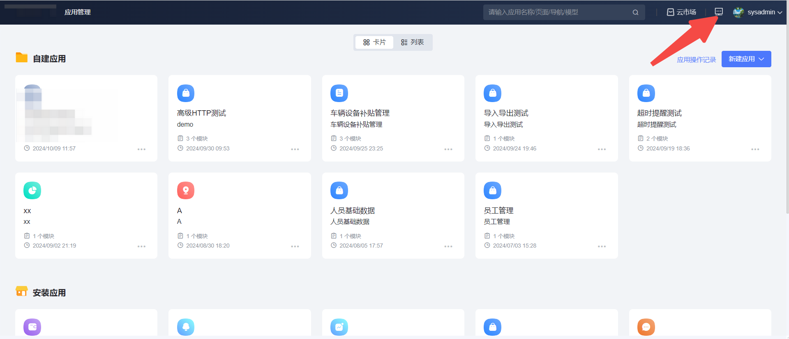
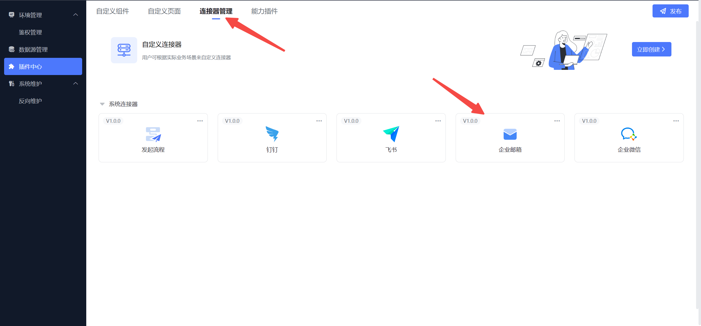
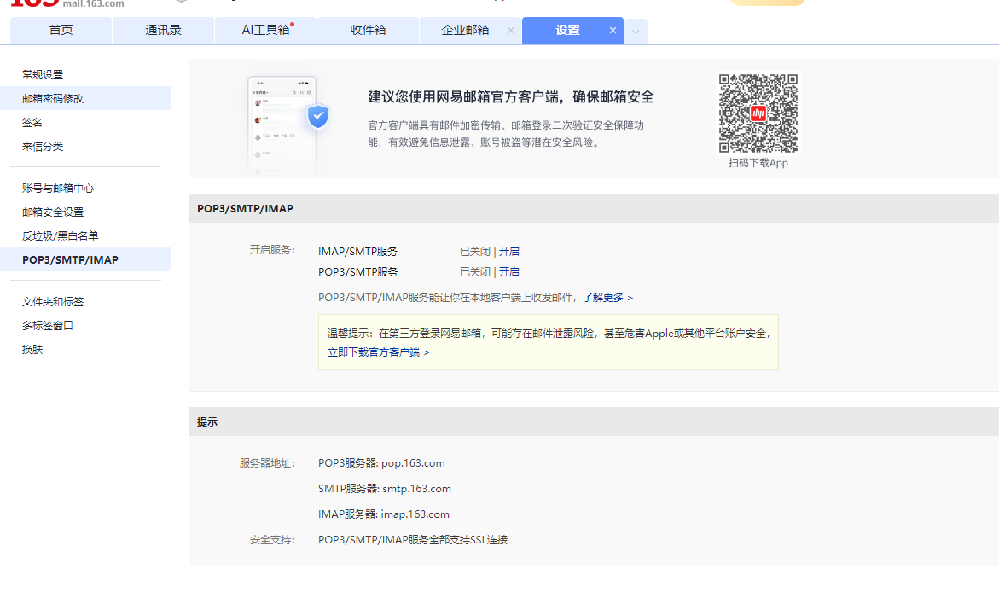
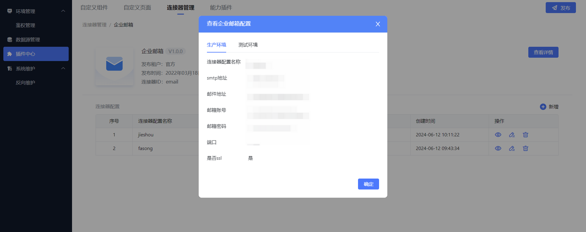
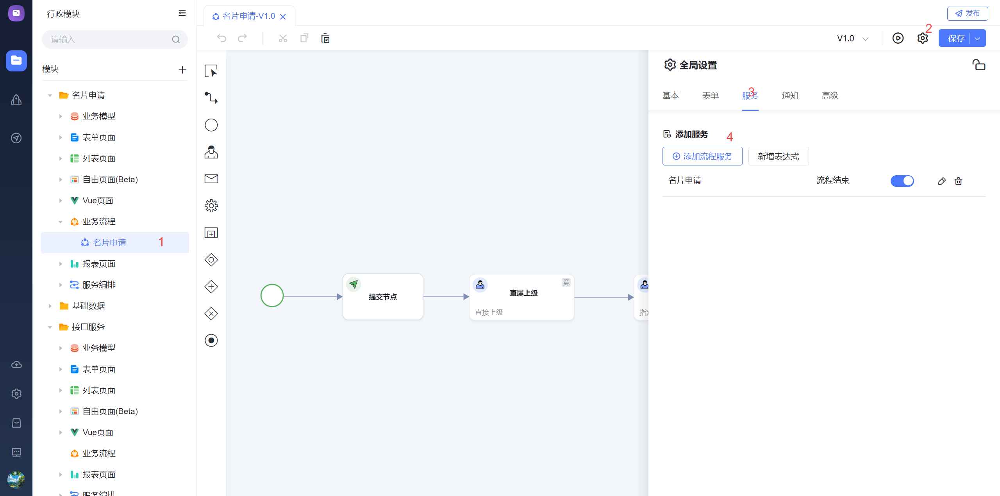
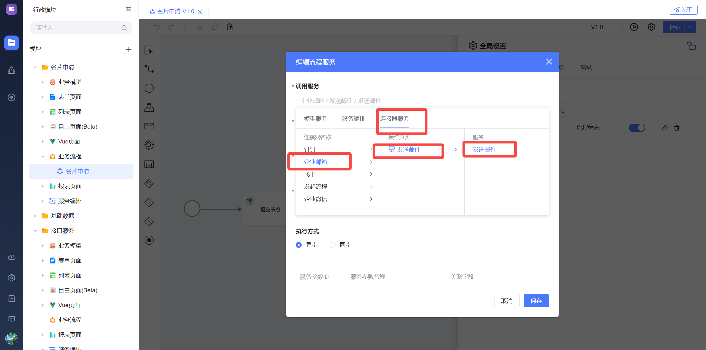
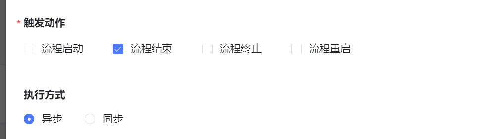
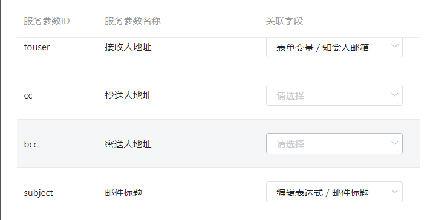
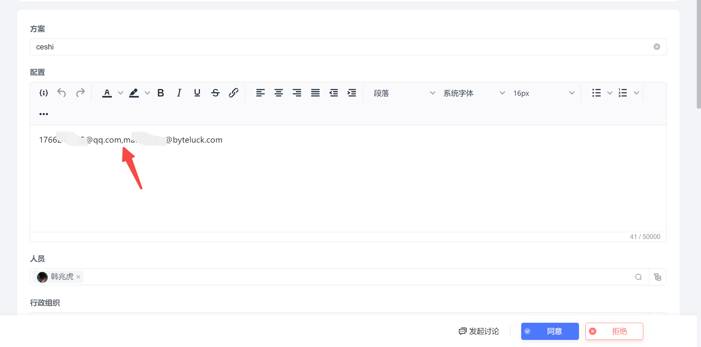
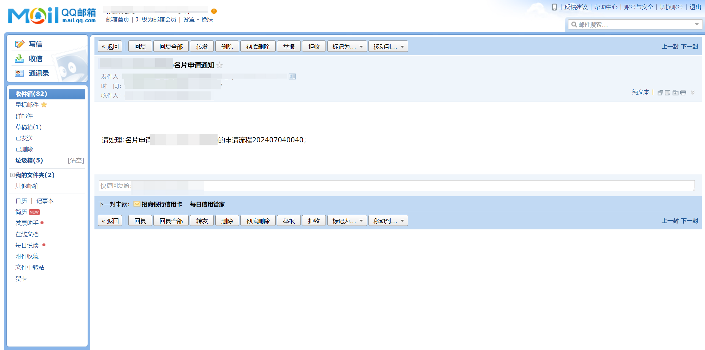

## 使用场景

在一个审批流程结束后，为了提升用户的学习体验，需要在审批流程结束后为用户发送消息提醒，分别提醒到邮件及对应IM工具

通过审批流程的的服务配置，平台能够灵活选择IM消息、邮件发送这些通知，以确保用户及时收到信息。

## 具体案例

用户在进行名片申请，当审批流程通过后需要将表单内容发送到前台邮箱

## 操作配置

### 前期配置

在管理后台的连接器管理中进行企业邮箱配置

企业邮箱配置说明

以163邮箱为例，smtp地址获取路径如下，不同 邮箱获取smtp地址不通。

### 流程配置

进入流程，选择高级，进入服务，添加流程服务

进入添加服务配置页面，选择连接器服务，选择企业邮箱，选择发送邮件

选择触发动作为流程结束后，执行方式为异步

进行一些邮件相关配置，关联字段配置可取表单变量，保存发布即可

如果需要给多人发送邮件，邮箱与邮箱之间使用英文逗号隔开

配置完毕发起流程进行审批测试

## 结果展示

审批流程结束后邮箱收到通知

