<a id="ec0mp"></a>


## **使用场景**

一家软件开发公司正在进行一个大型项目的开发，为了确保项目的正常运行，需要定时将开发进度发送给总监审阅

<a id="Gb1lc"></a>


## 具体案例

在项目开发过程中，项目经理每周汇报一次情况，在每周一上午九点通过触发流程将汇报内容发送总监审阅

<a id="gkGsu"></a>


### 任务创建

项目经理 进行任务汇报 填写，到指定时间需将汇报内容发送给总监


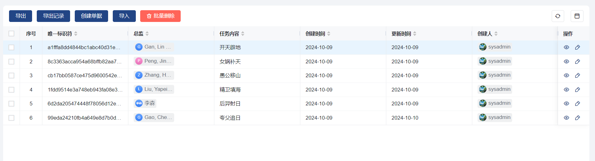


<a id="lmj0j"></a>


### **流程设计**


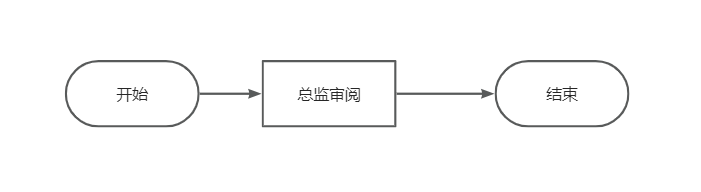


<a id="BF8Re"></a>


## 服务编排+定时任务

<a id="o2XZ7"></a>


### 前期配置

在管理后台添加流程连接器配置


<a id="A0ESq"></a>


### 添加服务编排


<a id="hXpWE"></a>


### 添加定时任务

触发周期为每周一的上午九点触发定时任务


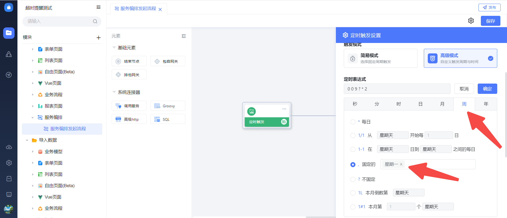


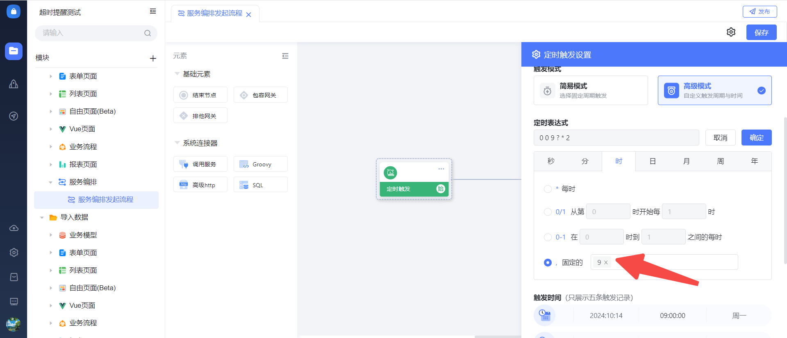


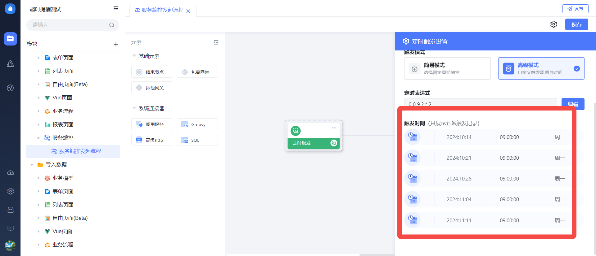


<a id="JWHha"></a>


### sql服务

<a id="JDO6k"></a>


#### 添加sql

在调用服务时获取sql服务的入参


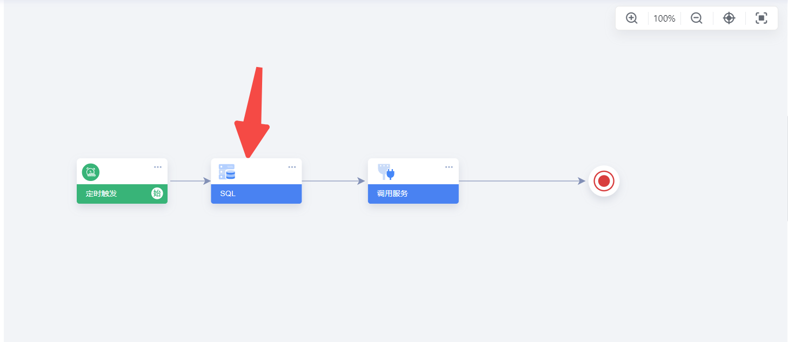


<a id="bs0MR"></a>


#### 添加服务

表达式如下


```plain
SELECT t.*
FROM drsj t
WHERE t. create_time  = (
    SELECT MAX(t2.create_time)
    FROM drsj t2
    WHERE YEARWEEK(t2.create_time, 1) = YEARWEEK(t.create_time, 1)
)
```


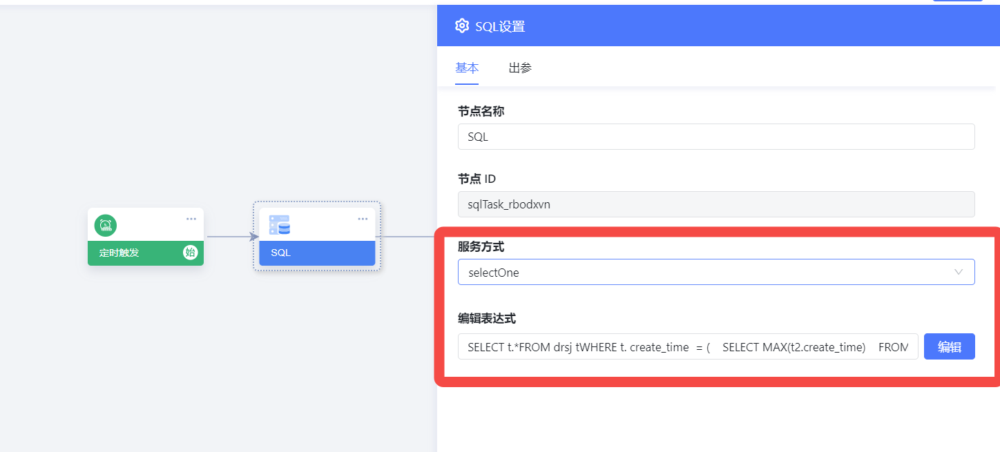


设置出参


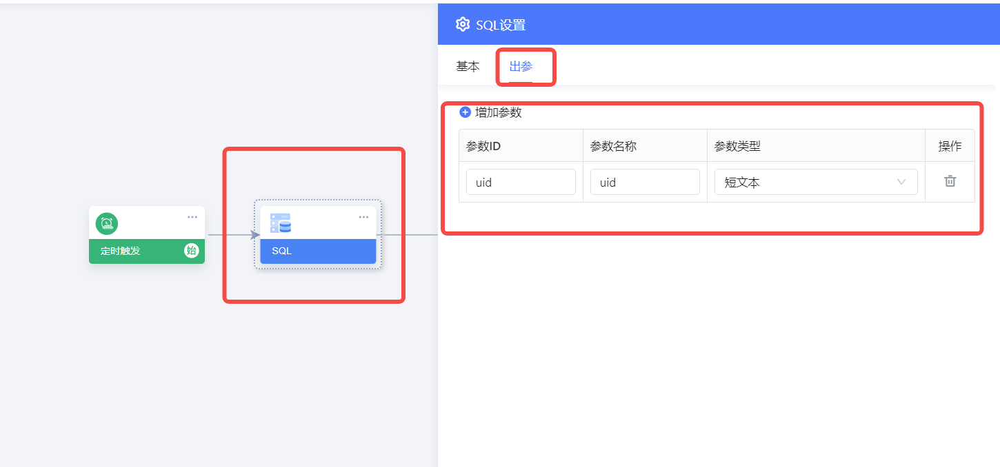


<a id="UA8Vi"></a>


### 服务配置

选择连接器服务，选择发起流程 ，操作分类选择发起流程，服务选择发起单个流程实例


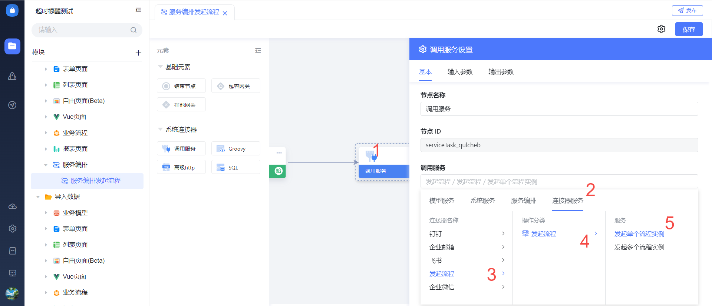


选择对应的连接器


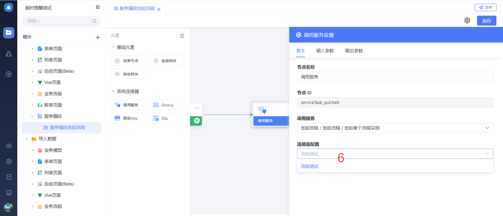


输入参数，本次以单条数据为案例进行讲解

**参数说明**

业务数据主键：列表数据uid的值

流程定义：流程key

流程提交人：流程的提交人

是否自动提交：1是自动提交


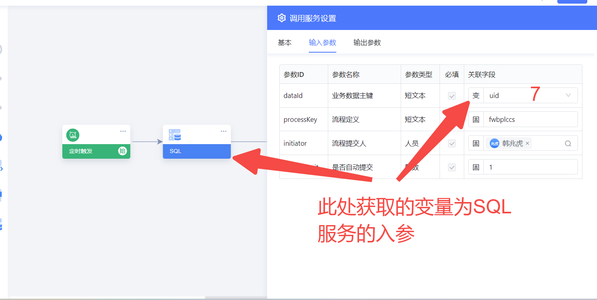


配置完毕之后可进行测试

<a id="l8sTl"></a>


## **案例效果**

可看到，流程被触发


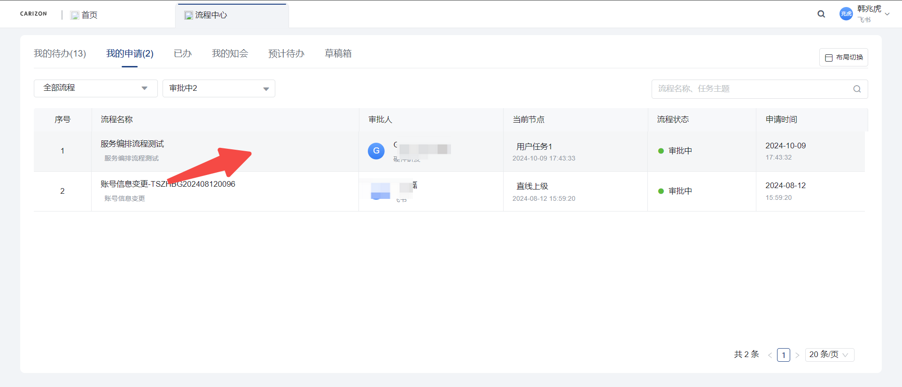
