<a id="ec0mp"></a>


## **使用场景**

企业人员日报的收集

<a id="Gb1lc"></a>


## 具体案例

企业需要定时将人员日报收集

<a id="cOwCt"></a>


### **流程设计**


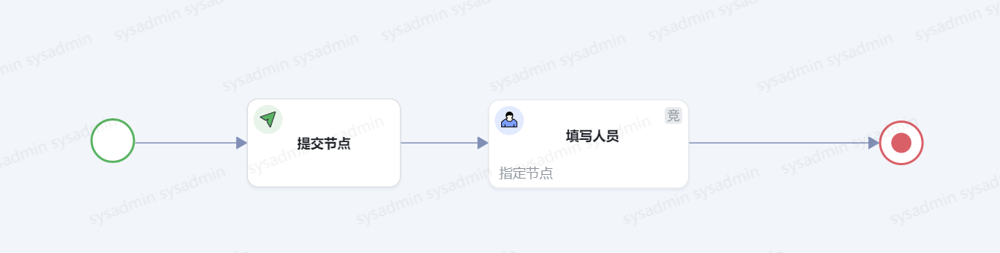


<a id="BF8Re"></a>


## 服务编排+定时任务

<a id="o2XZ7"></a>


### 前期配置

在管理后台添加流程连接器配置


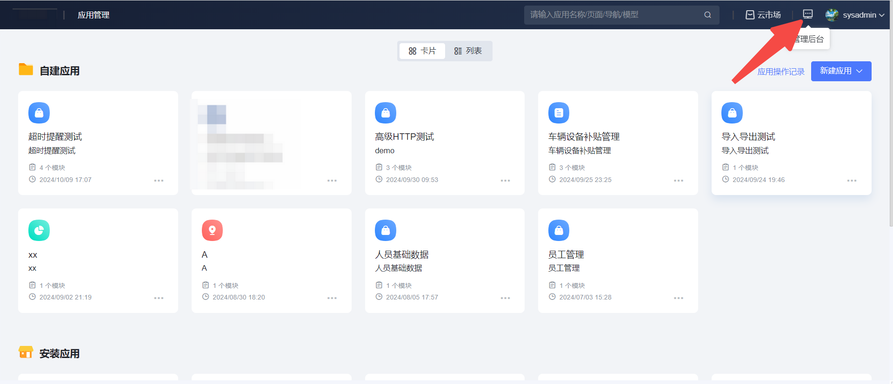


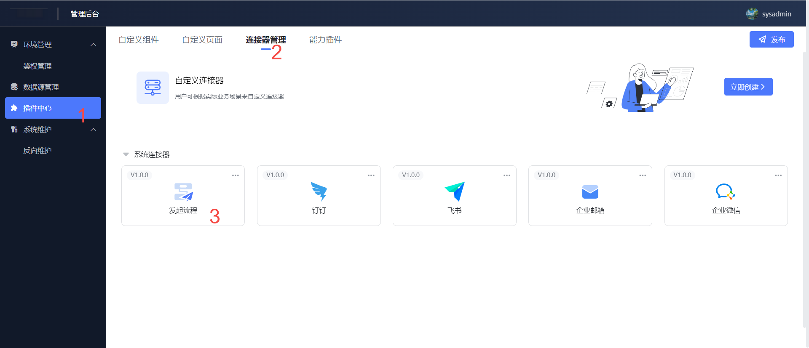


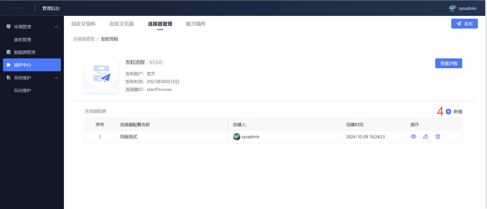


<a id="A0ESq"></a>


### 添加服务编排


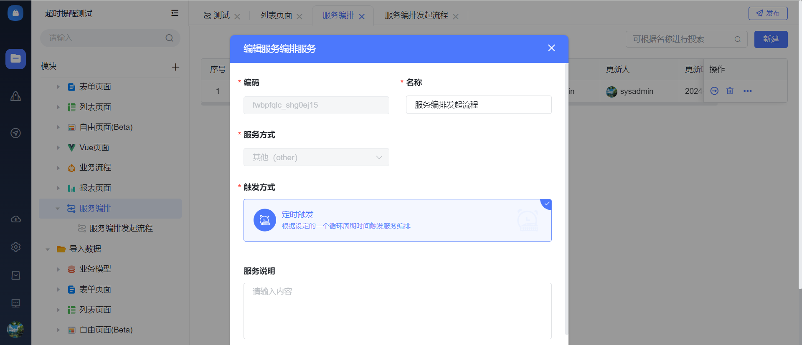


<a id="sY9so"></a>


#### 添加定时任务

触发周期为每天0点


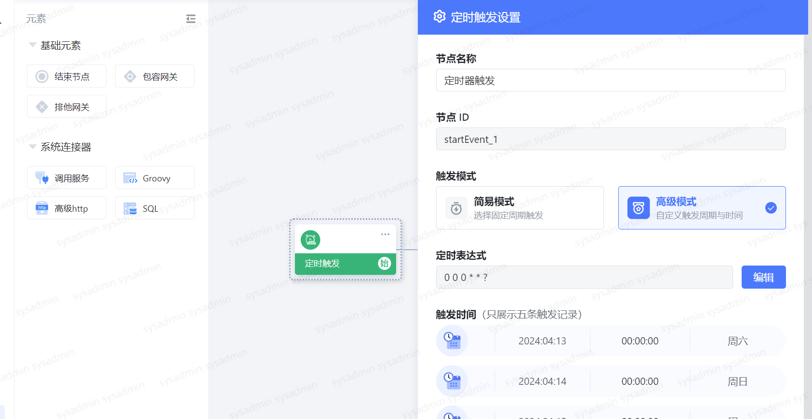


<a id="Tvghk"></a>


#### 添加Groovy连接器

定时任务到期触发Groovy连接器，执行连接器中的表达式，表达式如下

表达式如下


```plain
def queryStr= "{\"page_index\":1,\"page_size\":1000,\"sort_criteria\":{\"create_time\":\"DESC\"},\"filter_sql\":null,\"data_filters\":[],\"permission_filters\":[]}";
// 查多  selectMore是一个ArrayList，是返回output中的value
//queryall_mlutiple_users_izszd8qw是项目服务，功能是返回当天满足下发条件的信息
// user + project + milestone
def selectMore = callService("app_x8j680m0vl","queryall_mlutiple_users_izszd8qw",queryStr);
def uuid1;
//遍历下发日报待办
for (element in selectMore) {
   uuid1 = UUID.randomUUID().toString().replace("-","");
	runing_sql_param =[:];
	runing_sql_param.put ("uid",uuid1);
	runing_sql_param.put ("xiangmu",element["project_name"]);
	runing_sql_param.put ("lichengbei",element["name"]);
	runing_sql_param.put ("faqiren",element["users"]);
  //faqiliucheng_kq9emasq是项目服务，功能是下发日报流程
  callService("app_x8j680m0vl","faqiliucheng_kq9emasq",runing_sql_param);
}
```


```sql
select c.users,b.name ,a.project_name
from project_info_bl2it3pf a, project_milestone_82uysom2 b, project_joinusers_m6lyg1m3 c
where c. project_milestone_id = b.uid
and b.project_info_id = a.uid
and LENGTH(trim(b.name))>0
and LENGTH(trim(c.users))>0
and LENGTH(trim(a.project_name))>0
and #{__current__.dateTime} BETWEEN b.start_date AND b.end_date
and a.status = "进行中"
```


​

<a id="vtahN"></a>


##### 触发发起单个流程的服务编排

服务方式选择为新增


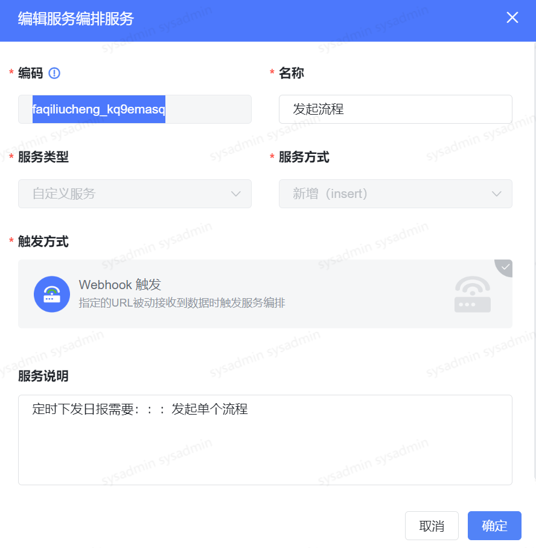


发起流程服务编排整体结构


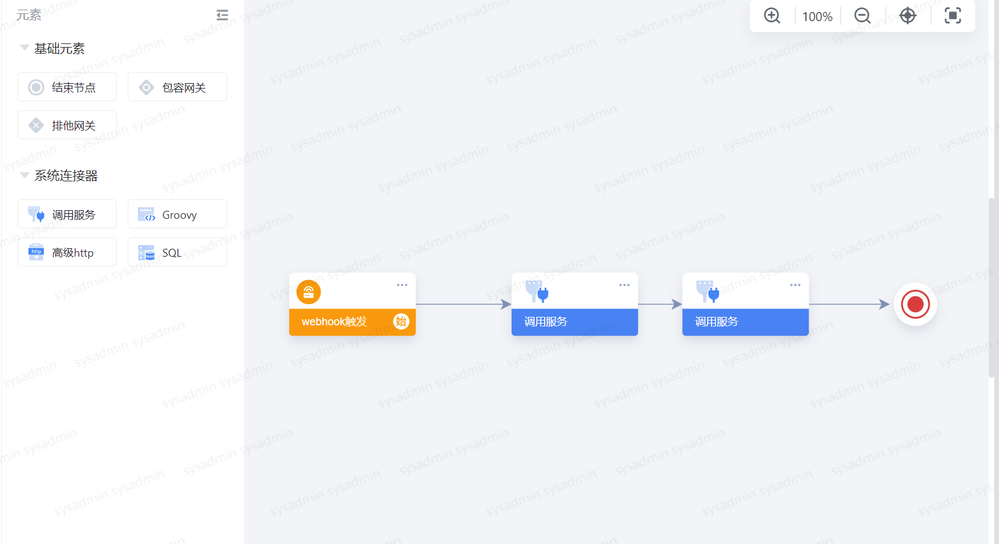


<a id="pEWfD"></a>


###### 触发方式为webhook


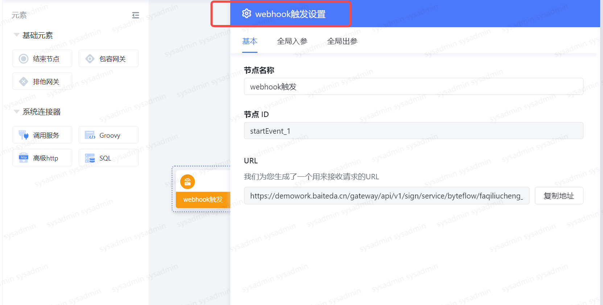


入参为Groovy表达式中对应参数


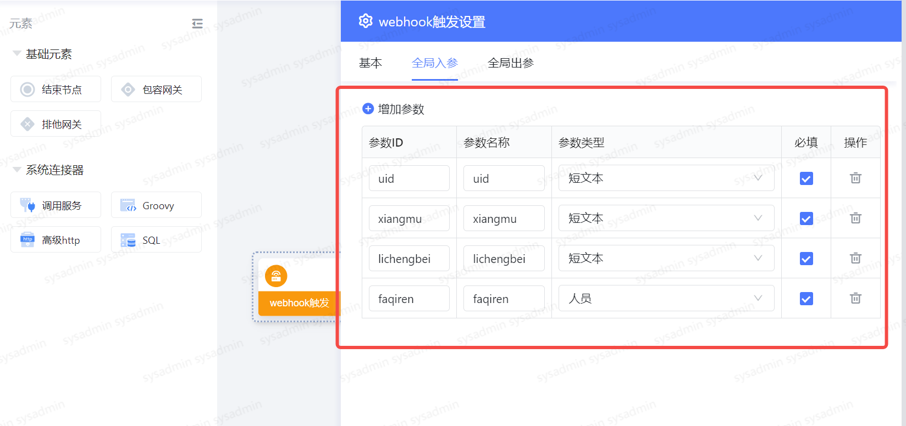


<a id="Ez84l"></a>


###### webhook触发完毕调用服务

触发调用日报的默认新服务


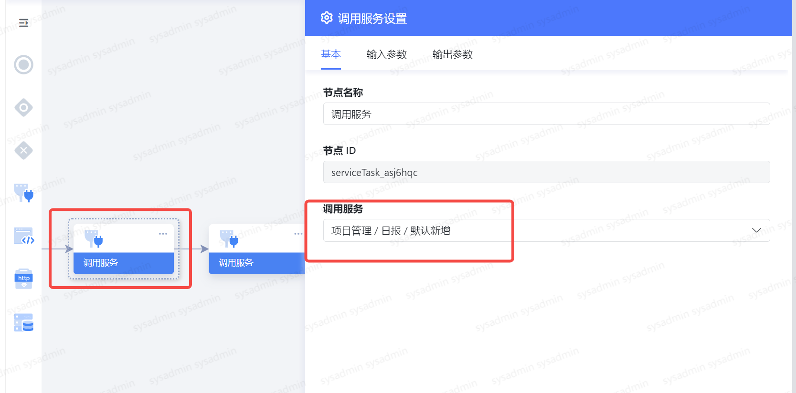


服务的输入参数为webhook的入参


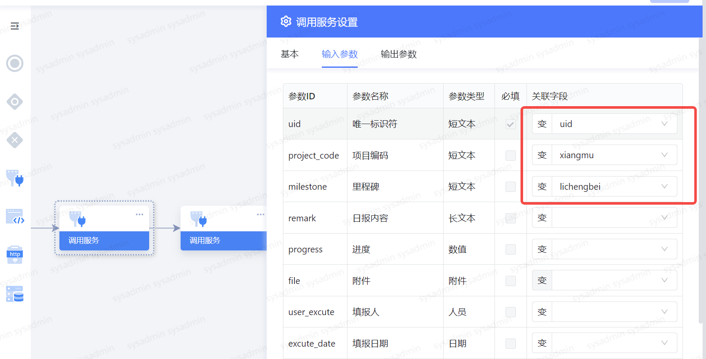


<a id="abIsy"></a>


###### 调用发起流程服务


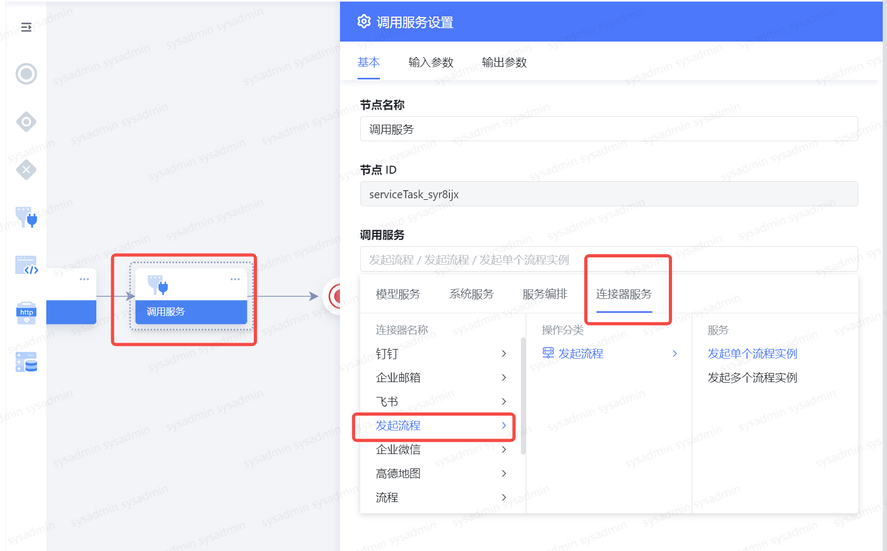


选中对应发起流程的连接器


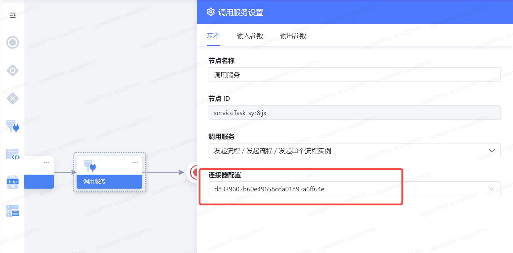


触发完毕最后一个服务，批量发起流程
