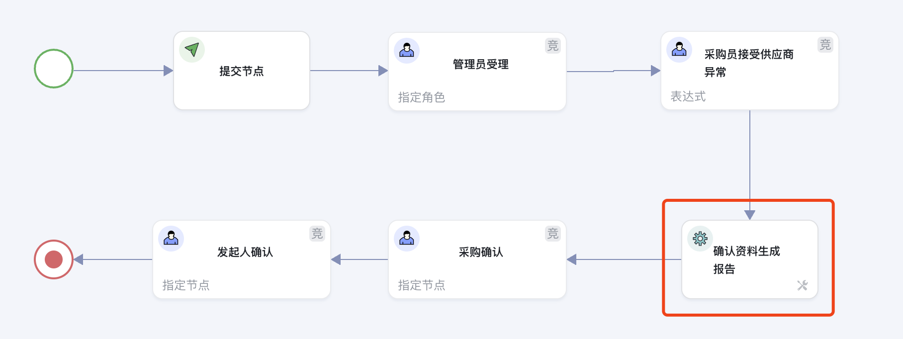
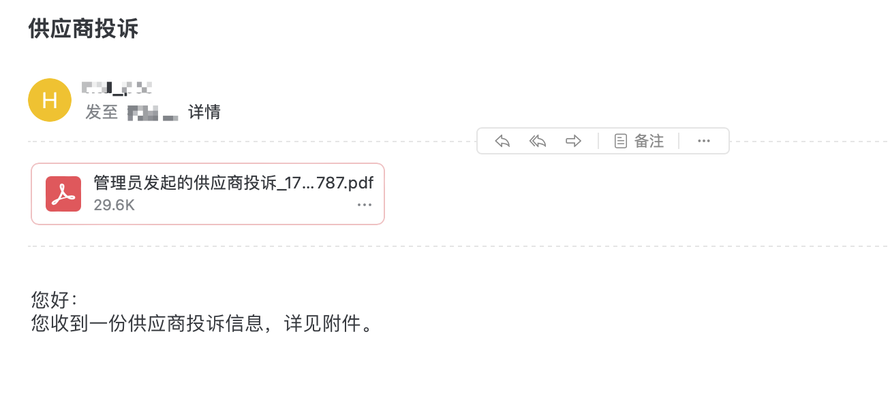
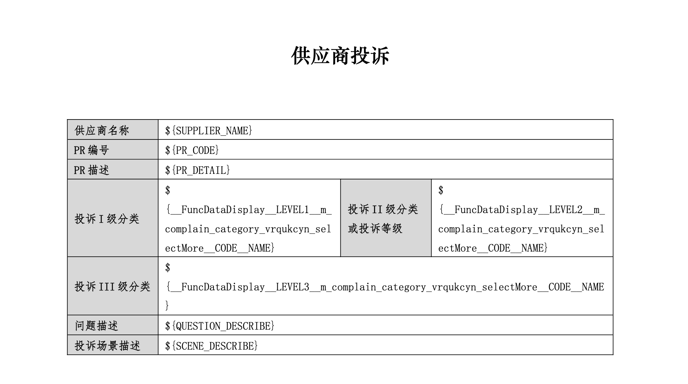
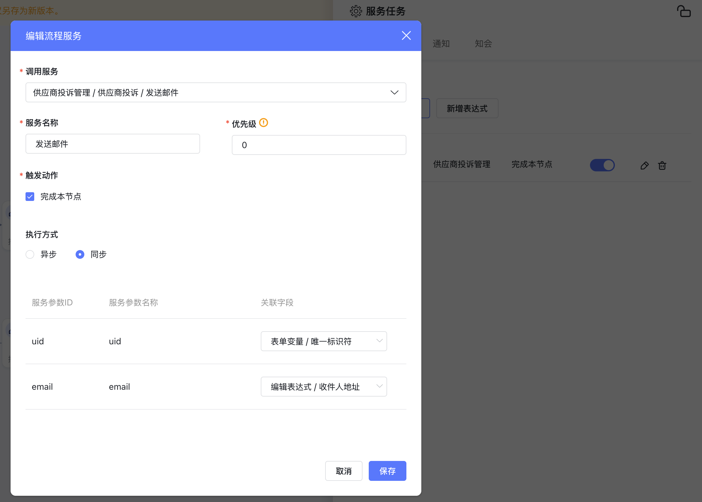
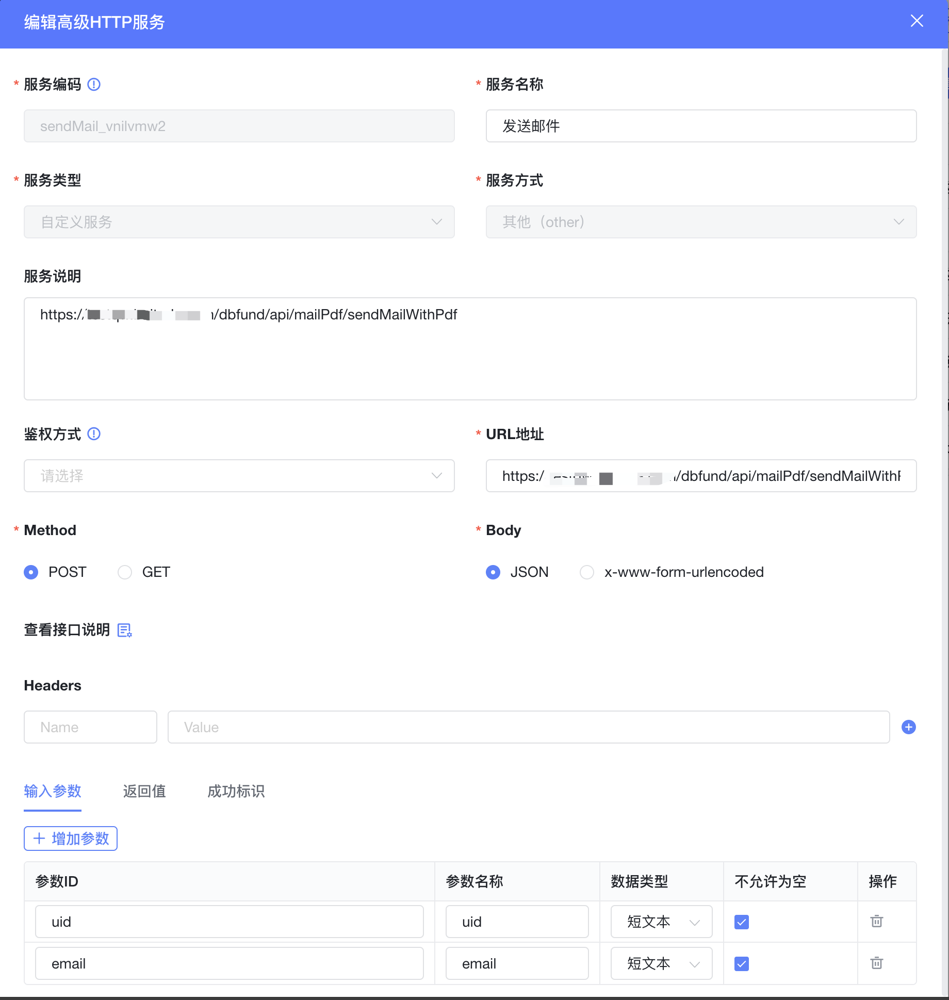

<a id="Al6PL"></a>


## 业务场景

<a id="gpT8R"></a>


### 供应商工单处理

1. 用户提交供应商处理的工单，由管理员和对应的采购员进行审核确认
2. 确认完成后将反馈的问题生成 PDF 文件，并通过邮件的方式发送给供应商对接人
3. 由供应商对接人线下处理





<a id="JbRu8"></a>


### 供应商收到邮件





<a id="EmdyT"></a>


## 相关配置

<a id="IsQbo"></a>


### 表单打印模板配置





[附件: 批量打印标准模版.docx](../../_assets/qzuu8d89u91m0q7q/批量打印标准模版-a0b1e1c545.docx)


<a id="kL3n2"></a>


### 流程中调用服务发送邮件





<a id="bthRM"></a>


### 发送邮件高级 HTTP 服务





<a id="TYABI"></a>


### 发送邮件二开服务


```java
package com.byteluck.service.impl;

import cn.hutool.core.lang.Assert;
import com.byteluck.baiteda.client.apprun.AppSvcService;
import com.byteluck.baiteda.client.apprun.AttachmentService;
import com.byteluck.baiteda.client.apprun.dto.Response;
import com.byteluck.baiteda.client.apprun.dto.SelectOneDto;
import com.byteluck.baiteda.client.apprun.dto.SingleOutput;
import com.byteluck.baiteda.client.attachment.IAttachmentCenterService;
import com.byteluck.baiteda.client.attachment.dto.AttachmentDto;
import com.byteluck.baiteda.client.attachment.dto.ListResult;
import com.byteluck.service.MailService;
import com.byteluck.util.SendMailUtil;
import lombok.extern.slf4j.Slf4j;
import org.apache.commons.lang3.StringUtils;
import org.apache.commons.lang3.tuple.Pair;
import org.springframework.beans.factory.annotation.Autowired;
import org.springframework.beans.factory.annotation.Value;
import org.springframework.stereotype.Service;

import java.io.File;
import java.io.FileOutputStream;
import java.io.IOException;
import java.io.InputStream;
import java.net.MalformedURLException;
import java.net.URL;
import java.net.URLConnection;
import java.util.*;

@Service
@Slf4j
public class MailServiceImpl implements MailService {

    @Autowired
    AppSvcService appSvcService;

    @Autowired
    IAttachmentCenterService attachmentCenterService;

    @Value("${baiteda.sdk.tenant-id}")
    private String tenantId;

    @Value("${baiteda.sdk.domain}")
    private String domain;

    @Value("${upload-path}")
    private String uploadPath;

    @Override
    public void sendMailWithPdf(String uid, String email) throws IOException {
        Assert.notBlank(email);
        Assert.notBlank(uid);

        String pdfFiles = getFileId(uid);
        List list = Arrays.asList(pdfFiles.split(","));
        ListResult<AttachmentDto> attachmentDtoListResult = attachmentCenterService.getAttachmentList(domain, tenantId, list);

        for(AttachmentDto attachmentDto : attachmentDtoListResult.getData()){
            final String fileName = attachmentDto.getFileName();
            String downloadUrl = domain+attachmentDto.getFilePath();
            //email = "qj@byteluck.com";
            String subject = "供应商投诉";
            String content = "";
            content = "您好：<br>" +
                    "您收到一份供应商投诉信息，详见附件。";
            String[] receiverAccounts = new String[]{email};
            List<File> files = new ArrayList<>();
            URL url = new URL(downloadUrl);
            URLConnection urlConnection = url.openConnection();
            InputStream inputStream = urlConnection.getInputStream();

            int bytesum = 0;
            int byteread = 0;
            byte[] buffer = new byte[1204];
            int length;
            FileOutputStream fs = new FileOutputStream(uploadPath+fileName);
            while ((byteread = inputStream.read(buffer)) != -1) {
                bytesum += byteread;
                fs.write(buffer, 0, byteread);
            }

            files.add(new File(uploadPath+fileName));
            SendMailUtil sender = new SendMailUtil("htd_poc@aliyun.com", "hgj123456", receiverAccounts, null, files);

            log.info("发送邮件 地址：{}", email);
            Pair<Boolean, String> result = sender.send(subject, content, null);
            log.info("发送邮件 结果：{}", result);
        }
    }

    private String getFileId(String uid){
        SelectOneDto selectOneDto = new SelectOneDto();
        selectOneDto.setTenantId(tenantId);
        selectOneDto.setSvcCode("m_supplier_complain_34blvjfx_selectOne");
        Map<String, Object> saveDataS = new HashMap<>();
        saveDataS.put("uid",uid);
        selectOneDto.setSaveDatas(saveDataS);
        Response<SingleOutput> response =  appSvcService.selectOne(selectOneDto);
        String pdfId = String.valueOf(response.getData().getValue().get("PDF_URL"));
        return pdfId;
    }
}
```


```java
package com.byteluck.service.impl;

import cn.afterturn.easypoi.excel.ExcelImportUtil;
import cn.afterturn.easypoi.excel.entity.ImportParams;
import cn.afterturn.easypoi.excel.entity.result.ExcelImportResult;
import com.byteluck.baiteda.client.apprun.AppSvcService;
import com.byteluck.baiteda.client.apprun.EmployeeService;
import com.byteluck.baiteda.client.attachment.IAttachmentCenterService;
import com.byteluck.baiteda.client.attachment.dto.AttachmentDto;
import com.byteluck.baiteda.client.attachment.dto.ListResult;
import com.byteluck.bean.bo.MarginTrading;
import com.byteluck.bean.bo.MarginTradingAccount;
import com.byteluck.bean.bo.TradingBill;
import com.byteluck.bean.dto.MarginTradingPdfInfo;
import com.byteluck.handler.ClassExcelVerifyHandler;
import com.byteluck.service.AccountOpeningInfoService;
import com.byteluck.service.MarginApproveService;
import com.byteluck.service.MarginTradingService;
import com.byteluck.service.TradingBillService;
import com.byteluck.util.PdfUtils;
import com.byteluck.util.SendMailUtil;
import com.byteluck.utils.FileUtils;
import com.itextpdf.text.Document;
import com.itextpdf.text.DocumentException;
import com.itextpdf.text.Font;
import com.itextpdf.text.Paragraph;
import com.itextpdf.text.pdf.PdfPTable;
import com.itextpdf.text.pdf.PdfWriter;
import lombok.extern.slf4j.Slf4j;
import org.apache.commons.lang3.StringUtils;
import org.apache.commons.lang3.tuple.Pair;
import org.apache.poi.ss.usermodel.Workbook;
import org.apache.poi.xssf.usermodel.XSSFWorkbook;
import org.springframework.beans.factory.annotation.Autowired;
import org.springframework.beans.factory.annotation.Value;
import org.springframework.mock.web.MockMultipartFile;
import org.springframework.stereotype.Service;
import org.springframework.web.multipart.MultipartFile;

import java.io.*;
import java.net.MalformedURLException;
import java.net.URL;
import java.net.URLConnection;
import java.text.DecimalFormat;
import java.text.NumberFormat;
import java.util.*;
import java.util.stream.Collectors;

/**
 * @author qianjun
 */
@Service
@Slf4j
public class MarginTradingServiceImpl implements MarginTradingService {
    @Autowired
    TradingBillService tradingBillService;

    @Value("${baiteda.sdk.tenant-id}")
    private String tenantId;

    @Value("${baiteda.sdk.domain}")
    private String domain;

    @Value("${upload-path}")
    private String uploadPath;

    @Autowired
    private AppSvcService httpAppSvcService;

    @Autowired
    private IAttachmentCenterService attachmentCenterService;

    @Autowired
    private MarginApproveService marginApproveService;

    EmployeeService employeeService;

    @Autowired
    private AccountOpeningInfoService accountOpeningInfoService;

    @Autowired
    private ClassExcelVerifyHandler verifyHandler;

    @Override
    public List<MarginTradingPdfInfo> genMarginTradingPdf(String uid, MultipartFile file) throws Exception {
        List<MarginTradingPdfInfo> marginTradingPdfInfoList = new ArrayList<>();

        List<TradingBill> tradingBillList = tradingBillService.queryTradingBill();
        List<MarginTradingAccount> marginTradingAccountList = readExcelInfo(file);

        List<MarginTradingAccount> marginTradingAccountListResult = handleData(tradingBillList, marginTradingAccountList);
//        String attacheId = "";
//        attachmentCenterService.getAttachment()
        if(StringUtils.isNotBlank(uid)) {
            List<String> fileIdList = new ArrayList<>();
            for (MarginTradingAccount marginTradingAccount : marginTradingAccountListResult) {
                String filePath = convertPdf(marginTradingAccount);
                log.info("生成的PDF文件:{}", filePath);
                MultipartFile multipartFile = FileUtils.getMultipartFile(new File(filePath));
                MultipartFile[] multipartFiles = new MultipartFile[]{multipartFile};
                ListResult<AttachmentDto> attachmentDtoListResult = attachmentCenterService.uploadAttachmentsByStream(multipartFiles);
                AttachmentDto attachmentDto = attachmentDtoListResult.getData().get(0);
                String fileId = attachmentDto.getFileId();
                fileIdList.add(fileId);
                // String hostUrl, String tenantId, String creator, Boolean deletable, MultipartFile[] multipartFiles            String files;
                //ListResult<AttachmentDto> attachmentDtoListResult =  attachmentCenterService.uploadAttachmentsByStream("", tenantId, "sysadmin",false, file);
            }
            marginApproveService.updatePdfFileIdByUid(uid, StringUtils.join(fileIdList, ","));
        }
        return marginTradingPdfInfoList;
    }

    @Override
    public List<MarginTradingPdfInfo> genMarginTradingPdf(String uid) throws Exception {
        String fileUrl = marginApproveService.getExcelFilePath(uid);
        URL url = new URL(fileUrl);
        URLConnection urlConnection = url.openConnection();
        InputStream inputStream = urlConnection.getInputStream();

        MultipartFile multipartFile = new MockMultipartFile("targetFile", inputStream);
        return this.genMarginTradingPdf(uid,multipartFile);
    }
}
```
