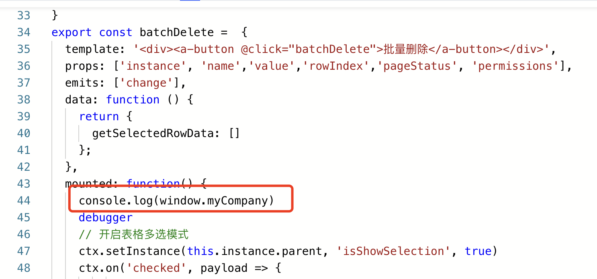

利用平台的 系统扩展脚本 可以注册第三方的js、css库，入口在管控台。


表单、列表中使用，请在 运行态 - 扩展脚本加载地址 填写扩展脚本的地址，必须是一个通过客户端浏览器可以访问到的地址。（建议放在oss中）

​

<a id="IUNeR"></a>


## extendjs.js 扩展脚本加载组件库示例：

​


```javascript
/**
* 系统初始化时回调，可以注入三方脚本
* @param {*} vue Vue实例
* @param {*} type 有个参数值 desktop / mobile
* @returns Promise / void
*/
window.BaitedaInit = async function(vue, type) {
  return new Promise(function (resolve, reject) {
    // 增加一个css的引用
    const link = document.createElement('link');
    link.rel = "stylesheet";
    link.href = "https://ego-fe.oss-cn-beijing.aliyuncs.com/temp/style.css";
    document.body.appendChild(link);
    // 结束

    // resolve(true) //如果只有css，则需要放在最后执行该语句


    /* 增加一个vconsole组件的引用
    if (type === 'mobile') {
      const vconsole = document.createElement('script')
      vconsole.src = 'https://byteluck.oss-cn-beijing.aliyuncs.com/libs/vconsole/vconsole-3.12.1.min.js'
      vconsole.crossorigin = 'true'
      vconsole.onerror = function() {reject()}
      vconsole.onload = function() {
        // 已经获取到 window.vconsole，此处可以做一些全局设置
        var vConsole = new window.VConsole();
        resolve(true)
      }
      document.body.appendChild(vconsole)
    }
    */


    // 增加多个组件的引用
    const echarts = document.createElement('script')
    echarts.src = 'https://fe-resource.baiteda.com/libs/echarts-5.3.2/echarts.min.js'
    echarts.crossorigin = 'true'
    echarts.onerror = function() {reject()}
    echarts.onload = function() {
      // 已经获取到 window.echarts，此处可以做一些全局设置
      resolve(true)
    }
    document.body.appendChild(echarts)
    // 结束
  })
}

/**
* 用户身份认证时回调，仅在私有化环境中启用
* @param {*} user 用户对象
* @param {*} tenant 租户对象
*/
window.BaitedaLogin = function(user, tenant) {}

/**
* 页面全局路由变更时回调，仅在私有化环境中启用
* @param {*} to 目标页面
* @param {*} from 当前页面
*/
window.BaitedaRouterChanged = function(to, from) {}

/**
 * 平台关闭页面的行为干预
 * 版本提供 4.2.0
 * @param params {
 *   type: "desktop" | "mobile";
 *   browserType: string;
 *   taskRedirectUrl: string;
 *   appLauncher: boolean;
 * }
 */
window.BaitedaClose = function(params) {}

/**
 * 全局注入请求头额外参数
 * 版本提供 4.2.0
 * @param {*} headers 请求头信息
 * @returns 返回的对象就会被注入到请求头部
 */
window.BaitedaRequestHeaders = function(headers) {return headers}

/**
 * 创建单据、浏览页面、编辑页面，以iframe形式打开，会通过此函数获取到url，进行预处理。如：qiankun等微前端地址替换的处理
 * @param params {
 * 		url: string;
 *     method: 'create' | 'edit' | 'read'
 * }
 * @returns true(表示继续向下执行之前代码) | false(表示不继续执行下面的代码逻辑, 直接返回)
 */
window.BaitedaOpenOperateUrl = function(params) {
	return true
}

/**
 * 修改标签页title的行为干预
 * @param params {
 *   title: string;
 * }
 * @returns true(表示继续向下执行之前代码) | false(表示不继续执行下面的代码逻辑, 直接返回)
 */
window.BaitedaUpdateCurrentTab = function(params) {
  return false
}

/**
 * 全局注入外部干预样式
 * @returns 返回的对象为外部干预样式
 */

window.BaitedaCustomStyle = function() {
	return {
		"list-view-aggrid": {
			"footer": {
				"height": 30
			}
		}
	}
}


/**
 * 创建单据、浏览页面、编辑页面，以iframe形式打开，会通过此函数获取到url，进行预处理。如：qiankun等微前端地址替换的处理
 * 版本提供 4.2.0
 * @param url
 * @param method: 'create' | 'edit' | 'read'
 * @returns url地址
 */
window.BaitedaGetIframeUrl = function(url, method) {return url}

//4.0.0版本提供
window.baitedaCustomFileSupportOnlineView = function(file, type, device) {
  /**
  file: {
    "tenant_id": "testqw",
    "file_id": "b1c72447c9c44c58ba42a5aad4b6b3ae",
    "file_name": "base64.min.js",
    "file_path": "/attach/attachment/testqw/20230521/b1c72447c9c44c58ba42a5aad4b6b3ae/base64.min.js",
    "file_size": 5094,
    "create_time": 1684681790996,
    "support_online_view": false,
    "online_view_url": null,
    "download_url": "//testqw.baiteda.com/attachment/api/v1/private/download/b1c72447c9c44c58ba42a5aad4b6b3ae",
    "del_file_url": "//testqw.baiteda.com/attachment/api/v1/private/del?fileId=b1c72447c9c44c58ba42a5aad4b6b3ae"
  },
  type: 'isSupport' | 'getUrl'
  device: 'desktop' | 'mobile'
  */
  if (type === 'isSupport') {return false}
  else if (type === 'getUrl') {return 'https://www.sina.com.cn'}
}

//5.2.0+版本提供  调用utils工具集
window.BaitedaUtilsMounted = async function (utils) {
 // 这里可以获取utils函数，调用服务等
};
```

<a id="MaIBX"></a>


## 多个组件引用

有的第三方组件需要被安装，如：vue.use(ElementPlus)，可以写到对应的资源引入的onload里面


```typescript
  const vuecoms = document.createElement('script')
  vuecoms.src = 'https://ego-fe.oss-cn-beijing.aliyuncs.com/demo/test111/element/element-plus.js'
  vuecoms.crossorigin = 'true'
  vuecoms.onerror = function () { reject() }
  vuecoms.onload = function () {
      //有的第三方组件需要被安装 如：vue.use(ElementPlus)，可以写到对应的资源引入的onload里面
      vue.use(ElementPlus)
  }
  document.body.appendChild(vuecoms)


// 增加多个组件的引用
    const echarts = document.createElement('script')
    echarts.src = 'https://cdn.jsdelivr.net/npm/echarts@5.3.1/dist/echarts.min.js'
    echarts.crossorigin = 'true'
    echarts.onerror = function() {reject()}
    echarts.onload = function() {
      // 已经获取到 window.echarts，此处可以做一些全局设置
      // window.echarts

      const vconsole = document.createElement('script')
      vconsole.src = 'https://byteluck.oss-cn-beijing.aliyuncs.com/libs/vconsole/vconsole-3.12.1.min.js'
      vconsole.crossorigin = 'true'
      vconsole.onerror = function() {reject()}
      vconsole.onload = function() {
        // 已经获取到 window.vconsole，此处可以做一些全局设置
        var vConsole = new window.VConsole();
        resolve(true)	//多个引用的话， resolve(true)放在最后一个
      }
      document.body.appendChild(vconsole)

    }
    document.body.appendChild(echarts)
    // 结束
```


​

<a id="INwNf"></a>


## 挂载自定义的全局函数


```typescript
//该文件用于外部扩展使用，实际会存放在nginx上配置的/custom/绝对路径上，里面并不在当前任何项目里面，保证定制修改的内容不会丢失
/**
 * 系统初始化时回调，可以注入三方脚本
 * @param {*} vue Vue实例
 * @param {*} type 有个参数值 desktop / mobile
 * @returns Promise / void
 */
window.BaitedaInit = async function(vue, type) {
    window.myCompany = {
        async getUserInfo(ids){
            const result = await window.fetch('/apps/api/v1/private/user/listUserInfoByIds',
            {
            method: 'post',
            headers: {
                    'Content-Type': 'application/json'
                },
            body: JSON.stringify({user_ids: ids})
            });
            console.log(result.json())
        },
        anyOther() {
            console.log('anyOther')
        },
        anyProperties: 'hello'
    }
}

/**
 * 用户身份认证时回调，仅在私有化环境中启用
 * @param {*} user 用户对象
 * @param {*} tenant 租户对象
 */
window.BaitedaLogin = function(user, tenant) {
    debugger
}

/**
 * 页面全局路由变更时回调，仅在私有化环境中启用
 * @param {*} to 目标页面
 * @param {*} from 当前页面
 */
window.BaitedaRouterChanged = function(to, from) {
    debugger
}
```


这样在vue容器中就可以使用全局挂在的对象了





<a id="rqzxE"></a>


## 使门户支持header=none


```javascript
//该文件用于外部扩展使用，实际会存放在nginx上配置的/custom/绝对路径上，里面并不在当前任何项目里面，保证定制修改的内容不会丢失
/**
 * 系统初始化时回调，可以注入三方脚本
 * @param {*} vue Vue实例
 * @param {*} type 有个参数值 desktop / mobile
 * @returns Promise / void
 */
 window.BaitedaInit = async function(vue, type) {
    if (window.location.search === '?header=none') {
        let styleNode = document.createElement("style");
        styleNode.setAttribute("type","text/css");
        styleNode.innerHTML = `
            .header-container{
                display:none!important;
            }
        `;
        let headNode = document.querySelector('head');
        headNode.appendChild(styleNode)
    }
}

/**
 * 用户身份认证时回调，仅在私有化环境中启用
 * @param {*} user 用户对象
 * @param {*} tenant 租户对象
 */
window.BaitedaLogin = function(user, tenant) {
    // debugger
}

/**
 * 页面全局路由变更时回调，仅在私有化环境中启用
 * @param {*} to 目标页面
 * @param {*} from 当前页面
 */
window.BaitedaRouterChanged = function(to, from) {
    // debugger
}
```

<a id="YZhBZ"></a>


## 全局隐藏审批表单的header


```javascript
//该文件用于外部扩展使用，实际会存放在nginx上配置的/custom/绝对路径上，里面并不在当前任何项目里面，保证定制修改的内容不会丢失
/**
 * 系统初始化时回调，可以注入三方脚本
 * @param {*} vue Vue实例
 * @param {*} type 有个参数值 desktop / mobile
 * @returns Promise / void
 */
 window.BaitedaInit = async function(vue, type) {
   let styleNode = document.createElement("style");
   styleNode.setAttribute("type","text/css");
   styleNode.innerHTML = `
            .app-header {
                display:none!important;
            }
        `;
   let headNode = document.querySelector('head');
   headNode.appendChild(styleNode)
}

/**
 * 用户身份认证时回调，仅在私有化环境中启用
 * @param {*} user 用户对象
 * @param {*} tenant 租户对象
 */
window.BaitedaLogin = function(user, tenant) {
    // debugger
}

/**
 * 页面全局路由变更时回调，仅在私有化环境中启用
 * @param {*} to 目标页面
 * @param {*} from 当前页面
 */
window.BaitedaRouterChanged = function(to, from) {
    // debugger
}
```

<a id="ylXeM"></a>


## Vue页面内引用cdn 使用第三方组件


```vue
<template>
  <AsyncComponent @eventCallBack="eventCallBack" />
</template>
// emit 和 :props 都可正常使用
// 如若组件库使用的 antd 使用的版本与平台不一致⬇️  平台目前是 antd@2.x
// 使用antd提供的ConfigProvider组件内 prefixCls 属性去自定义前缀 保证样式隔离
<script setup>
  import { ref, unref, onMounted,reactive,defineAsyncComponent } from "vue";
  import { message, Input } from "ant-design-vue";
  import { ctx, utils } from "byteluck-driven-vue";

  const props = defineProps({
    pageStatus: String,
    name: String,
  });

  const visible = ref(false)
  const AsyncComponent = defineAsyncComponent(()=>new Promise((resolve,reject)=>{
    const asyncScript = document.createElement('script')
    asyncScript.src = '三方地址'
    asyncScript.crossorigin = 'true'
    asyncScript.onerror = ()=>reject(window.xxx) // 加载失败后的组件 或者 为false
    asyncScript.onload = ()=>resolve(window.xxx) // 加载成功后的组件
    document.body.appendChild(asyncScript)
  }))
  function handlerClickOk(selectState){

  }
  function onEngineInit(innerCtx){

  }
  function eventCallBack(value){
    visible.value = true
  }


</script>
<style scoped>
</style>
```
