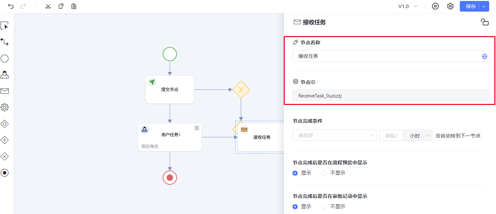
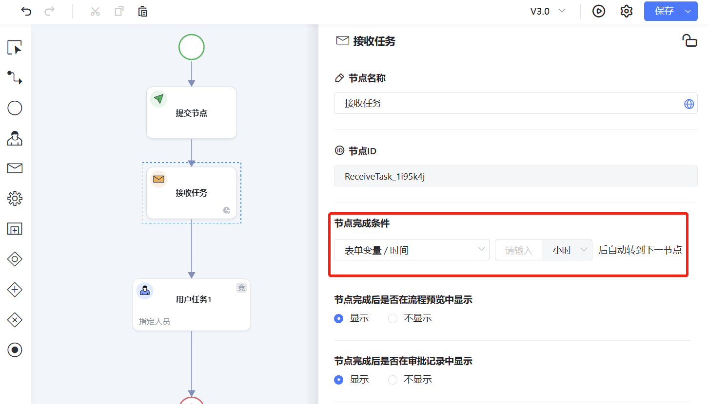

<a id="OAEWA"></a>


## 接收消息设置

双击接收任务，即可对其进行属性设置； 可以设置名称，点击“地图”图标，可以设置英文、日文名称；节点ID不可设置。

接收任务节点：

1、满足流程里的配置条件自动驱动流程向下流转

2、调用接口时，直接驱动





<a id="lvI8Z"></a>


## 节点完成条件

下拉择节点完成条件





节点完成条件的第一个选择框，只要内容存的是时间戳，不论是什么类型的表单字段第二个输入框，如果不填写，则默认就是0，即到达字段上的时间就立刻生效。

注:时间戳内的数据只能是未来时间才可以被系统识别，假如表单创建时间的时分秒已经小于当前的时间的时分秒了，系统就会判断不了。

​

<a id="UtgMT"></a>


## 通过接口立即触发节点驱动

<a id="ocdVv"></a>


### 携带更新表单数据方式

​[签名相关](../005-服务端 API/003-签名相关.md)

接口地址

[https://{host}/apps/api/v1/openapi/process/submitServiceTask](https://%7Bhost%7D/apps/api/v1/openapi/process/submitServiceTask)

**请求方式：**POST

签名方式

基于header签名

|  |  |  |  |
| --- | --- | --- | --- |
| **参数key** | **参数描述** | **类型** | **是否必填** |
| app\_id | 应用ID | String | 必填 |
| current\_user\_id | 操作人工号 | String | 必填 |
| data\_set | 主表数据 | Array | 必填 |
| data\_code | 业务模型code | String | 必填 |
| values | 表单数据 | Array | 必填 |
| code | 字段code | String | 必填 |
| value | 字段对应的值 | String | 非必填 |
| process\_definition\_key | 流程定义key | String | 必填 |
| process\_instance\_id | 流程实例编号 | String | 必填 |
| node\_id | 节点编号 | String | 必填 |
| form\_key | 表单key | String | 必填 |
| tenant\_id | 租户ID | String | 必填 |
| data\_id | 数据编号 | String | 必填 |
| subtable\_data\_set | 子表数据 | Array | 非必填 |
| run\_task | 审批数据 | Object | 必填 |
| command\_id | 任务对应按钮id | String | 必填 |
| command\_type | 任务对应按钮类型 | String | 必填 |
| transient\_variable | 其他在流程中定义的瞬时变量 | map对象{} | 非必填 |
| task\_comment | 处理意见 | String | 非必填 |
| agent\_id | 代理任务时必填，否则不会标记代理处理人， 委托人id A委托B处理，这里填A | String | 非必填 |
| transfer\_user\_id | 转办人id，转办时必填 | String | 非必填 |
| recover\_node\_id | 追回的目标节点id，追回时必填 | String | 非必填 |
| endorsement\_user\_id\_list | 加签人列表；如有多人，用“,”分隔,加签操作是必填 | String | 非必填 |
| rollback\_task\_id | 想要退回到的任务id ,退回指定任务时必填 | String | 非必填 |
| revoke\_task\_id | 新撤回按钮要撤回到的任务id | String | 非必填 |
| attachment\_id | 上传附件id，多个用逗号分隔 | String | 非必填 |

入参示例


```json
{
    "data_id":"7a813d82d35c4f2c9c55dddde3b09795",
    "data_code":"app_666pa5p2nt_mobile",
    "app_id":"app_eouw1rryzy",
    "current_user_id":"YangHeng",
    "data_set":{
        "data_code":"app_666pa5p2nt_mobile",
        "values":[
            {
                "code":"price",
                "value":"500"
            },
            {
                "code":"uid",
                "value":"7a813d82d35c4f2c9c55dddde3b09795"
            },
            {
                "code":"intro",
                "value":"更新成功"
            }
        ]
    },
    "form_key":"form_flfyrl2rzd",
    "node_id":"ReceiveTask_0zzedtx",
    "process_instance_id":"42d352d1-a33f-4388-b39c-92927334a86f",
    "process_definition_key":"interance_process",
    "run_task":{
        "command_id":"receiveEnd",
        "command_type":"receiveEnd"
    },
    "subtable_data_set":[
        {
            "data_code":"app_666pa5p2nt_child_mobile",
            "values":[
                {
                    "row_data":[
                        {
                            "code":"zi_jieshao",
                            "value":"lllllllllll"
                        }
                    ],
                    "uid":"43477aeeb99d475389c3947d72a7dad4"
                }
            ]
        }
    ],
    "tenant_id":"test"
}
```


返回值


```json
{
  "state": "SUCCESS",
  "message": "执行成功",
  "code": "000000",
  "timestamp": "2021-05-13 15:08:05",
  "data": {
    "business_key": null,
    "node_id": "ReceiveTask_0zzedtx",
    "node_name": {
      "zh": "接收任",
      "en": "接收任",
      "ja": ""
    },
    "process_definition_key": "interance_process",
    "process_location": "UserTask_0xs8y2v",
    "process_status": "RUNNING"
  }
}
```

<a id="fVovD"></a>


### **直接驱动流程运转接口**

**接口地址：**${host}/ego\_api/api/v1/common/runReceiveTask

**请求方式：**POST

**签名方式: body中传参**

**Body中biz\_params参数：**

|  |  |  |  |
| --- | --- | --- | --- |
| 参数key | 参数描述 | 类型 | 是否必填 |
| process\_instance\_id | 流程实例id | String | 必填 |
| node\_id | 节点id，当有多个等待节点需要驱动时，需要传递node\_id | String | 非必填 |
| transient\_variable | 流程运行所需要的瞬时变量 | Map<String,Object> | 非必填 |

**参考示例：**


```json
{
	"app_id":"app001",
	"sign":"sign001",
	"timestamp":"20200621103634",
  "tenant_id":"test",
	"biz_params":"{\"node_id\":\"15620\",\"process_instance_id\":\"c11b8a25-4df0-475a-9e89-396510b441b9\",\"transient_variable\":{\"flow_info_map\":{},\"flow_form_map\":{\"form_dghn389uv2\":\"/apps/api/v1/private/form/dispatcher/app_mh86d5wq3g/form_dghn389uv2\"},\"form_data_map\":{\"app_mh86d5wq3g_Yunxing\":{\"creator\":\"edad3361e2b15ae5c75bbab2c5b9a78c\",\"create_time\":1597142317000,\"process_location\":\"\",\"app_version\":\"1597126354589\",\"Amoxing_id\":\"\",\"tupian\":\"\",\"uid\":\"674aa5bc00e242db99696976bf9650b8\",\"update_time\":1597142317000,\"process_instance_id\":\"\",\"process_status\":\"\",\"name\":\"\",\"prrocess_key\":\"\",\"id\":76}},\"sub_data_map\":{},\"sub_data_map_single\":{}}}"
}
```


**返回参考示例：**


```json
{
    "code": "000000",
    "message": "成功",
    "data": {
        "business_key": "674aa5bc00e242db99696976bf9650b8",
        "node_id": "UserTask_1brrh84",//审批任务操作的节点
        "node_name": {
            "zh": "组长审批",
            "en": "组长审批",
            "ja": ""
        },
        "process_definition_key": "test_baimingdan_process",
        "process_location": "UserTask_01xl3pz",//审批后流程所在位置
        "process_status": "RUNNING"
    }
}
```

<a id="ec71H"></a>


## ​
