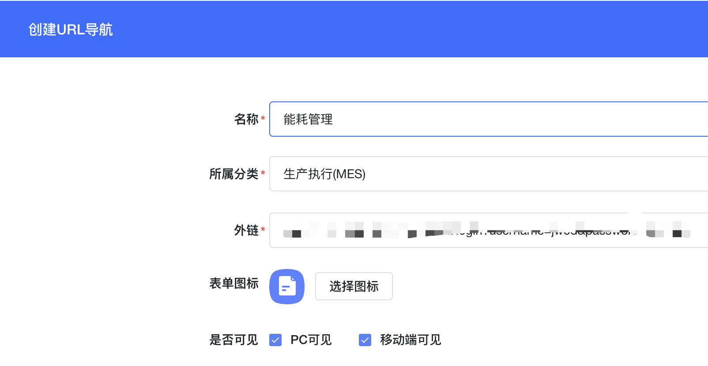
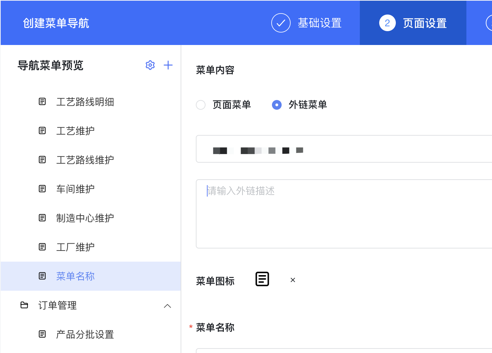
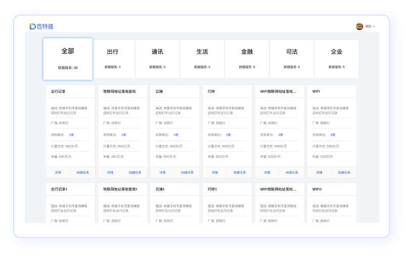
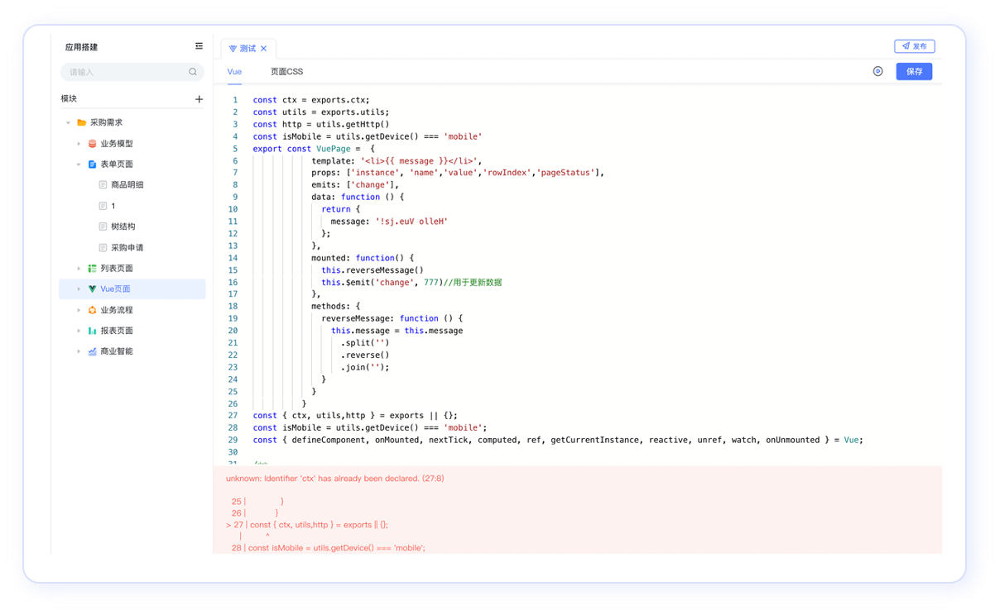

## 系统级扩展

### 单点登录集成

### 全局注入 JS 或 CSS

如：主题色、首次加载 loading、加载全局变量函数、加载全局组件

解决方案：系统扩展脚本，系统仅在打开单页应用的首次会加载并触发

[表单上引入第三方组件](../001-百特搭大讲堂/004-表单进阶/001-表单上引入第三方组件.md#HfFQj)

### 干预平台行为

如：登录、关闭、所有XHR请求头注入、自定义的附件预览

解决方案：系统扩展脚本

[表单上引入第三方组件](../001-百特搭大讲堂/004-表单进阶/001-表单上引入第三方组件.md#HfFQj)

## 应用级扩展

### 定时任务调度

#### 每日检查库存，对于低于阈值的零件向管理员报警

解决方案：使用服务编排定时调度。在服务编排内进行服务的调用。

[服务编排定时发消息](../001-百特搭大讲堂/006-消息发送及定时任务/002-服务编排定时发消息.md)

[定时发起（单个）流程](../001-百特搭大讲堂/006-消息发送及定时任务/004-定时发起（单个）流程.md)

[定时发起（多个）流程](../001-百特搭大讲堂/006-消息发送及定时任务/005-定时发起（多个）流程.md)

[发送消息通道（邮件）](../001-百特搭大讲堂/006-消息发送及定时任务/003-发送消息通道（邮件）.md)

### 将三方应用或自有应用接入平台门户

如：SAP Concur、Oracle PeopleSoft或自有开发的系统

可以将特别复杂的需求转移到平台外部，通过原生开发的方式实现，再通过导航菜单中集成“外链”方式与平台应用集成在一起

### 将平台应用接入业主方门户

#### 业主方门户通过 iframe 集成平台应用

解决：通过应用的超链接地址，直接集成，并且可以隐藏顶部导航栏

[表单/列表二开指南](007-表单 列表二开指南/README.md#U8CQJ)

​

#### 业主方门户提供qiankun集成平台应用

解决：qiankun集成参数配置

## 页面级扩展

### 调用后端自定义接口

使用二开后端项目暴露 RESET API，在平台模型服务中使用高级 HTTP 服务对接。

#### 按钮触发、控件事件触发

解决方案：在按钮点击时事件调用该服务，并传递参数

[如何调用接口](../001-百特搭大讲堂/004-表单进阶/004-如何调用接口/README.md)

#### 表单提交前的有效性校验、表单提交后的关联数据操作

解决方案：操作项前、后事件，调用自定义二开服务

[表单有效性校验](../001-百特搭大讲堂/004-表单进阶/007-表单有效性校验/README.md)

[表单保存后处理](../001-百特搭大讲堂/004-表单进阶/008-表单保存后处理.md)

### 导航中集成第三方页面

#### URL导航使用外链

#### 菜单导航中使用外链

### 布局复杂的页面

#### 在线Vue页面编写（不用部署）

可以通过Vue页面，在线通过代码方式进行复杂展现和功能的实现。

#### 本地开发上传Vue页面（不用部署）

在后台管理控制台中上传自定义页面，可以在应用 Vue 页面中直接注册使用

## 页面局部扩展

### 一次性定制功能

#### 页面展现

可以通过 Vue 容器实现页面局部展现个性化

#### 简单数据逻辑处理

可以创建 SQL 服务，通过页面可视化事件调用完成

#### 复杂业务处理

如：检查保证金、供应商信用计算 等

通过二开服务实现，使用高级 HTTP 服务接入并在页面中调用

### 可复用的组件

#### 现有组件直接在 Vue 容器、Vue 页面代码中使用

解决方案：可以通过全局引入三方组件库的方式，在代码中使用

[表单上引入第三方组件](../001-百特搭大讲堂/004-表单进阶/001-表单上引入第三方组件.md#gXpBX)

​

#### 开发组件接入设计器中，支持可视化配置

解决方案：按照平台接入规范包装组件，可以接入表单自定义组件中使用

[自定义组件开发](../001-百特搭大讲堂/004-表单进阶/010-自定义组件开发/README.md)
