

# 场景说明

业务方自己有开发能力，且功能复杂，平台配置无法实现，经评估后通过调用高级http服务方式可实现对应的业务需求

使用场景：三方系统集成使用平台表单列表能力、复杂场景实现

# 使用方法如下

## 增删改查接口

参考示例：

[附件: baiteda-client-sdk-demo.zip](../_assets/dzeuxnx8l9nri0gc/baiteda-client-sdk-demo-6995eaf9da.zip)

## 平台配置

### 查多（selectMore）

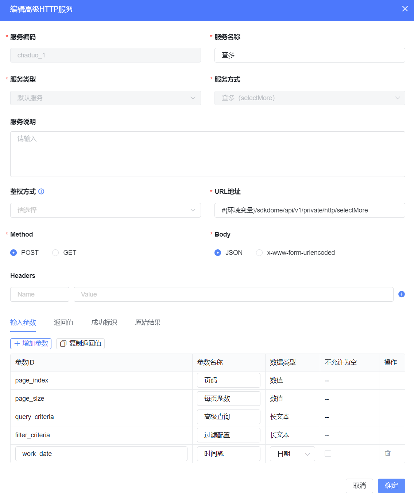

#### 服务配置

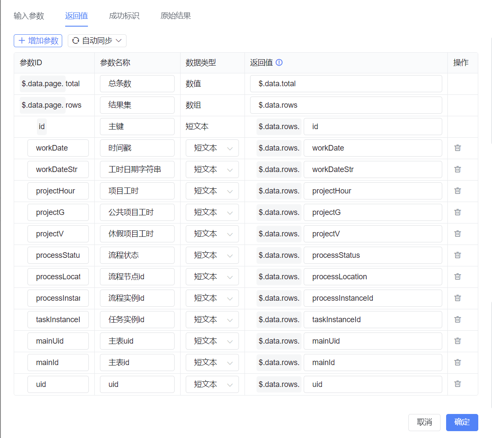

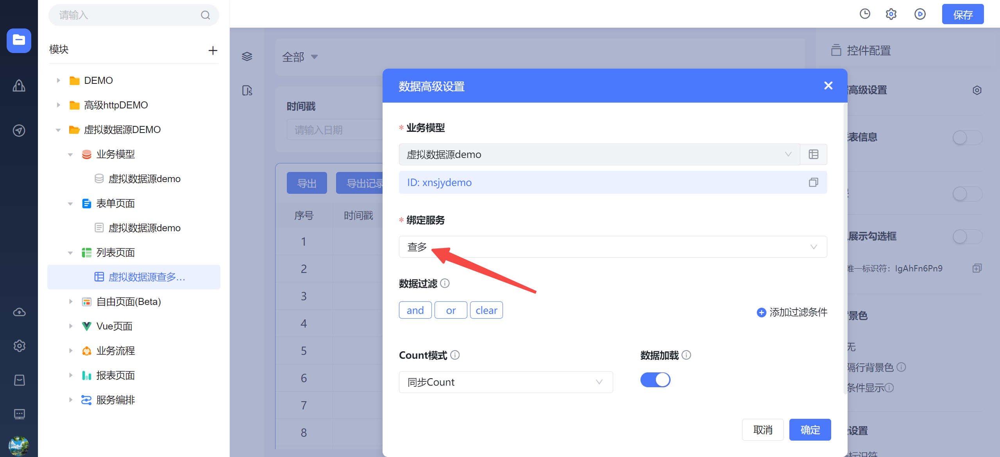

#### 使用场景

列表数据加载时调用该服务可实现对数据的查多操作

#### 案例

列表数据加载时调用该服务将查询的数据展示

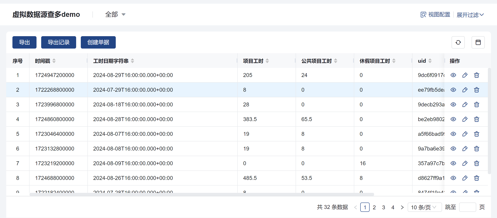

#### 参考示例

示例项目：baiteda-client-sdk-demo

> superhttp模块下SuperHttpServiceController接口中的selectMore

### 新增（insert）

#### 服务配置

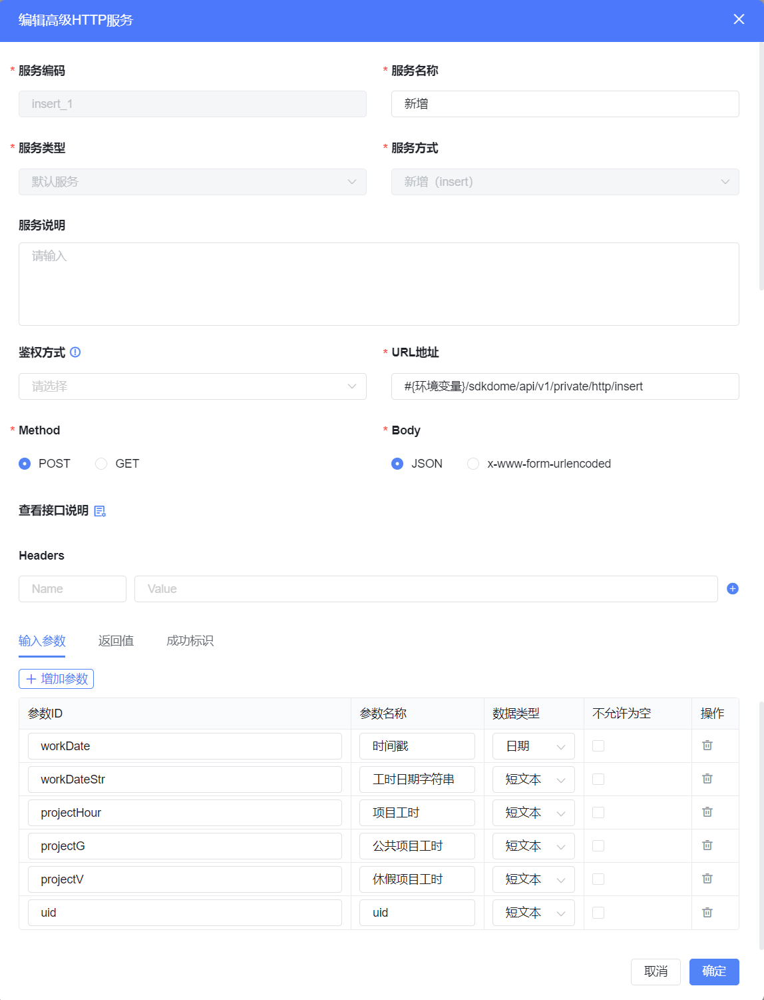

#### 使用场景

创建数据时调用新增服务可实现对数据的新增

#### 案例

在列表上点击创建单据，打开表单录入数据点击保存，实现调用新增服务

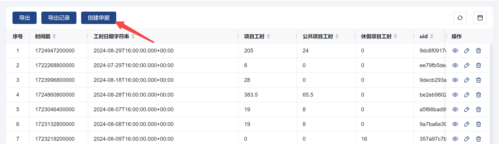

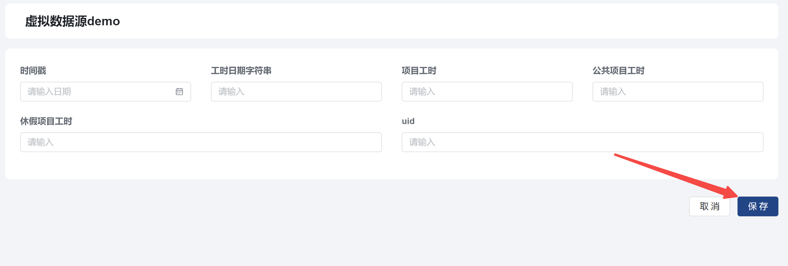

#### 参考示例

示例项目：baiteda-client-sdk-demo

> superhttp模块下SuperHttpServiceController接口中的insert

### 修改（update）

#### 服务配置

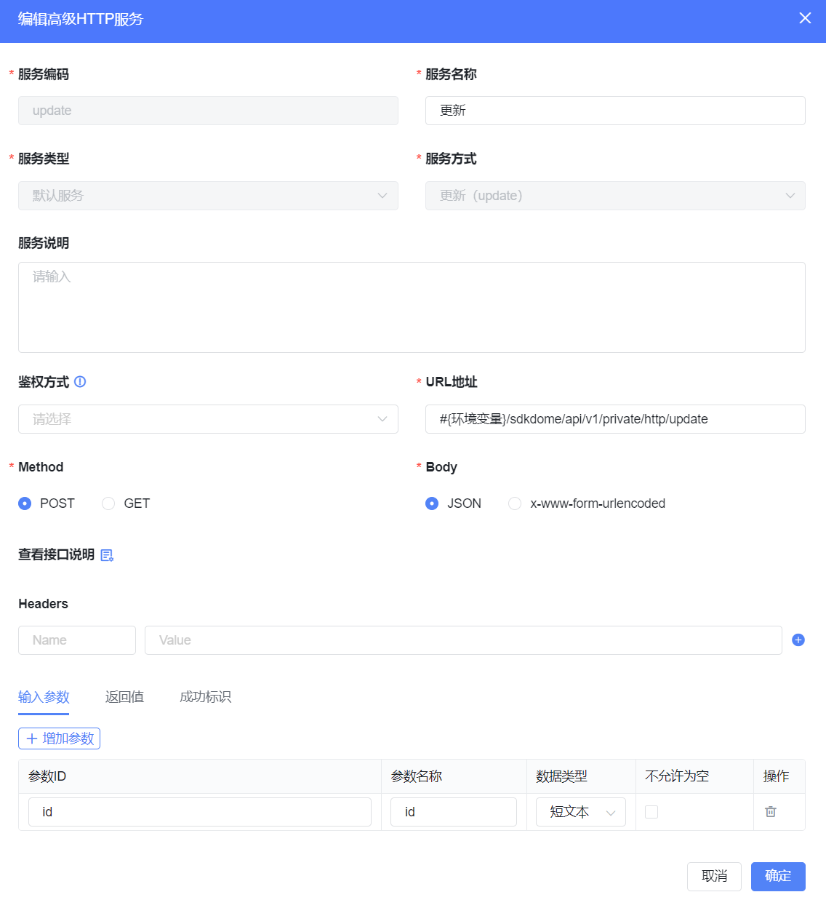

#### 使用场景

对数据进行修改调用该服务可实现修改操作

#### 案例

点击列表修改，在弹出表单修改完成数据，点击保存调用修改服务

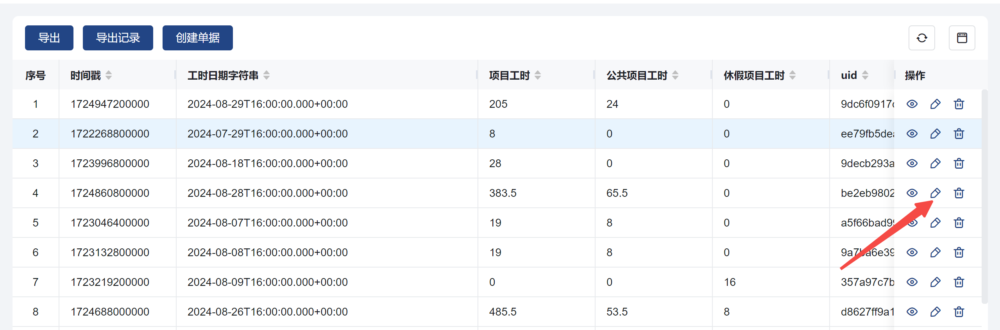

#### 参考示例

示例项目：baiteda-client-sdk-demo

> superhttp模块下SuperHttpServiceController接口中的update

​

### 删除（delete）

#### 服务配置

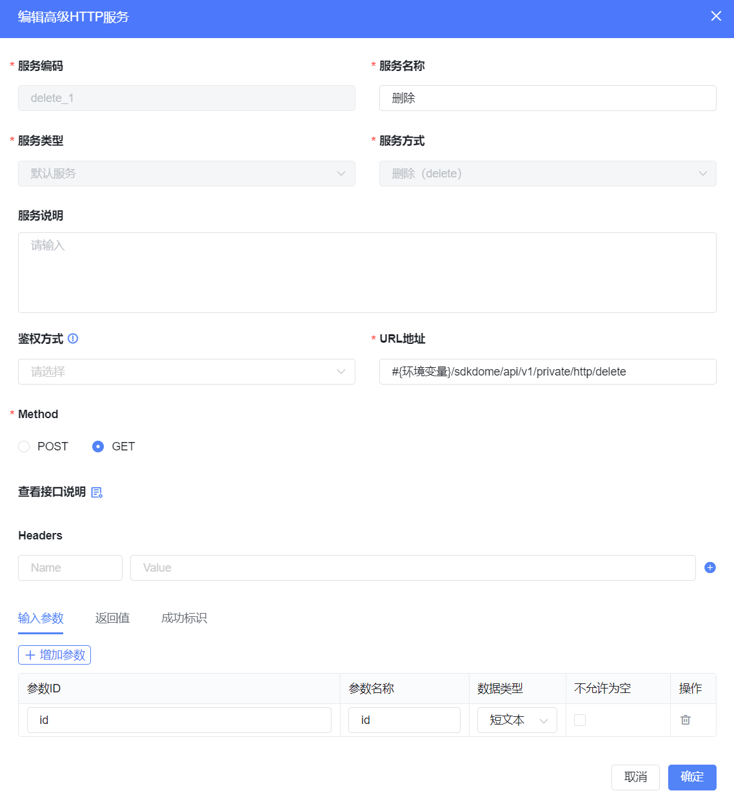

#### 使用场景

对数据进行删除时调用该服务可实现删除

#### 案例

点击列表删除，调用删除服务

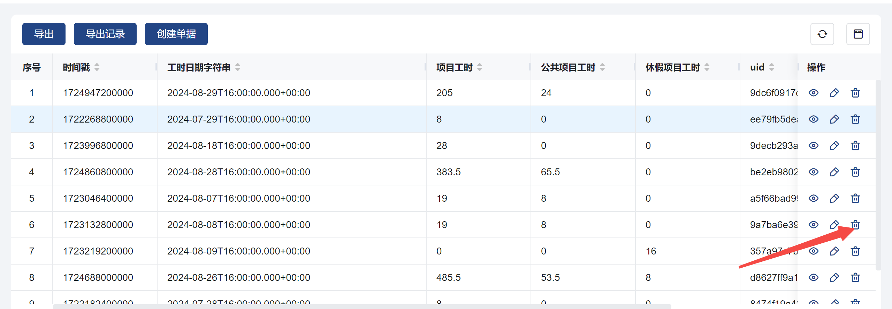

#### 参考示例

示例项目：baiteda-client-sdk-demo

> superhttp模块下SuperHttpServiceController接口中的delete

### 查单（selectOne）

#### 服务配置

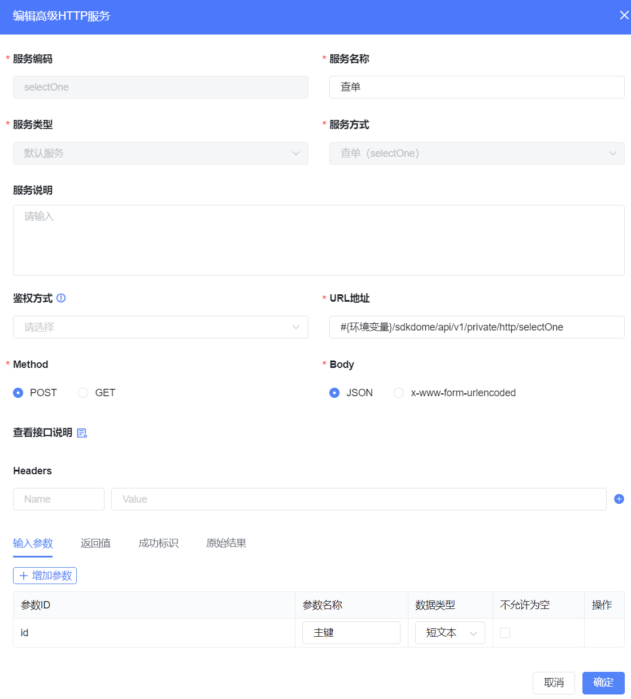

#### 使用场景

表单数据加载时调用该服务可实现对数据的查询操作

#### 案例

列表查看数据时调用查单服务，实现对表单数据的查看

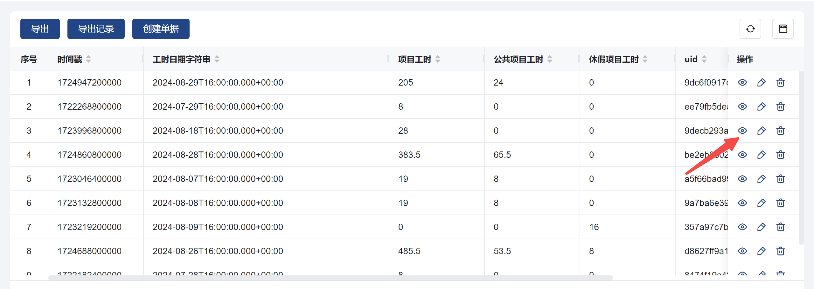

#### 参考示例

示例项目：baiteda-client-sdk-demo

> superhttp模块下SuperHttpServiceController接口中的selectOne

鉴权方式参考

[鉴权管理](https://baiteda.yuque.com/czwxoe/avp3qe/hgng8f32eszzx82g)
