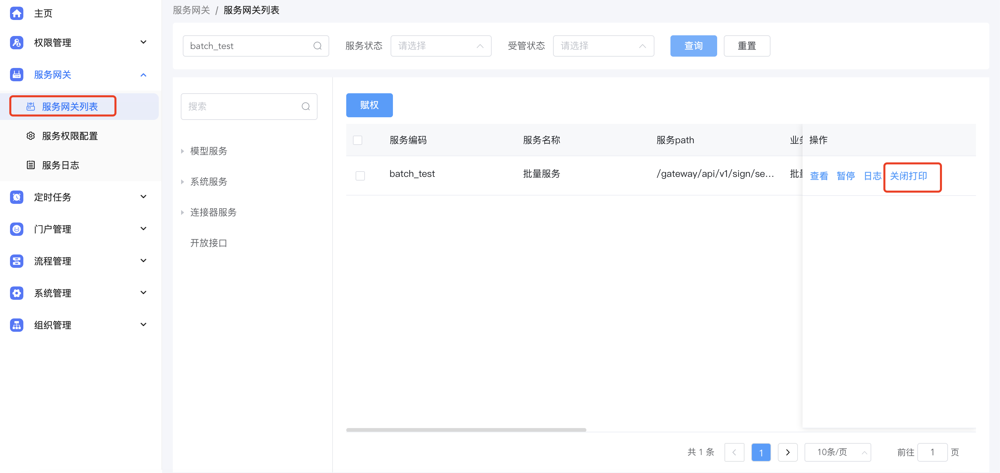
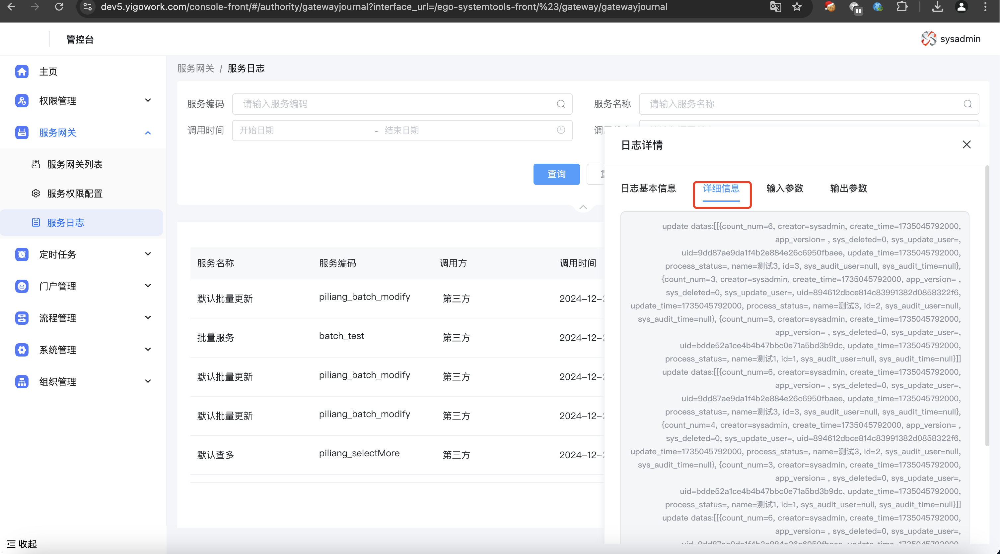

备注 版本大于 5.2.0 才可以在groovy服务网中使用批量服务

批量服务的code

{data\_code}\_batch\_save 批量新增

{data\_code}\_batch\_modify 批量修改 批量修改中数据需要包含模型主键


```json
def queryStr= "{\"page_index\":1,\"page_size\":5,\"sort_criteria\":{\"create_time\":\"DESC\"},\"query_criteria\":[],\"filter_sql\":null,\"data_filters\":[],\"permission_filters\":[]}";
// 查多
def selectMore = callService("app_66s78tld23","piliang_selectMore",queryStr);

if(selectMore == null || selectMore.size() == 0){
   def  datas = [];
   datas.add([name:"测试1",count_num:"1",creator:${__current__.employeeId}])
   datas.add([name:"测试3",count_num:"1",creator:${__current__.employeeId}])
   datas.add([name:"测试3",count_num:"1",creator:${__current__.employeeId}])
       callService("app_66s78tld23","piliang_batch_save",datas);
      logger.info("insert datas:{}",datas)

}else{
   for(def item : selectMore){
     item.put("count_num",Integer.parseInt(item.get("count_num")) + 1)
    callService("app_66s78tld23","piliang_batch_modify",selectMore);
    logger.info("update datas:{}",selectMore)
   }
}
```


开启详细日志打印






